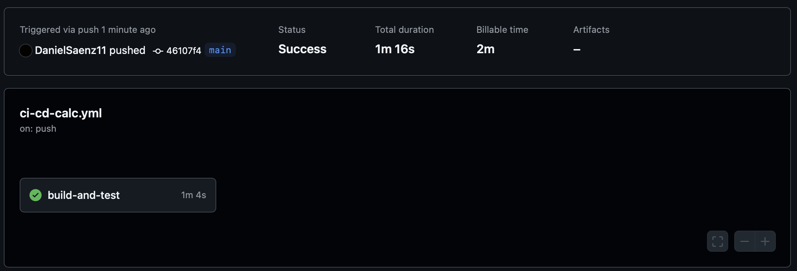

# Laboratorio 10

El presente directorio corresponde al Laboratorio 10, realizado el 5 de noviembre del 2024, en el que se realizó una calculadora y se realizaron _tests_ con la herramienta GoogleTest para comprobar su correcto funcionamiento.

Además, se definió un _workflow_ en el directorio `ie0217/.github/workflows/` llamado `ci-cd-calc.yml`, donde se integran las pruebas en GitHub para que al realizar un `push` en el branch `main` del presente repositorio, se ejecuten los _tests_ de forma automática, por medio de un CI-CD Pipeline.

## Modo de uso

Para compilar el código en el directorio actual asegúrese de estar en el _path_ `ie0217/Laboratorios/Laboratorio10/`, se debe ejecutar el siguiente comando para crear un directorio `build` para la construcción del proyecto:

```shell
mkdir build && cd build
```

Ahora bien, para construir el proyecto con `CMake` ejecute el siguiente comando:

```shell
cmake ..
```

Para compilar el programa, utilice el comando a continuación:

```shell
make
```

Finalmente, para la ejecución, utilice el comando:

```shell
./tests/run_tests
```

> [!IMPORTANT]
> Dependiendo del sistema operativo, se debe utilizar `\` en las rutas, en lugar de `/` (específicamente para Windows).

## Demostración de ejecución

En la imagen a continuación, se muestra el resultado de realizar un `push` al repositorio en la sección de GitHub Actions. Observe que se realiza un _build_ y se ejecutan los _tests_ para la calculadora. Entonces, se verifica el correcto funcionamiento dentro del branch `main` del código perteneciente al laboratorio actual.

<p align="center">
  
</p>
