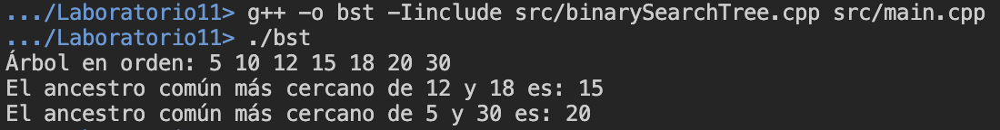

# Laboratorio 11

El presente directorio corresponde al Laboratorio 11, realizado el 22 de noviembre del 2024, en el que se realizó la documentación de una implementación de la búsqueda del ancestro común entre dos nodos en un árbol binario.

La implementación fue dividida de la siguiente forma:

- __`include/`__
    - `binarySearchTree.hpp`: Archivo de cabecera que contiene la declaración de las clases y métodos.
- __`src/`__
    - `binarySearchTree.cpp`: Archivo de código fuente que contiene la implementación de la clases y métodos del proyecto.
    - `main.cpp`: Código de prueba para el algoritmo de `findLCA`.

## Modo de uso

Para la compilación del programa, utilice el siguiente comando:

```shell
g++ -o bst -Iinclude src/binarySearchTree.cpp src/main.cpp
```

Para la ejecución, se utiliza el comando:

```shell
./bst
```

> [!NOTE]
> En el caso de ejecutar el código en Windows, cambie `/` por `\`.

## Demostración de ejecución

A continuación se muestra la ejecución para el caso de prueba colocado en el `main.cpp` y en el enunciado del laboratorio:

<p align="center">
  
</p>

Inicialmente, se imprime el recorrido del árbol binario en orden. Luego, se muestra el ancestro común más cercano entre los nodos 12 y 18, y 5 y 30, respectivamente.

Como nota adicional, el árbol binario formado en el caso anterior corresponde al siguiente:

```
    20
   /  \
  10    30
 /  \
5    15
    /  \
  12    18
```
