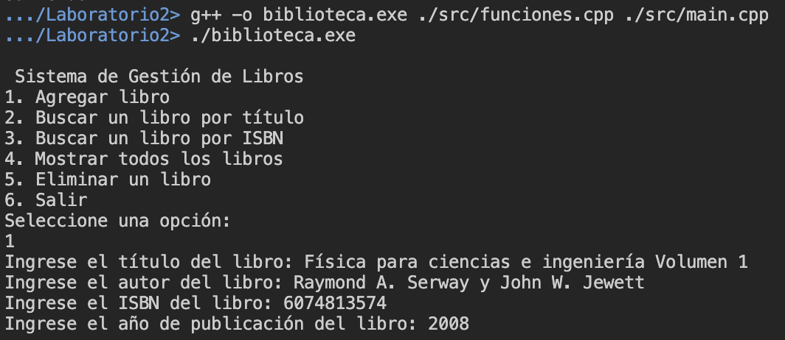

# Laboratorio 2: Sistema de almacenamiento de libros
El presente laboratorio corresponde al realizado el 23 de agosto del 2024, que consiste en la creación de un proyecto de un sistema de manejo de libros en C++.

## Modo de uso

Para compilar el proyecto, asegúrese de estar en el directorio `./ie0207/Laboratorios/Laboratorio2` propio del presente repositorio. Utilice el siguiente comando: 
```
g++ -o biblioteca.exe ./src/funciones.cpp ./src/main.cpp
```

Para la ejecución del proyecto, después de su compilación, se emplea el comando:
```
./biblioteca.exe
```

## Descripción de la estructura del proyecto
El proyecto contiene dentro del directorio `./ie0217/Laboratorios/Laboratorio2/src`, el código fuente y los _header files_ creados.

* `funciones.hpp`: Contiene el prototipo de las funciones creadas para el manejo de libros.

* `funciones.cpp`: Contiene la definición de las funciones declaradas en `funciones.hpp`.

* `libro.hpp`: Contiene la declaración del __struct libro__, que tiene el título, autor, ISBN y año de publicación del libro.

* `main.cpp`: Contiene la función `main()` que corresponde al punto de entrada de ejecución del proyecto. Dentro de esta, se ejecuta un menú para el ingreso y validación de las entradas del usuario, así como las llamadas de las funciones en cada caso requerido.

## Ejemplo de ejecución

### Agregar libro
Se muestra la ejecución donde se agrega un libro al sistema de almacenamiento.


### Buscar un libro por título

### Buscar un libro por ISBN

### Mostrar todos los libros

### Eliminar un libro

### Salir del programa
