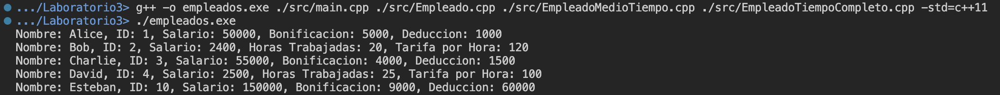

# Laboratorio 3: Sistema de Gestión de Empleados

Este directorio corresponde al Laboratorio 3 realizado el 27 de agosto del 2024, que consiste en un sistema de gestión de empleados, al clasificarlo en forma de empleados de medio tiempo y empleados de tiempo completo. 

## Modo de uso

Para compilar el proyecto, asegúrese de estar en el directorio `./ie0207/Laboratorios/Laboratorio3` propio del presente repositorio y de tener instalado el compilador __g++__. Utilice el siguiente comando: 
```
g++ -o empleados.exe ./src/main.cpp ./src/Empleado.cpp ./src/EmpleadoMedioTiempo.cpp ./src/EmpleadoTiempoCompleto.cpp -std=c++11
```

En este comando, se nombra el archivo ejecutable con el nombre `empleados.exe`. Además, se incluyeron los archivos de código fuente utilizados con extensión `.cpp`. En ciertos dispositivos es necesario agregar el flag `-std=c++11` para indicar la versión del compilador y así, evitar _warnings_.

Para la ejecución del proyecto, después de su compilación, se emplea el comando:
```
./empleados.exe
```

Para eliminar el archivo ejecutable se utiliza el comando a continuación:
```
rm empleados.exe
```

En caso de ejecutar el archivo en un dispositivo con sistema operativo Windows, es necesario cambiar el _slash_ `/` por un backslash `\`. 

## Descripción de la estructura del proyecto
El proyecto contiene dentro del directorio `./ie0217/Laboratorios/Laboratorio3/src`, el código fuente y los _header files_ creados. Estos se detallan a continuación:

- `Empleado.cpp` y `Empleado.hpp`: Corresponden a los archivos donde se declara y define la clase abstracta `Empleado`, en esta se colocaron funciones virtuales para que se requieran sobreescribir en las clases derivadas. Además, se abarcaron los temas de funciones amigas y sobrecarga de operadores (`<<` en el programa). Adicionalmente, a cada atributo se le añadieron funciones _getters_ y _setters_ para modificar sus atributos.

- `EmpleadoTiempoCompleto.cpp` y `EmpleadoTiempoCompleto.hpp`: Contiene la declaración e implementación de la clase `EmpleadoTiempoCompleto`, a la cual se le añadieron atributos adicionales, así como que se definieron las funciones solicitadas por la clase padre _Empleado_ (con keyword `virtual`). De igual forma, se incluyeron funciones _getters_ y _setters_ para los atributos nuevos.

- `EmpleadoMedioTiempo.cpp` y `EmpleadoMedioTiempo.hpp`: Contienen el diseño de la clase `EmpleadoMedioTiempo`, con atributos nuevos para cumplir las necesidades de esta clase como _horasTrabajadas_ y _horasPorTarifa_. Se modificó la función _mostrarInformacion()_ y se añadieron _getters_ y _setters_ al igual que en los casos anteriores.

- `main.cpp`: Contiene la función `main()` que corresponde al punto de entrada de ejecución del proyecto. Dentro de esta, se utiliza la estructura de datos _vector_ para almacenar punteros de la clase `EmpleadoTiempoCompleto` o `EmpleadoMedioTiempo`. Luego, se recorre el vector para ejecutar el método _mostrarInformacion()_ a cada empleado y así describirse. Después, se elimina la memoria reservada correspondiente a cada empleado, al recorrer nuevamente el vector.

## Ejemplo de ejecución
En la siguiente imagen se evidencia la correcta ejecución del código realizado en el laboratorio.

