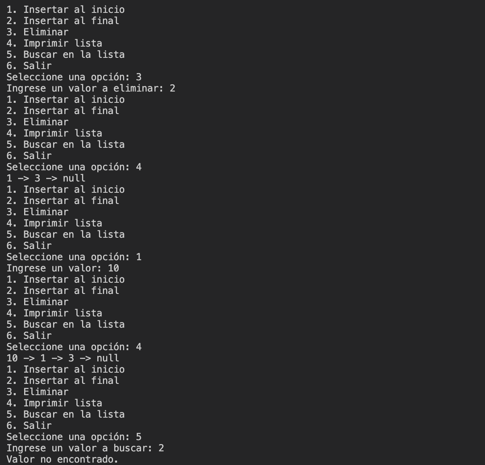
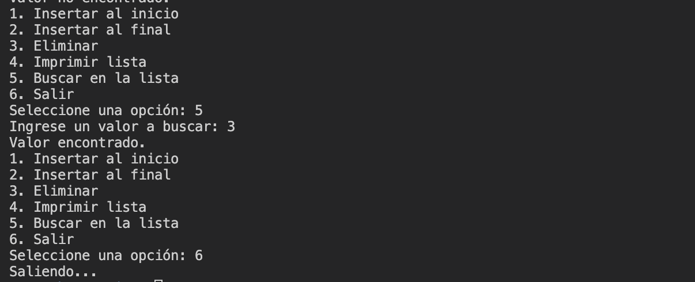

# Laboratorio 4:

Este directorio corresponde al Laboratorio 4 realizado el 3 de setiembre del 2024, que consiste en la implementación de dos programas: __Listas enlazadas__ y __Árboles__.

El primer programa de __Listas Enlazadas__ en el directorio `./ie0217/Laboratorios/Laboratorio4/Listas` contempla las siguientes funcionalidades:

- Insertar un nodo al inicio de lista.

- Insertar un nodo al final de la lista.

- Eliminar un nodo con un valor específico de la lista enlazada.

- Imprimir toda la lista enlazada.

- Buscar un nodo con un valor en la lista.

Ahora bien, el segundo programa de __Árboles binarios de búsqueda__ ubicado en el directorio `./ie0217/Laboratorios/Laboratorio4/Arboles` abarca las funcionalidades a continuación:

- Insertar un nodo con un valor en la posición adecuada del árbol binario de búsqueda.

- Recorrido en pre-orden del árbol.

- Recorrido en orden del árbol.

- Recorrido en post-orden del árbol.

- Buscar un valor en el árbol.

- Determinar la altura del árbol.

- Verificar si el árbol está balanceado.

## Modo de uso

Este laboratorio consiste de dos programas principales, como se mencionó en la introducción. Ambos programas fueron realizados en el lenguaje de programación C++. Por lo tanto, se requiere que se tenga instalado el compilador `g++` para ejecutarlos.

Para la correcta ejecución de los comandos indicados a continuación, es necesario que se encuentre en el directorio `./ie0217/Laboratorios/Laboratorio4` del presente repositorio. Asegúrese de tener un directorio `./ie0217/Laboratorios/Laboratorio4/Listas/build` y `./ie0217/Laboratorios/Laboratorio4/Arboles/build` para la compilación de los archivos ejecutables.

### Comandos para Linux

Para ejecutar el primer programa correspondiente a una implementación de listas enlazadas, se sugiere el siguiente comando para sistemas operativos del tipo Linux:
```
g++ -o Listas/build/listas.exe Listas/src/main.cpp -std=c++11
```
La ejecución del programa, se utiliza el siguiente comando en Linux:
```
./Listas/build/listas.exe
```

Para la compilación del segundo programa de árboles binarios de búsqueda, se utiliza el siguiente comando en Linux:
```
g++ -o Arboles/build/arboles.exe Arboles/src/main.cpp -std=c++11
```

Con respecto a la ejecución del programa:
```
./Arboles/build/arboles.exe
```

### Comandos para Windows

En el caso de utilizar el sistema operativo Windows, para el primer programa, se utiliza el comando de compilación:
```
g++ -o .\Listas/build\listas.exe .\Listas\src\main.cpp -std=c++11
```
En cuanto a la ejecución, se utiliza el comando:
```
.\Listas\build\listas.exe
```

Para el segundo programa de árboles binarios, se utiliza el siguiente comando para compilación:
```
g++ -o .\Arboles/build\arboles.exe .\Arboles\src\main.cpp -std=c++11
```

Para la ejecución del archivo `arboles.exe`:
```
.\Arboles\build\arboles.exe
```

## Demostración del funcionamiento

### Listas enlazadas

Compilación del programa y agregar nodos iniciales a la lista enlazada.


Eliminar nodo y buscar nodo con valor que no existe.


Buscar nodo con valor existente y salir del programa.


### Arboles binarios de búsqueda

Compilación del programa y agregar nodos al árbol binario de búsqueda.


Recorridos en pre-orden, en orden y en post-orden.


Búsqueda de valores dentro del árbol.


Verificar si el árbol está balanceado, obtener su altura y salir del programa.

