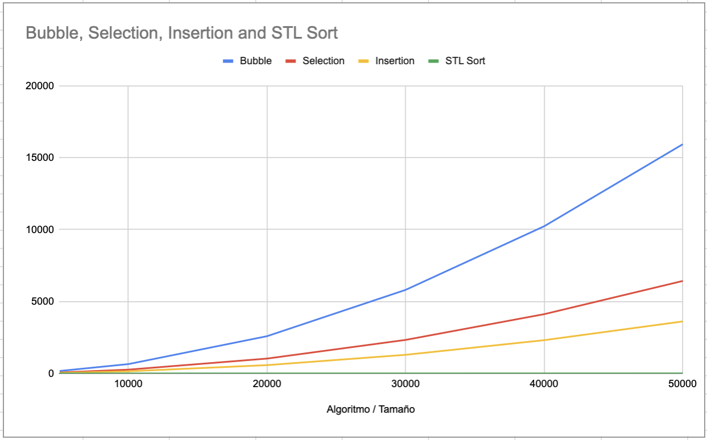

# Laboratorio 5

Este directorio corresponde al Laboratorio 5 realizado el 13 de setiembre del 2024, que consiste en la implementación de un programa para medir el tiempo de ejecución de los siguientes algoritmos de ordenamiento:

- __Bubble sort__
- __Selection sort__
- __Insertion sort__
- __STL sort__

Se compara el tiempo de ejecución de los 4 algoritmos para distintas entradas de datos. Brevemente, en cuanto a la implementación, se tiene que se utilizó la biblioteca `chrono` para medir el tiempo de ejecución total de cada uno de los algoritmos y se empleó `random` para generar números aleatorios para la entrada de los algoritmos.

## Modo de uso

El programa fue realizado en el lenguaje de programación C++. Por lo tanto, se requiere que se tenga instalado el compilador `g++` para ejecutarlos.

Para la correcta ejecución de los comandos indicados a continuación, es necesario que se encuentre en el directorio `./ie0217/Laboratorios/Laboratorio5/` del presente repositorio. Asegúrese de tener un directorio `./ie0217/Laboratorios/Laboratorio5/build/` y `./ie0217/Laboratorios/Laboratorio5/build/` para la compilación de los archivos ejecutables.

Se indica el tipo de versión que va a utilizar el compilador con el flag `-std=c++11` para evitar errores en ciertas computadores que no reconocen algunas funciones utilizadas pues el compilador tiene una versión predeterminada más antigua.

### Comandos para Linux

Para ejecutar el programa correspondiente a una implementación de la medición de algoritmos de ordenamiento, se sugiere el siguiente comando para sistemas operativos del tipo Linux:
```
g++ -std=c++11 -o ./build/main.exe ./src/main.cpp ./src/sorting.cpp
```

La ejecución del programa, se utiliza el siguiente comando en Linux:
```
./build/main.exe
```

### Comandos para Windows

En el caso de utilizar el sistema operativo Windows, para el primer programa, se utiliza el comando de compilación:
```
g++ -std=c++11 -o .\build\main.exe .\src\main.cpp .\src\sorting.cpp
```
En cuanto a la ejecución, se utiliza el comando:
```
.\build\main.exe
```

## Demostración del funcionamiento

En la demostración a continuación, se ejecuta el programa de medición de tiempo de ejecución de algoritmos de _sorting_ para `5000`, `10000`, `20000`, `30000`, `40000`, `50000`.


Nótese que la compilación se realizó de forma correctamente como se evidencia en la primera línea de la imagen. Además, se observa que conforme se incrementa la cantidad de la entrada, se aumenta el tiempo de ejecución de cada uno de los algoritmos. Entre menos eficiente es el algoritmo, crece de forma más acentuada.

## Resultados

Se realizaron 5 iteraciones para todos los tamaños de entrada mencionados anteriormente. En el gráfico siguiente se muestra el promedio de cada uno de cada una de las iteraciones para los tamaños de entrada. 

Se determinó que por orden de eficiencia, los algoritmos se clasifican de la siguiente forma:

1) __STL sort__
2) __Insertion sort__
3) __Selection sort__
4) __Bubble sort__

Por lo tanto, el algoritmo más eficiente es el __STL sort__.


