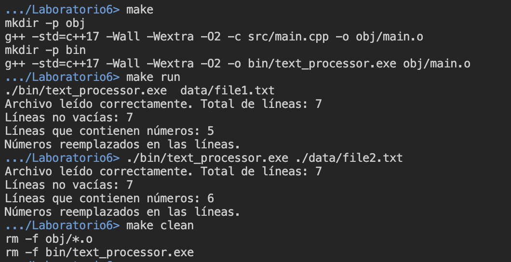

# Laboratorio 6

Este directorio corresponde al Laboratorio 6 realizado el 20 de setiembre del 2024, que consiste en la implementación de un sistema de búsqueda de strings numéricos en un archivo objetivo ingresado como argumento desde la línea de comandos.

## Modo de uso

El programa fue realizado en el lenguaje de programación C++. Por lo tanto, se requiere que se tenga instalado el compilador `g++` para ejecutarlos.

Para la correcta ejecución de los comandos indicados a continuación, es necesario que se encuentre en el directorio `./ie0217/Laboratorios/Laboratorio6/` del presente repositorio.

Se indica el tipo de versión que va a utilizar el compilador con el flag `-std=c++17` para evitar errores en ciertas computadores que no reconocen algunas funciones utilizadas pues el compilador tiene una versión predeterminada más antigua.

### Comandos para Linux

Como se está utilizando la herramienta __Makefile__, se sugiere el siguiente comando de compilación para sistemas operativos del tipo Linux (Unix-based):
```
make
```

De igual manera, se definió una regla de limpieza para eliminar los archivos ejecutables y objeto, esta corresponde a:

```
make clean
```

Para ejecutar el programa de forma prederminada con el `file1.txt`, se utiliza el comando:
```
make run
```

Sin embargo, si se desea ejecutar el programa con otro archivo, como con el `file2.txt`, se utiliza el siguiente comando:
```
./bin/text_processor.exe ./data/file2.txt
```

Como alternativa, se puede modificar la regla `run` dentro del __Makefile__ para cambiar la ruta de ejecución del archivo `data/file1.txt` por la ruta deseada.

### Comandos para Windows

Para compilar se utiliza el comando: 
```
mingw32-make
```

Para ejecutar de forma predeterminada con `file1.txt`:
```
mingw32-make run
```

Para ejecutar demás archivos:
```
.\bin\text_processor.exe .\data\file2.txt
```

## Descripción de la solución

El programa está conformado por los siguientes archivos:

- __Exceptions.hpp__: Contiene la declaración de las clases para indicar los tipos de errores contemplados dentro del programa: `FileNotFoundException`, `ReadException` y `RegexException`.

- __FileReader.hpp__: Implementa una clase por medio de un _class template_ (recibe un container). Contiene una función miembro para leer el contenido del archivo.

- __RegexUtils.hpp__: Contiene la declaración de dos _utils_ en forma de funciones utilizadas en el programa que corresponden a: `regexSearch()` y `regexReplace()`. Estas procesan las expresiones regulares. La primera retorna un vector con las líneas coincidentes y la segunda recorre las líneas y sustituye las que contienen un match con el regex por un string de reemplazo.

- __TextProcessor.hpp__: Contiene la declaración de una _function template_ para procesar texto. Recibe un contenedor y una función (callable), entonces para cada elemento del contenedor, ejecuta la función con el elemento como parámetro.

- __main.cpp__: Corresponde al punto de entrada de ejecución del programa, pues contiene a la función `main()`. Procesa los argumentos de la línea de comandos (recibe la ruta del archivo objetivo). Posteriormente, se lee cada una de las líneas por medio del `FileReader` y se procesa el texto para determinar la cantidad de líneas no vacías con `processText()`. Luego, se buscan números en las líneas a partir del uso de expresiones regulares y del util creado `regexSearch()`. Finalmente, se reemplaza cada una de las líneas con números por la etiqueta `[Número]` con `regexReplace()`. Para esto, se emplea el manejo de excepciones para atrapar los errores que puedan ocurrir al procesar archivos y expresiones regulares. 

- __Makefile__: Se utilizó un Makefile modificado para que funcione en dispositivos Linux (o Unix-based). Primeramente, se indican las variables que se van a utilizar para compilar el programa, como el tipo de compilador, flags, directorios respectivos de código fuente, binarios, entre otros. Luego, se indican los archivos SOURCES y OBJECTS del programa. Se definieron reglas para compilar el TARGET, los archivos objeto (`.o`) y reglas de limpieza, así como la creación de los directorios requeridos en el caso de que no existan con `mkdir -p`. 

Como aclaración del concepto de un archivo objeto se tiene que un archivo objeto es un archivo intermedio que contiene código binario generado por el compilador, los archivos objeto son normalmente la entrada para la fase de enlazado.

## Demostración del funcionamiento

Con respecto a la demostración del funcionamiento, se adjunta la imagen debajo para ilustrar el funcionamiento del programa. Inicialmente, se compila con el comando `make` y se ejecuta el programa con el comando `make run`, el cual se realiza con el archivo `file1.txt`.

Posteriormente, respecto a la ejecución `file2.txt`, se utiliza el comando sugerido para demás archivos (aunque también se puede cambiar el archivo objetivo en el __Makefile__ como se mencionó anteriormente).

Finalmente, se eliminan los archivos objeto y ejecutables resultantes, con la regla `clean`.

