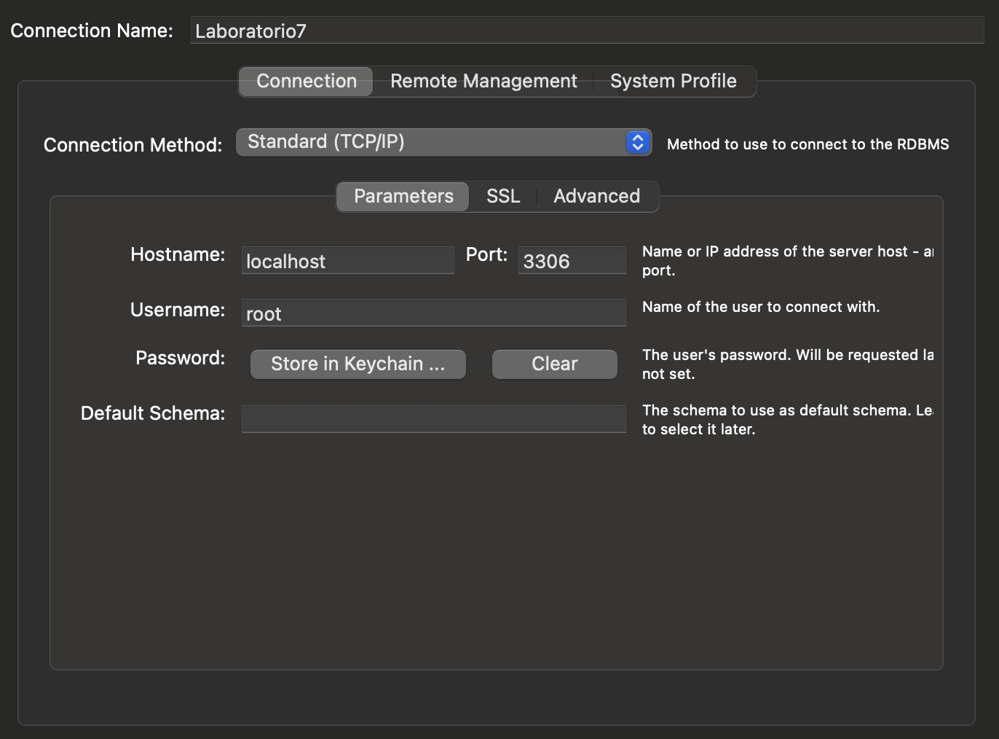
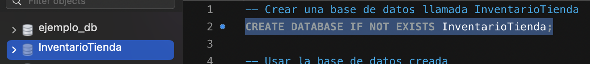
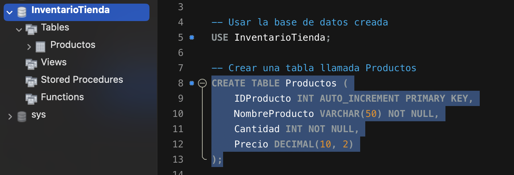
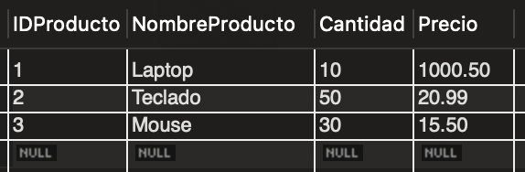
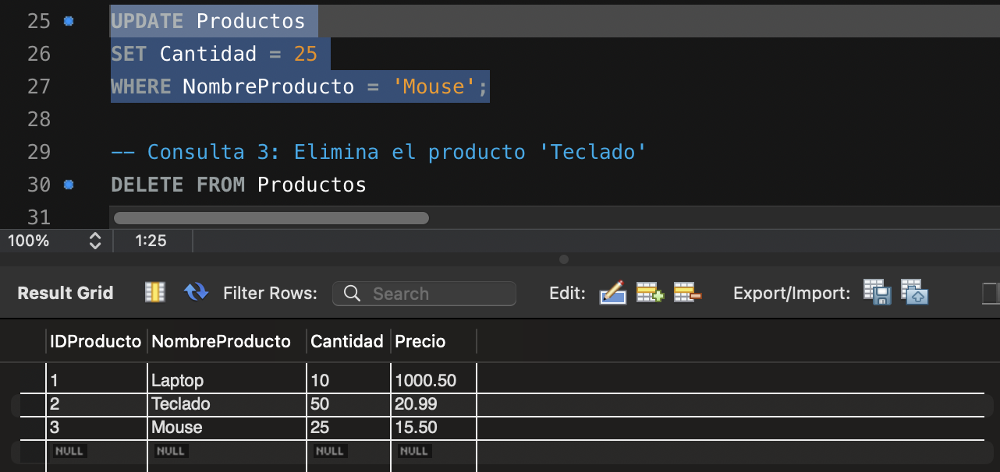
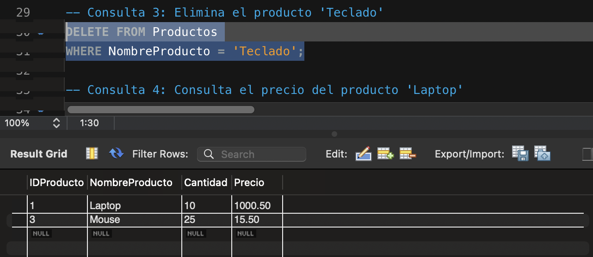
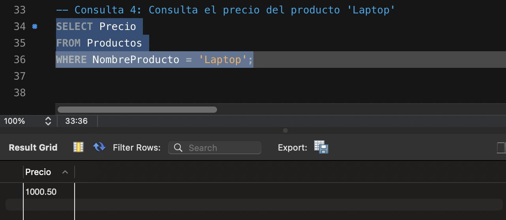
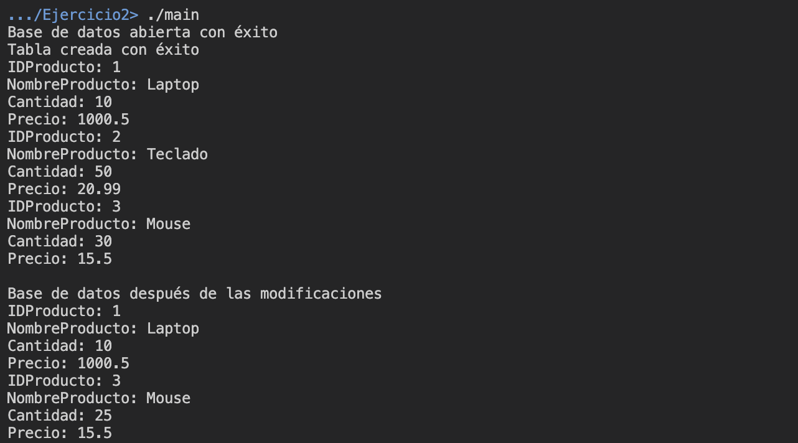

# Laboratorio 7

Este directorio corresponde al Laboratorio 7 realizado el 8 de octubre del 2024, que consiste en el uso de MySQL y SQLite. 

## Ejercicio 1

Este ejercicio consiste en el uso de MySQL Workbench para manejar una base de datos llamada `Producto`. Se realizan operaciones de creación (`CREATE`),  selección (`SELECT`), actualización (`UPDATE`) y eliminación (`DELETE`).

### Discusión

#### 1. ¿Qué ventajas ofrece un sistema de gestión de base de datos como MySQL para manejar el inventario frente a métodos tradicionales?

MySQL es un sistema de gestión de bases de datos ampliamente utilizado en la industria. Entre las ventajas que brinda este software en comparación con otros, resalta la __eficiencia y rapidez al realizar consultas__ sobre volúmenes amplios de datos. Relacionado con esta razón, se tiene MySQL ofrece escalabilidad para el manejo de datos y la realización de consultas al mismo tiempo (simultaneidad).

Además, se tiene que este sistema permite reducir los __errores__ o conflictos entre datos, pues posee la funcionalidad de definir __claves__ para identificar los conjuntos de datos de forma sencilla. Asimismo, por su popularidad y uso empresarial, también implica directamente que es un sistema __seguro__ y de fácil mantenimiento conforme aumenta su tamaño.

En comparación con servicios más tradicionales como Excel o almacenamiento en archivos `.csv`, las ventajas anteriores son claramente a favor de MySQL, en este caso. Especialmente con el manejo de grandes bases de datos y la eficiencia al realizar consultas simultáneamente (conflictos y demás).

Cabe recalcar que MySQL permite el acceso remoto a través de servidores, por ejemplo. Esto facilita en gran medida el mantenimiento de la base de datos y la realización de consultas desde múltiples sitios simultáneamente.

#### 2. ¿Cómo gestionan estos sistemas la concurrencia cuando varios usuarios intentan modificar el mismo dato al mismo tiempo?

La gestión de la concurrencia cuando varios intentan modificar el mismo dato al mismo tiempo en MySQL se realiza a partir de bloqueos, los cuales pueden ocurrir a nivel de fila o a nivel de tabla (de ser necesario). Si MySQL detecta que ocurrió un conflicto (_deadlock_), aborta una de ellas y la otra se realiza correctamente.

Además, se sigue un flujo, de modo que MySQL gestiona que se realicen y se complete una serie de operaciones; es decir, se realizan completamente o no se realizan. Esto sirve para asegurar inconsistencias en los procesos.

También, se sigue el llamado _multiversion concurrency control_ (MVCC). Este consiste en que se permite que múltiples transacciones lean y escriban datos simultáneamente, con versiones antiguas de los datos. Mientras una transacción está actualizando un registro, otros usuarios pueden leer una versión anterior sin bloquearse.

### Documentación

En el enunciado, se solicita una documentación paso a paso. Inicialmente, se configura un servidor de base de datos utilizando MySQL Workbench. Para ello, se ingresaron los parámetros de creación mostrados en la imagen a continuación. 

<p align="center">
  
</p>

Posteriormente, con el servidor abierto, se crea la base de datos en la interfaz de MySQL Workbench. Se utiliza el comando:

```sql
CREATE DATABASE IF NOT EXISTS InventarioTienda;
```

<p align="center">
  
</p>

Observe que en la imagen anterior, se evidencia la creación de la base de datos en la interfaz de MySQL Workbench, después de refrescar el panel. 

Luego, se ejecuta el comando mostrado en la siguiente imagen para crear una tabla llamada `Productos`, la cual está compuesta por una clave primaria `IDProducto`, `NombreProducto`, `Cantidad` y `Precio`.

<p align="center">
  
</p>

La imagen a continuación evidencia la inserción de los elementos: `Laptop`, `Teclado` y `Mouse`, así como la selección de todos los productos en la tabla, por medio del comando:

```sql
SELECT * FROM Productos;
```

<p align="center">
  
</p>

A cada elemento se le añadió el nombre, cantidad y precio. El identificador se asigna de forma automática y con una naturaleza autoincremental.

Ahora, se ejecuta la porción de código en la imagen siguiente, para actualizar el valor de `Cantidad` del producto `Mouse` a 25. Para ello, se utiliza el comando `UPDATE`. Además, se seleccionaron nuevamente todos los datos para que el comando tenga una salida visual.

<p align="center">
  
</p>

En cuanto a la eliminación del producto `Teclado`, se ejecutó el código de la imagen, para eliminarlo en la tabla `Productos`.

<p align="center">
  
</p>

Finalmente, se realiza una consulta del precio del producto `Laptop`. La salida con el comando `SELECT` está compuesta únicamente por esta columna.

<p align="center">
  
</p>

## Ejercicio 2

El segundo ejercicio del laboratorio consiste en aplicar el mismo ejercicio realizado en MySQL Workbench, pero por medio de SQLite y C++. Por lo que, el primer paso, consiste en incluir el archivo de encabezado `sqlite3`. En este ejercicio, se crea la base de datos llamada `inventario.db` en el directorio de ejecución.

Inicialmente, se abre/crea  la base de datos con el comando:

```cpp
rc = sqlite3_open("inventario.db", &db);
```

Para todas las operaciones realizadas en la base de datos, se implementó un manejo de errores por medio de `if`. Un ejemplo de ello se muestra a continuación:

```cpp
if (rc) {
    // Fallo del programa
    std::cerr << "No se pudo abrir la base de datos: " << sqlite3_errmsg(db) << std::endl;
    return (0);
} else {
    // Se abrió/creó satisfactoriamente
    std::cout << "Base de datos abierta con éxito" << std::endl;
}
```

En el caso en que el programa falla, se imprime el mensaje de error correspondiente y se sale del programa. Si no falla, se continúa con la ejecución. La porción de código anterior corresponde a la utilizada para verificar si la base de datos fue abierta/creada correctamente.

El siguiente paso corresponde a crear la tabla `Productos`. De forma similar al ejercicio 1, se utiliza el mismo comando de creación.

La diferencia se encuentra al ejecutar el comando, pues se utiliza:

```cpp
rc = sqlite3_exec(db, sql, callback, 0, &errMsg);
```

El bloque anterior ejecuta el código SQL almacenado en el puntero `sql` en la base de datos `db`. En caso de que ocurra un error, lo almacena en `errMsg`. Además, si se selecciona un valor o se desea retornar ciertos datos de la base de datos, se utiliza la función `callback`. El _return code_ de la ejecución del comando SQL se almacena en `rc`, lo cual resulta especialmente útil para comprobar si la operación se realizó de forma correcta.

Posteriormente, se insertan los datos `Laptop`, `Teclado` y `Mouse` en la tabla `Productos` por medio del siguiente comando:

```cpp
const char* sqlInsert = "INSERT INTO Productos (NombreProducto, Cantidad, Precio) "
                        "VALUES ('Laptop', 10, 1000.50), " // Laptop
                        "('Teclado', 50, 20.99), "         // Teclado
                        "('Mouse', 30, 15.50); "; 
```

Esta corresponde a la instrucción en SQL para agregar los elementos juntos. De igual forma que en el caso anterior, se ejecuta el comando con la función `sqlite3_exec()` y se comprueba su `rc` en caso de error, para continuar con la ejecución o detenerla.

Para seleccionar todos los productos, se utiliza el comando:

```cpp
const char* sqlSelect = "SELECT * FROM Productos;";
```

En cuanto a la actualización de la cantidad de `Mouse`, se empleó la siguiente línea:

```cpp
const char* sqlUpdate = "UPDATE Productos SET Cantidad = 25 WHERE NombreProducto = 'Mouse';"; 
```

Finalmente, para eliminar el producto `Teclado` de la tabla `Productos`, se utiliza la indicación:

```cpp
const char* sqlDelete = "DELETE FROM Productos WHERE NombreProducto = 'Teclado';";
```

Nuevamente, para cada uno de ellos, se realizó la comprobación del valor de `rc` en caso de error.

Al finalizar con la ejecución de los comandos anteriores en la base de datos, se seleccionan todos los datos para observar el resultado posterior a las modificaciones realizadas.

### Modo de uso

Para compilar el archivo `ejercicio2.cpp`, asegúrese de estar en el directorio `./ie0217/Laboratorios/Laboratorio7/Ejercicio2/`. Entonces, se utiliza el comando general:

```shell
g++ ejercicio2.cpp -o main -L<RUTA_DIRECTORIO_SQLITE>/sqlite/lib -I<RUTA_DIRECTORIO_SQLITE>/sqlite/include -lsqlite3
```

En mi caso, se utilizó el comando:

```shell
g++ ejercicio2.cpp -o main -L/opt/homebrew/opt/sqlite/lib -I/opt/homebrew/opt/sqlite/include -lsqlite3
```

> [!NOTE]
> El comando anterior sirve para SQLite instalado en el sistema operativo MacOS vía el _package manager_ Homebrew.

Para ejecutarlo, se escribe en la terminal:

```shell
./main
```

> [!IMPORTANT]
> Si se ejecutan los comandos en el sistema operativo Windows, asegúrese de utilizar `\` en lugar de `/` en las rutas anteriores.

### Demostración de ejecución

En la imagen a continuación, se evidencia la correcta compilación y ejecución del programa. Observe que se ejecutan cada uno de los comandos mencionados y al final, se muestra el producto final en la base de datos `inventario.db`.

<p align="center">
  
</p>

