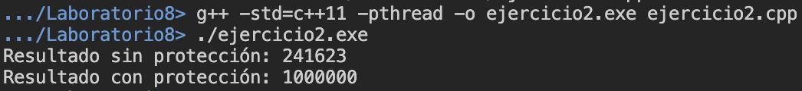

# Laboratorio 8

El presente directorio corresponde al laboratorio 8 del curso, el cual consiste en 5 ejercicios sobre programación paralela y concurrente. 

- __`ejercicio1.cpp`__: Ejercicio de Productor-Consumidor con mutex y semáforos.

- __`ejercicio2.cpp`__: Ejercicio que ejecuta un loop que aumenta un contador. En la primera iteración, no se protege el acceso al contador por distintos hilos, por lo que, se presentan condiciones de carrera generalmente. Mientras que, en la segunda, sí se protege y se evitan las condiciones de carrera.

- __`ejercicio3.cpp`__: Corresponde a la implementación de un algoritmo en paralelo.

- __`ejercicio4.cpp`__: Se presenta un programa con un _deadlock_. Se resuelve el problema al utilizar técnicas de adquisión consistente.

- __`ejercicio5.cpp`__: Corresponde a la simulación de un sistema de multitarea (hilos). Se utilizan `std::mutex`, `std::barrier` y otras técnicas para manejar la sincronización entre tareas.

## Modo de uso

El comando de compilación para el primer programa `ejercicio1.cpp` es:

```shell
g++ -std=c++11 -pthread -o ejercicio1.exe ejercicio1.cpp
```

Respecto al segundo ejercicio `ejercicio2.cpp`, se compila de la siguiente forma:
```shell
g++ -std=c++11 -pthread -o ejercicio2.exe ejercicio2.cpp
```

En cuanto a `ejercicio3.cpp`, se utiliza el comando a continuación:
```shell
g++ -std=c++11 -pthread -o ejercicio3.exe ejercicio3.cpp
```

Para compilar el cuarto ejercicio, `ejercicio4.cpp`, se usa:
```shell
g++ -std=c++11 -pthread -o ejercicio4.exe ejercicio4.cpp
```

Finalmente, para la compilación de `ejercicio5.cpp`, utilice el siguiente comando:
```shell
g++ -std=c++20 -pthread -o ejercicio5.exe ejercicio5.cpp
```

Específicamente para la compilación del quinto ejercicio, es necesario tener una versión de `g++` igual o superior a la 11, pues en esta fue incluido C++20, que contiene a `std::barrier`.

Finalmente, para la ejecución de cada uno de los ejecutables resultantes del proceso de ejecución, utilice el siguiente comando:

```shell
./<nombre_ejecutable>
```

## Demostración de ejecución

En mi caso, se me fue asignado `ejercicio2.cpp`. Por lo tanto, este es el código que fue ejecutado. 

El resultado de la ejecución se muestra en la siguiente imagen:

<p align="center">
  
</p>

Observe que en la primera ejecución que no se realiza de forma correcta el conteo, pues múltiples hilos están accediendo a la variable `counter` sin que se actualice su valor.

Por otro lado, en la segunda ejecución, sí se realiza el conteo de forma correcta pues se utilizó la protección `std::mutex`.