# Laboratorio 9

Este directorio corresponde al laboratorio 9 realizado el 29 de octubre del 2024, el cual consiste en el uso de herramientas de debugging para identificar errores de ejecución.

## Modo de uso

Para la ejecución de los programas en el presente directorio, debe estar ubicado en la ruta `./ie0217/Laboratorios/Laboratorio9/`.

> [!IMPORTANT]
> Como se están utilizando herramientas de debugging, es importante utilizar el flag `-g` al compilar.

### Ejercicio 1

Respecto al primer ejercicio, se sugiere el siguiente comando de compilación:

```shell
g++ -g -o ej1 ./src/ej1.cpp
```

Para el debugging, se va a utilizar la herramienta `gdb`, entonces la ejecución se realiza con el siguiente comando:

```shell
gdb ej1
```

Esto abre el menú de `gdb` y permite utilizar sus comandos específicos para operar con el código fuente del archivo ejecutable y así detectar errores.

### Ejercicio 2

Respecto al segundo programa, se va a utilizar `valgrind` para checkear la memoria. Por lo que, se sugiere el siguiente comando de compilación:

```shell
g++ -g -o ej2 ./src/ej2.cpp
```

Para la ejecución, se utiliza el comando:

```g++
valgrind --leak-check=yes ./ej2
```

### Ejercicio 3

Se utiliza la herramienta `ASan` para revisar accesos fuera de los límites de un arreglo. Para la compilación, se utiliza el siguiente comando de compilación:

```shell
g++ -g -fsanitize=address -o ej3 ./src/ej3.cpp
```

Para la ejecución, se utiliza el comando:

```shell
./ej3
```

### Ejercicio 4 y 5

Respecto al cuarto y quinto programa, se tiene el mismo programa correspondiente a `ej4_5.cpp`, para verificar la existencia de condiciones de carrera con _threads_.

Inicialmente, para la herramienta `helgrind`, se utiliza el siguiente comando de compilación:

```shell
g++ -g -o ej4 ./src/ej4_5.cpp -pthread
```

Para la ejecución con la herramienta `helgrind` de Valgrind:

```shell
valgrind --tool=helgrind ./ej4
```

Respecto a la herramienta `TSan`, se compila de la siguiente forma:

```shell
g++ -g -fsanitize=thread -o ej5 ./src/ej4_5.cpp -pthread
```

La ejecución se realiza de forma regular, como se muestra a continuación:

```shell
./ej5
```

## Demostración

### Ejercicio 1

El ejercicio 1 corresponde a un programa que contiene funciones para calcular la media aritmética y la mediana, respectivamente. La idea es utilizar la herramienta `gdb` para encontrar los errores en el código. Estos se detallan a continuación:

1) En la función `calcularMedia()`, se encontró que el tipo de dato de la variable `suma` no es el indicado, pues se requieren mostrar decimales. Por lo tanto, se cambió a `double` para coincidir con su tipo de retorno.
2) Nuevamente, en la función `calcularMedia()` se cambió la condición del `for` loop, pues este se ejecutaba hasta que fuera menor o __igual__ a `numeros.size()`. Por lo que, se generaba un comportamiento indeterminado al salir de los límites del vector y la salida era inesperada.

<p align="center">
  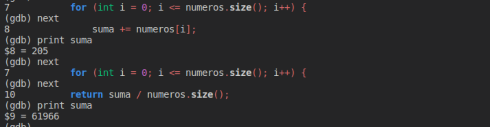
</p>

En la imagen anterior, se demuestra el comportamiento al salir de los límites del vector.

2) En la función `calcularMediana()`, cuando la salida es par, debe obtener el promedio entre los dos elementos en el medio del vector. Sin embargo, al dividir dos números enteros, por la naturaleza de C++, genera una salida entera y necesariamente no es de esta forma. Por ende, se ajustó la división para que fuera entre `2.0` y así generar una salida con decimales.

<p align="center">
  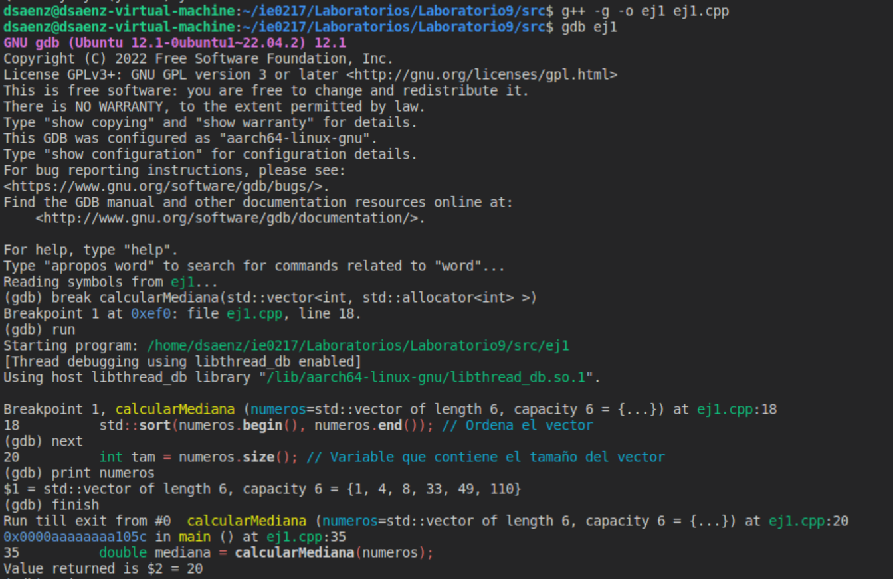
</p>

### Ejercicio 2

El ejercicio 2 tiene un problema de no liberación de memoria reservada, pues reserva un arreglo de 10 enteros del _heap_ y no lo libera. La salida de valgrind del código inicial es la siguiente:

<p align="center">
  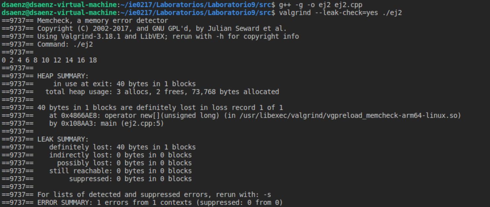
</p>

Se indica que el error se encuentra en la línea 5 (donde se reservó la memoria del arreglo). Para solucionarlo, se liberó el arreglo con `delete[] arr`. La salida sin errores de valgrind se muestra a continuación:

<p align="center">
  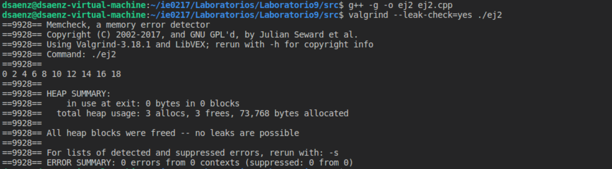
</p>

### Ejercicio 3

Para el ejercicio 3, se utilizó la herramienta `ASan` para detectar el acceso de memoria fuera de los límites del arreglo. Se indica que el error es de tipo `heap-buffer-overflow` en la línea 12 (donde se accede al índice 10 del arreglo).

<p align="center">
  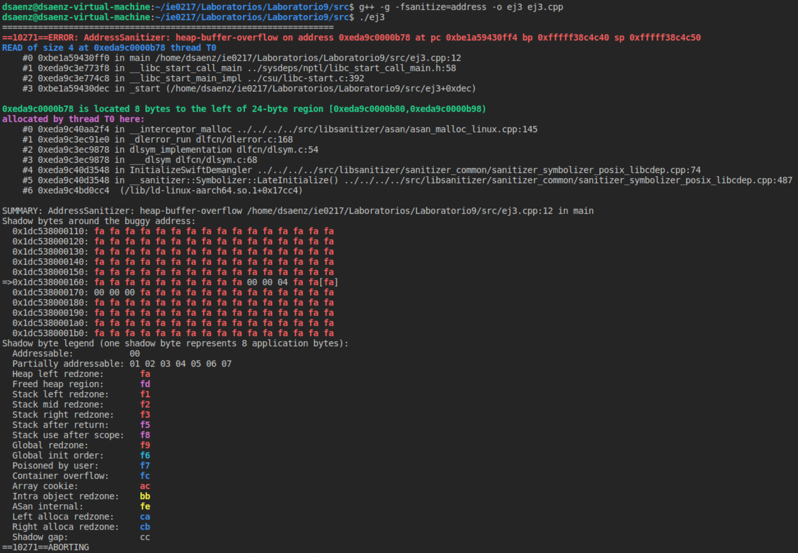
</p>

Por lo tanto, después de corregir el programa y acceder a un elemento dentro del rango, se obtiene la siguiente salida:

<p align="center">
  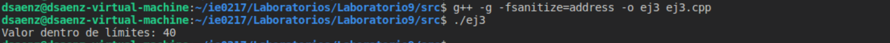
</p>

### Ejercicio 4

Tanto el ejercicio 4 como el 5 poseen el mismo archivo de código. En este caso, se utiliza la herramienta `helgrind` para verificar la existencia de condiciones de carrera al trabajar con _threads_. La primera salida al ejecutar el programa se muestra en las imágenes a continuación.

<p align="center">
  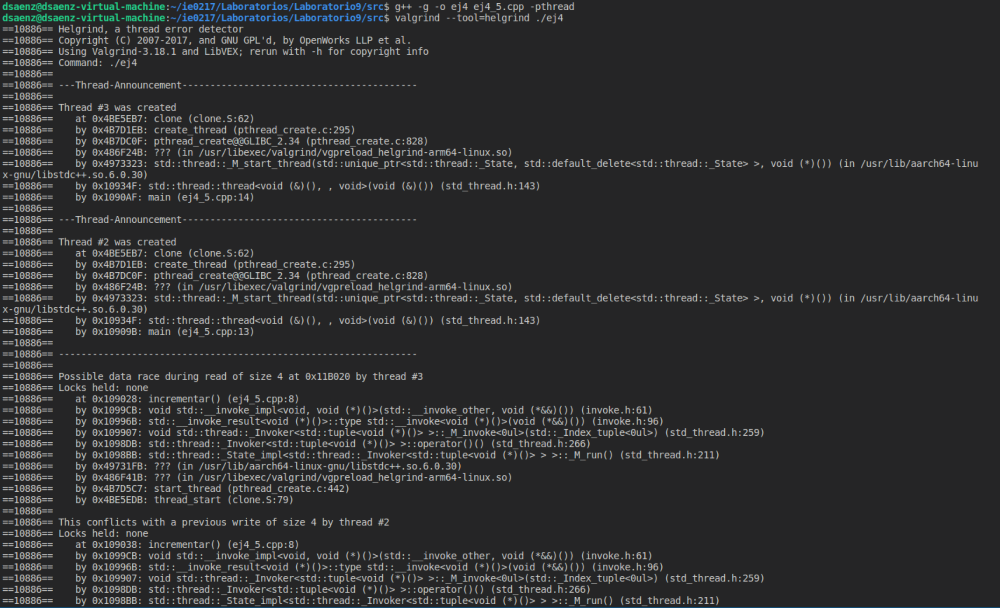
</p>

<p align="center">
  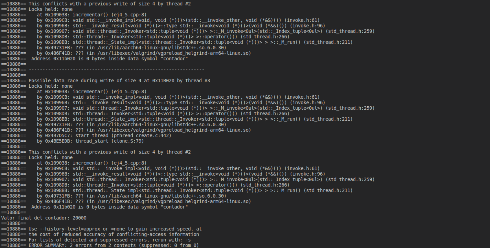
</p>

Observe que reporta posibles condiciones de carrera en la lectura y escritura en la línea 8 del archivo `ej4_5.cpp`; es decir, en la función `incrementar()`. Lo anterior tiene sentido pues ahí se encuentra la variable global `contador`.

Para solucionar el problema, se utilizó `std::mutex` y `std::lock_guard` para proteger el acceso a la variable `contador`, mientras un hilo está leyendo o modificando su valor. Entonces, para que otro hilo pueda acceder a la variable, debe esperar a que el hilo anterior salga del ámbito del `lock` y desbloquee el `mutex`.

<p align="center">
  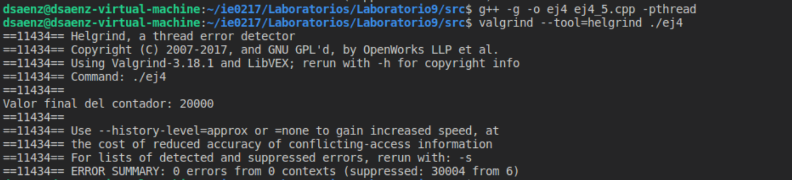
</p>

### Ejercicio 5

El ejercicio 5, de forma similar al 4, se utiliza la herramienta `TSan` para comprobar si se están dando condiciones de carrera en el programa.

Al ejecutar el código inicial, se obtiene la salida mostrada en la imagen a continuación.

<p align="center">
  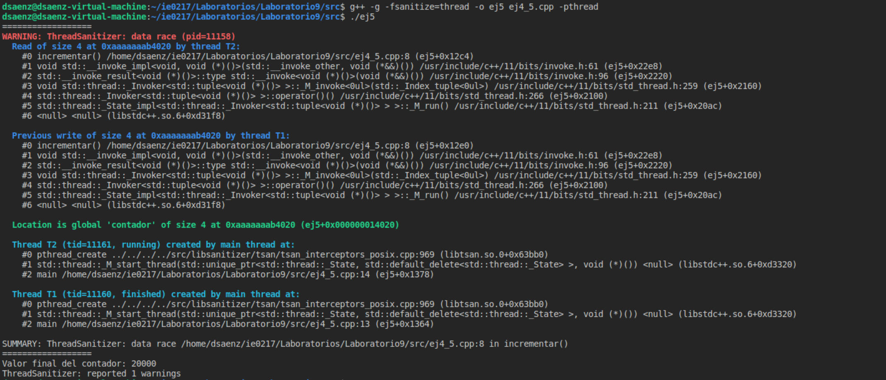
</p>

Observe que se indica que se está dando un `data_race` en la función `incrementar()` entre los hilos, en la variable `contador`. Entonces, de forma idéntica la anterior, se protegió la variable global contador con `mutex` y `lock`. La salida después de la modificación es la siguiente: 

<p align="center">
  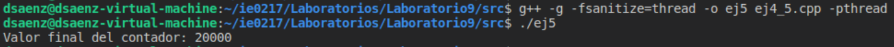
</p>


