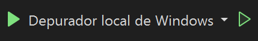

# Sesión 10: Interfaz Gráfica WxWidgets

Esta sesión corresponde a la realizada para el 27 de setiembre del 2024, la cual incluye el uso de la interfaz gráfica __WxWidgets__ dentro del IDE __Visual Studio 2022__.

La dinámica de trabajo en __Visual Studio 2022__ se realiza a partir de soluciones (`.sln`). Estos corresponden a contenedores de proyectos que comparten información de compilación, configuración de ventanas, entre otros. Se trabajó de tal forma que cada proyecto posee su solución para dividir claramente los archivos entregados para la presente sesión.

## Modo de uso

Para ejecutar los programas creados en esta sesión, se debe de tener la herramienta __Visual Studio 2022__ instalada, la cual se encuentra disponible únicamente para Windows (_supported_).

Además, se debe compilar por lote la biblioteca `WxWidgets`. Debe instalar el instalador de la biblioteca sin binarios desde [la página oficial de WxWidgets](https://www.wxwidgets.org/downloads/). Luego, se ejecuta el instalador y se guarda la ruta donde se instaló como una variable de entorno del sistema llamada `WXWIN`.

Luego, se abre la solución de __Visual Studio 2022__ que se encuentra en el directorio `.\wxWidgets-<version>\build\msw\wx_vc17.sln`. Si se compila en una arquitectura distinta a `x64` o `Win32`. Se debe de ingresar a `Compilar -> Administrador de configuración` y se indica el sistema en plataformas activas. Después, se debe verificar que los directorios de salida de la compilación son los mismos que las plataformas mencionadas anteriormente. Para ello, se hace clic derecho en cada proyecto dentro de la solución y se ingresa a `Propiedades`. En `Propiedades de configuración -> General` se muestra el directorio de salida y directorio intermedio de compilación, verifique estos son para todas las plataformas. 

Se selecciona la opción en la barra superior `Compilar -> Compilación por lote`, se ingresa `Seleccionar todo` y finalmente, `Compilación`. Este proceso tarda aproximadamente 30 minutos.

### Ejecución de los programas

Abra la solución (`.sln`) del proyecto que desea ejecutar y toque en la parte superior el botón de ejecución dado por el símbolo de _play_.

En caso de que se presenten errores de _linking_, seleccione la opción de `Propiedades` al hacer clic derecho en el nombre del proyecto en el Explorador de soluciones. Luego, verifique que en la plataforma activa, se encuentre dentro de `C/C++ -> General` en directorios de inclusión adicionales los siguientes: `$(WXWIN)\include` y `$(WXWIN)\include\msvc`. Además, en la pestaña `Vinculador -> Sistema`, en subsistema, se presente `Windows (/SUBSYSTEM:Windows)`. Finalmente, en `Vinculador -> General`, en directorios de bibliotecas adicionales, se encuentre `$(WXWIN)\lib\vc_<plataforma>_lib`. 

## Descripción del contenido

### <ins>wxTest</ins>

En esta carpeta, se encuentra la solución que fue utilizada para verificar la correcta compilación por lote de la biblioteca `WxWidgets`. Cuando se ejecuta correctamente, significa que la biblioteca compiló correctamente y se está realizando un proceso de enlazado correcto dentro de Visual Studio 2022.

### <ins>ventanaBasica</ins>

Dentro de este directorio, se realizó la primera aplicación con `WxWidgets`. Además, acá se establecen los 4 archivos con los que se trabajan el resto de la sesión en los siguientes apartados. Observe que está compuesto por:

- `MainFrame.hpp`: Contiene la declaración de la clase `MainFrame` que hereda públicamente de `wxFrame`. Por lo que, es utilizado para trabajar con la ventana principal (como su nombre lo indica). Acá se declaró el constructor de la clase y demás funciones relacionadas con el procesamiento de eventos posteriormente.

- `MainFrame.cpp`: Contiene la definición del constructor de la clase `MainFrame` y luego, también abarcará la definición de las funciones que se realizan dentro de la ventana, como el procesamiento de eventos.

- `MyApp.hpp`: Incluye la declaración de la clase `App` que hereda públicamente de `wxApp`. Esta clase es utilizada para iniciar la aplicación y mostrar la ventana.

- `MyApp.cpp`: En este archivo, se definió la función miembro de la clase `App`, denominada `OnInit()` para indicar el proceso de inicialización de la aplicación.

Ahora bien, propiamente para este ejemplo, se tiene que únicamente se muestra una ventana básica, sin ningún tipo de contenido.

### <ins>Controles</ins>

En este directorio, se realiza una implementación básica de los siguientes controles:

- Button
- Checkbox
- StaticText
- Text control
- Slider
- Gauge
- Choice
- SpinCtrl
- ListBox
- RadioBox

Se definió un `panel` dentro del `MainFrame` para que contenga a todos los controles mencionados. Por lo tanto, estos poseen como _parent_ a `panel`.

El resultado del programa se muestra a continuación:

### <ins>Estilos</ins>

En este directorio, se implementaron estilos para los controles mencionados en la seccióna anterior. Se alineó el texto del botón a la izquierda, un tercer estado para el _checkBox_, un _background_ gris, una entrada de texto con estilo de contraseña, un slider que muestra el porcentaje recorrido, un _gauge_ vertical, un sistema de selección ordenado, un _spin control_ cíclico, un _list box_ que permite selección múltiple y finalmente, un _radiobox_ vertical.

### <ins>EventosEstaticos</ins>

En este apartado, se tratan los eventos estáticos. Se creó una tabla de eventos, en donde se asigna una función designada para evento de los controles creados. Se indica en el _status bar_ el valor del último control cambiado.

### <ins>EventosDinamico</ins>

Se utiliza el método `Bind()` para asignar funciones a los botones creados. En este proyecto, se empleó también `Unbind()` a la función asignada al botón. Por lo que, no muestra ningún mensaje en el _status bar_.

### <ins>PropagacionEventos</ins>

Para la propagación de eventos, se realizaron 4 soluciones numeradas para indicar la progresión que siguen.

`PropagacionEventos1` sirve para indicar la posibilidad de hacer `Bind()` a un control específico, a un control dentro de `panel` o a un control dentro del `MainFrame`.

`PropagacionEventos2` muestra la posibilidad de asignar por medio de un mismo `Bind()` a los elementos dentro del `MainFrame` y que ejecutan la función cuando ocurre el evento en uno de ellos.

`PropagacionEventos3` demuestra que si hay un evento "general" asignado a los controles dentro del `MainFrame` y uno específico al botón en cuestión, se ejecuta únicamente la función correspondiente al específico. 

`PropagacionEventos4` corresponde al caso si se desea que se ejecuten los dos eventos, se utiliza `.Skip()` para que continúe la propagación de eventos. Se debe de utilizar este comando para indicar la propagación de eventos al cerrar la ventana.

### <ins>EventosMouse</ins>

En cuanto a los eventos de mouse, se crearon 3 soluciones numeradas, para mostrar el funcionamiento del mouse dentro de la ventana. En estas, se muestra la posición del cursor respecto al `MainFrame`. En la segunda solución, se muestra el efecto de agregar botones y la posición relativa que toma el marco de referencia del cursor. Esto, se soluciona en la tercera solución.

### <ins>EventosTeclado</ins>

Finalmente, en cuanto a los eventos de teclado, se realizaron 3 soluciones numeradas para mostrar su funcionalidad y mostrar el valor de la tecla presionada en el _status bar_; para ello, se creó la función `OnKeyEvent()`.

Además, se analizó que los eventos de teclado de la forma `wxEVT_KEY_DOWN`, son detectados dependiendo de la sección enfocada en la interfaz. Sin embargo, en la tercera solución, se utiliza `panel->Bind(wxEVT_CHAR_HOOK, &MainFrame::OnKeyEvent, this)` para detectar los eventos de teclado independiente del elemento que esté enfocado.

