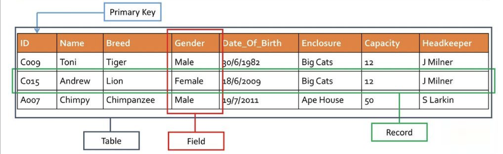

# Sesión 11

Esta sesión corresponde a la realizada para el 1 de octubre del 2024. Se trata el tema de __bases de datos SQL__.

En este README, se van a detallar la teoría y comandos vistos en el video de la sesión.

## Base de datos

Una base de datos es un sistema organizado de almacenamiento de datos que permite almacenar y recuperar información de manera eficiente y estructurada.

### __Bases de datos relacionales__

De forma generl, consiste de una tabla compuesta por filas (registros) y columnas (atributos). Las partes detalladas son las siguientes:

- __Tabla/_Table_:__ Estructura de principal de almacenamiento.

- __Fila (Registro)/_Row_ (_Record_):__ Único registro en la tabla.

- __Columna (Campo)/_Column_ (_Field_):__ Representa un atributo de la entidad.

- __Clave Primaria/_Primary Key_:__ Campo que identifica cada fila en una tabla. Se suele utilizar `ID` para hacer referencia a este tipo.

- __Clave Extranjera/_Foreign Key_:__ Campo que establece una relación entre <ins>dos tablas</ins>. Ejemplo: la relación entre la clave de una orden de compra y la información del cliente que la realizó.

- __Índice/_Index_:__ Estructura de datos para incrementar la velocidad de las operaciones.

- __Vista/_View_:__ Tabla virtual que resulta de una consulta sobre las tablas.



### __Bases de datos no relacionales__

- __Documento/_Document_:__ Para bases de datos orientadas a documentos.

- __Clave-Valor/_Key-Value_:__ Colección de pares clave-valor (similar a diccionario).

- __Grafo/_Graph_:__ Representación de nodos y aristas en un grafo.

- __Columna Ancha/_Wide Column Store_:__ Datos en columnas.

- __Contenedor/_Bucket_:__ Agrupaciones de datos relacionados en contenedores.

## SQL

SQL (_structured query language_) es un lenguaje especializado para administrar y manipular bases de datos relacionales. Se suele interactuar con un sistema de gestión de bases de datos (DBMS).

Se emplean las operaciones del tipo __CRUD__ para trabajar en sus bases de datos. Estas corresponden a:

- _Create_: Crear tablas o bases de datos.
- _Read_: Leer datos de una tabla.
- _Update_: Actualizar datos en una tabla.
- _Delete_: Eliminar tablas o bases de datos.

### Elementos de tablas en SQL

- __Clave candidata:__ Atributo(s) que puede identificar de manera única una tabla.

- __Súper clave:__ Un conjunto de atributos que puede identificar de manera única una tupla (claves candidatas, claves primarias y claves únicas).

- __Clave primaria:__ Atributo utilizado para identificar de manera única cada tupla en una tabla. Es el principal identificador de la tabla.

- __Clave alterna:__ Claves candidatas distintas de la clave primaria.

- __Clave única:__ Similar a la clave primaria, pero puede admitir un valor `NULL` en la columna.

- __Clave externa:__ Atributo que solo puede tomar valores presentes en otra tabla como referencia.

- __Clave compuesta:__ Combinación de columnas
que identifican de manera única cada tupla en una tabla.

### Comando `SELECT`

Este comando es utilizado para seleccionar columnas a partir de una tabla; es decir, permite filtrar información de la tabla original. La sintaxis más básica es la siguiente:

```sql
SELECT first_name, last_name
FROM Customers;
```

Se seleccionan las columnas `first_name`, `last_name` de la tabla `Customers`. Además, se puede seleccionar todas las columnas con `*`.

#### Directiva `WHERE`

Si se desea __filtrar datos__ a partir de la información de una cierta columna, se utiliza el comando `WHERE` seguido de la condición de filtrado. Por ejemplo:

```sql
SELECT *
FROM Customers
WHERE last_name = 'Doe';
```

La porción anterior de código se encarga de buscar todas las filas coincidentes con `last_name = 'Doe'`.

#### Operadores lógicos

SQL también permite utilizar __operadores lógicos__ como `AND` y `OR` si se desea que se cumplan dos condiciones a la vez o que se cumpla una de ellas, respectivamente. Esto se puede implementar con `WHERE` para realizar búsquedas más específicas. Si se desea negar la condición, se utiliza `NOT`.

#### Valores únicos

Se pueden obtener los valores únicos de una columna con el comando `SELECT DISTINCT`; es decir, se muestran los valores sin repeticiones.

Además, permite establecer distintas condiciones de búsqueda de valores distintos. Esto se refiere a que se pueden buscar pares de columnas distintas (ambos valores deben ser iguales para que cuente como repetido). Simplemente, se agregan los nombres de las dos columnas en `SELECT DISTINCT`.

Si se desea contar la cantidad de valores únicos, se utiliza `COUNT(DISTINCT <nombre_columna>)`. Además, `COUNT` cuenta los valores que no sean nulos.

#### Directiva `AS`

Esta indicación permite seleccionar columnas y trabajar __como__ una forma determinada. Se tiene el siguiente ejemplo que concatena el primer nombre y el apellido y se trabaja con esa columna como el nombre completo:

```sql
SELECT CONCAT(first_name, ' ', last_name) AS full_name
FROM Customers;
```

#### Directiva `TOP`/`LIMIT`

En motores como MySQL, PostgreSQL, SQLite, se utiliza el comando `LIMIT` para seleccionar una determinada cantidad de filas a partir de una búsquda con `SELECT`. Se puede también realizar `OFFSET n` de _n_ cantidad de filas para buscar a partir de la (n+1)-ésima fila.

```sql
SELECT first_name, last_name
FROM Customers
LIMIT 2 OFFSET 3;
```

En los motores SQL Server, MS Access, se utiliza el comando `TOP` para realizar una función similar. En el ejemplo siguiente, se seleccionan las primeras dos filas completas (indicado por `*`).

```sql
SELECT TOP 2 *
FROM Customers;
```

#### Directiva `IN`

Se utiliza para realizar una búsqueda donde se desea que un elemento se encuentre __en__ otro. Por ejemplo, en el siguiente ejemplo, se busca que el país se encuentre en `'USA'` o `'UK'`.

```sql
SELECT first_name, last_name
FROM Customers
WHERE country in ('USA', 'UK');
```

También, se puede unir la funcionalidad de `IN` con `NOT` para buscar elementos que NO se encuentren en el otro elemento.

#### Directiva `BETWEEN`

Se utiliza junto a `WHERE` para buscar elementos __dentro de un rango__. Este rango puede ser tanto numérico como alfabético.

#### Valor `NULL`

Permite asignar campos que no contienen un valor definido. Se puede filtrar con `WHERE` para buscar elementos nulos o no nulos.

#### Directiva `MAX()` y `MIN()`

Permite buscar el valor máximo y mínimo almacenado en una columna. De igual forma, aplica para valores numéricos y alfabéticos.

En el caso de que se quiera buscar cuáles filas contienen el valor mínimo (pues puede estar repetido), se puede agregar como condición del `WHERE` que se busque el atributo mínimo.

#### Directiva `SUM` y `AVG`

`SUM()` se encarga de calcular la suma de los valores de la columna indicada como parámetro. Mientras que, `AVG()` calcula el promedio de los datos. Un ejemplo del uso de `SUM` se muestra a continuación:

```sql
SELECT SUM(amount) as total_sales
FROM Orders;
```

Se indica explícitamente que se tome como `total_sales`.

#### Agrupaciones `GROUP BY` y ordenamientos `ORDER BY`

La directiva `GROUP BY` sirve para agrupar los elementos de la tabla a partir de la columna indicada. En el siguiente ejemplo, se agrupan las órdenes de compra por el ID del cliente:

```sql
SELECT customer_id, AVG(amount) AS average_spends
FROM Orders
GROUP BY customer_id;
```

La directiva `ORDER BY` se encarga de ordenar los elementos de la(s) columna(s) a partir de cierta columna indicada. Se puede ordenar tanto numéricamente como alfabéticamente. La forma de indicar el tipo de ordenamiento (ascendente o descendente) se coloca después del nombre de la columna que define el criterio. 

```sql
SELECT *
FROM Customers
ORDER BY age DESC;
```

En el ejemplo anterior, se selecciona la tabla de manera descendente basándose en la columna de la edad.

En el caso en que se indiquen varias columnas en el criterio de ordenamiento, se sigue la prioridad de izquierda a derecha.

#### Directiva `LIKE`

Esta directiva es utilizada como condición de filtrado con `WHERE`. Sirve para indicar que se busque una columna __similar a__ un valor. Este valor puede ser un string exacto o que contenga una substring específico y con eso ya se hace match.

#### Directiva `UNION`

Es utilizada cuando se requiere hacer análisis o consultas para dos tablas, por ejemplo. Entonces, consiste en que se __unen__ dos columnas de dos tablas de interés. Sin embargo, observe que los elementos repetidos se incluyen una vez únicamente. Si se quieren incluir los repetidos, se utiliza el comando `UNION ALL`.

```sql
SELECT age
FROM Teachers
UNION
SELECT age
FROM Students;
```

#### Vistas

Las vistas en SQL contienen filas y columnas similares a una tabla. Con la diferencia de que, las vistas no contienen los datos reales. 

Es similar a un entorno de tabla virtual creado a partir de una o más tablas para facilitar el trabajo con datos. Son utilizadas para hacer consultas.

Se utiliza la siguiente sintaxis:

```sql
CREATE VIEW us_customers AS
SELECT customer_id, first_name
FROM Customers
WHERE Country = 'USA';
```

En el ejemplo anterior, se crea una tabla virtual que contiene únicamente los clientes pertenecientes a `'USA'`.

#### Directiva `CASE`

Permite crear una columna extra a la salida de `SELECT` que aplica las condiciones indicadas en el bloque indentado (`WHEN-ELSE`). Después `WHEN`, se coloca la condición de comparación, seguido de `THEN` y el valor a colocar.

Un ejemplo de su uso se muestra a continuación, donde utiliza `CASE` para definir una serie de casos que se colocan en la columna `country_name`.

```sql
SELECT customer_id, first_name
CASE
    WHEN country = 'USA' THEN 'United States of America'
    WHEN country = 'UK' THEN 'United Kingdom'
    ELSE 'Uknown Country'
END AS country_name
FROM Customers;
```

#### Directiva `HAVING`

Sirve para verificar una condición para un __grupo__ de filas. Se ejecuta después de `GROUP BY`.

En el siguiente ejemplo, muestran únicamente los grupos de `customer_id` con más de una aparición.

```sql
SELECT COUNT(customer_id), country
FROM Customers
GROUP BY country
HAVING COUNT(customer_id) > 1;
```

#### Operador `EXISTS`
