# Sesión 12

Esta sesión corresponde a la realizada el 8 de octubre del 2024, para el tema de sistemas de gestión de bases de datos (_DBMS_ por sus siglas en inglés).

En el presente directorio, se tratan 3 motores principales:

- __MySQL__
- __SQLite__
- __Amazon RDS de AWS__

Los dos primeros fueron utilizados localmente, mientras que, para Amazon RDS se utilizaron los servicios de AWS de la nube para almacenar la instancia de la base de datos creada para el propósito de esta sesión.

El proceso de instalación y comandos listados a continuación fue realizado para MacOS, por lo que, puede variar dependiendo del sistema operativo y la arquitectura de la computadora.

## MySQL

Actualmente pertenece a Oracle Corporation y es especialmente popular para aplicaciones web con alto tráfico, _E-commerce_ y aplicaciones empresariales.

### Instalación

En cuanto a la instalación del motor, se descargó en el siguiente link [MySQL Community Downloads](https://dev.mysql.com/downloads/) los servicios listados a continuación:

- __MySQL Community Server__: Para servidores.
- __MySQL Shell__: Para el uso en la terminal.
- __MySQL Workbench__: Interfaz gráfica de trabajo.
- __MySQL Connector/C++__: Conector con C++.

Seleccione en cada uno la versión correspondiente para el tipo de arquitectura de su computadora.

> [!NOTE]
> Para usuarios de Windows, puede descargar `MySQL Installer for Windows` para instalar los paquetes requeridos.

En la instalación del Workbench, se solicita la creación del __MySQL Root Password__ para acceder al usuario _root_, ingrese esta contraseña y almacénela de forma segura. 

Posteriormente, se procede a crear una base de datos personalizada, para ello hay que seleccionar el botón `+` en la interfaz del Workbench. Acá se ingresaron las siguientes opciones:

<p align="center">
  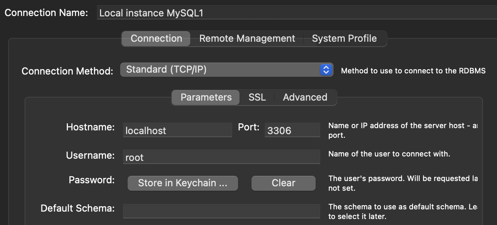
</p>

Se selecciona la opción `Store in Keychain` o `Store in Vault` (dependiendo del sistema), para ingresar la contraseña del servicio para el respectivo usuario.

> [!IMPORTANT]
> El puerto utilizado usualmente para las comunicaciones con MySQL es el 3306. El resto de opciones pueden variar dependiendo de las necesidades.

### Ejecución

Se crearon 4 programas para ejecutar varios comandos o acciones dentro de una base de datos, estos se encuentran en `./MySQL/`, donde su funcionalidad se describe a continuación:

- __`db1.sql`__: Contiene el código para crear una base de datos llamada `ejemplo_db`, usarla y crear una tabla llamada `empleados` dentro de ella.

- __`db2.sql`__: Inserta 5 registros en la tabla para empleados.

- __`db3.sql`__: Permite seleccionar todos los empleados con el primer `SELECT`. El segundo selecciona los empleados del departamento de ventas.

<p align="center">
  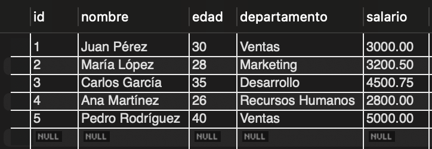
</p>

<p align="center">
  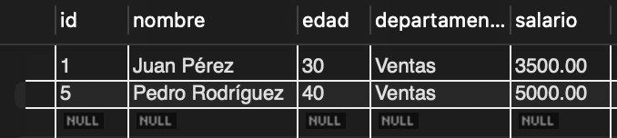
</p>

- __`db4.sql`__: Consiste en un programa un poco más grande con varias consultas.
    - Selecciona los empleados con más de `3000.00` de salario. Ya aparece el salario de `Juan Pérez` actualizado del último comando por simplicidad.

    <p align="center">
    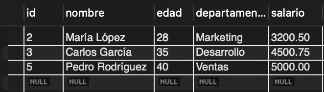
    </p>
    
    - Cuenta el número de empleados por departamento.

    <p align="center">
    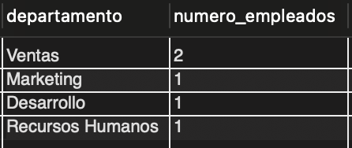
    </p>

    - Calcula el salario promedio por departamento.

    <p align="center">
    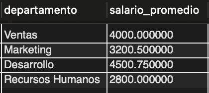
    </p>

    - Actualiza el salario de `Juan Pérez` inicial. Para este comando se debe de tener deshabilitado `Safe Updates`, el cual se puede modificar en `Preferencias > SQL Editor`.

> [!TIP]
> MySQL Workbench permite seleccionar cuáles líneas o comandos ejecutar específicamente dentro de un programa. Utilice el ícono con símbolo de rayo para ello después de seleccionar las líneas de interés.

### MySQL Shell

Como se mencionó al inicio, también se instaló MySQL Shell, la cual permite realizar consultas a la base de datos directamente desde la consola.

Para acceder a ella desde la terminal, se utilizó el siguiente comando:

```shell
mysqlsh
```

Al ingresar, si se desea cambiar para interpretar comandos en SQL (dependiendo del caso puede iniciar en otro lenguaje de programación), se utiliza:

```shell
\sql
```

Para conectarse al _local host_ donde se creó la base de datos anterior en Workbench, se utiliza el puerto 3306, como se había mencionado previamente. Utilice el siguiente comando:

```sql
\connect root@localhost:3306
```

<p align="center">
  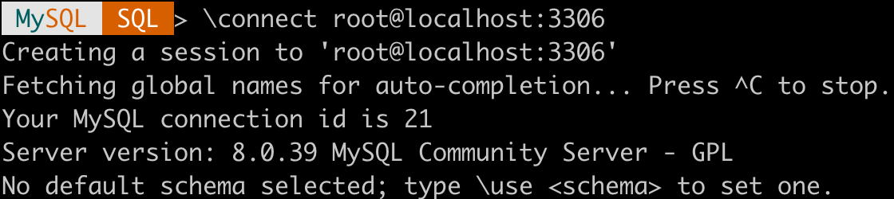
</p>

> [!NOTE]
> Es posible que le solicite la __contraseña de root__.

Para mostrar las bases de datos disponibles se utiliza el comando:

```sql
SHOW DATABASES;
```

<p align="center">
  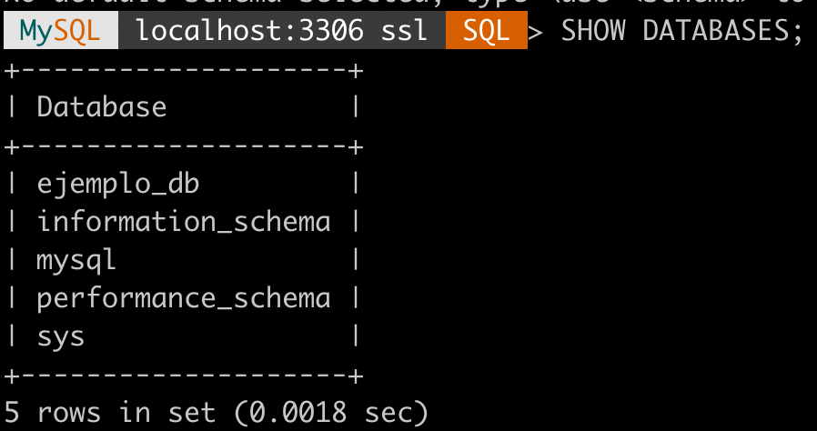
</p>

Para usar la base de datos `ejemplo_db`, escriba el comando:

```sql
USE ejemplo_db
```

A continuación se muestra el resultado de realizar la operación de inserción de registros en la tabla `empleados`:

<p align="center">
  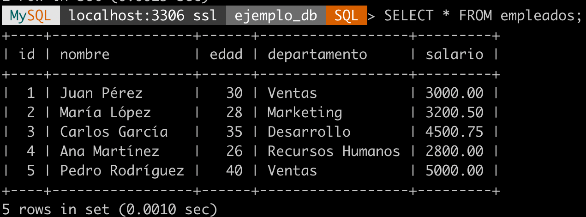
</p>

Observe que se añadieron los mismos empleados que en la sección del Workbench.

Para ello, se utilizó el comando:

```sql
INSERT INTO empleados (nombre, edad, departamento, salario) VALUES
('Juan Pérez', 30, 'Ventas', 3000.00),
('María López', 28, 'Marketing', 3200.50),
('Carlos García', 35, 'Desarrollo', 4500.75),
('Ana Martínez', 26, 'Recursos Humanos', 2800.00),
('Pedro Rodríguez', 40, 'Ventas', 5000.00);
```

## SQLite

Fue creado en el 2000 por D. Richard Hipp. Es un proyecto de dominio público y se utiliza ampliamente debido a su simplicidad y eficiencia.

SQLite es una biblioteca de C que implementa un motor de base de datos SQL embebido. Soporta bases de datos de hasta 140 terabytes.

Es utilizado en aplicaciones móviles, navegadores web, aplicaciones de escritorio y dispositivos embebidos, por mencionar unos cuantos.

### Instalación

Para la instalación, puede ingresar al [sitio oficial de SQLite](https://www.sqlite.org/download.html).

Dependiendo del sistema operativo, se tiene un proceso distinto. En el caso de Windows, descargue los binarios precompilados para Windows.

Para la instalación, en mi caso, utilicé el instalador de paquetes `Homebrew` para tener la versión disponible para la arquitectura ARM-64 nativo. Este cambio hace que los comandos de ejecución varíen un poco en la dirección donde se encuentran los paquetes.

Inicialmente, se agregó a la variable de entorno PATH, la ruta de los binarios de SQLite. Para ello, se agregó al archivo `~/.bash_profile` el comando:

```shell
export PATH="/opt/homebrew/opt/sqlite/bin:$PATH"
```

Además, para que los compiladores encuentren SQLite, se agregan las siguientes variables de entorno:

```shell
export LDFLAGS="-L/opt/homebrew/opt/sqlite/lib"
export CPPFLAGS="-I/opt/homebrew/opt/sqlite/include"
```

### Ejecución

El programa para mostrar el funcionamiento de SQLite, se encarga de crear (si no existe) una base de datos `test.db`. Posteriormente, se abre y se crea una tabla (si no existe) llamada `COMPANY`, la cual posee una llave primaria `ID`, `NAME`, `AGE`, `ADDRESS`, `SALARY`. Se insertan registros a la tabla correspondientes a los trabajadores de la compañía y se seleccionan todos los trabajadores para mostrar en pantalla, por medio de la función `callback`definida para imprimir los valores retornados.

Se utilizó el siguiente comando de compilación del programa:

```shell
g++ ./SQLite/sqlite.cpp -o ./SQLite/main -L/opt/hom
ebrew/opt/sqlite/lib -I/opt/homebrew/opt/sqlite/include 
-lsqlite3
```

> [!IMPORTANT]
> El comando anterior varía dependiendo del sistema en el que es ejecutado. Lo importante es incluir en la sección de `-L` la ruta de la biblioteca SQLite `lib` y en `-I`, la ruta del `include`.

Para ejecutar, de la forma usual para programas de C++, se utiliza el comando:

```shell
./main
```

<p align="center">
  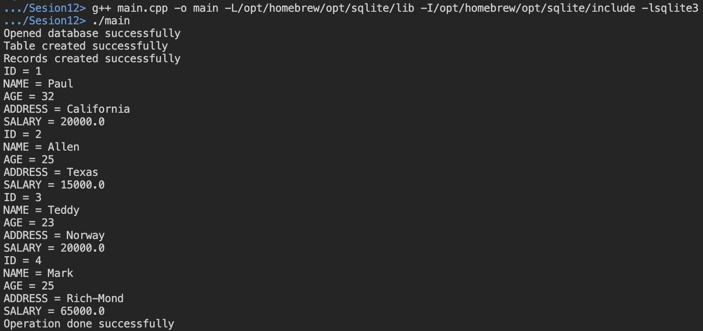
</p>

En la segunda ejecución del programa, se muestra el error que ya existe la tabla `COMPANY` dentro de la base de datos `test.db` y que ya existen los valores dentro de la tabla ingresados, entonces se continúa con los siguientes comandos para mostrar la salida:

<p align="center">
  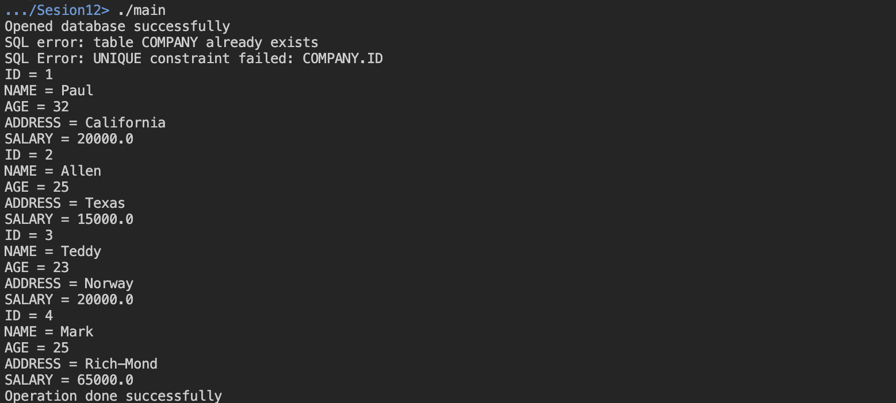
</p>

# Amazon RDS con AWS

AWS es uno de los proveedores de servicios en la nube más grandes y más utilizados en el mundo

Amazon RDS (_Relational Database Service_) es el servicio gestionado de bases de datos relacionales de AWS. Entre su características, se encuentra que este es multimotor, disponibilidad alta, permite automatización de backups y snapshots, escalable, de fácil uso y seguro.

### Creación de database en RDS

Inicialmente, es necesario crearse una cuenta en AWS. Para ello, acceda al [sitio oficial de AWS](https://aws.amazon.com/free/).

Posteriormente, en la sección de servicios, selecciona `RDS` y luego `Create database`. Entre la configuración de la base de datos, lo importante es que el método de creación sea `Standard create` y que el motor sea `MySQL`. Además, en cuanto a los credenciales, se colocó como _master user_ `admin` y se escribió una contraseña personalizada. Es importante deshabilitar `Storage autoscaling` para evitar cobros monetarios y colocar la base de datos como `Publicly accessible` para poder acceder desde un cliente de terceros.

Para esta sección, es importante tener instalado el conector de MySQl para C++, como se mencionó en la instalación de los recursos de MySQL.

En caso de tener problemas con la conexión entre la computadora y AWS, revise la página [Troubleshooting for Amazon RDS](https://docs.aws.amazon.com/AmazonRDS/latest/UserGuide/CHAP_Troubleshooting.html#CHAP_Troubleshooting.Connecting). 

### Configuración en la computadora

Para que las bibliotecas utilizadas en el programa sean reconocidas por Visual Studio Code y el sistema, se agregaron las siguientes variables al _bash profile_:

```shell
export PATH="/usr/local/mysql-connector-c++-9.0.0/bin:$PATH"
export CPLUS_INCLUDE_PATH="/usr/local/mysql-connector-c++-9.0.0/include:$CPLUS_INCLUDE_PATH$"
export LIBRARY_PATH="/usr/local/mysql-connector-c++-9.0.0/lib64:$LIBRARY_PATH"
export DYLD_LIBRARY_PATH="/usr/local/mysql-connector-c++/lib64:$DYLD_LIBRARY_PATH"
```

La primera corresponde a la ruta de los binarios del conector para C++. La segunda consiste en el directorio de `include` del conector. La tercera es el path de la biblioteca (`lib`). La cuarta es utilizada para reconocer los recursos durante la compilación para las bibliotecas dinámicas.

Además, se puede agregar la ruta `"/usr/local/mysql-connector-c++-9.0.0/include/**"` al _includePath_ de VS Code para que reconozca los elementos de la biblioteca dentro del editor de texto.

### Ejecución

El comando de compilación utilizado corresponde al siguiente:

```shell
g++ ./AWS/aws.cpp -o ./AWS/aws -std=c++11 -I/usr/local/mysql-connector-c++-9.0.0/include/jdbc -I/usr/local/mysql-connector-c++-9.0.0/jdbc/cppconn -L/usr/local/mysql-connector-c++-9.0.0/lib64 -lmysqlcppconn
```

> [!IMPORTANT]
> El comando anterior varía dependiendo del sistema y de la ubicación de los archivos de la biblioteca. `-I` contiene la ubicación del directorio `./mysql-connector-c++-9.0.0/include/jdbc` y `./mysql-connector-c++-9.0.0/jdbc/cppconn`. `-L` contiene la ubicación del directorio `./mysql-connector-c++-9.0.0/lib64` que es la biblioteca.

Para ejecutar el archivo ejecutable resultante del proceso de compilación, se utiliza el comando:

```shell
./AWS/aws
```

En la siguiente imagen, se muestra el resultado de la ejecución del programa:

<p align="center">
  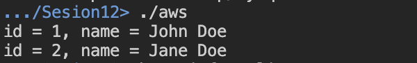
</p>