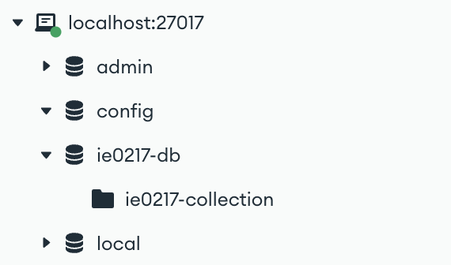
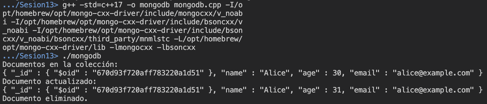
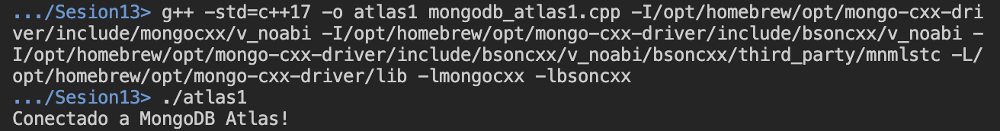
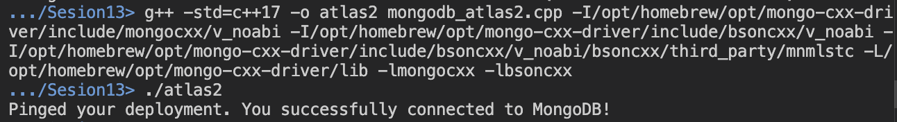

# Sesión 13

Esta sesión corresponde a la realizada el 15 de octubre del 2024, que consiste en el uso de bases de datos no relacionales, específicamente MongoDB, tanto a nivel local como en la nube con MongoDB Atlas.

## Tipos de bases de datos no relacionales (NoSQL)

Cada motor NoSQL tiene su propio lenguaje para realizar consultas. A continuación se describen brevemente algunos tipos de bases de datos NoSQL utilizados en la industria.

### Bases de datos clave-valor (key-value)

Almacenan datos como pares clave-valor, donde las claves son únicas. Son eficientes en la recuperación de datos (usualmente emplean un algoritmo de _hashing_).

Entre los principales usos para este tipo de bases de datos se encuentran: caches, sesiones de usuario, almacenamiento de configuraciones y contadores, entre otros. 

Motores populares:
- Redis
- DynamoDB

### Bases de datos column-family

Consiste en un contenedor lógico para un conjunto de filas. Cada fila dentro de una column-family tiene una clave única llamada __Row Key__. Además, cada columna tiene un nombre, valor y una marca de tiempo. Sin embargo, a diferencia de SQL, las filas no deben tener todas las columnas, lo cual proporciona flexibilidad al almacenar los datos.

Entre los usos comunes para este tipo de bases de datos, se encuentran: análisis de big data, almacenes de datos, sistemas de recomendación, gestión de registros financieros.

Motores populares:
- Apache Cassandra
- HBase

### Bases de datos de grafos

Almacenan datos altamente interconectados mediante nodos (__entidades__) y aristas (__relaciones__). 

Entre los usos comunes se encuentran las redes sociales y sistemas de recomendación, así como gestión de fraudes y sistemas para el análisis de redes.

Motores populares:
- Neo4j
- OrientDB

### Bases de datos no documentales

Almacenan datos en documentos, típicamente en formato JSON o BSON. Cada documento contiene pares clave-valor, y los documentos pueden tener estructuras anidadas. 

Son utilizados en aplicaciones donde se requiere flexibilidad en el esquema para realizar modificaciones rápidas y fácil gestión de datos semiestructurados. Son ampliamente empleados en aplicaciones web, gestión de contenido, análisis de datos, entre otros.

Motores populares:
- MongoDB
- CouchDB

## MongoDB

### Instalación

En general, una de las ventajas de MongoDB es que corresponde a un sistema ampliamente documentado. Por lo tanto, la instalación dependiendo del sistema donde se esté ejecutando se puede realizar de forma sencilla. 

A continuación, se encuentran una serie de links de descarga y documentación de MongoDB (dependiendo del sistema operativo).

- [Link de descarga](https://www.mongodb.com/try/download/community): Se debe de seleccionar la versión que desea instalar, la plataforma y el tipo de paquete de interés.
- [Documentación para la instalación en Windows](https://www.mongodb.com/docs/manual/tutorial/install-mongodb-on-windows/)
- [Documentación para la instalación en MacOS](https://www.mongodb.com/docs/manual/tutorial/install-mongodb-on-os-x/)

> [!IMPORTANT]
> En el caso de MacOS, la documentación oficial sugiere que se descarguen los paquetes utilizando el manejador de paquetes __Homebrew__.

Después de la instalación es importante seguir los pasos indicados en la documentación para agregar a MongoDB como un servicio del sistema.

Para verificar la correcta instalación de MongoDB, utilice el siguiente comando para abrir Mongo en la terminal:

```shell
mongosh
```

Se puede mostrar las bases de datos dentro de `mongosh` con el siguiente comando:

```shell
show dbs;
```

Además de MongoDB, también se necesita descargar la interfaz gráfica para interactuar con MongoDB denominada MongoDB Compass. Para ello, se debe acceder al siguiente [link de descarga de Compass](https://www.mongodb.com/try/download/compass).

Después de instalarlo, abra el programa y realice una nueva conexión con el `localhost` para crear una base de datos local. Para ello, la URI de la nueva conexión debe ser la siguiente:

```shell
mongodb://localhost:27017/
```

Además, se creó una base de datos denominada `ie0217-db` junto con una colección dentro de ella `ie0217-collection`.

Al finalizar estos pasos, se visualiza la base de datos en la barra izquierda de MongoDB Compass.

<p align="center">
  
</p>

## MongoDB en C++

En el archivo __`mongodb.cpp`__, se colocó el código para crear/seleccionar la base de datos `mydatabase` y la colección de esta `users`, esto de manera local en el `localhost`. Por lo que, los cambios también pueden ser visualizados en MongoDB Compass (si no se borrara el documento).

Posteriormente, se inserta un documento para el usuario `Alice`, actualiza su edad y posteriormente, elimina el documento.

En la línea de actualizar los datos, se cambió la sección de `$set` para permitir cambiar el valor de la edad correctamente, respecto a la sesión oficial del curso. Observe el documento para observar los cambios a detalle.

### Configuración para ejecutar el programa de C++

Inicialmente, se instaló el driver de C++ para utilizar MongoDB. Para ello, se accedió al siguiente [link de documentación del driver de MongoDB para C++](https://www.mongodb.com/docs/languages/cpp/cpp-driver/current/).

Al seguir los pasos de instalación, de igual manera, se recomienda que en MacOS, se utilice el manejador de paquetes __Homebrew__ para instalar el driver. En caso de utilizar otro sistema operativo, siga las instrucciones de instalación específicas en la documentación.

Para que Visual Studio Code reconozca a los drivers utilizados en este proyecto, se colocaron las direcciones de estos en el _includePath_ del archivo `c_cpp_properties.json` de VS Code. Específicamente, se colocó la ruta de los siguientes directorios:

```shell
"<ruta_completa>/mongo-cxx-driver/include/mongocxx/v_noabi/**",
"<ruta_completa>/mongo-cxx-driver/include/bsoncxx/v_noabi/**" 
```

Es decir, de colocó la ruta del directorio `mongocxx` y `bsoncxx`, pues estos son los que contienen los header files empleados.

### Compilación y ejecución

Para ejecutar el programa, es necesario indicar la versión de C++ que se va a utilizar (`-std=c++17`), el nombre del ejecutable resultante (`-o mongodb.exe`) y el nombre del archivo de código fuente (`mongodb.cpp`). Después, se colocan las rutas de los directorios de inclusión para los drivers `mongocxx` y `bsoncxx` con el flag `-I` antes de las rutas.

Para solucionar un error de que no se encuentra el header file `core/optional` se colocó también la ruta del directorio `mnmlstc` que contiene al archivo `core/optional.hpp`.

Finalmente, se colocó la ruta de la librería del driver `mongo-cxx-driver`, así como los flags `-lmongocxx -lbsoncxx` para terminar la configuración de la compilación.

El comando completo se muestra a continuación:
```shell
g++ -std=c++17 -o mongodb.exe mongodb.cpp -I<ruta_completa>/mongo-cxx-driver/include/mongocxx/v_noabi -I<ruta_completa>/mongo-cxx-driver/include/bsoncxx/v_noabi -I<ruta_completa>/mongo-cxx-driver/include/bsoncxx/v_noabi/bsoncxx/third_party/mnmlstc -L<ruta_completa>/mongo-cxx-driver/lib -lmongocxx -lbsoncxx
```

Con este proceso, debería generarse el archivo ejecutable `mongodb.exe`. El resultado de su ejecución se muestra en la imagen a continuación:

<p align="center">
  
</p>

Observe que se ejecutaron los pasos de creación, actualización y deleción de forma correcta. 

## MongoDB Atlas

Corresponde a una base de datos como servicio (DBaaS) totalmente administrada que maneja la configuración, operación y escalabilidad de MongoDB en la nube.

Entre las ventajas de su uso, se encuentra el despliege global, escalabilidad automática, seguridad a nivel empresarial, alta disponibilidad y copias de seguridad automatizadas. 

Los programas en cuestión __`mongodb_atlas1.cpp`__ y __`mongodb_atlas2.cpp`__, contiene el código para conectarse a una base de datos en MongoDB Atlas. Al final, imprime un mensaje de que se realizó la conexión correctamente. 

### Configuración de MongoDB Atlas

Para utilizar el servicio, ingrese a este [link de MongoDB Atlas](https://www.mongodb.com/products/platform/atlas-database). Cree una cuenta de forma gratuita y cree la base de datos.

En mi caso, creé el usuario `dsaenzobando` como el _admin_ de la base de datos y un Cluster llamado `Cluster0` por simplicidad. Es importante agregar también la dirección IP de acceso en la pestaña __Network Access__.

De igual forma que en el ejercicio anterior, la configuración también es aplicable para ejecutar el código de este.

### Compilación y ejecución

En cuanto a la compilación del primer programa `mongodb_atlas1.cpp`, el comando es similar al utilizado en el ejercicio anterior. El comando completo se muestra a continuación:

```shell
g++ -std=c++17 -o atlas1.exe mongodb_atlas1.cpp -I<ruta_completa>/mongo-cxx-driver/include/mongocxx/v_noabi -I<ruta_completa>/mongo-cxx-driver/include/bsoncxx/v_noabi -I<ruta_completa>/mongo-cxx-driver/include/bsoncxx/v_noabi/bsoncxx/third_party/mnmlstc -L<ruta_completa>/mongo-cxx-driver/lib -lmongocxx -lbsoncxx
```

El resultado de la ejecución del programa se muestra a continuación:
<p align="center">
  
</p>

Con respecto al segundo programa `mongodb_atlas2.cpp`, se utiliza el siguiente comando de compilación:
```shell
g++ -std=c++17 -o atlas2.exe mongodb_atlas2.cpp -I<ruta_completa>/mongo-cxx-driver/include/mongocxx/v_noabi -I<ruta_completa>/mongo-cxx-driver/include/bsoncxx/v_noabi -I<ruta_completa>/mongo-cxx-driver/include/bsoncxx/v_noabi/bsoncxx/third_party/mnmlstc -L<ruta_completa>/mongo-cxx-driver/lib -lmongocxx -lbsoncxx
```

El resultado de la ejecución se encuentra en la siguiente imagen:
<p align="center">
  
</p>

Observe que al ejecutar el archivo ejecutable resultante en ambos casos, se imprimió un mensaje donde se indica que se conectó correctamente.

