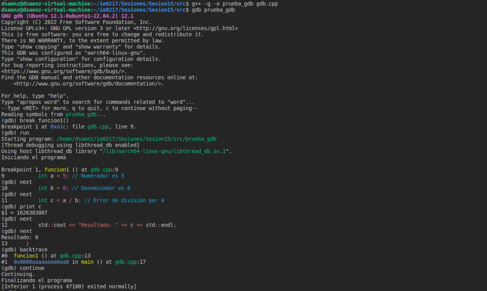
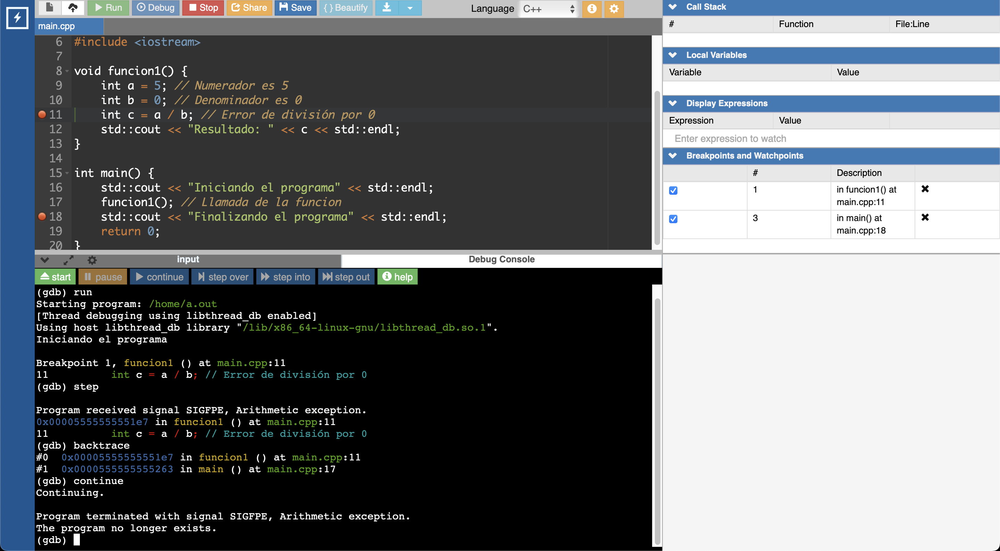
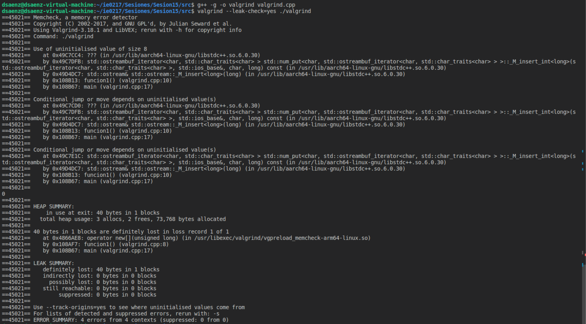
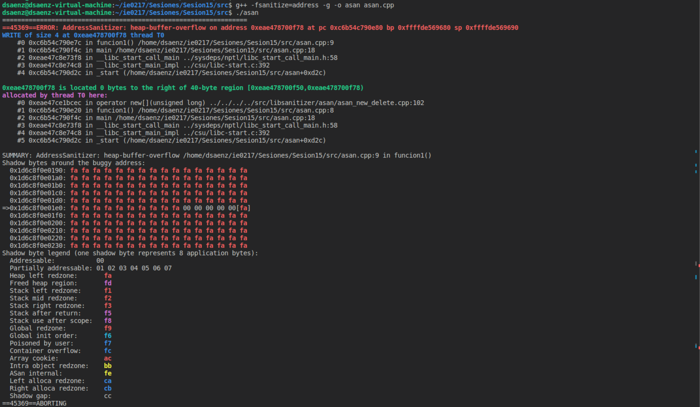
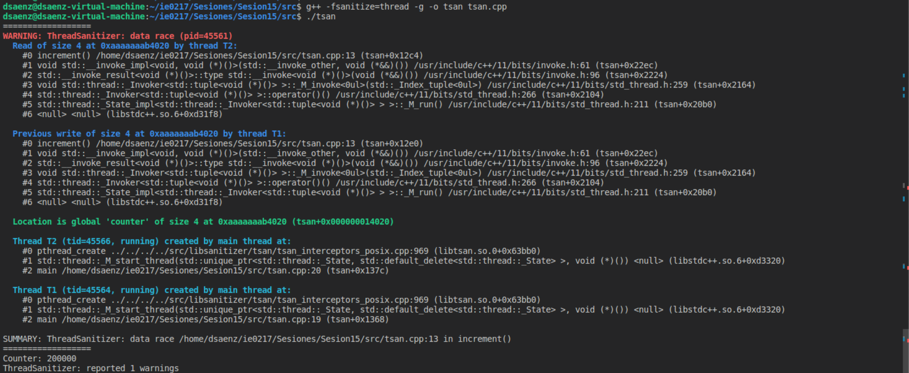
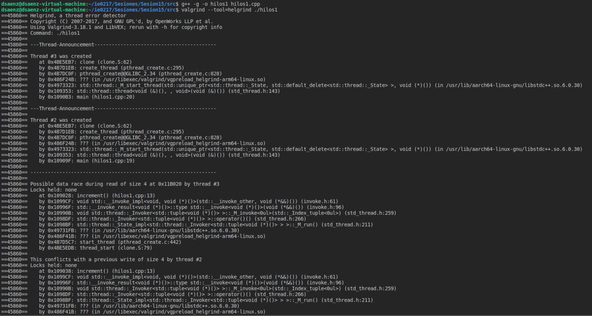
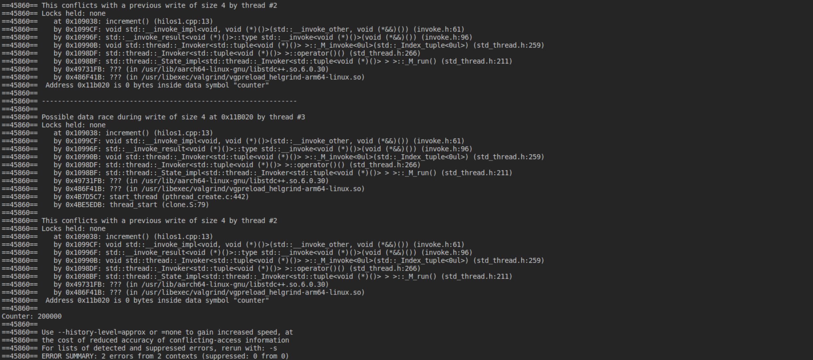
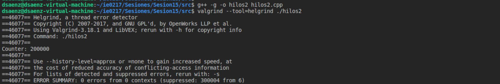

# Sesión 15

El presente directorio corresponde a la sesión realizada para el martes 29 de octubre del 2024, que trata sobre las herramientas de depuración como `gdb`, `valgrind` y `sanitizers`.

## Modo de uso

Para la compilación de los programas, es importante señalar que se utiliza el flag `-g` con `g++` para indicar que se va a utilizar en modo de debugging.

Además, asegúrese de estar en el directorio `./ie0217/Sesiones/Sesion15` para la compilación. Por simplificidad, los archivos generados se van a encontrar en este directorio si se utilizan los comandos indicados a continuación. 

### `gdb`

La primera herramienta utilizada corresponde a `gdb` (_GNU Debugger_). Para ello, se utiliza el programa `gdb.cpp`que contiene un error de división por 0.

Para la compilación, se utiliza el siguiente comando:

```shell
g++ -g -o prueba_gdb ./src/gdb.cpp
```

Luego, para la ejecución con `gdb`, se utiliza el siguiente comando:

```shell
gdb prueba_gdb
```

### Valgrind

Para utilizar `valgrind` para realizar debugging con el manejo de la memoria del programa, se va a utilizar el archivo `valgrind.cpp`.

Para compilar, se sugiere el siguiente comando:

```shell
g++ -g -o prueba_valgrind ./src/valgrind.cpp
```

Posteriormente, para ejecutarlo:

```shell
valgrind --leak-check=yes ./prueba_valgrind
```

### `ASan`

Para la demostración del uso de los _AdressSanitizers_, se usó el programa `asan.cpp`. Para la compilación, se sugiere el siguiente comando:

```shell
g++ -fsanitize=address -g -o asan ./src/asan.cpp
```

Para la ejecución:

```shell
./asan
```

### `TSan`

En cuanto a los _ThreadSanitizer_, se va a emplear el archivo `hilos1.cpp` para la verificación de existencia de condiciones de carrera. Utilice el siguiente comando de compilación:

```shell
g++ -fsanitize=thread -g -o hilos1 ./src/hilos1.cpp
```

Respecto a la ejecución, se realiza de forma regular, como se muestra a continuación:

```shell
./hilos1
```

### Helgrind

Finalmente, para probar el funcionamiento de `helgrind`, se van a utilizar dos archivos. El primero es el mismo utilizado para `TSan` para comprobar la existencia de condiciones de carrera (`hilos1.cpp`) El segundo corresponde a un programa donde no hay condiciones de carrera (`hilos2.cpp`).

El comando de compilación requerido es el siguiente:

```shell
g++ -g -o <nombre_ejecutable> ./src/<nombre_archivo_fuente>
```

En cuanto a la ejecución, se utiliza el comando a continuación:

```shell
valgrind --tool=helgrind ./<nombre_ejecutable>
```

> [!WARNING]
> Los comandos sugeridos fueron utilizados en un entorno Unix. Por lo que es posible que varíen si se utilizan en el sistema operativo Windows. Por ejemplo, en la colocación de una extensión definida al archivo compilado.

## Descripción de conceptos importantes

En esta sección, se describen los conceptos importantes de la sesión.

### Depuración

Este concepto trata sobre el proceso de __identificar__ y __eliminar__ errores o fallos de manera efectiva en un programa de software. Su objetivo se basa en garantizar la calidad y el correcto funcionamiento del programa.

- __Calidad del código__:
    - Código consistente.
    - Código fiable.
- __Mantenimiento del código__: Un código depurado y limpio es más fácil de mantener en el tiempo y de realizarle cambios sin afectar el funcionamiento del programa.
    - Generalmente está ligado con código limpio y bien documentado.
    - La modularidad ayuda a depurar el código bloque por bloque.
- __Eficiencia de desarrollo__: La detección temprana de los errores reduce el tiempo para corregirlos más adelante. 
- __Experiencia de usuario__: Minimiza los fallos que pueden afectar la experiencia del usuario final del software y su coste asociado.

### Tipos de errores

1) __Errores de sintaxis__: En la forma en que se escribe el código.
    - Generalmente son detectados por el compilador o intérprete del programa.
2) __Errores de tiempo de ejecución__: Son errores que ocurren mientras el programa se está ejecutando (de forma imprevista):
    - Pueden causar que el programa se detenga inesperadamente.
3) __Errores lógicos__: El programa se comporta de forma incorrecta, aunque no genere errores. 
    - Pueden ser causados por algoritmos incorrectos, condiciones erróneas en estructuras de control o bucles infinitos.

### Puntos de interrupción (_breakpoints_)

Son marcadores que se colocan en el código para pausar la ejecución del programa en una línea específica.

### Paso a paso (_stepping_)

- _Step over_: Avanza al siguiente punto de ejecución, pero sin entrar en funciones llamadas en la línea actual.
- _Step into_: Avanza al siguiente punto de ejecución. Entra en funciones llamadas en la línea actual.
- _Step out_: Continúa la ejecución hasta salir del ámbito de la función actual. Es útil cuando se está dentro de una función y se quiere salir rápidamente.

### Inspección de variables

Es esencial poder ver el valor que toman las variables en un momento dado durante la ejecución para identificar errores. Muchos IDEs permiten ver las variables globales y locales y el valor que toman, así como modificarlo.

### Call stack

Consiste en la secuencia de llamadas de funciones están en ejecución al punto actual. Es una herramienta importante para entender el flujo de ejecución del programa y diagnosticar errores en funciones anidadas.

## GNU Debugger (`gdb`)

Es una herramienta de depuración potente para programas escritos en C y C++. Permite a los desarrolladores ver lo que está ocurriendo dentro de un programa mientras se ejecuta o en el momento de un fallo.

Entre las funcionalidades que ofrece, se encuentran las siguientes:
- __Control de ejecución__: Pausar y reanudar la ejecución del programa.
- __Inspección de variables__: Ver y modificar el valor de las variables.
- __Navegación en la pila de llamadas__: Ver la pila de llamadas para entender el flujo de ejecución.
- __Breakpoints__: Establecer puntos de interrupción para pausar la ejecución en líneas específicas del código fuente.
- __Tracing__: Seguir el flujo del programa paso a paso.

A continuación se muestra un cuadro con comandos útiles dentro de `gdb`:

| Comando    | Descripción                                                           | Uso                                             |
|------------|-----------------------------------------------------------------------|-------------------------------------------------|
| run        | Inicia la ejecución del programa.                                     | `(gdb) run`                                     |
| break      | Establece un punto de interrupción en una línea o función.            | `(gdb) break main.cpp:10`<br>`(gdb) break main` |
| next       | Ejecuta la siguiente línea de código, sin entrar en funciones llamadas en esa línea. | `(gdb) next`                     |
| step       | Ejecuta la siguiente línea de código y entra en cualquier función llamada en esa línea. | `(gdb) step`                  |
| continue   | Reanuda la ejecución del programa hasta el siguiente breakpoint o hasta que termine. | `(gdb) continue`                 |
| print      | Muestra el valor de una variable.                                     | `(gdb) print variable`                          |
| backtrace  | Muestra la pila de llamadas actual.                                   | `(gdb) backtrace`                               |

## Valgrind

Es un marco de herramientas para el análisis de programas que ayuda a encontrar errores relacionados con la memoria y la concurrencia. Es especialmente útil para detectar pérdidas de memoria, accesos inválidos a memoria, y condiciones de carrera.

- __Detección de pérdidas de memoria__: Identifica lugares donde la memoria dinámica no se libera correctamente, lo que puede llevar a fugas de memoria.
- __Errores de memoria__: Detecta accesos fuera de límites y uso de memoria no inicializada.
- __Análisis de concurrencia__: Herramientas específicas dentro de Valgrind pueden detectar problemas en programas multihilo.

## Memcheck

Monitorea todas las operaciones de memoria en un programa, asegurándose de que no se acceda a memoria no inicializada, se libere memoria más de una vez, o se lea/escriba fuera de los límites de los bloques de memoria asignados.

- __Detección de errores de lectura/escritura__: Identifica accesos fuera de los límites de los bloques de memoria.
- __Memoria no inicializada__: Detecta el uso de memoria que no ha sido inicializada.
- __Pérdidas de memoria__: Informa sobre cualquier memoria que se haya asignado pero no liberado antes de que el programa termine.

## Sanitizers

### AddressSanitizers (`ASan`)

Es una herramienta de detección de errores de memoria que encuentra problemas comunes como accesos fuera de los límites, uso de memoria después de ser liberada (_use-after-free_), y uso de memoria no inicializada. Se mantiene un _shadow memory_ para detectar accesos incorrectos.

Se debe utilizar el flag `-fsanitize=address` para agregar el runtime de `ASan` al archivo compilado.

- __heap-buffer-overflow__: Acceso fuera de los límites del array.
- __use-after-free__: Uso memoria después de haber sido liberada.
- __Shadow bytes__: Estado de los bytes de la memoria alrededor de la dirección problemática.

### ThreadSanitizer (`TSan`)

Es una herramienta que detecta condiciones de carrera (_race conditions_) y problemas de concurrencia multihilo.

Se utiliza el flag `-fsanitize=thread`. Entonces, en la salida de la ejecución se muestran los siguientes datos:

- __Data race__: Indica que se ha detectado una condición de carrera.
- __Read/Write__: Muestra las operaciones de lectura y escritura en memoria que causaron la condición de carrera.
- __Ubicación__: Proporciona la ubicación exacta en el código fuente donde ocurre la condición de carrera.

### Helgrind

Está diseñada para detectar problemas en programas multihilo, tales como condiciones de carrera, bloqueos y otros errores relacionados con el uso de hilos. Se encuentra en el marco de herramientas de Valgrind.

## Demostración de ejecución de los programas

### `gdb`

Para probar el funcionamiento de `gdb`, se utilizaron dos métodos:

- De forma local
- En línea

Inicialmente, con el método local, se siguieron las instrucciones de compilación y ejecución indicadas en el modo de uso. Posteriormente, ya en la ejecución, se colocó un `breakpoint` en la función `funcion1()` y se ejecutó línea por línea para ir analizando el comportamiento del programa. El resultado se muestra en la imagen a continuación:

<p align="center">
  
</p>

Observe que al ocurrir la división por 0 y se imprime el valor de `c`, se obtiene que el programa toma un comportamiento indefinido. Según la investigación realizada, en ciertas arquitecturas puede ocurrir este comportamiento y que el programa no falle. De ahí que sea también importante utilizar este tipo de herramientas para validar estos comportamientos inesperados.

Aparte de eso, se utilizó el comando `backtrace` para observar el _call stack_ en ese momento de ejecución.

Ahora bien, al colocar el código en línea en la página [onlinegdb](https://www.onlinegdb.com/), se obtuvo la salida a continuación:

<p align="center">
  
</p>

En este caso, sí se genera el error aritmético y se detiene la ejecución del programa.

### Valgrind

Para la demostración de ejecución de `valgrind`, se compiló y ejecutó con las instrucciones mencionadas para obtener la siguiente salida:

<p align="center">
  
</p>

Observe que hubo errores por acceso a variables no inicializadas, que es justamente lo que ocurrió en el programa. Además, se muestra que se perdió memoria por no haberla liberado (`valgrind.cpp:8`), lo cual coincide con la línea donde se reservó la memoria no liberada.

### `ASan`

De igual manera, para los _AddressSanitizers_, se tiene que hubo un acceso fuera de los límites del arreglo y un acceso después de liberar la memoria. En la imagen a continuación se muestra la salida de la ejecución:

<p align="center">
  
</p>

En el primer bloque, se muestra un `heap-buffer-overflow`, que indica un acceso fuera de los límites del arreglo. Además, se muestra _shadow bytes_, que corresponde al estado de los bytes alrededor de la dirección problemática.

### `TSan`

En cuanto a los _ThreadSanitizers_, se tiene que en la salida, se muestra justamente en dónde están ocurriendo las condiciones de carrera por los _threads_, en la sección `data_race`. Se muestra que el thread T1 y el thread T2 están leyendo y escribiendo a la variable `counter`, lo cual genera _race conditions_.

<p align="center">
  
</p>

### Helgrind

Finalmente, para Helgrind, se tiene que la salida para el programa donde hay _race conditions_ es la siguiente:

<p align="center">
  
</p>

<p align="center">
  
</p>

En las anteriores, se muestra que los threads están entrando en conflicto e intentan leer y escribir a la vez, lo cual implica _race conditions_.

Para el programa `hilos2.cpp`, se tiene la siguiente salida, donde no hay errores de _race conditions_.

<p align="center">
  
</p>


