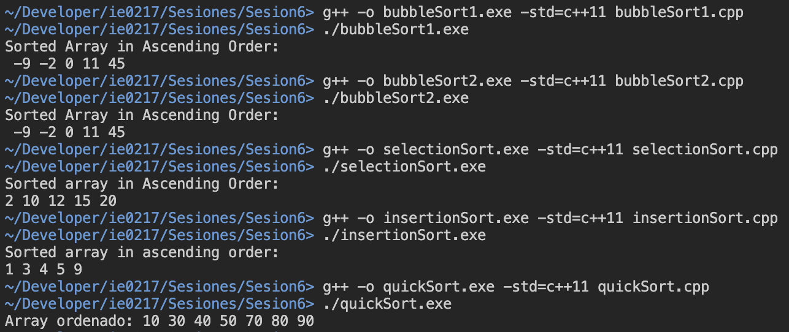

# Sesión 6: Algoritmos de ordenamiento en C++

Esta sesión corresponde a la realizada para el 13 de setiembre, acerca del tema de algoritmos de ordenamiento en C++.

En el directorio actual, se encuentran los siguientes subtemas desarrollados:

- __bubbleSort1.cpp__: Implementación del algoritmo de ordenamiento de burbuja (_bubble sort_), sin optimización en caso de que se termine de ordenar antes de lo previsto.

- __bubbleSort2.cpp__: Implementación del algoritmo _bubble sort_ optimizado, de manera que, cuando si se dejan de realizar _swaps_ antes de terminar el loop; es decir, el arreglo se ordenó antes de terminar el loop, se termina el ciclo.

- __selectionSort.cpp__: Algoritmo de ordenamiento _selection sort_, el cual recorre el arreglo de datos para buscar los datos de menor valor y colocarlos en su posición correspondiente.

- __insertionSort.cpp__: Código del algoritmo de ordenamiento por inserción, el cual consiste en que se divide el arreglo en un _subarray_ ordenado (izquierdo) y un _subarray_ desordenado (derecha). Cada elemento de la parte derecha se va insertando en su posición correcta en el subarreglo izquierdo.

- __quickSort.cpp__: Implementación del algoritmo de ordenamiento rápido, el cual posee una complejidad temporal promedio de `O(nlog(n))`. Este funciona por medio de recursividad y la declaración de elementos pivote para colocar los elementos menor que este en la parte izquierda y los mayores en la derecha.

## Modo de uso

Para ejecutar los programas, es necesario que se tenga instalado el compilador `g++` para ejecutar el código de C++.

A modo general, los programas contienen únicamente un archivo de fuente. Por ende, se sugiere el siguiente comando, dentro del directorio actual `./ie0217/Sesiones/Sesion6/`:

```
g++ -o nombrePrograma.exe -std=c++11 nombrePrograma.cpp
```

Para ejecutarlos, se requiere el comando a continuación:

```
./nombrePrograma.exe
```

Para eliminar el ejecutable, se utiliza el comando en Linux (Unix-based):
```
rm nombrePrograma.exe
```

En Windows, se utiliza el comando:
```
del nombrePrograma.exe
```

__Nota__: Si se compilan los archivos en el sistema operativo Windows, es posible que al ejecutar o especificar direcciones de archivos, se requiera utilizar `\` en lugar de `/`.

Además, se presentan algunos casos especiales de archivos que utilizan propiedades que no se presentan en la versión predeterminada de C++ utilizada por el compilador, como sintaxis modernas. Por lo tanto, se recomienda compilar con el flag `-std=c++11`, con el fin de evitar este problema.

## Demostración de la ejecución

