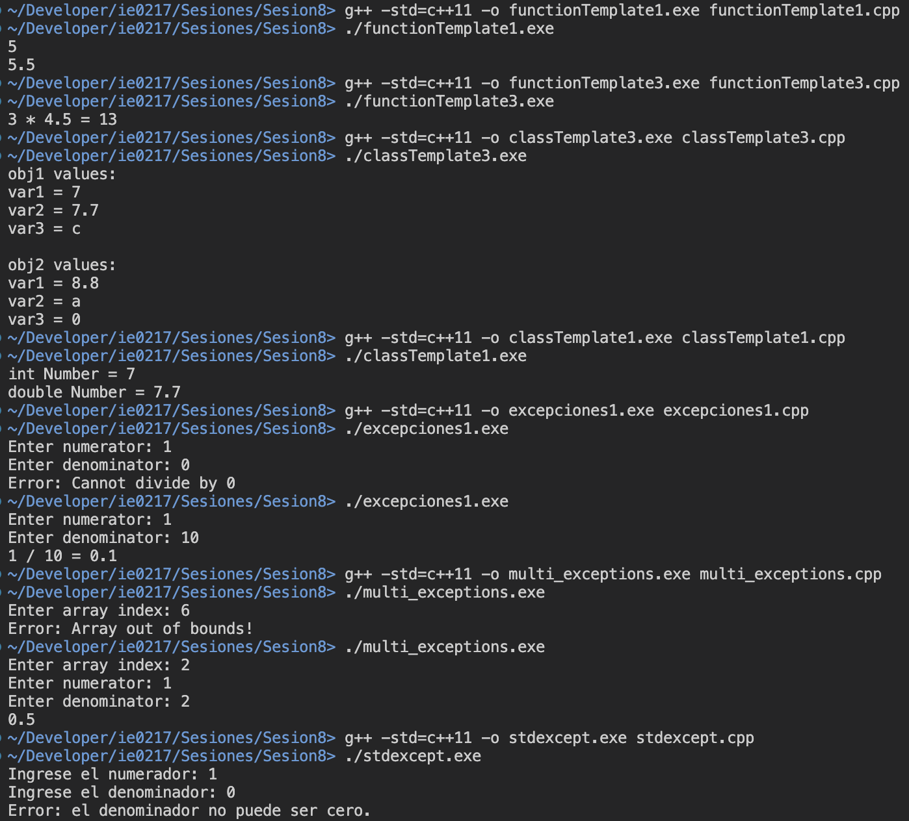

# Sesión 8: Templates y Excepciones

Esta sesión corresponde a la realizada para el 20 de setiembre del 2024, que abarca el uso e implementación de __templates__ y excepciones en C++.

En el directorio actual, se encuentran los siguientes subtemas desarrollados:

### <ins>Templates</ins>

- `functionTemplate1.cpp`, `functionTemplate2.cpp` y `functionTemplate3.cpp`: Representan ejemplos del uso de templates en funciones para trabajar con diferentes tipos de datos dentro de ellas en la misma definición. Abarca el uso de _function templates_ con un único parámetro y varios parámetros diferentes.

- `classTemplate1.cpp`, `classTemplate2.cpp` y `classTemplate3.cpp`: Abarca el uso de _class templates_ en clases con parámetros únicos y múltiples, así como el uso de estos cuando se separa la declaración de la definición de las funciones miembro de la clase.


### <ins>Excepciones</ins>

- `excepciones1.cpp` y `excepciones2.cpp`: Corresponde al ejemplo realizado en la sesión para validar los posibles valores de una división. Se emplea la sintaxis __try-catch__ para el manejo de errores.

- `multi_exceptions.cpp`: Consiste en otro programa para validar los valores del numerador y denominador de una fracción. Se utilizan varias excepciones para manejar el tipo de error ocurrido.

- `stdexcept.cpp` y `noExceptions.cpp`: Uso de la biblioteca __stdexcept__ para levantar excepciones especiales en C++.


## Modo de uso

Para ejecutar los programas, es necesario que se tenga instalado el compilador `g++` para ejecutar el código de C++.

A modo general, los programas contienen únicamente un archivo de fuente. Por ende, se sugiere el siguiente comando, dentro del directorio actual `./ie0217/Sesiones/Sesion8/`:

```
g++ -std=c++11 -o nombrePrograma.exe nombrePrograma.cpp
```

Para ejecutarlos, se requiere el comando a continuación:

```
./nombrePrograma.exe
```

Para eliminar el ejecutable, se utiliza el comando en Linux (Unix-based):
```
rm nombrePrograma.exe
```

En Windows, se utiliza el comando:
```
del nombrePrograma.exe
```

__Nota__: Si se compilan los archivos en el sistema operativo Windows, es posible que al ejecutar o especificar direcciones de archivos, se requiera utilizar `\` en lugar de `/`.

Además, se presentan algunos casos especiales de archivos que utilizan propiedades o sintaxis especiales que no se presentan en la versión predeterminada del compilador de C++, como _for_ loops con `auto`. Por lo tanto, se recomienda compilar con el flag `-std=c++11`, con el fin de evitar este problema.

## Demostración de la ejecución

Se compilaron y ejecutaron algunos programas de C++ del presente directorio para demostrar la funcionalidad apropiada de cada uno de ellos, a modo de ejemplo. Los programas que no fueron ejecutados corresponden a los que contienen ligeros cambios respecto a los ejecutados.

