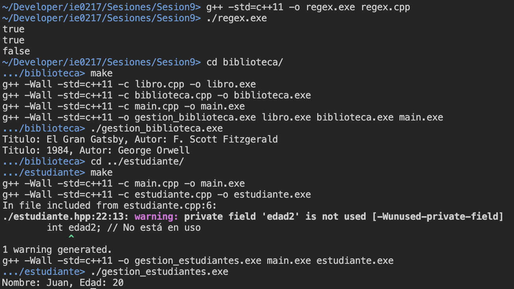

# Sesión 9: Expresiones regulares y Makefiles

Esta sesión corresponde a la realizada para el 20 de setiembre del 2024, correspondiente a la implementación de expresiones regulares (_regex_) y el uso de la herramiento de compilación __Makefile__.

En el directorio actual, se encuentran los siguientes subtemas desarrollados:

### <ins>Expresiones regulares</ins>

Se implementó un programa donde se utiliza de forma básica la biblioteca `regex` de C++ para encontrar coincidencias en strings. Se empleó la función `std::regex_search()` para determinar el estado de la búsqueda.

### <ins>Makefile</ins>

Se implementó un sistema de gestión de biblioteca básico con programación orientada a objetos. Se dividió el código en _header files_ y _source files_, en los cuales se implementaron las clases de forma separada. De igual manera, se implementó un sistema de gestión de estudiantes con POO, el cual se compone de varios archivos `.cpp` y `.hpp`.

La idea de esta implementación dividida está enfocada en el uso de __Makefile__ como herramienta de compilación en ambos casos, la cual facilita el proceso de compilación, pues permite definir variables, reglas con dependencias y demás comandos, para hacer el procedimiento dinámico. 

## Modo de uso

Para ejecutar los programas, es necesario que se tenga instalado el compilador `g++` para ejecutar el código de C++, así como la herramienta de compilación Makefile.

Primeramente, para ejecutar el programa `regex.cpp`, ubíquese en el directorio `./ie0217/Sesiones/Sesion9/`, y ejecute el siguiente comando:

```
g++ -std=c++11 -o regex.exe regex.cpp
```

Para ejecutarlo, se requiere el comando a continuación:

```
./regex.exe
```

Para eliminar el archivo ejecutable generado `regex.exe`, se utiliza el comando en Windows:

```
del regex.exe
```

En el caso de Linux (_Unix-based_), se utiliza el comando:

```
rm regex.exe
```

Ahora bien, para los programas contenidos en los directorios `./ie0217/Sesiones/Sesion9/estudiante/` y `./ie0217/Sesiones/Sesion9/biblioteca/`, se tiene que ingresar a su directorio respectivo y ejecutar el siguiente comando con la herramienta __Makefile__:
```
make
```

Para eliminar los archivos generados, se utiliza el siguiente comando en la terminal:
```
make clean
```

__Nota__: Si se compilan los archivos en el sistema operativo Windows, es posible que al ejecutar o especificar direcciones de archivos, se requiera utilizar `\` en lugar de `/`.

Además, se presentan algunos casos especiales de archivos que utilizan propiedades que no se presentan en la versión predeterminada de C++ utilizada por el compilador, como _for_ loops con `auto`. Por lo tanto, se recomienda compilar con el flag `-std=c++11`, con el fin de evitar este problema.

## Demostración de la ejecución

Se compilaron y ejecutaron los programas de C++ del presente directorio para demostrar la funcionalidad apropiada de cada uno de ellos, a modo de ejemplo.



Observe que todos cada uno de ellos se ejecutó de la forma esperada. El único _warning_ presente corresponde a la variable no utilizada en `estudiante.hpp`. En el archivo se mencionó de igual manera que no se le asignaba ningún uso, pero se copió igualmente para seguir con la guía de contenido de la presente sesión.