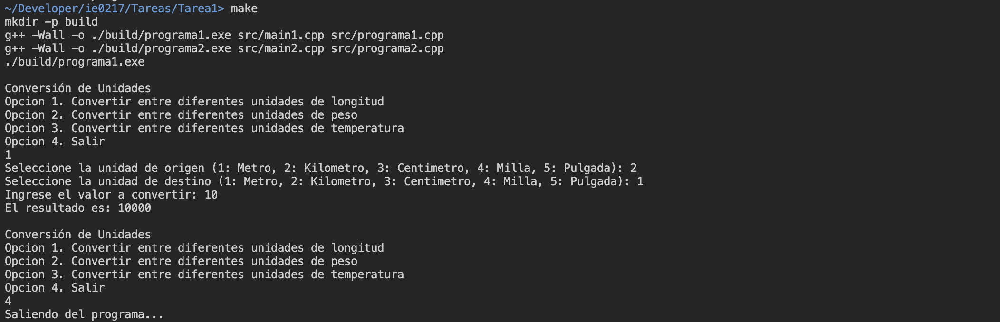
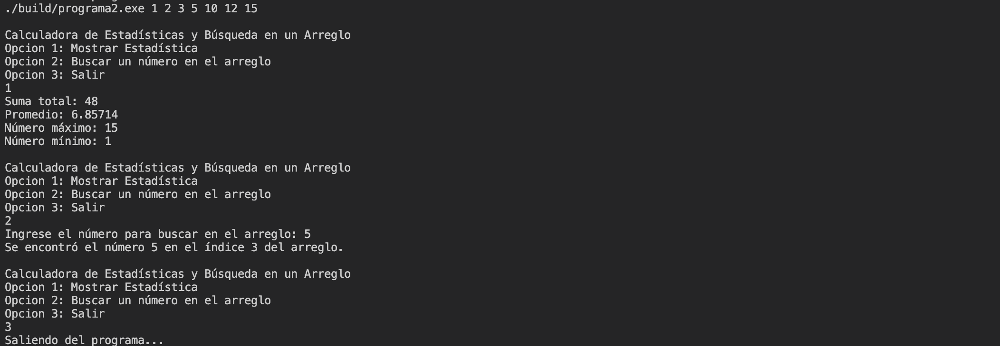

# Tarea 1

Esta corresponde a la _Tarea 1_ del curso IE-0217, en la cual se tratan los principios del lenguaje de programación C++. La asignación está dividida en tres partes:

1) Modo de uso
2) Preguntas teóricas sobre C++.
3) Descripción del ejercicio de __Conversión de unidades__.
4) Descripción del ejercicio de __Calculadora de Estadísticas y Búsqueda en un Arreglo__.

Las secciones mencionadas se desarrollan a continuación.

Además, para acceder a documentación detallada en Doxygen sobre ambos programadas realizados, ingrese a este [link]().

A lo largo de todos los programas creados para esta asignación, se utilizó la convención de variables descrita en el siguiente enlace: [Naming Convention in C++ - GeeksForGeeks](https://www.geeksforgeeks.org/naming-convention-in-c/). En las indicaciones, se mencionó que se utilizara la convención para el nombramiento de variables más común. Sin embargo, al investigar en distintas fuentes se encontraron contradicciones sobre la convención más utilizada, especialmente entre _snake\_case_ y _camelCase_, pues la elección entre estas dos se menciona que es por preferencia y depende de la dinámica del grupo de trabajo o proyecto en cuestión.

## Modo de uso

El proceso de compilación se utilizó a partir de la herramienta Makefile y se utiliza el compilador g++. Por lo tanto, es importante que se tenga instalado en el dispositivo para la ejecución.

La compilación de ambos programas está dada por el siguiente comando:
```
make
```
Asegúrese de estar en el directorio `./ie0217/Tareas/Tarea1/` para ejecutar el comando. Este se encarga de crear un directorio nuevo (si no existe), denominado `./build`, en donde se van a encontrar los archivos ejecutables.

Después de esto, se crean los ejecutables y se ejecutan secuencialmente, de forma que primero se ejecuta `./build/programa1.exe` y luego `./build/programa2.exe`.

Para interactuar con las aplicaciones, siga las instrucciones que se muestran en la terminal al ejecutar. En caso de dudas sobre su uso, puede profundizar sobre el uso en la sección al final de __Conversión de Unidades__ o __Calculadora de Estadísticas y Búsqueda en un Arreglo__.

Para eliminar los archivos ejecutables, utilice el comando a continuación:
```
make clean
```

Si ya compiló los programas previamente y desea volver a ejecutarlos, sírvase del comando:
```
make run
```

Como nota adicional sobre el uso de las aplicaciones, el segundo programa `programa2.exe` está programado de tal forma que recibe argumentos desde la línea de comandos, pues fue diseñado para recibir una lista de números para los cuales calcular estadísticas del conjunto y poder buscar si existe o no un número dentro del conjunto. Entonces, el _Makefile_ fue realizado para colocar argumentos predeterminados en caso de que no se especifique nada: `1 2 3 5 10 12 15`.

Sin embargo, si se quiere colocar una serie de números personalizados, utilice el siguiente comando:
```
make ARGS2="1 2 ..."
```
Si ya compiló los archivos, utilice:
```
make run ARGS2="1 2 ..."
```

El _Makefile_ fue diseñado de manera que funciona en dispositivos con sistema operativo Windows y Linux.

## Preguntas teóricas

En esta sección se van a responder a las preguntas propuestas por el profesor sobre los principios de C++.

### 1. ¿Cuáles son las diferencias entre los lenguajes compilados e interpretados? Brinde un ejemplo de cada uno.

Se presentan diferencias marcadas entre los lenguajes del tipo compilado e interpretado.

Primeramente, en cuanto al proceso de ejecución del código, se tiene que en los lenguajes compilados, el código se traduce a un lenguaje de bajo nivel por un compilador (_g++_ en el caso de C++); el código de máquina generado por el compilador fue hecho específicamente para la arquitectura de la computadora en cuestión. Por esta razón, cuando se distribuye código de lenguajes compilados, se envía el código fuente, no el ejecutable. Ahora bien, respecto a los lenguajes interpretados, estos se ejecutan línea por línea por medio de un intérprete; es decir, no se genera un archivo ejecutable.

El siguiente punto está relacionado con el anterior, pues los lenguajes compilados, por lo general, son más rápidos, debido a la compilación previa del código.

Durante el proceso de compilación, también se pueden detectar errores del tipo sintácticos, mientras que en los interpretados, es necesario ejecutar el programa para detectarlos.

Un ejemplo de un lenguaje de programación compilado corresponde a __C++__ o __Rust__. Mientras que, uno interpretado sería __Python__.

### 2. ¿Qué son los tipos de datos en C++? ¿Cuáles son sus clasificaciones? Brinde dos ejemplos de cada clasificación.

Los tipos de datos en C++ son los indicadores de qué tipo de dato se guarda en cierta variable, las operaciones que se pueden realizar con la variable, así como la cantidad de memoria que vaya a ocupar esta. 

Se dividen en tipos de datos primarios, derivados y _user defined_ (definidos por el usuario). Los primarios son los básicos del lenguaje, como enteros __int__ y caracteres __char__.

Los derivados como su nombre lo indica derivan de los primitivos, como colecciones de datos primitivos __arrays__ y __punteros__ que guardan la direccion de datos primarios.

Finalmente, los definidos por el usuario son los tipos que permiten agrupar datos primitivos y derivados para realizar nuevos tipos y adaptar a las necesidades del programa en cuestión, por ejemplo. Entre los tipos definidos por el usuario, se encuentran las __clases__ y los _structs_.


### 3. Explique qué es un linker en el contexto de un lenguaje de programación compilado. ¿Cuál es su función principal y por qué es esencial en el proceso de compilación?

El trabajo del linker en la compilación de archivos de C++ corresponde a combinar y vincular los archivos objeto dentro de un archivo ejecutable o en una biblioteca. Se realiza esta combinación a partir de la resolución de referencias entre los archivos objeto; es decir, cuando se declara una función en un header file, se tiene la definición en un archivo `.cpp` y se llama en otro archivo `.cpp`, el linker se encarga de asociar la llamada de la función con la declaración y la definición de esta.

Entonces, a partir de lo anterior, se tiene que el linker es fundamental para poder programar aplicaciones de forma modular. Además, realiza ciertas optimizaciones al unir los archivos objetos en el ejecutable resultante.

### 4. ¿Cuál es la diferencia entre usar el operador `=` y `==`? Brinde un ejemplo para cada uno.

El operador `=` consiste en el __operador de asignación__. Este se utiliza cuando se va a asignar un valor a una variable, por ejemplo. Su funcionamiento se ilustra en la porción de código a continuación:

```
int num = 1;
```

Se está asignando el valor de 1 a la variable _num_.

Ahora bien, el operador `==` corresponde al __operador de igualdad__. Se utiliza para comparar la igualdad entre dos valores. Al operar con él, se devuelve `true` si ambos valores son iguales o `false` si son distintos.

El ejemplo consiste en que se define `x` con el valor de 1. Luego, se coloca el operador de igualdad dentro de la condición del `if` para comprobar si el valor guardado en la variable `x` es igual a 1. En caso de serlo, se imprime un mensaje para indicar que se ejecuta el statement. 

```
int x = 1;

if (x == 1) {
    cout << "Se ejecuta" << endl;
}
```

### 5. Observe el siguiente código, indique qué imprime el programa en la iteración número 7 y 9 del ciclo, explique el porqué.

```
#include <iostream>
int main() {
    int sum = 0;
    int result = 0;

    for (int i=0; i <= 10; i++) {
        sum += i;

        result = (i % 3 == 0) ? sum : 0;
        std::cout << result << std::endl;
    }
    return 0;
}
```

Para responder a esta pregunta, primero se puede ejecutar el código una modificación para rastrear el número de repetición y el resultado obtenido, luego se analiza por qué el resultado fue este. 

Entonces, el código utilizado fue el que se muestra a continuación. Se agregó una impresión del número de repetición del loop antes del resultado.
```
#include <iostream>
int main() {
    int sum = 0;
    int result = 0;

    for (int i=0; i <= 10; i++) {
        sum += i;

        result = (i % 3 == 0) ? sum : 0;
        std::cout << i+1 << ". " << result << std::endl;
    }
    return 0;
}
```

Inicialmente, en el código se inicializan las variables `sum` y `result` en 0. Luego, se emplea un _for_ loop, tal que la variable `i` del ciclo tome valores desde 0 hasta 10, inclusive, con un incremento de una unidad en cada repetición.

Dentro del ciclo, se incrementa el valor de la variable almacenado en `sum` en `i` unidades. Posteriormente, se utiliza el operador ternario `?` para determinar el valor que se almacena en `result`. La operación a realizar es si `i` es divisible por 3, entonces `result` contiene al valor de `sum`; en caso contrario, es 0.

Si se observa la salida de la ejecución del programa anterior, se tiene lo siguiente:

```
1. 0
2. 0
3. 0
4. 6
5. 0
6. 0
7. 21
8. 0
9. 0
10. 45
11. 0
```

El _output_ coincide con el resultado esperado. Como se inicia en 0, entonces los valores de `i` divisibles por 3 corresponden a los que poseen la forma __3n+1__; es decir, 4, 7 y 10. En estos casos, es que se guarda en `result` la suma de todos los números desde 0 hasta el número en cuestión, lo cual se modela con la suma de Gauss. 

Para ejemplificar el párrafo anterior, cuando `i` toma el valor de 6, en la sétima repetición, se tiene que es divisible por 3. Por lo tanto, toma el valor de la suma de los números desde 0 hasta 6, que por la fórmula de Gauss es: `6*7/2 = 21`.


### 6. Explique el proceso de pasar argumentos a la función principal. ¿Cuál es el primer elemento de `argv[ ]`?

El proceso para pasar argumentos a la función `main()` consiste en indicar en la función los parámetros a recibir, la sintaxis es la siguiente:

```
int main(int argc, char *argv[])
```

Se tiene que `int argc` corresponde a la cantidad de argumentos que se recibe en la línea de comandos (incluye el nombre del programa). Además, `char *argv[]` corresponde a un arreglo de punteros del tipo caracter, donde cada índice apunta a una cadena que representa el número del argumento indicado. 

Para responder a la segunda pregunta, `argv[0]` corresponde al nombre del programa; es decir, el primer elemento del arreglo es el nombre o parte de la ruta del ejecutable.

### 7. ¿Cuál es la diferencia entre declarar e inicializar una variable?

La acción de __declarar__ una variable consiste en indicar el nombre y tipo de la variable, corresponde a una forma de indicarle al compilador que existe la variable, pero no se le asigna un valor. También, se reserva su espacio en memoria. 

En cuanto a __inicializar__ una variable,esta consiste en asignarle un valor a la variable después de la declaración.

### 8. ¿Para qué sirven los modificadores en C++?

Los modificadores corresponden a palabras que se colocan como prefijos para cambiar propiedades de variables o funciones, así como el comportamiento de estas. Por ejemplo, están los modificadores `signed` y `unsigned` que modifican el rango de la variable numérica (admite números negativos en su rango o no, respectivamente). Además, los modificadores `short` y `long` también son utilizados para cambiar el tamaño de las variables en memoria y por ende, su rango varía proporcionalmente. Los anteriores son de gran utilidad en sistemas donde el uso eficiente de recursos es una prioridad.

Obtenido de: [C++ Type Modifiers - GeeksForGeeks](https://www.geeksforgeeks.org/cpp-type-modifiers/).

### 9. ¿Qué es la sobrecarga de funciones en C++ y cómo se utiliza?

La sobrecarga de funciones es una característica de C++ que permite definir funciones con el mismo nombre y tipo de retorno, pero con distinto número y tipo de parámetros. Esto es realmente útil para la simplificación del código y aumentar su legibilidad y comprensión. El compilador se encarga de entender cuál definición de la función utilizar basándose en las características mencionadas anteriormente.

Un ejemplo de su uso es el siguiente, donde se tienen definidas dos funciones de `sumar()`, con la diferncia en el número de parámetros que recibe cada una.

```
int sumar(int a, int b) {
    return a + b;
}

int sumar(int a, int b, int c) {
    return a + b + c;
}
```

### 10. ¿Cuál es la diferencia entre una variable local y una local estática?

Primero, se tiene que la variable local se declara dentro de una función o bloque de código, tal que su _scope_ está limitado a ese bloque (no se puede acceder fuera de él). Respecto a su ciclo de vida, al terminar la ejecución de la función/bloque de código, la variable muere (se libera su memoria).

En segundo lugar, las variables locales estáticas comparten el mismo _scope_ de las locales regulares. Sin embargo, su tiempo de vida difiere, pues conserva su valor en las siguientes llamadas de la función, por ejemplo. Se inicializa y vive hasta que termine la ejecución del programa.

### 11. ¿Qué es el type casting? ¿Cuáles existen? Brinde un ejemplo de cada uno.

El _type casting_ consiste en el proceso de convertir una variable de un data type a otro en programación. En el caso de C++ existen 4 tipos principales:

1) `static_cast`

Este corresponde al más usado en C++ y se utiliza para realizar castings seguros de tipos de datos relacionados. La sintaxis es la siguiente:

```
// static_cast<new_type> (expression);

int num = 10;
double numDouble = static_cast<double>(num);
```

2) `dynamic_cast`

Se utiliza para hacer casting downcasting; es decir, convertir de un puntero de una clase base a una clase derivada.

```
// dynamic_cast<new_type> (expression);

Animal* animalPtr = new Dog(); // base class ptr
Dog* dogPtr = dynamic_cast<Dog*>(animalPtr); // downcasting
```

3) `const_cast`

Este casting es empleado para modificar el prefijo de __const__ o __volatile__ de una variable. Normalmente, se utiliza temporalmente para modificar los valores de las variables. Sin embargo, se debe usar con cuidado porque pueden provocar indefiniciones.

```
// const_cast<new_type> (expression);

const int number = 5;
const int* ptr = &number;
int* nonConstPtr = const_cast<int*>(ptr); // const casting
*nonConstPtr = 10; // modificar el valor constante
```

4) `reinterpret_cast`

Este tipo de casting se utiliza para cambiar el tipo de un puntero a otro.

```
// reinterpret_cast<new_type> (expression);

int* numberPointer = &number;

// cambio de tipo de ptr
char* charPointer = reinterpret_cast<char*>(numberPointer);
```

Como tipo adicional, se encuentra el casting implícito que ocurre cuando no va a haber pérdida de información al hacerlo.

```
int a = 1;
double b = a;
```

También está el casting clásico de C, que se utilizan los paréntesis __()__ antes de la variable para hacer el casting. 

```
int a = 1;
double b = (double)a;
```

Obtenido de: [Casting Operators in C++](https://www.geeksforgeeks.org/casting-operators-in-cpp/).

### 12. ¿Cuál es la principal diferencia entre un bucle _do-while_ y un bucle _while_?

El bucle _do-while_ realiza una ejecución del código dentro de llaves y luego se ejecuta cada repetición mientras se cumpla la condición en el _while_.

En cuanto al bucle _while_, desde el inicio, este se ejecuta únicamente si la condición se cumple; es decir, si la condición antes de entrar al loop no se cumple, no se ejecuta ninguna repetición del _while_.

### 13. Explique por qué es útil y común dividir el código en archivos `.hpp`, `.cpp` y `main.cpp` en C++. Describa el propósito específico de cada tipo de archivo.

La utilidad de dividir el código en archivos `.hpp`, `.cpp` y `main.cpp` radica en la modularidad del código. Al diseñar el proyecto de esta forma, se facilita la organización, el mantenimiento y la colaboración. Además, se separa la implementación del código en el archivo `.cpp`, mientras que se proporciona una interfaz del código en el `.hpp`.

Entonces, el propósito del archivo `main.cpp` consiste en que este es el punto de entrada y guía de ejecución del código (contiene las instrucciones principales). Se incluyen los archivos de encabezado creados.

Los archivos de encabezado `.hpp` contienen la __declaración__ de las funciones, variables globales, clases y estructuras de datos, entre otros, que se utilizan en los archivos del programa. Por esta razón, este corresponde a la interfaz del proyecto. Para utilizarlos, se necesita incluirlos por medio de `#include`.

Los archivos `.cpp` contienen la definición e implementación de las funciones, clases y demás código fuente, para ser accesados por medio del _header file_ en los archivos donde es incluido. También se conocen como _source files_ por esta razón.


### 14. ¿Qué hace la sentencia `goto` y por qué es considerada una mala práctica en la programación moderna? ¿Qué alternativas se pueden usar en su lugar?

La sentencia `goto` funciona de manera que permite saltarse código y dirigirse a una etiqueta definida. Es decir, cambia el flujo de ejecución del código y dependiendo de la complejidad del programa, resulta confusa de seguir el código y difícil de mantener. Además, existen casos donde puede que no se declaren o liberen datos correctamente por estos saltos entre código.

Entre las alternativas a esta secuencia, se encuentran los loops conocidos `for` y `while`, así como el uso de estructuras condicionales como `if-else`. Para manejar la interrupción de código, se recomienda utilizar los keywords `break` (para salir del loop), `continue` (para saltar una iteración del loop) y `return` (para salir de funciones). De esta forma, no se presentan saltos directos en el código, se sigue el flujo regular de ejecución.

### 15. ¿Para qué se utiliza la directiva `#ifndef` y por qué es importante?

`#ifndef` significa _si no se ha definido_ y consiste en una directiva de preprocesador que se utiliza en los _header files_ o archivos de cabecera para evitar la inclusión del archivo varias veces.

Su importancia radica en que así, se evita un uso de memoria innecesario, así como la redefinición de elementos que pueden generar errores y conflictos.

Funciona de tal forma que, si se no ha definido lo que se encuentra dentro de `#ifndef` y `#endif`, se define. En posteriores inclusiones, si ya se definió, esta parte es omitida.

### 16. ¿Qué es un puntero y para qué es útil? ¿Cómo se declara e inicializa?

Un puntero en C++ es una variable que almacena la dirección de memoria de otra variable. Las variables regulares contienen valores, pero los punteros contienen direcciones.

La forma de declararlos se muestra a continuación:

```
int num1 = 1;
int* ptr = &num1; // data_type* ptr_name = &var
int num2 = *ptr;
```

En el ejemplo anterior, se evidencia el uso de `*` después del _data type_ para indicar que se trata de un puntero, luego se escribe el nombre del variable puntero, esta es la declaración del puntero. En cuanto a la asignación de un valor (inicialización), se utiliza el operador `&` para acceder a la memoria de la variable `num`. Entonces, se guarda en el puntero la dirección de memoria de num.

También, se utiliza nuevamente el `*` para acceder a la memoria a la que apunta el puntero. Por eso, en el ejemplo, se le asigna a `num2` el contenido de la dirección a la apunta `ptr`, que sería el valor de `num1`.

La utilidad de los punteros consiste en que se puede acceder directamente al valor en memoria de la variable. Por lo tanto, es usado ampliamente en funciones donde se requiere modificar el valor de la variable fuera del _scope_ de la función. Otra aplicación de los punteros corresponde a la manipulación de memoria dinámica y estructuras dinámicas de datos. 


### 17. ¿Cuál es la diferencia entre pasar parámetros por valor, por referencia y por puntero?

Al pasar parámetros por valor, se crea una copia del valor fuera de la función, por ejemplo. Por lo tanto, se utiliza memoria adicional para la copia, la cual es la utilizada dentro de la función (se modifica la copia, no el valor fuera de la función).

```
// Los cambios no se realizan fuera de la funcion
void duplicar(int n) {
    n *= 2;
}
```

En cuanto al paso de parámetros por referencia, la función recibe la dirección de la variable argumento. Por lo tanto, al modificar la variable, los cambios se reflejan también en la variable original. 

```
// Se modifica n fuera de la funcion pues se recibe su direccion
void duplicar(int &n) {
    n *= 2;
}
```

Finalmente, en el paso de parámetros por puntero, se utilizan punteros para modificar variables o estructuras de datos que se encuentran fuera de la función. Los cambios también se reflejan en estos pues se recibió un puntero hacia ellos, no una copia de su valor.

```
// Modifica el valor al que apunta n
void duplicar(int* n) {
    *n *= 2;
}
```

### 18. Cuando se usa un puntero para apuntar a un arreglo en C++, ¿a qué valor o dirección apunta inicialmente? Describa cómo sería la forma de acceder a todos los datos de ese arreglo mediante el puntero.

Al utilizar punteros en un arreglo, no se apunta a todo el arreglo. Por la naturaleza de esta estructura, cada elemento de los índices se encuentra en memoria contigua. Por lo tanto, al apuntar con un puntero a un arreglo se apunta al primer índice de este.

La forma de declarar un puntero a un arreglo es la siguiente:

```
int arr[10];

// Forma 1
int* ptr = arr;

// Forma 2
int* ptr = arr[0];
```

Posteriormente, para acceder a las demás entradas del arreglo por medio del puntero, se debe de sumar el índice de interés al puntero, para moverse esa cantidad de espacios en memoria.

```
int arr[10];
int* ptr = arr;

// Indice 5
*(ptr + 5);
```

Por ejemplo, en el bloque de código anterior, se declaró un arreglo con 10 entradas. El puntero se asignó de la forma mencionada anteriormente. Ahora bien, para acceder a la entrada 5 del arreglo, se aumenta la dirección del puntero en 5. También, se utiliza el operador `*` para acceder a la dirección del primer elemento más 5, de ahí que se utilicen los paréntesis.

### 19. ¿En qué caso es conveniente usar el operador `->` en punteros y por qué es beneficioso?

El operador `->` en C++ se utiliza principalmente con punteros a estructuras _structs_ o clases para acceder a los miembros de esos objetos. Note que este operador combina la desreferencia del puntero junto con el acceso al miembro, por lo que, es lo mismo que utilizar `*(ptr).`. 

Su beneficio radica en la practicidad de escribir y leer este operador en comparación con la sintaxis análoga mencionada.

### 20. ¿Cuál es la manera de implementar punteros dobles, triples, etc? Brinde un ejemplo de en qué caso sería beneficioso usar esta implementación.

Para implementar punteros dobles, triples o múltiples en general, se utiliza la agrupación de asteriscos `*` luego de colocar el _data type_ de la variable puntero. Por ejemplo, si se refiere a un puntero triple, se utilizan tres asteriscos para indicar este nivel de indirección.

Un ejemplo de uso se muestra a continuación:

```
int n = 20;
int *ptr = &n;
int **ptr_ptr = &ptr;
int ***ptr_ptr_ptr = &ptr_ptr;
```

Entonces, el puntero triple guarda la dirección del puntero doble (apunta al doble), el doble apunta al simple y así sucesivamente.

Esto es especialmente útil cuando se trabaja con matrices multidimensionales con memoria dinámica. En este caso, el arreglo de filas (puntero doble) contiene punteros simples que corresponden a las entradas de las columnas.

### 21. ¿Qué es el puntero `this` en C++?

Antes de explicar el concepto del puntero `this` resulta importante comprender que cuando se crea un objeto a partir de una clase, este posee una copia de cada uno de los miembros de la clase. Entonces, este puntero está disponible para los métodos no estáticos de una clase y apunta a la dirección de la instancia del objeto que llamó al método.

Un ejemplo de uso corresponde al siguiente:

```
class Coordenadas {
    private:
        int x, y;

    public:
        Coordenadas(int x, int y) {
            this->x = x;
            this->y = y;
        }
}
```

Obtenido de: ['this' pointer in C++ - GeeksForGeeks](https://www.geeksforgeeks.org/this-pointer-in-c/).

### 22. ¿Qué es un puntero `nullptr`?

Un puntero `nullptr` corresponde a puntero que, como su nombre lo indica, contiene apunta a una dirección nula o no válida. Usualmente, es utilizado cuando un puntero no está inicializado o cuando se dejó de utilizar y se indica que no apunta a nada.

Es una buena práctica al trabajar con punteros que estos sean inicializados como un `nullptr` y que al utilizarlos, se compruebe antes que no sean nulos para evitar errores.

### 23. ¿Qué es una función prototipo?

Una función prototipo corresponde a la declaración de una función. No se incluye la definición o implementación de la función, únicamente contiene el tipo de dato de retorno y los parámetros con su tipo; es decir, la firma de la función.

Estas son utilizadas en el diseño de código modular en archivos de encabezado con terminación `.hpp`.

### 24. ¿Dónde y cómo se guardan las variables que se crean en C++? Explique la diferencia entre el almacenamiento de variables locales y globales.

El lugar donde se guardan las variables locales, globales, estáticas y dinámicas se guardan en sitios distintos dependiendo de su tipo. Por esta razón, se va a dividir la respuesta basándose en estos, principalmente entre las locales y globales, como lo indica el enunciado. En las preguntas 25 y 26 se responden para las dinámicas y estáticas.

- Variables locales: Al llamar la función, se crea un nuevo _stack frame_ en el _stack_, donde se guardan las variables locales. Estas variables son almacenadas durante el tiempo de vida de la función dentro de la cual fueron declaradas.

- Variables globales: Los globales son guardados en el _data segment_. Cuando el programa se ejecuta, son colocados allí, hasta que finaliza el tiempo de ejecución de este. Se subdividen en la _sección de datos inicializados_ y la _sección de datos no inicializados_.


Obtenido de: [Memory and C++ - Stanford CS.](https://cs.stanford.edu/people/eroberts/courses/cs106b/handouts/21-MemoryAndC++.pdf)

### 25. Investigue qué es un _memory leak_.

Un _memory leak_ corresponde a un error en el manejo de la memoria al programar. En lenguajes de programación como C++, se puede reservar y liberar memoria del _heap_ para tener estructuras de datos dinámicas, por ejemplo. Sin embargo, siempre que se reserva memoria, debe de liberarse cuando se deja de utilizar.

En el caso en que no se libera la memoria y termina el programa, se pierde la dirección de la memoria reservada, pero esta sigue ocupando ese espacio. Lo anterior significa que resulta imposible volver a acceder a ella para liberarla. Esto afecta negativamente el rendimiento del programa.

### 26. ¿Qué es memoria dinámica?

La memoria dinámica es una clase de memoria que es reservada manualmente por el programador, esta proviene del _heap_ y se realiza __durante el tiempo de ejecución__ del programa. Entre las ventajas de su uso, corresponde a que como se reserva en tiempo de ejecución, permite tener un tamaño variable para las estructuras de datos dinámicas, por ejemplo.

Para reservar memoria dinámica, se utiliza la palabra clave `new`. Mientras que, para liberar esta memoria, se utiliza `delete`.

### 27. ¿Qué es memoria estática?

La memoria estática es una clase de memoria que es manejada por el compilador durante la compilación, tal que esta se encuentra reservada durante __todo__ el tiempo de ejecución del programa, la cantidad de memoria no se modifica durante la ejecución (diferencia con la memoria dinámica).

Entre los usos de la memoria estática, se encuentra: variables globales, variables estáticas, miembros de clase estáticos. 

### Comandos generales utilizados para Markdown

En el enunciado, se menciona que hay que investigar y agregar explicaciones para el formato Markdown. Por lo tanto, en esta sección se va a agregar una guía general para la elaboración de archivos con extensión `.md`.

- __Headers (#)__:
Para colocar títulos en Markdown se utiliza `#`, dependiendo de cuantos caracteres de este tipo se coloquen, indica el nivel del título. Note que `#` indica el encabezado de mayor tamaño (nivel 1), mientras que `######` indica el encabezado de menor tamaño (nivel 6).

- __Listas sin orden__:
Para colocar listas sin un orden, se utilizó el caracter `-`. Cada ítem de la lista, se encuentra indicado por este. Se pueden usar también otros caracteres como `*` y `+`, los cuales funcionan de la misma forma.

- __Listas ordenadas__:
El formato para colocar listas ordenadas corresponde a colocar los números del ítem para el cual se está poniendo. Por ejemplo: `1.`, `2.` y así sucesivamente.

- __Itálica__:
Para colocar palabras en itálica, se rodea la palabra con `_` o `*` en ambos lados. Por ejemplo: `_italica_` o `*italica*`.

- __Negrita__:
En cuanto a las negritas, funciona de forma similar que itálica, se colocan `_` o `*` dobles alrededor de la palabra. Por ejemplo: `**negrita**` o `__negrita__`.

- __Código__:
El código multilínea se escribe al rodear el bloque de código con tres caracteres de \`. Mientras que, el código en una línea simple, se escribe al rodearlo con \` una única vez.

- __Hipervínculos__:
Para agregar enlaces en Markdown, se utiliza el siguiente formato:

```
[Palabras con hipervinculo](enlace)
```

## Conversión de Unidades

El programa _Conversión de Unidades_ consiste en una aplicación en el lenguaje de programación C++, la cual permite realizar conversiones de longitud, peso y temperatura. Este funciona por medio de la terminal.

En cuanto a las conversiones de __unidades de longitud__, se encuentra: metros, kilómetros, centímetros, millas y pulgadas. En las __unidades de peso__, se presenta: gramos, kilogramos, libras y onzas. Finalmente, para la conversión de __unidades de temperatura__, hay: Celsius, Fahrenheit y Kelvin.

Las opciones de conversión colocadas en el párrafo anterior se muestran en un menú al ejecutar el programa. Estas se seleccionan siguiendo el orden en el que fueron mencionadas, al ingresar el número respectivo. Además, la última opción `4`, se termina la ejecución del programa.

### Descripción de la implementación

En el enunciado de la _Tarea 1_, se indica específicamente que se deben utilizar, al menos una vez, los Enums, Structs, la sobrecarga de funciones y la recursividad.

- __Enums__:
Estos fueron utilizados para tener numeraciones fijas para unidades y así, facilitar su proceso de conversión, pues sus índices coinciden con los índices de los factores de conversión de los arreglos creados para este propósito. 

- __Estructuras y Sobrecarga de funciones__:
Luego, las estructuras y la sobrecarga de funciones fueron utilizadas en conjunto, pues se crearon _structs_ que contienen las unidades de origen y destino de la conversión (ambos del _data type_ del Enum de la unidad correspondiente). La sección de sobrecarga de funciones está ligada a esto pues se definieron funciones `convertir()` que recibe un tipo de _struct_ (dependiendo de la conversión) y el valor a convertir. De esta forma, se diferencia qué función se usa en cada caso, por la diferencia de tipo de dato de los parámetros.

- __Recursividad__:
Se empleó recursividad para mostrar el menú después de realizar las conversiones. Se analizaron distintas posibilidades para aplicar recursividad, como en las conversiones, pero para los demás se encontraron mejores maneras de resolver en esos casos. Entonces, finalmente se decidió aplicar recursión en el menú. A pesar de que, no sea la mejor solución para realizar un menú, comparado con loops o similares, fue la mejor aplicación que se encontró dentro del marco del ejercicio.

Ahora bien, en cuanto a la implementación como tal, inicialmente en la función `main()`, se llama a la función `mostrarMenu()`, la cual como se mencionó, se repite recursivamente.

Luego, dentro de esta función, se muestra el menú del programa, el usuario ingresa el tipo de conversión que desea realizar y el valor que quiere convertir. Dependiendo de la opción escogida, se inicializa un struct específico para esa conversión, con la unidad de origen y destino. Entonces, se asignan los valores ingresados por el usuario en el menú a las variables del struct. Después, se pasa este struct junto con el valor a convertir a la función `convertir()`.

La función `convertir()` es una función sobrecargada que se diferencia por el tipo de dato del struct ingresado para realizar la conversión. Esta sigue una lógica intuitiva para simplicar el código que consiste en que para convertir las unidades, se pasan a una _unidad base_ arbitraria (metro en longitud, gramo en peso, Celsius en temperatura) y luego de esta unidad base, se pasa a la unidad destino. Esto hace la implementación del código más sencilla.

Después de realizar la conversión, se imprime el resultado y se vuelve a mostrar el menú. Este proceso se repite hasta que se ingrese la opción de salir y terminar la ejecución del programa.

## Calculadora de Estadísticas y Búsqueda en un Arreglo

El programa de _Calculadora de Estadísticas y Búsqueda en un Arreglo_ consiste en una aplicación en el lenguaje de programación C++, en la que se puede calcular estadísticas básicas de un conjunto de números (como la suma, promedio, valor máximo y mínimo) y realizar una búsqueda de un número específico dentro de ese conjunto. El __formato de recepción__ del arreglo es desde la línea de comandos del archivo ejecutable.

A rasgos generales, se muestra un menú con las siguientes opciones:
```
Calculadora de Estadísticas y Búsqueda en un Arreglo
Opcion 1: Mostrar Estadística
Opcion 2: Buscar un número en el arreglo
Opcion 3: Salir
```

A partir de esto, se solicita una entrada para escoger una opción. 

### Descripción de la implementación

En cuanto al funcionamiento de la aplicación como tal, se tiene que esta inicialmente verifica que se hayan recibido al menos un argumento por la línea de comandos; en caso contrario, se sale del programa con un código de error.

Posteriormente, se asignan los argumentos de la línea de comandos pertenecientes a `argv` a un arreglo `array` con un largo de `argc - 1`. Para cada asignación, se convierte la entrada a un número entero, por medio de `stoi()`.

Luego, se utiliza un `do-while` loop para mostrar el menú del programa solicitado. Dentro de este, se valida la entrada en el menú por medio de un `switch-case`. Si se accede a la primera opción, se llaman las funciones `calcularSuma()`, `calcularPromedio()`, `calcularMaximo()` y `calcularMinimo()`, que son las funciones que calculan las estadísticas del arreglo de datos ingresado.

En cuanto a la segunda opción, se ejecuta la función `buscarNumero()`, la cual solicita al usuario el ingreso de un número para ser buscado en el arreglo. Para ello, se muestra un mensaje que indica el estado de existencia del número buscado.

Finalmente, si se ingresa la opción de _Salir_, se muestra un mensaje que indica la terminación de la ejecución del programa.

## Ejemplo de ejecución

En esta sección, se muestra un ejemplo de ejecución de los códigos, para evidenciar su correcto funcionamiento.



En la imagen superior, se muestra la compilación del programa con el comando `make`. Además, se ejecuta el código de `programa1.exe`. Se evidencia que el menú que se repite funciona como debe, así como el resultado satisfactorio de la conversión realizada para las unidades de longitud.



Luego, en esta imagen, se muestra la ejecución después del código de `programa2.exe`. Este programa se ejecute secuencialmente al finalizar el anterior. Note que como no se agregaron argumentos al ejecutar `make`, se ejecutan con los argumentos predefinidos. Observe que el resultado de las estadísticas y de la búsqueda del número 5 en el arreglo se dan correctamente.

Por lo tanto, con esta ejecución, se verifica el funcionamiento de ambos programas, así como del _Makefile_ creado.