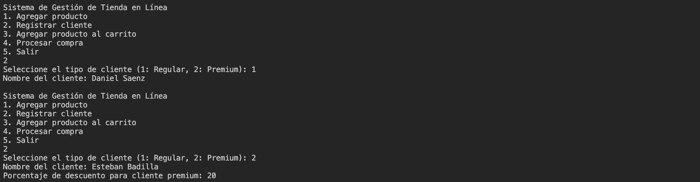
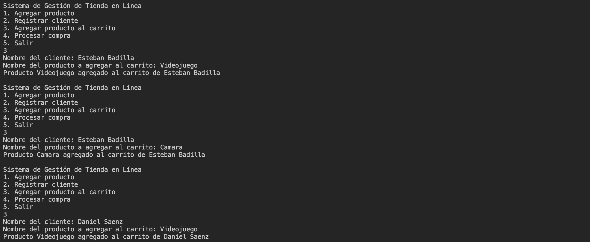

# Tarea 2

Esta corresponde a la _Tarea 1_ del curso IE-0217, en la cual se tratan los principios del lenguaje de programación C++. La asignación está dividida en las siguientes partes:

1) Modo de uso
2) Preguntas teóricas
3) Sistema de Gestión de Tienda en Línea

Además, para acceder a documentación detallada en Doxygen sobre el código implementado, ingrese a este [link]().


## Modo de uso

El proceso de compilación se realiza a partir de la herramienta _Makefile_ y se utiliza el compilador `g++`. Por lo tanto, es importante que se tenga instalado en el dispositivo para la ejecución.

La compilación del programa está dada por el siguiente comando:
```
make
```

Asegúrese de estar en el directorio `./ie0217/Tareas/Tarea2/` para ejecutar el comando. Este se encarga de crear un directorio nuevo (si no existe), denominado `./build/`, en donde se va a encontrar el archivo ejecutable. Por lo tanto, el archivo ejecutable se debe encontrar en el directorio `./ie0217/Tareas/Tarea2/build/tienda.exe`.

Para eliminar el archivo ejecutable, utilice el comando a continuación:
```
make clean
```

Si ya compiló el programa previamente y desea volver a ejecutarlo, sírvase del comando:
```
make run
```

El _Makefile_ fue diseñado de manera que funciona en dispositivos con sistema operativo Windows y Linux. Se agregó dentro del archivo el flag de compilación `-std=c++11` para indicarle a `g++` qué versión utilizar (para el `for` loop en el vector).

## Preguntas teóricas

### 1. ¿Qué es la programación orientada a objetos y cuáles son sus principios fundamentales?

El concepto de la programación orientada a objetos radica en que es un paradigma de programación, enfocado en la creación de __clases__ y __objetos__, los cuales contienen atributos (datos) y métodos (funciones) para operar sobre ellos. Esta organización en objetos facilita la organización y mantenimiento de código, pues su enfoque es hacia el objeto como tal.

La programación orientada a objetos (OOP) posee 4 principios fundamentales:
1) __Encapsulamiento__.
2) __Abstracción__.
3) __Herencia__.
4) __Polimorfismo__.

### 2. Mencione y explique al menos tres problemas clásicos de programación que POO es capaz de resolver.

- __Mantenimiento del código__

Dependiendo del tamaño del programa, se tiene que se vuelve complicado mantener y manejar el código, especialmente si no está organizado y documentado de tal forma que queda claro para qué funciona. Con la programación orientada a objetos, se aplica el principio de _Divide and conquer_ para manejar el problema a través de clases y objetos, donde se presenta un encapsulamiento de los datos de cada objeto y se tienen los métodos de cada objeto relacionados entre sí. De esta forma, se mantiene un código organizado y más sencillo de utilizar. Si se realizan cambios, se pueden modificar secciones que no afecten a todo el programa o sean más fáciles de integrar al programa.

- __Reutilización del código__

La duplicidad del código es un problema común al implementar funciones similares pero distintas en ciertos detalles. Es decir, resulta complicado reutilizar código y de igual forma, dificulta el mantenimiento del código si se desea realizar cambios. La POO entra en juego en esta situación, pues permite la __herencia__. Se pueden heredar métodos y atributos de clases base a clases derivadas, lo cual incrementa las posibilidades de reutilizar código. Además, gracias al __polimorfismo__, se tiene que distintas clases pueden compartir interfaces y esto permite tener un código flexible a cambios.

- __Escalabilidad__

Finalmente, la escabilidad de los programas que no implementan la POO se puede perjudicada conforme crece el proyecto. Al agregar nuevo código, se tiene que realizar muchos cambios dependiendo del caso, lo cual pone en riesgo la seguridad del programa y la aparición de errores. Nuevamente, la programación orientada a objetos brinda el __encapsulamiento__ y __polimorfismo__ que permite exponer únicamente ciertos métodos públicamente y flexibilidad a la hora de cambiar ciertos métodos.

En conclusión, la POO facilita la programación pues implementa la modularidad para resolver problemas de mayor tamaño eficientemente.

### 3. Describa el concepto de polimorfismo y brinde un ejemplo de su implementación en POO.

El __polimorfismo__ en la programación orientada a objetos corresponde a uno de sus pilares fundamentales. Existen dos tipos principales de polimorfismo en C++: en tiempo de compilación y en tiempo de ejecución.

En tiempo de compilación, se puede tener polimorfimo al realizar una sobrecarga de función en métodos de una clase. Asimismo, funciona con sobrecarga de operadores. Se llaman de esta manera, pues durante la compilación, el compilador determina cuál definición de función corresponde a las llamadas de estas, en el caso de sobrecarga de funciones.

En tiempo de ejecución, el polimorfismo se da por medio de sobreescritura de funciones (_overriding_). Consiste en ejecutar métodos de diferentes clases derivadas como objetos de la misma clase base, de esta forma, se tienen diferentes comportamientos según el tipo de objeto. Se suelen utilizar _miembros virtuales_ en este caso, si se desea que al tener un puntero de la clase base que apunte a un objeto derivado, se ejecute el método de la clase derivada.

Un ejemplo para este último caso corresponde al siguiente:

```
#include <iostream>
using namespace std;

// Declaracion de clase base
class Base {

public:
    // funcion miembro virtual
    virtual void display()
    {
        cout << "Funcion virtual base" << endl;
    }

    void print()
    {
        cout << "Funcion base" << endl;
    }
};

// Declaracion de clase derivada
class Derivada : public Base {

public:
    void display()
    {
        cout << "Funcion en clase Derivada" << endl;
    }

    void print()
    {
        cout << "Funcion en clase Derivada" << endl;
    }
};

int main()
{
    // Puntero de clase Base
    Base* base;

    // Instanciar objeto de tipo Derivada
    Derivada derivada;

    // Puntero de clase Base apunta a objeto de Derivada
    base = &derivada;

    // Se ejecuta la funcion de Derivada
    base->display();

    // Se ejecuta la funcion de Base
    base->print();
}
```

Note que al utilizar el puntero a la clase Base que apunta a un objeto de la clase Derivada, se tiene que se ejecutan los métodos sobreescritos en Derivada para las funciones del tipo virtual. Esto es fundamental para aplicar el principio de polimorfismo, pues se pueden tener varias clases derivadas de una misma clase base y al ejecutar los métodos virtuales, se ejecutan sus propias modificaciones. 

### 4. Describa el concepto de abstracción y brinde un ejemplo de su implementación en POO.

La abstracción corresponde a otro de los pilares fundamentales de la programación orientada a objetos. Consiste en que se proporciona una interfaz para interactuar con los objetos de las clases, donde se ocultan los detalles de la implementación. De ahí es que viene su nombre, pues el usuario que utiliza el código desconoce cómo funciona por debajo el objeto, pero conoce a un nivel más alto cómo se utiliza.

```
#include <iostream>
using namespace std;

// Clase abstracta (interfaz proporcionada)
class Figura {
    public:
        // Metodo virtual puro -> Determina que una clase es abstracta
        virtual void dibujar() const = 0; // Las clases derivadas deben implementarlo

        virtual ~Figura() {};
};

// Clase derivada: Hereda la clase abstracta
class Circulo : public Figura {
    public:
        // Implementacion de dibujar() para Circulo
        void dibujar() const override {
            cout << "Dibujar circulo" << endl;
        }
};

class Cuadrado : public Figura {
    public:
        // Implementacion de dibujar() para Cuadrado
        void dibujar() const override {
            cout << "Dibujar cuadrado" << endl;
        }
};

int main() {
    // Puntero del tipo de la clase abstracta
    Figura* circulo = new Circulo();
    Figura* cuadrado = new Cuadrado();

    // Se llama al metodo que contiene la implementacion de cada tipo
    circulo->dibujar();
    cuadrado->dibujar();

    // Liberar la memoria reservada
    delete circulo;
    delete cuadrado;

    return 0;
}
```

Note que en el ejemplo anterior, se proporciona una interfaz que consiste en la clase abstracta `Figura`. Para convertir en una clase virtual pura, se crea un método virtual puro que termina con `= 0` en su declaración (como se muestra en el ejemplo anterior). En principio, esa es la porción de código con la que interactúa el usuario que utilice las clases. Luego, se encuentran las subclases que heredan a la clase `Figura`. En estas, se escribe la implementación específica (oculta para el usuario) de la función miembro `dibujar()`.

Su uso facilita la interacción con las diferentes subclases pues en la función `main()`, se utilizan punteros del tipo `Figura` con el constructor de las clases derivadas `Circulo` y `Cuadrado`. El usuario no se preocupa por cómo fue implementado la función `dibujar()` en esos objetos, lo cual facilita el uso de la clase. 

### 5. Describa el concepto de encapsulamiento y brinde un ejemplo de su implementación en POO.

El principio de __encapsulamiento__ en la programación orientada a objetos en C++, como su nombre lo indica, corresponde a exponer una interfaz pública (especificador de acceso `public`), mientras que se restringe (encapsula) el acceso directo a ciertos componentes que compone la clase. Su importancia radica en que se protege la información interna y se permite el acceso exclusivamente por los métodos que se programen para ello. Por lo que, no se puede modificar el valor de un atributo privado, por ejemplo, si no existe un método definido para ello.

```
#include <iostream>
using namespace std;

class Bank {
    private:
        // No se puede modificar directamente
        int balance; 

    // Metodos publicos
    public:
        // Constructor
        Bank(int initialBalance) {
            if (initialBalance >= 0) {
                balance = initialBalance;
            }
            else {
                balance = 0;
            }
        }

        // Depositar dinero a la cuenta
        void depositar(int cantidad) {
            if (cantidad > 0) {
                balance += cantidad;
            } else {
                cout << "Cantidad invalida." << endl;
            }
        }

        // Retiro de dinero
        void retirar(int cantidad) {
            if (cantidad > 0 && cantidad <= ) {
                balance -= cantidad;
            } else {
                cout << "Cantidad invalida." << endl;
            }
        }

        // Consultar el balance
        int obtenerBalance() const {
            return balance;
        }
};
```

El ejemplo anterior consiste en una clase `Bank`, que contiene una implementación sencilla para una cuenta bancaria, con las operaciones iniciales para ello: `depositar()`, `retirar()` y `obtenerBalance()`. Note que se define un atributo privado `balance`, el cual no es accesible desde afuera de la definición de la clase. Entonces, ahí está la importancia de la implementación de las funciones miembro anteriores, pues permiten modificar y acceder al valor de la variable de forma controlada.

### 6. Defina los conceptos de clase, objeto, método y atributo de la programación orientada a objetos y brinde un ejemplo de la vida real (No de programación) que los describa intuitivamente.

- __Clase__: Corresponde a la plantilla o prototipo a partir del cual, se definen atributos (datos) y métodos (acciones), que se agrupan para conformar objetos de la clase. Un ejemplo de la vida real consiste en los planos de una casa, pues contiene las dimensiones preestablecidas para esta y los componentes que tiene, las funcionalidades que presenta, entre otras características.

- __Objeto__: Consiste en un elemento creado a partir de la clase, el cual posee características propias (atributos) y realiza los métodos establecidos en la clase. Un ejemplo en la vida real consiste en la casa construida a partir de los planos previos, se pueden realizar muchas casas a partir de esos planos con funcionalidades iguales o similares. Pero la casa es única en ubicación, quién habita en ella, entre otros.

- __Atributo__: Variable dentro de la clase que almacena propiedades del objeto, por lo que, pueden ser únicos para cada objeto de la clase. Entre los atributos para el ejemplo de la casa, se encuentra el color, el material con el que fue construido, la ubicación, el número de habitaciones, el área total que abarca la casa, por mencionar algunos.

- __Método__: Se refiere a las funciones definidas dentro de la clase, que indican las acciones específicas que puede realizar el objeto. Permiten cambiar el valor de los atributos. El ejemplo en la vida real para la casa consiste en las funcionalidades que provee la casa, como encender las luces, abrir puertas y ventanas, abrir el tubo del agua.


### 7. Mencione qué elementos tiene el “boilerplate” de una clase y explique cada uno.

El _boilerplate_ de una clase consiste en los elementos esenciales que conforman su estructura.

- __Declaración de la clase:__ Utiliza la palabra clave `class` junto al nombre para declarar la clase y su contenido va dentro de llaves. La estructura es la siguiente:

```
class NombreClase {
    // Contenido
};
```

- __Especificadores de acceso:__ Se utilizan para controlar el acceso a los métodos y atributos de la clase. Corresponden a: `public`, `private` y `protected`.

- __Atributos:__ Representan propiedades de los objetos. Dependiendo del encapsulamiento que se desee, se coloca dentro del especificador de acceso de interés.

- __Métodos:__ Funciones miembro que definen acciones para los objetos. 

- __Constructor:__ Método que se llama al crear un objeto de la clase, se utiliza para inicializar los atributos; es decir, crea el objeto. 

- __Destructor:__ Método que se ejecuta cuando termina el tiempo de vida de un objeto. Se utiliza para liberar los recursos de este.

A continuación, se muestra un ejemplo completo del _boilerplate_ de una clase.

```
// Declaracion de la clase NombreClase
class NombreClase {
    // Especificador de acceso privado
    private:
        int var1; // Variable privada
    
    // Especificador de acceso publico
    public:
        // Constructor
        NombreClase();

        // Destructor
        ~NombreClase();

        // Metodo
        int obtenerVar1() const {
            return var1;
        }
};

// Metodo fuera de la clase
int NombreClase::obtenerVar1() const {
    return var1;
}
```

### 8. ¿Qué es el constructor de una clase? ¿Para qué sirve?

El __constructor__ de una clase consiste en un método que se ejecuta al instanciar un objeto de la clase. Al declarar una clase, usualmente se coloca dentro del especificador de acceso `public` y tiene el mismo nombre que la clase. Puede tomar parámetros, de tal forma que, inicializa atributos con valores específicos dependiendo del objeto.

Su funcionalidad radica en inicializar los atributos del objeto, así como controlar el flujo de creación de objetos de una clase y garantizar que al instanciar un objeto, este va a ser válido para su uso.

### 9. ¿Qué es instanciar un objeto en el contexto de POO? ¿Para qué sirve?

En programación orientada a objetos, instanciar un objeto se refiere a crear un objeto de esa clase en la memoria con su propio conjunto de atributos y que permite ejecutar los métodos para él definidos dentro de la clase. Como se mencionó anteriormente, la clase es como un plantilla, pero para crear objetos a partir de esa plantilla, se debe instanciar. 

Su funcionalidad radica en que al crear o instanciar objetos, se inicializan sus variables correspondientes y pueden utilizar (incluyendo los métodos) dentro del programa, a partir del constructor.

### 10. ¿Cuáles son las diferencias entre los especificadores de acceso públicos, privados y protegidos?

Los especificadores de acceso o _access specifiers_ son utilizados dentro de las clases para determinar la visibilidad y accesibilidad de los miembros. Como su nombre lo indica, son utilizados para especificar en dónde se pueden utilizar los miembros.

Primero, el __acceso público__ permite que los miembros sean utilizados desde cualquier parte del programa, no necesariamente dentro de la clase.

Luego, el __acceso privado__ proporciona una accesibilidad limitada al ámbito de la clase. No pueden ser utilizados fuera de esta.

Finalmente, el __acceso protegido__ permite que sean accedidos desde dentro de la clase y desde clases derivadas, pero no fuera de la clase.

La excepción a los casos de miembros con acceso privado y protegido son las clases y funciones amigas que se describen en una pregunta posterior.

### 11. ¿Qué es el destructor de una clase y para qué aplicaciones es conveniente usarlo?

El destructor de una clase consiste en un método o función miembro que se ejecuta de forma automática cuando el tiempo de vida de un objeto de la clase acaba; es decir, cuando se elimina con `delete` o finaliza el programa, por mencionar algunos casos.

Se utiliza principalmente cuando un objeto adquirió memoria dinámica y se debe liberar al eliminarse el objeto. Además, si se abren archivos, en el destructor se ejecuta el comando de cerrado.

El destructor se declara de la siguiente forma:
```
class Clase {
    public:
        // Constructor
        Clase();

        // Destructor
        ~Archivo();
};
```

### 12. Explique qué es la sobrecarga de operadores y proporcione un ejemplo de cómo se implementa en C++.

La sobrecarga de operadores permite especificar comportamientos de los operadores en C++ para que se puedan utilizar con objetos de clases. Facilita la manipulación de los objetos al implementar comportamientos con operadores nativos. Además, ayuda a reducir la complejidad del código.

El ejemplo a continuación corresponde a la implementación de la clase `Fraccion`:

```
#include <iostream>
using namespace std;

// Declaracion de clase Fraccion
class Fraccion {
    private:
        // Partes de independientes de la fraccion
        int numerador;
        int denominador;

    public:
        // Constructor para inicializar la fraccion
        Fraccion(int n, int d) : numerador(n), denominador(d) {
            if (d == 0) {
                cout << "Error: el denominador no puede ser cero." << endl;
                denominador = 1; // Evitar division por cero
            }
        }

        // Sobrecarga del operador +
        Fraccion operator+(const Fraccion& otra) const {
            int nuevoNumerador = (numerador * otra.denominador) + (otra.numerador * denominador);

            int nuevoDenominador = denominador * otra.denominador;

            Fraccion resultado(nuevoNumerador, nuevoDenominador);

            return resultado;
        }

        // Sobrecarga del operador <<
        friend std::ostream& operator<<(std::ostream& os, const Fraccion& f) {
            os << f.numerador << "/" << f.denominador;
            return os;
        }
};

int main() {
    // Crear dos fracciones
    Fraccion f1(3, 4);  // 3/4
    Fraccion f2(2, 5);  // 2/5

    // Sumar las fracciones usando el operador +
    Fraccion suma = f1 + f2;

    // Imprimir el resultado de la suma
    std::cout << "Suma: " << suma << endl;

    return 0;
}
```

En el ejemplo anterior, se aplica sobrecarga de operadores al operador `+` y `<<`, para sumar e imprimir fracciones, respectivamente. Se observa la facilidad con la que se puede operar sobre objetos que poseen este comportamiento definido.

### 13. ¿Qué es la herencia en POO?

La __herencia__ en la programación orientada a objetos corresponde a una propiedad que permite crear una clase (derivada) basándose en una clase existente (base). Se heredan los atributos y métodos de la clase base. Este principio es fundamental para la reutilización de código.

Las clases derivadas tienen la posibilidad de sobrescribir miembros para implementar comportamientos específicos en la subclase si se desea. Además, facilita el mantemiento del sistema, pues si se cambia un detalle en la clase base, se ve reflejado en las clases derivadas.

### 14. Mencione las diferencias entre la herencia pública, privada o protegida de una clase, qué sucede al heredar cada tipo.

Como se menciona en el enunciado, existen 3 tipos principales de herencia: pública (_public_), privada (_private_) y protegida (_protected_). Al declarar una clase, se indica herencia de la siguiente forma:
```
class Derived : <tipoHerencia> Base;
```

Entonces, la __herencia pública__ implica los miembros públicos permanecen públicos, los miembros protegidos permanecen protegidos y los miembros privados no se heredan.

La __herencia protegida__ consiste en que los miembros públicos y protegidos pasan a ser protegidos en la clase derivada. Los miembros privados mantienen su comportamiento de no herencia.

Finalmente, en la __herencia privada__ se heredan los miembros públicos y privados de la clase base, pero pasan a ser miembros privados dentro de esta. De igual manera, los miembros privados de la clase base no se heredan.


### 15. Observe el siguiente fragmento de código:

```
#include <iostream>

class Base {
    private:
        int primera;
    protected:
        int segunda;
    public:
        int tercera;
        Base() : primera(1), segunda(2), tercera(3) {}
};

class Derived : public Base {
    private:
        int cuarta;
    protected:
        int quinta;
    public:
        int sexta;
        Derived() : cuarta(4), quinta(5), sexta(6) {}
};
```

Considerando que existen seis variables en el código (`primera`, `segunda`, `tercera`, `cuarta`, `quinta` y `sexta`), desde el main del programa:
- A cuáles de estas variables puede acceder un objeto instanciado de la clase `Base`, a cuales no puede acceder y por qué.
- A cuáles de estas variables puede acceder un objeto instanciado de la clase `Derived`, a cuales no puede acceder y por qué.

---

Para responder ambas preguntas, es necesario considerar la respuesta de la pregunta 14 sobre los especificadores de acceso en herencia.

Respecto a la primera pregunta, se tiene que para un objeto de la clase `Base`, este no puede acceder a las variables `cuarta`, `quinta`, `sexta`, pues estas fueron declaradas en la clase `Derived`. Como no se produce herencia en sentido contrario (derivada a base), entonces no se tiene acceso a ninguna.

Ahora bien, para las variables miembro dentro de la clase `Base`, se tiene que `primera` está dentro del especificador de acceso privado, mientras que, `segunda` se encuentra dentro de los protegidos. Por lo tanto, no se pueden acceder afuera de la clase. Entonces un objeto de `Base` no puede acceder a estas dos variables. Sólo se puede acceder a `tercera` pues tiene el especificador de acceso público.

En cuanto a la segunda pregunta, para un objeto instanciado de la clase `Derived`, se tiene que al realizar la herencia de `Base` a `Derived`, se emplea un acceso público. Por lo que, las variables públicas se mantienen públicas, las protegidas se quedan protegidas y no se puede acceder a las privadas en la clase hija.

Entonces, un objeto de `Derived` no puede acceder a `primera`, pues ni siquiera la clase `Derived` tiene acceso a ella. Para `segunda` y `quinta`, se tiene que estas son protegidas dentro de la presente clase, mientras que, `cuarta` es privada. Estas tres variables no son accesibles desde afuera de la clase, por lo que, un objeto de la clase no puede acceder a ellas. Únicamente las variables `tercera` y `sexta` tienen la condición de ser públicas y pueden ser accedidas por un objeto instanciado de la clase `Derived`.


### 16. ¿Qué es una clase amiga y para qué se usa? ¿Cúal es la manera de definirla?

Las clases amigas corresponden a clases que pueden acceder a los miembros _protected_ y _private_ de la clase en cuestión; es decir, tienen acceso a los miembros que sólo se pueden acceder dentro de la clase.

Su principal uso consiste en la colaboración entre clases, cuando se requiere que una clase acceda a atributos o métodos privados o protegidos.

La manera de definir una clase amiga se muestra a continuación:

```
// Se coloca la declaracion de la clase amiga antes para que el compilador sepa que existe y se va a definir despues
class ClaseA;

class ClaseB {
    public:
        void mostrarDatosA(ClaseA &a) {
            cout << "Privado de A: " << a.datoPrivado << endl;
        }
};

class ClaseA {
    private:
        // Miembro privado que tiene acceso ClaseB
        int privado;
    
    public:
        // Constructor
        ClaseA(int valor) : privado(valor) {}

        // Declaracion de ClaseB como amiga de ClaseA
        friend class ClaseB;
};
```

Entonces, en el ejemplo anterior, se muestra que la `ClaseA` coloca a `ClaseB` como clase amiga. Por lo tanto, en la `ClaseB` se pueden acceder los miembros privados de la `ClaseA`.

### 17. ¿Qué es una función amiga y para qué se usa? ¿Cúal es la manera de definirla?

Las funciones amigas son funciones que no pertenecen a ninguna clase, pero están colocadas dentro de la clase de interés con el keyword `friend`, de tal forma que tienen acceso a los atributos privados y protegidos de la clase. Su importancia radica en que, así, no se exponen los datos públicamente, únicamente la función amiga tiene acceso.

La forma de definir una función amiga se muestra a continuación:
```
// Declaracion de ClaseA
class ClaseA {
    private:
        int privado;
    
    public:
        // Constructor
        ClaseA(int valor) : privado(valor) {}

        // Declaracion de funcion amiga
        friend void imprimir(const ClaseA &a);
};

void imprimir(const ClaseA &a) {
    cout << "Privado: " << a.privado << endl;
}
```

La función `imprimir()` puede acceder a los miembros privados de `ClaseA`.

### 18. Explique la importancia de los métodos virtuales en C++ y cómo se utilizan en la implementación de polimorfismo.

La importancia de los métodos virtuales radica en que permiten que se pueda sobreescribir un miembro de la clase base en la derivada, de tal forma que, incluso si el objeto es tratado como un objeto del tipo base, se ejecute el método modificado. Esto introduce la posibilidad de tener polimorfismo dinámico.

Los métodos virtuales definidos en la clase base sirven para indicar al compilador que este puede ser sobrescrito en una clase derivada. El método real que se ejecute depende del tipo del objeto, el cual es el principio sobre el cual se implementa el polimorfismo. 

```
#include <iostream>
using namespace std;

// Declaracion de clase base
class Animal {
public:
    // Metodo virtual
    virtual void hacerSonido() const {
        cout << "El animal hace un sonido genérico." << endl;
    }
};

// Clase Perro hereda Animal
class Perro : public Animal {
public:
    // Sobrescribir el metodo hacerSonido()
    void hacerSonido() const override {
        cout << "El perro ladra: ¡Guau guau!" << endl;
    }
};

int main() {
    Animal* animal; // Puntero a clase Base

    Perro miPerro;

    // El puntero animal apunta a objeto de clase Perro
    animal = &miPerro;
    animal->hacerSonido(); // Llama al metodo hacerSonido() de Perro

    return 0;
}
```

En el ejemplo anterior, se implementa el polimorfismo con la clase derivada `Perro`, pues se tiene un puntero del tipo `Animal`, que apunta a un objeto `Perro`. Gracias a los métodos virtuales, al ejecutar el método `animal->hacerSonido()` se ejecuta el perteneciente a la clase derivada. 

Si no se colocara el _keyword_ `virtual` en la declaración de la función miembro en la clase base, se mostraría la implementación de la clase base, en vez de la derivada. 

## Explicación Formato Markdown utilizado

En el enunciado, se menciona que hay que investigar y agregar explicaciones para el formato Markdown. Por lo tanto, en esta sección se va a agregar una guía general para la elaboración de archivos con extensión `.md`.

- __Headers (#)__:
Para colocar títulos en Markdown se utiliza `#`, dependiendo de cuantos caracteres de este tipo se coloquen, indica el nivel del título. Note que `#` indica el encabezado de mayor tamaño (nivel 1), mientras que `######` indica el encabezado de menor tamaño (nivel 6).

- __Listas sin orden__:
Para colocar listas sin un orden, se utilizó el caracter `-`. Cada ítem de la lista, se encuentra indicado por este. Se pueden usar también otros caracteres como `*` y `+`, los cuales funcionan de la misma forma.

- __Listas ordenadas__:
El formato para colocar listas ordenadas corresponde a colocar los números del ítem para el cual se está poniendo. Por ejemplo: `1.`, `2.` y así sucesivamente.

- __Itálica__:
Para colocar palabras en itálica, se rodea la palabra con `_` o `*` en ambos lados. Por ejemplo: `_italica_` o `*italica*`.

- __Negrita__:
En cuanto a las negritas, funciona de forma similar que itálica, se colocan `_` o `*` dobles alrededor de la palabra. Por ejemplo: `**negrita**` o `__negrita__`.

- __Código__:
El código multilínea se escribe al rodear el bloque de código con tres caracteres de \`. Mientras que, el código en una línea simple, se escribe al rodearlo con \` una única vez.

- __Hipervínculos__:
Para agregar enlaces en Markdown, se utiliza el siguiente formato:

```
[Palabras con hipervinculo](enlace)
```

## Sistema de Gestión de Tienda en Línea

La solución programada consiste en la __aplicación de la programación orientada a objetos__ para la implementación del sistema de gestión de tienda en línea. Se realizaron un total de 7 clases, las cuales fueron distribuidas archivos de cabecera (`.hpp`) y archivos de código fuente (`.cpp`), de tal forma que, la declaración de la clase se encuentra en el _header file_ y la definición de los métodos en el _source file_.

Entonces, el contenido de los archivos de código realizado, presenta la siguiente estructura:

1) `Producto.hpp` y `Producto.cpp`: 

Contiene la declaración e implementación de la clase `Producto`. Esta clase corresponde a una clase abstracta que posee los atributos privados de `nombre` y `precio`. Además, incluye el método del constructor, destructor, y funciones miembro para obtener el nombre y el precio, así como, mostrar la información del producto. Este último método de `mostrarInformación()` fue implementado de tal forma, que corresponde a un método virtual puro y convierte a la clase en una clase abstracta (no se pueden instanciar objetos), lo cual obliga a que en las clases derivadas de esta: `ProductoDigital` y `ProductoFisico` se implemente este método.

2) `ProductoDigital.hpp` y `ProductoDigital.cpp`: 

Corresponde a la declaración y definición de la clase `ProductoDigital`. Esta hereda los miembros de la clase abstracta `Producto`. Se implementa también un atributo privado de ID como identificador en línea. Este atributo viene acompañado con una función miembro que retorna su valor. De igual manera, se sobrescribe el método virtual `mostrarInformacion()` para el caso del `ProductoDigital`.

3) `ProductoFisico.hpp` y `ProductoFisico.cpp`: 

Corresponde a la declaración y definición de la clase `ProductoFisico`. Esta hereda los miembros de la clase abstracta `Producto`. Se implementa también un atributo privado de `peso` como característica de los productos físicos. Este atributo viene acompañado con una función miembro que retorna su valor. Además, se sobrescribe el método virtual `mostrarInformacion()` para el caso del `ProductoFisico`.

4) `Cliente.hpp` y `Cliente.cpp`:

Consiste en la implementación de la clase abstracta `Cliente`. Esta representa a los clientes de la tienda. Cada cliente se reconoce por su atributo de `nombre` y su `carrito` de compras. Además, se crearon funciones _getters_ de sus atributos y métodos para calcular el total de la compra, agregar un producto al carrito y un método virtual puro para calcular el descuento en el precio final, el cual se implementa en las clases derivadas.

5) `ClienteRegular.hpp` y `ClienteRegular.cpp`: 

En estos archivos se desarrolló el código para la clase `ClienteRegular`, la cual corresponde a una clase derivada de `Cliente`. Se programó el constructor y la función miembro requerida de la clase base `aplicarDescuento()`.

6) `ClientePremium.hpp` y `ClientePremium.cpp`: 

Corresponde a la declaración y la definición de la clase `ClientePremium`. Al igual que la clase anterior, esta hereda los miembros de la clase `Cliente` e implementa un constructor para inicializar los objetos y la definición del método `aplicarDescuento()` específico para objetos de la clase `ClientePremium`.

7) `Tienda.hpp` y `Tienda.cpp`: 

La clase `Tienda` se define en estos archivos y representa la tienda en línea del ejercicio. Contiene los atributos privados de `productosDisponibles` y `clientes` en la tienda. Aparte de eso, implementa un destructor, métodos para agregar productos y clientes, procesar la compra de un cliente a partir de su nombre, y buscar productos y clientes en el vector donde son almacenados.

8) `main.cpp`:

Finalmente, el archivo `main.cpp` consiste en el punto de entrada del programa. En este se implementa el menú recurrente, la validación de las entradas del programa y el llamado de los métodos de las clases en las situaciones donde es necesario.

## Convención de nombre de variables utilizada

A partir de la investigación de una convención de nombramiento de variables, funciones y clases general, se llegó a la conclusión que no existe una respuesta clara, pues dependiendo del proyecto y gustos personales, los desarrolladores se adaptan a la convención preferida. Sin embargo, se determinó que existen tendencias en el nombramiento de las variables, las cuales fueron implementadas en el código.

* __Nombres de clases__: Se utilizó la convención _PascalCase_ para nombrar las clases. Los nombres de las clases corresponden a sustantivos e inician en mayúscula, cada palabra siguiente también se coloca en mayúscula.

* __Nombres de atributos y métodos__: Los atributos y métodos siguen la convención _camelCase_. Se determinó que los métodos se le debe colocar un nombre de forma que, inicie con un verbo para describir la acción que realiza.

* __Nombres de enum__: Los enum fueron nombrados, de manera que, su nombre sigue la convención _PascalCase_. Además, los elementos dentro del enum son nombrados en mayúscula y cada palabra separada por un guion bajo (`_`).

* __Nombres de archivos__: Los archivos son nombrados con la convención _PascalCase_; es decir, comienzan en mayúscula y para distinguir entre palabras también se coloca la letra en mayúscula.

* __Variables locales__: Las variables locales siguen la convención _camelCase_.

* __Punteros__: Los punteros son declarados de manera que, el `*` está contiguo al nombre de la variable, no al tipo de dato.

## Ejemplo de una ejecución del programa

En esta sección, se muestra un ejemplo de ejecución del programa para dos clientes. Así se verifica el flujo del programa.

### Compilación con comando `make`

Se compila el programa únicamente con el comando `make` como se solicita en las indicaciones de la asignación.


### Agregar productos a la tienda

Se agregan dos productos al vector de `productosDisponibles`: _Videojuego_ (producto digital) y _Camara_ (producto físico). Note que se solicitan los atributos requeridos para cada tipo de producto.


### Registrar clientes a la tienda

Se registran dos clientes, uno del tipo regular y otro del tipo premium. De esta forma, se observa que para agregar al cliente premium al registro, se agrega el porcentaje de descuento.



### Agregar productos al carrito de clientes

Para agregar productos al carrito, se ingresa el nombre del cliente, seguido del nombre del producto que desea agregar. Si ambos existen, se imprime un mensaje de confirmación.



### Procesar compra

Al procesar la compra con los productos agregados al carrito para los clientes. Inicialmente, se solicita que se ingrese el nombre del cliente. Luego, se muestra el total a pagar, el total con el descuento aplicado y finalmente, la lista de los productos en el carrito con la información de cada uno.


### Salir

Al ingresar la opción de salir del programa, se libera la memoria reservada y se imprime un mensaje que indica que se salió.

