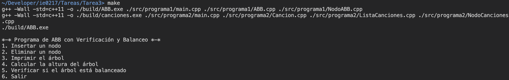

# Tarea 3

Esta corresponde a la _Tarea 3_ del curso IE-0217, en la cual se trata la implementación de un programa sobre árboles binarios de búsqueda y listas enlazadas. La asignación está dividida en cuatro partes principales:

1) Modo de uso
2) Parte teórica
3) Árbol Binario de Búsqueda con Verificación y Balance
4) Gestión de una Lista Enlazada Dinámica de Canciones

<ins>__Documentación del código__</ins>: Para acceder a documentación detallada en Doxygen sobre el código implementado, ingrese a este [link](https://tarea3-ie0217.netlify.app). Acá se encuentra documentado cada archivo, clase y función de ambos programas realizados.

## Modo de uso

El proceso de compilación se realiza a partir de la herramienta _Makefile_ y se utiliza el compilador `g++`. Por lo tanto, es importante que se tenga instalado en el dispositivo para la ejecución.

La compilación del programa está dada por el siguiente comando:
```
make
```

Asegúrese de estar en el directorio `./ie0217/Tareas/Tarea3/` para ejecutar el comando. Este se encarga de crear un directorio nuevo (si no existe), denominado `./build/`, en donde se va a encontrar el archivo ejecutable. Por lo tanto, los archivo ejecutables se deben encontrar en la dirección `./ie0217/Tareas/Tarea2/build/canciones.exe` y `./ie0217/Tareas/Tarea2/build/ABB.exe`.

Para eliminar el archivo ejecutable, utilice el comando a continuación:
```
make clean
```

Si ya compiló el programa previamente y desea volver a ejecutarlo, sírvase del comando:
```
make run
```

El _Makefile_ fue diseñado de manera que funciona en dispositivos con sistema operativo Windows y Linux. Se agregó dentro del archivo el flag de compilación `-std=c++11` para indicarle a `g++` qué versión utilizar.

## Parte teórica

En esta sección, se van a resolver las preguntas teóricas de la parte inicial de la tarea 3.

### 1. Explique cada sección del nivel de usuario de la memoria (Text, Heap, Stack, etc..) ¿Cuáles de estas secciones son de memoria dinámica?

El nivel de usuario de la memoria se divide en las siguientes secciones:

- __Text segment__: Esta contiene el código ejecutable del programa, por lo que, abarca las instrucciones compiladas y código de bibliotecas que se enlazan al programa. Además, no corresponde a una parte de memoria dinámica, pues es memoria estática que no cambia en el tiempo de ejecución.

- __Initialized Data segment__: Contiene las variables globales y estáticas __inicializadas__, las cuales permanecen en memoria durante el tiempo de ejecución. Corresponde a una sección estática, definida en la compilación.

- __BSS (Block Started by Symbol)__: Abarca las variables globales y estáticas que no han sido inicializadas por el programador. Estas permanecen en memoria durante toda la ejecución del programa.  

- __Heap__: Es la región de la memoria del programa utilizada para la memoria dinámica durante la ejecución. El tamaño de este varía durante la ejecución del programa, pues el programador puede solicitar o liberar memoria del heap. Por lo descrito anteriormente, sí es de memoria dinámica. Permite que implementar soluciones tales que, su tamaño no se conoce antes de ejecutar el código.

- __Stack__: En esta sección, se almacena las variables locales y se siguen las llamadas de las funciones durante la ejecución del programa. Al crear una función, se crea un _stack frame_ con las variables locales de la función y cuando se termina la ejecución se libera, por ejemplo. A pesar de que cambie su tamaño durante la ejecución, no es memoria dinámica, pues la administración de memoria es automáticamente manejada.

Tomado de [Memory Layout of C++ Programs - GeeksForGeeks](https://www.geeksforgeeks.org/memory-layout-of-c-program/)

### 2. Observe el siguiente fragmento de código:

```
#include <iostream>

int globalVar = 42;

int main() {
    static int staticVar = 100;
    int localVar = 10;
    int* dynamicVar = new int(5);
    
    delete dynamicVar;
    
    return 0;
}
```

### Considerando que existen cuatro variables en el código (`globalVar`, `staticVar`, `localVar` y `dynamicVar`), mencione en qué sección de la memoria se almacena cada variable y explique el porqué.


En primer lugar, se tiene la variable en el código `globalVar`, como se observa esta corresponde a una variable global inicializada con el valor de 42. Por lo tanto, pertenece a la sección de memoria __Initialized Data Segment__, pues como se describió en la pregunta anterior, acá se almacenan variables globales y estáticas inicializadas.

En segundo lugar, `staticVar` consiste en una variable de tipo estática definida dentro de _main()_. Las variables estáticas poseen su valor durante toda la ejecución del programa, por lo tanto, se almacenan en el __Initialized Data Segment__.

En tercer lugar, `localVar`, la cual como su nombre lo indica corresponde a una variable local dentro de _main()_. Entonces, las variables locales se almacenan en el __stack__ en un _stack frame_, que se destruye al terminar la ejecución de la función.

En cuarto lugar, `dynamicVar`, consiste en una variable puntero reservada a partir de memoria dinámica del __heap__. La memoria a la que apunta el puntero proviene del heap, pues se utilizó el keyword `new` para reservar memoria de allí y se tiene que liberar por medio de `delete`. Sin embargo, el puntero como tal se almacena en el stack.


### 3. ¿Cuál es la diferencia entre memoria dinámica y memoria estática? Brinde un ejemplo de qué tipos de variables se almacenan en cada tipo.

Primero, se va a describir la __memoria estática__. Esta es asignada durante el tiempo de compilación. Además, las variables de este tipo viven durante todo el tiempo de ejecución del programa y su administración es realizada de forma automática por el sistema operativo. La memoria estática (almacenada en _data segment_) corresponde a las variables globales (fuera de _main()_) y estáticas (keyword `static`), tanto inicializadas como no inicializadas.

Ahora, en cuanto a la __memoria dinámica__, se tiene que esta se asigna durante el tiempo de ejecución del programa. El ciclo de vida de las variables dinámicas consiste desde que fueron reservadas hasta que se libera la memoria (importante resaltar la liberación manual de memoria para evitar _memory leaks_). La memoria dinámica se almacena en el _heap_. En cuanto a los ejemplos de variables que almacena, se tienen arreglos de datos dinámicos que se puede requerir cambiar su tamaño durante la ejecución y objetos dinámicos de una clase.


### 4. ¿Cómo se accede a la memoria dinámica del heap? Brinde un ejemplo programado de cómo guardar un valor en una posición de memoria ubicada ahí.

El proceso de acceder a memoria del __heap__ se realiza por medio de punteros. En el ejemplo programado a continuación se muestra la reservación dinámica de un entero en el _heap_ con el keyword `new`, en el cual la dirección de esa memoria se almacena en el puntero entero `dynamicVar`. Luego, se le asigna un valor por medio del operador de desreferencia `*` al puntero. Finalmente, se debe liberar la memoria reservada por medio del keyword `delete`.

```
#include <iostream>
using namespace std;

int main() {
    // Asignación dinámica de un entero en el heap
    int dynamicVar = new int;

    // Guardar un valor en la posición reservada
    *dynamicVar = 1; // Uso de * para desreferenciar el valor

    delete dynamicVar;

    return 0;
}
```


### 5. ¿Por qué es importante liberar la memoria asignada dinámicamente cuando ya no se esté utilizando?

La memoria asignada dinámicamente del __heap__ debe ser liberada cuando ya no se esté utilizando, o al menos al terminar la ejecución del programa. Se describen algunas de las razones que determinan la importancia de la liberación de memoria en programas que utilizan memoria dinámica:

- __Memory leaks__: Al reservar memoria dinámica, esta no se libera automáticamente, como en el caso de los demás tipos de memoria. Por lo tanto, es necesario utilizar el keyword `delete` o `free()` para liberar la memoria dinámica asignada previamente. De esta forma, se evitan las fugas de memoria que provoca que el programa consuma más memoria de la que debería y puede agotar la memoria eventualmente, lo cual afecta el rendimiento del sistema, en general.

- __Sobrecarga del heap__: Si se satura la memoria que ocupa el programa, se puede afectar el funcionamiento de otros procesos en el sistema, pues se reduce la cantidad de memoria disponible para ellos también (especialmente en sistemas con recursos limitados como sistemas embebidos). Además, el _heap_ posee una fragmentación (por ende es más lento comparado con otros tipos de memoria), por lo que, si la memoria no se libera, aunque haya memoria total disponible, puede no haber un bloque continuo del tamaño requerido, lo cual dificulta la reservación de memoria posterior.


### 6. ¿Para que se utilizan las funciones `malloc`, `calloc` y `realloc`? ¿Qué parámetros recibe cada una?

Las 3 funciones mencionadas son utilizadas en el manejo de memoria dinámica del __heap__ pertenecientes a la biblioteca estándar de C. A continuación, se describen las características de cada una:

- `malloc()`: Se utiliza para asignar un bloque de código de un tamaño específico. Resulta importante mencionar que no inicializa la memoria con un valor, entonces puede contener información basura. Observe en el ejemplo debajo, que `malloc()` recibe el tamaño de memoria a asignar en bytes. Usualmente, se utiliza la función integrada `sizeof()` para determinar el tamaño del tipo de dato que se desea reservar memoria. Además, la función retorna un puntero de tipo `void` a la memoria recién asignada, por lo que, se utiliza _casting_ para pasar el puntero al tipo de dato requerido. En caso de no haber memoria suficiente, se retorna `NULL`.

```
// Sintaxis: void* malloc(size)
int *ptr = (int*)malloc(sizeof(int));
```

- `calloc()`: Es utilizado para asignar memoria para un _array_ de elementos, de tal forma que, todos ellos se inicializan con un valor de 0. Al igual que `malloc()`, la función también retorna un puntero de tipo `void` a la memoria recién reservada y retorna `NULL` en caso de error. Además, recibe la cantidad de elementos que va a contener el arreglo y el tamaño de un elemento del arreglo en bytes.

```
// Sintaxis: void* calloc(num_elementos, size_elemento);
int *array = (int*)calloc(5, sizeof(int));
```

- `realloc()`: Esta función es utilizada para redimensionar un bloque de memoria reservado previamente. Si el nuevo tamaño es mayor, se mantiene el contenido y se agrega nuevo espacio para memoria. En caso de que sea menor, se descarta el contenido excedente. La función recibe el puntero al bloque de memoria antiguo y el nuevo tamaño requerido en bytes. Además, retorna un puntero de tipo `void`, que apunta a la dirección de memoria resultante. Si no se pudo redimensionar, devuelve `NULL` y no se modifica la memoria anterior. 

```
int *array = (int*)malloc(5 * sizeof(int));

// Sintaxis: void* realloc(void *ptr, size_nuevo);
array = (int*)realloc(array, 10 * sizeof(int));
```

### 7. Mencione las diferencias entre el uso de `free()` y `delete`. ¿En qué contexto se utilizaría cada uno?

Ambas funciones son utilizadas para la liberación de memoria dinámica de un programa de C++, pues como se ha mencionado en el transcurso de las respuestas a las preguntas de la sección teórica, la memoria dinámica debe ser liberada manualmente por el programador para evitar fugas de memoria.

- `free()`: Proviene del lenguaje C, por lo que, es utilizada para liberar memoria que fue asignada con `malloc()`, `calloc()` o `realloc()`. Una diferencia importante es que si se están liberando objetos (propios de C++), no se llama al destructor de estos. 

- `delete`: Originario de C++, entonces sí es compatible con las implementaciones de este lenguaje respecto a C (keyword `new`). Por lo tanto, si se asignó memoria con `new`, al liberar la memoria con `delete`, se llama también al destructor de la clase del objeto. Cuando se va a liberar la memoria de un arreglo dinámico, se utiliza el comando `delete[]`.


### 8. Explique la diferencia entre `new` y `malloc()` en C++. ¿Cuándo deberı́a utilizar uno sobre el otro?

Las funciones `new` y `malloc()` son utilizadas para la asignación de memoria dinámica del heap. Su principal diferencia radica en que `malloc()` corresponde a una función perteneciente a la _standard library_ de C, mientras que, `new` fue implementada propiamente para C++.

Entonces, partiendo de lo anterior, se tiene que `new` es compatible con la programación orientada a objetos y entonces al crear un objeto con este, se inicia el constructor del mismo. En el caso de `malloc()` sólo se asigna la memoria.

Las sintaxis de ambos son un poco distintas, un ejemplo de su uso para inicializar un array con 10 elementos, se muestra a continuación:

```
// Uso de new
int *arr = new int[10]; // Array de 10 elementos

// Uso de malloc()
int *arr = (int*)malloc(10 * sizeof(int))
```

Por lo tanto, cuando se trabaja con programación orientada a objetos, es necesario utilizar `new` para reservar la memoria del heap y `delete`para liberarla. En el caso de asignación de arreglos, se pueden utilizar ambos con sus sintaxis específicas. Además, se presentan diferencias en cuanto a las excepciones que se devuelven al no poder asignar memoria. `new` genera una excepción de `std::bad_alloc` mientras que `malloc()` devuelve `NULL`.

Usualmente se utiliza `malloc()` cuando se busca la compatibilidad con C. Sin embargo, `new` es preferible en la mayoría de casos.


### 9. Explique el concepto de punteros inteligentes (smart pointers) y proporcione ejemplos de su uso.

Los _smart pointers_ fueron implementados en C++, para facilitar el manejo de memoria dinámica, pues evitan fugas de memoria y __dangling pointers__. Este tipo de punteros maneja automáticamente la liberación de la memoria reservada del heap. Esto se debe a que, los punteros inteligentes, en términos sencillos, son objetos de clases que rodean punteros, entonces posee un destructor incluido.

Existen diferentes tipos de _smart pointers_:

- `std::unique_ptr`: Almacena únicamente un puntero. Entonces, se utiliza cuando se requiere sólo un propietario, como en la gestión de archivos, por ejemplo.

- `std::shared_ptr`: Almacena más de un puntero a la vez, pues mantiene un _Reference counter_. Se libera la memoria cuando el contador llega a 0. Se emplea cuando se requiere que un recurso pueda ser accedido entre varias partes del programa sin preocuparse por la liberación, por ejemplo, cuando varios objetos requieren acceso a los mismos datos.

- `std::weak_ptr`: Es un puntero que no afecta al contador de referencias de un `std::shared_pointer` y se utiliza para evitar ciclos de refencia. Puede ser utilizado en árboles cuando los nodos hijos requieren de una referencia a sus padres pero no se desea que el padre controle la vida de los nodos hijos (ser propietario de la memoria).

Un ejemplo del uso del puntero `std::unique_ptr` se muestra a continuación:

```
#include <iostream>
#include <memory>  // Para usar smart pointers

class Persona {
public:
    Persona(const std::string& nombre) : nombre_(nombre) {
        std::cout << "Constructor de " << nombre_ << std::endl;
    }
    ~Persona() {
        std::cout << "Destructor de " << nombre_ << std::endl;
    }
    void mostrarNombre() const {
        std::cout << "Mi nombre es " << nombre_ << std::endl;
    }
private:
    std::string nombre_;
};

int main() {
    // Crear un std::unique_ptr que maneje un objeto Persona
    std::unique_ptr<Persona> personaPtr = std::make_unique<Persona>("Juan");

    // Usar el objeto a través del puntero
    personaPtr->mostrarNombre();

    // No es necesario liberar la memoria; el unique_ptr lo hará automáticamente
    return 0;
} 
// Al salir de este scope, se llama automáticamente al destructor
```

### 10. Mencione qué es un algoritmo y explique qué características básicas debería tener.

El concepto de algoritmo está dado como un conjunto de instrucciones secuenciales finitas que son utilizadas para implementar la solución a un problema o realizar una acción en específico.

La idea de los algoritmos es que poseen una __entrada__ (_input_) y una __salida__ (_output_). La entrada consiste en los datos sobre los que se ejecuta el algoritmo, mientras que, la salida es el resultado de la operación realizada por el algoritmo.

Además, un algoritmo tiene una __complejidad__ asociada, la cual describe la eficiencia en la ejecución del algoritmo. Este parámetro se divide en complejidad temporal (cuánto tarda) y espacial (cuánta memoria utiliza).

A partir de lo anterior, se tiene que los algoritmos deben ser claros (implementación definida), generales (pueden ser realizados en cualquier lenguaje de programación) y correctos (para cada conjunto de datos producen la salida esperada).

Obtenido de: [Introduction to Algorithms - GeeksForGeeks](https://www.geeksforgeeks.org/introduction-to-algorithms/).


### 11. ¿Qué es la complejidad y eficiencia de un algoritmo? ¿De qué manera se miden?

La complejidad y eficiencia de un algoritmo corresponden a la cantidad de tiempo y espacio que se utiliza durante el tiempo de ejecución. Entre menores recursos se utilicen, mejor algoritmo.

Entonces, la complejidad temporal se mide respecto a la cantidad de operaciones que se realizan, mientras que, el espacio se refiere a la memoria empleada. Además, la complejidad de un algoritmo usualmente depende de la entrada, a medida que crece, se refleja en el tiempo y espacio ocupado.

Para la medición de la complejidad de los algoritmos, se utiliza comúnmente la notación __Big-O__. Esta representa la peor complejidad temporal y espacial que puede alcanzar un algoritmo (comportamiento asintótico). También existe la notación para el límite inferior de recursos que se llama notación __omega__, y la notación __theta__ representa la complejidad promedio de un algoritmo.


### 12. ¿Cuál es la diferencia entre las estructuras de datos lineales y no-lineales? Mencione dos ejemplos de cada una.

Las estructuras de datos lineales y no lineales difieren en la forma en la que organizan los elementos y permiten accederlos.

- __Estructuras de datos lineales__: Como su nombre lo indica, se organizan de forma secuencial. Para recorrerlos, se tiene inicia en el primer elemento hasta el final. Como ejemplos, se tienen los _arreglos_ y _listas enlazadas_, pues estos poseen una clara relación entre el elemento anterior, el actual y el siguiente.

- __Estructuras de datos no lineales__: La principal característica de este tipo de estructuras es que los elementos no se organizan de forma secuencial (al contrario que los lineales). Por lo tanto, los elementos que los componen pueden tener varias relaciones con otros elementos; puede ser de tipo jerárquica, por ejemplo. Dos ejemplos de estas estructuras consisten en los árboles y grafos. Note que ambos se pueden recorrer de distintas formas.


### 13. Explique cómo funciona la estructura Stack.

La estructura __stack__, también llamada pila, corresponde a una estructura lineal que se rige por el principio LIFO (_last in, first out_). Esto se refiere a que el último elemento agregado al stack, es el primero en salir.

En cuanto a su modo de uso, se tiene que este posee 4 funcionalidades principales: `push` (agregar elemento al final), `pop` (eliminar el último elemento), `top` (se obtiene el valor del último elemento) y `isEmpty` (verificar si está vacío o no). Por lo tanto, usualmente su acceso está limitado al último elemento.

Su funcionamiento también se puede entender por su nombre, pues en una pila sólo se puede acceder al último elemento. Si se quieren acceder a elementos más abajo, se tiene que quitar los superiores primero.

```
#include <stack>

int main() {
    // Declaración de stack tipo entero
    std::stack<int> pila;

    return 0;
}
```

### 14. Explique cómo funciona la estructura Queue.

La estructura __Queue__ (traducido a español como cola) consiste en una estructura de datos lineal que sigue el principio FIFO (__first in, first out__). Presenta una diferencia importante respecto a la pila, pues el primer elemento añadido es el primero que puede salir; es decir, se agregan elementos de un extremo de la cola y de otro se sacan.

En cuanto a las operaciones comunes, se tiene `enqueue` para insertar un elemento al final de la cola y `dequeue` para eliminar el elemento del frente de la cola. También, se permite acceder al elemento frontal con `front` y verificar si la cola está vacía con `isEmpty`.

Su funcionamiento se puede entender intuitivamente al asociarlo con una cola común, pues las primeras en ingresar a la cola, son las primeras en salir de ella.

```
#include <queue>

int main() {
    // Declaración de queue tipo entero
    std::queue<int> cola;

    return 0;
}
```


### 15. Explique cómo funciona la estructura Lista Enlazada.

Una lista enlazada es una estructura de datos lineal también, la cual está conformada secuencialmente por nodos, que corresponden a cada uno de los elementos de la lista. Cada nodo contiene el valor de la lista en ese punto y un puntero al siguiente nodo (si lo hay).

Un ejemplo para visualizar una lista enlazada corresponde al siguiente:
```
nodo1 -> nodo2 -> nodo3 -> nullptr
```

Observe que la lista está conformada por 3 nodos, que apuntan al nodo siguiente a ellos únicamente. El último nodo apunta a `nullptr`.

Para crear listas enlazadas, se utiliza memoria dinámica para cada nodo. Además, como cada nodo apunta al siguiente, significa que la memoria no es contigua en la lista enlazada, lo cual permite redimensionar la lista (añadir o eliminar nodos) sin tener que realocar memoria del heap. Como contraparte, el acceso a los elementos es menos eficiente.

Usualmente, se tienen funcionalidades para insertar un nodo en distintas posiciones de la lista, eliminar un nodo, recorrer la lista y buscar un nodo con un valor específico.

### 16. Explique cómo funciona la estructura Árbol. ¿Qué características presenta esta estructura?

Un árbol corresponde a una estructura de datos no lineal. Permite la organización de datos de forma jerárquica a partir de nodos. Los elementos que conforman un árbol son:

- __Nodos__: Contiene los datos y las conexiones con otros nodos.
- __Raíz__: Nodo principal, se suele colocar en la parte superior. No posee nodos padre.
- __Hojas__: Nodos sin hijos (al final del árbol).
- __Altura__: Camino más largo entre la raíz y una hoja.

Por lo tanto, cada nodo contiene el valor que guarda, un puntero al nodo izquierdo y derecho (si no hay nodo en esa posición, se coloca `nullptr`),

Otra característica de los árboles es que no poseen ciclos y se suele utilizar recursividad para operar sobre ellos. 

Algunas operaciones comunes en árboles corresponden a insertar un nuevo nodo, eliminar, recorrer el árbol (existen diferentes formas pues no es lineal).


### 17. Explique los tipos de recorridos que se le pueden aplicar a un árbol.

Como se mencionó, los árboles son estructuras de datos no lineales, eso implica que no existe una forma secuencial de recorrerlos. De ahí es que se definen ciertas formas comunes de recorrerlos con un propósito en específico. Estos emplean la _recursividad_ para visitar cada uno de los nodos. Los principales tipos se describen a continuación: 

- __Pre-order Traversal__: El recorrido en preorden consiste que se visita primero el nodo raíz, luego el subárbol izquierdo y después el subárbol derecho. 

- __In-order Traversal__: Este corresponde a recorrer el árbol de la siguiente manera: subárbol izquierdo, raíz, subárbol derecho. Se utiliza en los árboles binarios de búsqueda, para imprimir sus elementos en orden.

- __Post-order Traversal__: El recorrido en postorden funciona de tal forma que se recorre recursivamente el subárbol izquierdo, luego el subárbol derecho y finalmente, la raíz. Es común utilizar esta técnica para liberar la memoria del árbol.

- __Level order Traversal__: Consiste en la visita de nodos por nivel, de izquierda a derecha, partiendo de la raíz. Se puede implementar este recorrido de forma iterativa.

Obtenido de [Tree Traversal Techniques - GeeksForGeeks](https://www.geeksforgeeks.org/tree-traversals-inorder-preorder-and-postorder/).

### 18. ¿Cuál es la diferencia entre un árbol y un árbol binario? Mencione y explique tres tipos de árboles binarios.

La diferencia principal entre un árbol y un árbol binario consiste en que los __árboles__ representan una jerarquía general, de forma que los nodos pueden tener cualquier número de hijos. Mientras que, los __árboles  binarios__ es un tipo especial de árbol en el que cada nodo tiene como máximo dos hijos (izquierdo y derecho).

En cuanto a los tipos de árboles binarios, se tiene el __árbol binario lleno__, el cual consiste en que cada nodo puede tener únicamente 0 o 2 nodos. 

Luego, se encuentra el __árbol binario completo__, en el que todos los niveles del árbol están llenos, menos el último. Además, los nodos del último se llenan de izquierda a derecha. Entonces, todos los elementos hoja deben de estar colocados hacia la izquierda.

Finalmente, el __árbol binario perfecto__ consiste en un árbol organizado de tal forma que cada nodo interno tiene dos nodos secundarios y todos los nodos hojas están organizados al mismo nivel.


## Explicación Formato Markdown utilizado

En el enunciado, se menciona que hay que investigar y agregar explicaciones para el formato Markdown. Por lo tanto, en esta sección se va a agregar una guía general para la elaboración de archivos con extensión `.md`.

- __Headers (#)__:
Para colocar títulos en Markdown se utiliza `#`, dependiendo de cuantos caracteres de este tipo se coloquen, indica el nivel del título. Note que `#` indica el encabezado de mayor tamaño (nivel 1), mientras que `######` indica el encabezado de menor tamaño (nivel 6).

- __Listas sin orden__:
Para colocar listas sin un orden, se utilizó el caracter `-`. Cada ítem de la lista, se encuentra indicado por este. Se pueden usar también otros caracteres como `*` y `+`, los cuales funcionan de la misma forma.

- __Listas ordenadas__:
El formato para colocar listas ordenadas corresponde a colocar los números del ítem para el cual se está poniendo. Por ejemplo: `1.`, `2.` y así sucesivamente.

- __Itálica__:
Para colocar palabras en itálica, se rodea la palabra con `_` o `*` en ambos lados. Por ejemplo: `_italica_` o `*italica*`.

- __Negrita__:
En cuanto a las negritas, funciona de forma similar que itálica, se colocan `_` o `*` dobles alrededor de la palabra. Por ejemplo: `**negrita**` o `__negrita__`.

- __Código__:
El código multilínea se escribe al rodear el bloque de código con tres caracteres de \`. Mientras que, el código en una línea simple, se escribe al rodearlo con \` una única vez.

- __Hipervínculos__:
Para agregar enlaces en Markdown, se utiliza el siguiente formato:

```
[Palabras con hipervinculo](enlace)
```

## Árbol Binario de Búsqueda con Verificación y Balance

La primera solución programada consiste en la __aplicación de un Árbol Binario de Búsqueda__ para la verificación y balance de sus propiedades. Se realizó una clase denominada `ABB` y un struct `Nodo`, que son las herramientas con las que se maneja el programa y en donde se distribuyeron las funcionalidades solicitadas. Estas fueron divididas en un total de 5 archivos de código fuente (`.cpp`) y de encabecera (`.hpp`), ubicados en la dirección `./ie0217/Tareas/Tarea3/src/programa1`. 

Como se respondió en las preguntas teóricas, un árbol binario de búsqueda es un tipo de estructura no lineal que permite almacenar números, de tal manera que, en cada nodo, su nodo vecino izquierdo debe ser menor que él; y su nodo vecino derecho debe ser mayor.

Entonces, en este programa, se implementaron funciones para operar sobre árboles binarios de búsqueda, de manera que están organizadas en la clase `ABB`. A continuación, se muestra la estructura que presenta el contenido de los archivos de código:

- `NodoABB.hpp` y `NodoABB.cpp`: Estos archivos abarcan la declaración y definición del `struct Nodo` empleado para representar cada uno de los nodos del ABB.

- `ABB.hpp` y `ABB.cpp`: En los presentes archivos se realizó la implementación de la clase `ABB`, la cual representa, como se mencionó anteriormente, al árbol binario de búsqueda. En estos se indicaron funcionalidades como: insertar y eliminar nodos, recorrer en orden el ABB, calcular la altura del árbol y verificar si este se encuentra balanceado. Cada una de estas fue implementada como una función miembro pública y privada dentro de la clase (para proporcionar encapsulamiento).

- `main.cpp`: Este archivo contiene el menú del programa recurrentemente, así como que se realiza la validación de las entradas del usuario para escoger opciones e ingresar valores para las funciones del programa. Corresponde al punto de entrada de ejecución del programa.


## Gestión de una Lista Enlazada Dinámica de Canciones

Con respecto a la segunda solución programada, se tiene que esta corresponde a la implementación de una _Lista Enlazada Dinámica de Canciones___. Para ello, se realizaron 2 clases: `Cancion`, que contiene los atributos de cada canción; y `ListaCanciones`, en el cual se desarrollan las funcionalidades de una lista enlazada simple. Además, se tiene una estructura `Nodo`, que representa cada uno de los nodos de la lista. Fueron divididas en un total de 7 archivos de código fuente (`.cpp`) y de encabecera (`.hpp`). 

La distribución empleada para la estructura del programa se encuentra bajo el directorio `./ie0217/Tareas/Tarea3/src/programa2` y se describe a continuación:

- `Cancion.hpp` y `Cancion.cpp`: Contienen la implementación de la clase `Cancion`, que corresponde al valor de cada uno de los nodos de la lista enlazada. En esta se colocaron los atributos privados propios de cada canción de la lista, así como un constructor y funciones _getters_ y _setters_ de los atributos.

- `ListaCanciones.hpp` y `ListaCanciones.cpp`: En estos archivos se realizó la declaración y definición de la clase `ListaCanciones`, la cual corresponde a la lista enlazada del programa. Se desarrollaron funcionalidades básicas de listas enfocado en canciones: insertar (en diferentes partes) y eliminar canciones, modificar los atributos de una canción a partir de su nombre (si se encuentra), e imprimir los elementos que conforman la lista. La _POO_ facilita la agrupación de métodos en la lista enlazada y permite simplificar su interacción. 

- `NodoCanciones.hpp` y `NodoCanciones.cpp`: Contienen la implementación del `struct Nodo`, que representa cada elemento de la lista enlazada. Está conformado por su contenido (objeto `Cancion`) y un puntero hacia el siguiente elemento de la lista. 

- `main.cpp`: Este archivo contiene el menú del programa recurrentemente, así como que se realiza la validación de las entradas del usuario para escoger opciones e ingresar valores para las funciones del programa. Corresponde al punto de entrada de ejecución del programa.

## Convención de nombre de variables utilizada

A partir de la investigación de una convención de nombramiento de variables, funciones y clases general, se llegó a la conclusión que no existe una respuesta clara, pues dependiendo del proyecto y gustos personales, los desarrolladores se adaptan a la convención preferida. Sin embargo, se determinó que existen tendencias en el nombramiento de las variables, las cuales fueron implementadas en el código.

* __Nombres de clases__: Se utilizó la convención _PascalCase_ para nombrar las clases. Los nombres de las clases corresponden a sustantivos e inician en mayúscula, cada palabra siguiente también se coloca en mayúscula.

* __Nombres de atributos y métodos__: Los atributos y métodos siguen la convención _camelCase_. Se determinó que los métodos se le debe colocar un nombre de forma que, inicie con un verbo para describir la acción que realiza.

* __Nombres de enum__: Los enum fueron nombrados, de manera que, su nombre sigue la convención _PascalCase_. Además, los elementos dentro del enum son nombrados en mayúscula y cada palabra separada por un guion bajo (`_`).

* __Nombres de archivos__: Los archivos son nombrados con la convención _PascalCase_; es decir, comienzan en mayúscula y para distinguir entre palabras también se coloca la letra en mayúscula.

* __Variables locales__: Las variables locales siguen la convención _camelCase_.

* __Punteros__: Los punteros son declarados de manera que, el `*` está contiguo al nombre de la variable, no al tipo de dato.

## Ejemplo de una ejecución de los programas

A continuación se muestran imágenes con un ejemplo de ejecución para cada uno de los programas desarrollados en la tarea.

### Compilación con el comando `make`

Primero, se muestra la compilación de ambos programas en la imagen a continuación con el comando `make`.


### Ejecución de programa 1

En la primera imagen de ejecución, se muestra el proceso de inserción de nodos al árbol binario de búsqueda a partir del árbol inicial predefinido. Nótese que al imprimir los elementos, se muestran en orden ascendente.


En la siguiente imagen, se muestra la eliminación de un nodo existente y uno inexistente en el árbol y el resultado que queda al imprimirlo.


Finalmente, se muestra el resultado de la condición de estar balanceado o no y el incremento de altura al agregar un nodo nuevo.


### Ejecución de programa 2

En la primera imagen, se agrega una canción al final de la lista enlazada y se imprime la lista enlazada para ver del resultado. Luego, se inserta otra canción en la segunda posición y se vuelve a imprimir para ver el impacto de la operación en la visualización de la lista. 


Posteriormente, se elimina la canción `C1` y se modifica la canción `C2`. Finalmente, se imprime la lista enlazada para ver cómo se reflejan los cambios en la lista enlazada. 


Se concluyó que para ambos programas, las operaciones se ejecutan de la forma esperada y adecuada.
