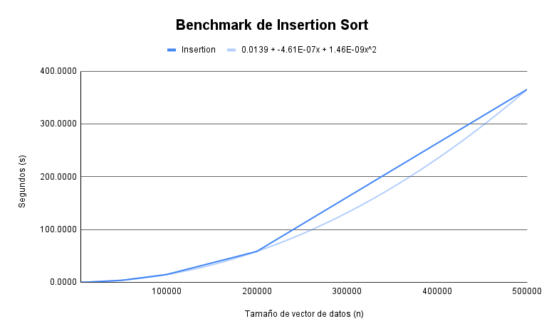

# Tarea 4

Esta corresponde a la _Tarea 4_ del curso IE-0217, en la cual se trata la implementación de un programa para benchmarking de algoritmos de ordenamiento y un simulador de gestión de proyectos de construcción. La asignación está dividida en cuatro partes principales:

1) Modo de uso
2) Parte teórica
3) Benchmarking de algoritmos de ordenamiento
4) Simulador de gestión de proyectos de construcción


# Pendiente agregar link de documentación
<ins>__Documentación del código__</ins>: Para acceder a documentación detallada en Doxygen sobre el código implementado, ingrese a este [link](). Acá se encuentra documentado cada archivo, clase y función de ambos programas realizados.

## Modo de uso

El proceso de compilación se realiza a partir de la herramienta _Makefile_ y se utiliza el compilador `g++`. Por lo tanto, es importante que se tenga instalado en el dispositivo para la ejecución.

Observe que se tienen dos Makefiles para la compilación de ambos programas. Por lo tanto, la compilación difiere un poco de los casos que poseen uno separado por directorios.

### Ejercicio 1

Con respecto al primer programa, correspondiente al desarrollo de un programa para hacer benchmarking de algoritmos de ordenamiento, se tiene que para compilar con todos los tamaños del vector preestablecidos, se utiliza el comando:

```shell
make -f Makefile1
```

Como se mencionó, con este comando se calcula el tiempo promedio para los tamaños: 5000, 10000, 50000, 100000, 200000, 500000. Sin embargo, en el `Makefile1` se establecieron variables para modificar el comportamientoo por defecto del programa.

La primera modificación corresponde a indicar un tamaño personalizado para el vector a ordenar. Esto se realiza a partir del siguiente comando:

```
make -f Makefile1 SIZE=<n>
```

Donde `n` corresponde al tamaño nuevo. Cada algoritmo en este caso se ejecuta únicamente para el tamaño ingresado.

Ahora bien, si se desea cambiar cuáles algoritmos se ejecutan en la ejecución, se utiliza el siguiente comando:

```
make -f Makefile1 ALGORITHMS="bubble-selection-insertion-quick-stl"
```

Elimine en el comando anterior los nombres de los algoritmos que no quiere ejecutar.

Ambos comandos de compilación anteriores se pueden unir para personalizar áun más el resultado deseado.

Después de ingresar el comando, se muestran el tiempo de cada una de las ejecuciones conforme terminan.

### Ejercicio 2

Con respecto al segundo ejercicio, correspondiente al programa de gestión de proyectos de construcción, se tiene que para este no se reciben argumentos de la línea de comandos, en comparación con el anterior.

El comando sugerido para ejecutar las reglas contenidas dentro del archivo `Makefile2` corresponde a:

```
make -f Makefile2
```

A partir de este paso, se muestra un menú con las instrucciones solicitadas. 

## Parte teórica

### 1. ¿Qué es un algoritmo de ordenamiento y por qué son importantes en programación?

Un algoritmo de ordenamiento es un conjunto de instrucciones para reorganizar elementos en una secuencia (como un array o lista) en un orden específico. Por lo general, se busca que sea ascendente o descendente, para poder acceder a estos de una forma más rápida.

Su importancia radica en mejorar la eficiencia de búsquedas y optimizar otras operaciones como la fusión de datos, comparaciones, y toma de decisiones en algoritmos o programas más complejos.

### 2. Explique el funcionamiento del algoritmo de ordenamiento "Bubble Sort".

Bubble Sort es un algoritmo de ordenamiento simple que funciona a partir de la comparación de elementos adyacentes y cambiándolos de posición si están en el orden incorrecto (entre ellos). Este proceso se repite para cada par de elementos en la lista.

Conforme se ejecuta el algoritmo, los elementos más grandes se van moviendo hacia el final del arreglo de datos. Posee una eficiencia de $O(n^2)$, por lo que, es una técnica poco eficiente.

La implementación de los algoritmos de ordenamiento se encuentra en el programa de _benchmarking_ de algoritmos de ordenamiento.

### 3. Explique el funcionamiento del algoritmo de ordenamiento "Selection Sort".

Selection Sort es un algoritmo de ordenamiento que divide el arreglo de datos en dos partes: _la parte ordenada_ y _la parte no ordenada_. En cada iteración, busca el elemento más pequeño (o más grande, dependiendo de la implementación) en la parte no ordenada y lo intercambia con el primer elemento de esa parte. Posteriormente, se puede expandir la parte ordenada al incluir este elemento y se repite el proceso con los elementos restantes no ordenados.

En cuanto a su eficiencia, es más eficiente que Bubble Sort, pero igual sigue siendo un algoritmo del tipo $O(n^2)$.

### 4. Describa el algoritmo de ordenamiento "QuickSort". ¿Cuál es su ventaja principal sobre otros algoritmos de ordenamiento?

El algoritmo QuickSort emplea la técnica de programación conocida como _Divide y vencerás_, usualmente por medio de recursión. Sigue los siguientes pasos clave:

- __Pivote__: Se elige un elemento del array, que puede ser el primero, el último, o uno aleatorio (depende de la implementación).

- __Partición__: Se reorganizan los elementos para que todos los menores al pivote queden a su izquierda y todos los mayores a su derecha (pivote queda en el medio).

- __Recursión__: Se aplica QuickSort recursivamente a los subarrays izquierdo y derecho (sin incluir el pivote, pues este ya fue ordenado).

Su ventaja principal corresponde a su complejidad temporal promedio, pues es de $O(n \log(n))$. Sin embargo, dependiendo del pivote escogido, en el peor caso, puede tener una complejidad de $O(n^2)$. Además, posee una buena eficiencia en memoria, de $O(\log(n))$.

### 5. Explique el concepto de complejidad temporal y cómo se aplica a los algoritmos de ordenamiento.

La __complejidad temporal__ mide el tiempo que toma un algoritmo para ejecutarse, dependiendo del tamaño de la entrada. Se suele utilizar la notación _Big O_. Se utiliza para evaluar cómo aumenta el tiempo de ejecución de un algoritmo a medida que aumenta el número `n` de elementos en la entrada.

En los algoritmos de ordenamiento, es utilizada para evaluar qué tan eficiente es el algoritmo, pues analiza cuántas comparaciones o intercambios se realizan para ordenar los elementos.

#### **a.** Discuta la complejidad temporal de algoritmos de ordenamiento comunes como Bubble Sort, Insertion Sort, Quick Sort, Selection Sort, y la función std::sort de la STL.

- __Bubble Sort__: Su mejor caso corresponde a cuando el arreglo ya está ordenado, acá posee una complejidad temporal de $O(n)$. Sin embargo, el peor caso y el caso promedio es de $O(n^2)$, pues debe comparar cada par de elementos adyacentes.

- __Insertion Sort__: Su mejor complejidad temporal es $O(n)$, el cual ocurre cuando la lista está casi ordenada. El peor caso y el caso promedio es $O(n^2)$.

- __Quick Sort__: El mejor caso de complejidad y el promedio es $O(n \log(n))$, pues se divide en dos el arreglo de datos y se ordena recursivamente. El peor caso es $O(n^2)$ cuando el pivote se escoge mal. Por lo general, con un pivote aleatorio no es usual observar el peor caso.

- __Selection Sort__: Posee como mejor, peor y promedio de complejidad $O(n^2)$. Se realizan `n` comparaciones para cada posición para `n` elementos, de ahí la complejidad resultante.

- __STL Sort__: Dependiendo del compilador, se implementa un algoritmo híbrido. Generalmente, consiste en una combinación de QuickSort, HeapSort, e Insertion Sort. La mejor complejidad y la promedio son $O(n \log(n))$. Además, contiene optimizaciones para listas pequeñas o desbalanceadas, y se mitiga el peor caso pues se realizan técnicas para evitar una complejidad de $O(n^2)$.

El algoritmo STL Sort corresponde a uno de los más estudiados y pulidos, por esta razón es que se encuentra implementado directamente en la biblioteca STL de C++. De ahí que su uso esté recomendado para la mayoría de los casos.


### 6. ¿Cuál es la diferencia entre los algoritmos de ordenamiento estables e inestables?

La principal diferencia entre ambos tipos de ordenamientos corresponde a la forma en que se manejan los elementos con valores o claves iguales.

- __Algoritmo estable__: Mantiene el orden relativo de los elementos iguales. Si dos elementos son iguales, su posición relativa en la lista ordenada será la misma que en la lista original; es decir, el que estaba primero, sigue estando primero y así para los demás.

- __Algoritmo inestable__: No garantiza mantener el orden relativo de los elementos iguales.

#### **a.** Proporcione ejemplos de algoritmos de ordenamiento estables e inestables y explique por qué la estabilidad puede ser importante en ciertos escenarios.

__Ejemplos de algoritmos estables__: Merge Sort, Bubble Sort, Insertion Sort.

__Ejemplos de algoritmos inestables__: Quick Sort, Selection Sort.

La estabilidad puede ser importante en escenarios donde se está realizando un ordenamiento con varios criterios; es decir, se quiere preservar el orden original en atributos que no están siendo comparados directamente, lo cual es utilizado cuando se hacen múltiples ordenamientos con criterios distintos. Por ejemplo, si se tiene una lista de personas ordenadas por apellido, y luego se quiere ordenar por nombre sin perder el orden original de los apellidos, un algoritmo estable es necesario en este caso.


### 7. ¿Cómo funciona la función std::sort de la STL y qué algoritmo de ordenamiento utiliza internamente?

La función `std::sort` de la biblioteca STL ordena un rango de elementos entre dos iteradores, típicamente en orden ascendente. Sin embargo, el usuario también puede proporcionar un criterio de comparación personalizado.

Internamente, `std::sort` utiliza un algoritmo híbrido que combina __QuickSort__, __HeapSort__ y __Insertion Sort__ para lograr un buen rendimiento en la mayoría de los casos. El uso de cada uno se describe a continuación:

- __QuickSort__: Se usa en la mayor parte del proceso para dividir el rango en subrangos y ordenarlos recursivamente, lo que le da su eficiencia promedio de $O(n \log(n))$.

- __HeapSort__: Se utiliza como _mecanismo de respaldo_ en situaciones donde el rendimiento de QuickSort puede verse afectado, como en el peor caso (que es $O(n^2)$). Esto asegura que la complejidad en el peor caso siga siendo $O(n \log(n))$ y que el algoritmo general mantenga su eficiencia.

- __Insertion Sort__: Se emplea para ordenar pequeños subrangos de elementos, puesto que es más eficiente en rangos pequeños.

#### **a.** Discuta la complejidad de std::sort y por qué a menudo es más eficiente que los algoritmos de ordenamiento implementados manualmente.

La función `std::sort` de la biblioteca STL tiene una complejidad temporal de $O(n \log(n))$ en el mejor y promedio de los casos, y también en el peor caso debido a las optimizaciones que emplea.

Entre las razones por las que es más eficiente que los demás algoritmos implementados manualmente, se encuentran:

- __Optimización híbrida__: Como se mencionó, `std::sort` utiliza una combinación de QuickSort, HeapSort, e Insertion Sort, lo que le permite manejar diferentes tamaños de datos.

- __Optimización a nivel de compilador__: Los compiladores suelen optimizar las implementaciones de la STL, al aprovechar instrucciones específicas del hardware y mejoras de bajo nivel.

- __Uso eficiente de memoria__: `std::sort` trabaja _in-place_; esto se refiere a que no requiere memoria adicional significativa aparte de la pila de recursión.

- __Optimizado y probado__: La implementación de `std::sort` ha sido ampliamente optimizada y probada en múltiples entornos y situaciones por muchas personas dedicadas al entorno de programación, lo que garantiza un rendimiento y corrección consistentes.

### 8. Explique la importancia de hacer benchmarks en los algoritmos de ordenamiento.

La importancia de hacer _benchmarks_ en los algoritmos de ordenamiento radica en que es necesario medir el rendimiento del algoritmo en términos de tiempo de ejecución y el uso que emplea de los recursos. Esto es de especial importancia cuando se trabaja con conjuntos de datos sumamente grandes o en sistemas con recursos limitados.

Además, es esencial pues permite comparar cómo diferentes algoritmos de ordenamiento se comportan con distintos tipos y tamaños de datos. De igual forma, los _benchmarks_ permiten detectar el rendimiento en casos extremos (mejor y peor caso).

La implementación de los benchmarks también es útil para observar cómo los algoritmos se comportan en diferentes plataformas y arquitecturas de hardware.

#### **a.** ¿Qué factores se deben considerar al hacer benchmarks de diferentes algoritmos de ordenamiento y cómo se pueden interpretar estos benchmarks?

Entre los factores a considerar en el análisis de _benchmarks_, se encuentran:

- __Tamaño del conjunto de datos__: Es importante observar el comportamiento al trabajar con distintos tamaños de datos, con esto se evidencia si el algoritmo es adecuado y suficientemente eficiente para ser utilizado.

- __Estado inicial de los datos__: Dependiendo del estado inicial de ordenamiento de los datos, el comportamiento de los algoritmos puede variar. Algunos mejoran su velocidad y otros no presentan una diferencia significativa.

- __Uso de recursos__: Es importante medir el uso de memoria del algoritmo. Algunos, como Merge Sort, necesitan memoria adicional para ser ejecutados, lo cual, dependiendo del tamaño de la entrada, puede influir negativamente en el rendimiento durante la ejecución.

- __Tipo de datos__: Algunos algoritmos pueden depender del tipo de datos. Probar con diferentes tipos, como enteros, cadenas o estructuras, es importante pues el costo de comparación puede variar.

- __Condiciones del sistema__: El rendimiento del algoritmo puede ser dependiente directamente del hardware y el software sobre el que está siendo ejecutado.

La forma de interpretar los _benchmarks_ está ligada con los factores anteriores, pues el rendimiento promedio, el peor caso de complejidad y el consumo de memoria son elementos importantes a tener en cuenta al interpretar los _benchmarks_ y pueden determinar si un algoritmo es adecuado o no para la aplicación específica. Además, la consistencia en los resultados del algoritmo es un punto clave a considerar.

### 9. Compare el uso de memoria de diferentes algoritmos de ordenamiento.

1. __Bubble Sort__ $O(1)$: Es un algoritmo _in-place_; esto significa que no requiere espacio adicional, aparte de ciertas variables auxiliares para las comparaciones e intercambios. 

2. __Insertion Sort__ $O(1)$: Ordena los datos dentro del arreglo original sin usar memoria adicional significativa (_in-place_). Solo se necesita memoria para las comparaciones e inserciones.

3. __Selection Sort__ $O(1)$: También es un algoritmo _in-place_, puesto que ordena los datos sin requerir estructuras de datos adicionales. Intercambia elementos dentro del array original.

4. __Quick Sort__ $O(\log(n))$: Es un algoritmo _in-place_, pero el uso de memoria proviene de la pila de recursión (profundidad promedio de $O(\log(n))$). 

5. __`std::sort`__ $O(\log(n))$: Como utiliza una combinación de QuickSort, HeapSort e Insertion Sort, su uso de memoria promedio es de $O(\log(n))$ (con optimizaciones para evitar peor caso).

#### **a.** Discuta cómo algoritmos como Quick Sort y Merge Sort usan la memoria de manera diferente, incluyendo su complejidad espacial.

Por un lado, QuickSort utiliza $O(\log(n))$ de memoria, pues es _in-place_ y solo requiere espacio para la pila de recursión. En el peor caso, puede usar $O(n)$ si las particiones son desbalanceadas.

Merge Sort, por otro lado, usa $O(n)$ de memoria. En cada paso, el array se divide en dos mitades, y luego cada mitad se combina después de haber sido ordenada. Como se requiere de espacio adicional para los subarrays, lo hace menos eficiente en términos de memoria.

### 10. ¿Cómo se elige el algoritmo de ordenamiento más adecuado para un conjunto de datos dado?

La elección de un algoritmo de ordenamiento para un conjunto de datos depende directemente del tamaño del conjunto de datos, el orden inicial de los datos, restricciones en el uso de memoria y recursos, especialmente en sistemas con memoria limitada, y si se requiere tener estabilidad en el algoritmo. Estos puntos se describen a profundidad en el siguiente subapartado.

#### **a.** Discuta los factores que influyen en la elección de un algoritmo de ordenamiento, como el tamaño del conjunto de datos, su orden inicial y la necesidad de estabilidad.

Entre los factores a considerar al elegir un algoritmo de ordenamiento para un conjunto de datos, destacan los siguientes:

- __Tamaño del conjunto de datos__: Si se tienen conjuntos pequeños, Insertion Sort o Bubble Sort pueden ser suficientes para la aplicación. Sin embargo, para conjuntos grandes, algoritmos como QuickSort o Merge Sort son mejores por su eficiencia $O(n \log(n))$.

- __Orden de los datos inicial__: Si los datos están casi ordenados, Insertion Sort es muy eficiente. Si están considerablemente desordenados, QuickSort puede ser más adecuados en ese caso.

- __Restricciones de memoria y uso de recursos__: Si se trabaja en un sistema con memoria limitada, QuickSort o HeapSort son preferibles porque son _in-place_, a diferencia de Merge Sort, que necesita memoria adicional.

- __Estabilidad__: Si se requiere mantener el orden relativo de elementos iguales, se debe usar un algoritmo estable como Merge Sort o Insertion Sort.

### 11. Nombre cinco contenedores diferentes de la STL y explique brevemente en qué situaciones serı́a apropiado usar cada uno.

1. __`std::vector`__: Es un array dinámico que es útil cuando se necesita acceso aleatorio rápido y el tamaño del contenedor puede cambiar con frecuencia. Resulta adecuado cuando se trabja con secuencias de datos.

2. __`std::list`__: Lista enlazada doblemente. Apropiada cuando se requiere inserciones y eliminaciones frecuentes en cualquier posición, mientras se mantiene un orden de los elementos.

3. __`std::deque`__: Doble cola. Es útil cuando se requieren inserciones y eliminaciones eficientes tanto al principio como al final de la secuencia de elementos del conjunto de datos.

4. __`std::set`__: Contenedor ordenado de elementos únicos. Es ideal cuando se necesita almacenar elementos ordenados automáticamente y no se necesitan duplicados.

5. __`std::map`__: Almacena pares clave-valor ordenados. Útil para búsquedas rápidas de valores asociados a claves, pues garantiza el orden de las claves y evitando duplicados (en la llave).


### 12. Explique qué son los adaptadores de contenedores y brinde un ejemplo para el cual se podría implementar.

Los __adaptadores de contenedores__ en la biblioteca STL son estructuras que proporcionan una interfaz modificada sobre otros contenedores. Se encargan de adaptar el comportamiento de contenedores básicos para cumplir con una funcionalidad específica, como una pila o una cola.

En cuanto al ejemplo de uso, se tiene el adaptador `std::stack`, el cual implementa una estructura de pila (_LIFO - Last In, First Out_), por medio de otro contenedor, como `std::vector` o `std::deque`, internamente. Este es utilizado cuando se necesita apilar elementos y acceder únicamente al último elemento insertado.

Una situación donde puede ser utilizado corresponde al deshacer los cambios en un editor de texto. Al realizar una modificación, esta se agrega al _stack_. Si el usuario presiona _Deshacer_, el último cambio realizado (el último en la pila) es revertido.

### 13. Explique el concepto de iteradores en la STL y cómo se utilizan para acceder a elementos en contenedores.

Los __iteradores en la STL__ son objetos que actúan como punteros para recorrer los elementos de un contenedor. Estos proporcionan una forma genérica y eficiente de acceder y manipular los elementos de un contenedor.

Existen diferentes maneras de acceder a los elementos, pues existen 4 tipos principales de iteradores: de entrada/salida, hacia adelante (_forward_), bidireccionales y de acceso aleatorio.

El primer tipo, los iteradores de entrada/salida sólo permiten leer o escribir elementos. Los iteradores hacia adelante permiten avanzar y leer elementos. Los iteradores bidireccionales pueden avanzar y retroceder. Finalmente, los iteradores de acceso aleatorio permiten acceso aleatorio (como en un vector, por ejemplo).

Los iteradores acceden a los elementos de forma similar que los punteros, se debe desreferenciar el valor sobre el que está iterando. A continuación, se muestra un ejemplo de este procedimiento:

```cpp
std::vector<int> vec = {1, 2, 3, 4, 5};

for (std::vector<int>::iterator it = vec.begin(); it != vec.end(); ++it) {
    std::cout << *it << " ";
}
```

En el bloque de código anterior, se recorre el vector desde el inicio hasta el final, por medio de un `for` loop. Para acceder a cada valor se utiliza el operador de desreferencia `*`.

### 14. Mencione y explique 3 diferentes operaciones soportadas por iteradores en STL ¿Cuál es la forma de definirlas en el código?

La primera operación corresponde al acceso al elemento actual al que apunta el iterador con el operador de desreferencia `*`. La sintaxis corresponde a `*it`, donde _it_ es el nombre del iterador en cuestión. A continuación, se muestra un ejemplo de su uso para desreferenciar el primer valor de una lista.

```cpp
std::vector<int> vec = {10, 20, 30};
std::vector<int>::iterator it = vec.begin();

std::cout << *it;
```

La segunda operación soportada corresponde al incremento, por medio del operador `++`, el cual es utilizado para avanzar con el iterador hacia el siguiente elemento en el contenedor. La sintaxis utilizada se muestra a continuación:

```cpp
it++;
std::cout << *it;
```

En el bloque de código, se mueve el iterador hacia el siguiente elemento y luego, se imprime su valor en la consola.

Finalmente, se tienen las operaciones de comparación `==` y  `!=`, las cuales son empleadas para comparar si dos iteradores apuntan al mismo elemento.

```cpp
if (it != vec.end()) {
    std::cout << "El iterador no ha alcanzado el final.";
}
```

En el bloque se código anterior, se muestra la forma de utilizarlas. Se compara el valor del iterador actual con el final del contenedor, por medio de un `if` clause.


### 15. ¿Qué implementaciones se pueden hacer con iteradores de acceso aleatorio? ¿Cuál es la diferencia principal con los iteradores bidireccionales?

Los __iteradores de acceso aleatorio__ permiten saltar directamente a cualquier posición dentro de un contenedor. Esto los hace especialmente útiles para operaciones como acceder a elementos en posiciones específicas, calcular distancias entre elementos y realizar ordenamientos eficientes. Por ejemplo, en un `std::vector`, se puede usar `it + n` para acceder rápidamente al n-ésimo elemento (partiendo del inicio), o calcular la distancia entre dos iteradores con `it2 - it1`.

Los iteradores de acceso aleatorio permiten moverse a cualquier elemento en tiempo constante $O(1)$, mientras que los bidireccionales sólo permiten avanzar o retroceder un elemento, lo que puede ser menos eficiente para recorrer grandes contenedores, pues implica una complejidad $O(n)$.

### 16. Proporcione ejemplos de al menos tres algoritmos de la STL y describa sus funciones básicas.

- __`std::sort`__: Ordena los elementos de un rango, generalmente en orden ascendente. Se puede proporcionar un criterio de ordenamiento personalizado. Usualmente, se emplea para ordenar contenedores. Los parámetros que recibe son dos iteradores (del elemento inicial y final). También puede recibir un criterio personalizado.

```cpp
std::vector<int> vec = {3, 1, 4, 1, 5};
std::sort(vec.begin(), vec.end());
```

- __`std::find`__: Busca el primer elemento en un rango que sea igual a un valor específico y devuelve un iterador a dicho elemento. Si no se encuentra, se retorna el iterador `end()`.

```cpp
std::vector<int> vec = {10, 20, 30, 40};
auto it = std::find(vec.begin(), vec.end(), 30);
```

- __`std::accumulate`__: Suma los elementos de un rango y devuelve el resultado. Se puede usar con otras operaciones como multiplicación.

```cpp
std::vector<int> vec = {1, 2, 3, 4};
int sum = std::accumulate(vec.begin(), vec.end(), 0);
```


### 17. ¿Cómo podrı́a utilizar un algoritmo personalizado con la STL?

Para utilizar un algoritmo personalizado con la STL, se pueden pasar funciones o lambdas como parámetros a los algoritmos estándar. Esto permite solicitar un comportamiento específico del algoritmo. 

En el siguiente ejemplo, se ordena un vector con un criterio personalizado a partir de una función lambda para que el ordenamiento sea en orden descendente. El criterio se coloca como tercer argumento de la función `std::sort`.

```cpp
std::sort(vec.begin(), vec.end(), [](int a, int b) {
    return a > b;
});
```

### 18. ¿Cuál es el papel de los templates en la implementación de funciones de ordenamiento?

Los templates en C++ son fundamentales en la implementación de funciones de ordenamiento, puesto que permiten escribir código genérico que puede funcionar con cualquier tipo de dato sin necesidad de duplicar el código para cada tipo específico.

#### **a.** Explique cómo los templates se pueden utilizar para crear funciones de ordenamiento genéricas que funcionen con diferentes tipos de datos.

Al usar templates, se define una función genérica que no está vinculada a un tipo de dato específico. En lugar de especificar un tipo, se usa un parámetro de tipo genérico, como `T`, que es determinado en el momento de la llamada a la función. La sintaxis utilizada es la siguiente:

```cpp
template <typename T>
void ordenamiento(std::vector<T>& vector) {
    // Implementación de algoritmo
}
```

También, se puede dejar que el compilador interprete el tipo de dato sin indicarlo explícitamente.

Además, los templates permiten que las funciones de ordenamiento acepten comparadores personalizados para ordenar la estructura basado en ciertos criterios particulares de la implementación.

### 19. Explique de qué forma se implementan templates con múltiples parámetros en C++.

En el caso de funciones, permite que acepten diferentes combinaciones de tipos de datos. Se utiliza la sintaxis evidenciada en el ejemplo a continuación:

```cpp
template <typename T, typename U>
void mostrar(T a, U b) {
    std::cout << "a: " << a << ", b: " << b << std::endl;
}
```

Se colocan los nombres con los que se van a identificar los templates después de `typename` y separados por `,`. 

En cuanto a las clases, permiten crear clases que operen con varios tipos de datos diferentes.

```cpp
template <typename T, typename U>
class Par {
public:
    T primero;
    U segundo;

    Par(T a, U b) : primero(a), segundo(b) {}
};
```

De igual forma que en las funciones, se colocan los tipos de datos que se quieren aceptar separados por `,`. Para crear un objeto de la clase con múliples parámetros, se hace de la siguiente forma:

```cpp
std::pair<int, std::string> par(1, "Uno");
```

### 20. ¿Qué son las excepciones en C++ y cómo se pueden usar para manejar errores durante las operaciones de ordenamiento?

Las __excepciones en C++__ son un mecanismo para manejar errores o condiciones excepcionales que ocurren durante la ejecución de un programa. En lugar de que el programa falle de manera abrupta e imprevista, las excepciones permiten detectar y responder a los errores de forma controlada. Esto permite crear un programa más robusto y seguro. Se utiliza la estructura `try-catch` para manejar los errores. La sintaxis empleada se muestra a continuación:

```cpp
try {
    // Código donde puede ocurrir un error
} catch (const std::exception& e) {
    // Manejo del error
    std::cerr << e.what() << std::endl;
}
```

Entre los errores posibles en operaciones de ordenamiento, se encuentra si el contenedor es demasiado grande y el sistema no puede asignar suficiente memoria, se puede lanzar una excepción `std::bad_alloc`. Además, si se utiliza un comparador personalizado en el ordenamiento, puede lanzarse una excepción si ocurre un error en la comparación de los elementos.

#### **a.** Proporcione un ejemplo de cómo usar excepciones para manejar un posible error en un algoritmo de ordenamiento.

Para el primer error mencionado anteriormente, que corresponde a cuando el contenedor es demasiado grande y el sistema no puede asignar suficiente memoria, se puede utilizar el manejo con excepciones para que el programa falle controladamente, de la siguiente forma:

```cpp
try {
    std::vector<int> vec(1000000000);
    std::sort(vec.begin(), vec.end());
} catch (const std::bad_alloc& e) {
    std::cerr << "Error: Memoria insuficiente. " << e.what() << std::endl;
}
```

Se colocó un tamaño de vector arbitrariamente muy grande para que si ocurre un error en la asignación de memoria, se muestre el mensaje de error.

### 21. Describa los bloques `try`, `catch` y `throw` y cómo se utilizan para el manejo de excepciones en C++.

- __`throw`__: se utiliza para lanzar una excepción cuando ocurre un error o una condición inesperada. Se utiliza la siguiente sintaxis:

```cpp
throw std::runtime_error("Error en el proceso");
```

- __`try`__: Encapsula el código que puede lanzar una excepción. Si ocurre un error dentro del bloque `try` y se lanza una excepción, se transfiere al bloque `catch`.

```cpp
try {
    // Código que puede lanzar una excepción
    if (error) {
        throw std::runtime_error("Ocurrió un error");
    }
}
```

- __`catch`__: Se utiliza para capturar y manejar la excepción lanzada. Note que el tipo de excepción capturada debe coincidir con el tipo de excepción lanzada por `throw`.

```cpp
catch (const std::runtime_error& e) {
    std::cerr << "Excepción capturada: " << e.what() << std::endl;
}
```

### 22. Nombre al menos tres excepciones estándar proporcionadas por C++ y proporciona ejemplos de situaciones en las que podrı́an ser útiles.

- __`std::out_of_range`__: Cuando se intenta acceder a un elemento fuera del rango válido de un contenedor. Por ejemplo, si se intenta acceder al décimo elemento de un vector que sólo tiene tres elementos, se lanzaría una `std::out_of_range`. Entonces, permite capturar el error y evitar que el programa falle repentinamente.

- __`std::invalid_argument`__: Esta excepción se lanza cuando se pasa un argumento inválido a una función. Un ejemplo es en una función de división, donde el divisor no puede ser cero. Entonces si se ingresa ese valor, se lanza la excepción y se maneja adecuadamente.

- __`std::bad_alloc`__: Esta excepción se produce cuando el programa intenta asignar más memoria de la que está disponible en el sistema. Por ejemplo, si se intenta asignar un array de un tamaño enorme que excede la memoria disponible.

### 23. ¿Cuál es la forma de manejar errores inesperados o no considerados durante la elaboración del código?

Para el manejo de excepciones inesperadas o no consideradas durante la elaboración del código, se utiliza el bloque `try`, `catch` junto con excepciones genéricas. Se utiliza `catch (...)` para capturar errores inesperados o no contemplados en los bloques `catch` anteriores. La sintaxis se muestra a continuación:

```cpp
try {
    // Código que puede generar cualquier error
} catch (...) {
    std::cerr << "Se produjo un error desconocido." << std::endl;
}
```

### 24. Describa cómo las expresiones regulares se pueden usar para validar o filtrar datos antes del ordenamiento.

Al utilizar expresiones regulares, se puede garantizar que los datos sean correctos o que cumplan con ciertos criterios antes de ser procesados, lo que ayuda a evitar errores y asegura que sólo se ordenen elementos válidos. Es decir, las expresiones regulares permiten preparar los datos para el ordenamiento, garantizando que sólo los elementos con el formato correcto se incluyan en el proceso. Esto asegura la calidad y consistencia de los datos, evita errores, y optimiza el rendimiento en conjuntos de datos complejos.

#### **a.** Proporcione un ejemplo de un escenario en el que la validación de datos mediante expresiones regulares sea necesaria antes de realizar el ordenamiento.

Por ejemplo, al trabajar con una lista de correos electrónicos, se puede filtrar previamente aquellos que no cumplan con el formato adecuado utilizando una expresión regular. Solo las direcciones de correo válidas se incluirían en el proceso de ordenamiento. Con esto, se evita cualquier error que pueda ocurrir dentro del proceso de ordenamiento si se ingresa un dato inválido.

### 25. Enumere al menos tres caracteres especiales comúnmente utilizados en expresiones regulares y describa sus funciones.

A continuación, se describen 3 caracteres especiales utilizados en _Regex_ junto con sus funciones y un ejemplo de uso.

1. __Punto `.`__: Representa cualquier carácter individual, excepto una nueva línea. Por ejemplo, `a.b` coincide con cualquier cadena que tenga una `a`, seguida de cualquier carácter, seguida de una `b`, como `acb` o `a1b`.

2. __Circunflejo `^`__: Indica el inicio de una línea o cadena de caracteres. Por ejemplo, `^abc` coincide con `abc` únicamente si se encuentra al principio de la línea.

3. __Signo de dólar `$`__: Marca el final de una línea o cadena de caracteres. Por ejemplo, `xyz$` coincide con `xyz` sólo si está al final de la línea.

### 26. ¿Cuál es la diferencia entre `std::regex_match` y `std::regex_search` en C++?

- __`std::regex_match`__: Comprueba si toda la cadena coincide completamente con la expresión regular. Es decir, para que el resultado sea positivo, toda la cadena debe ajustarse al patrón proporcionado.

- __`std::regex_search`__: Busca si alguna parte de la cadena coincide con la expresión regular. A diferencia de `std::regex_match`, no requiere que la cadena completa coincida con el patrón, sólo que exista una coincidencia parcial dentro de la cadena.

### 27. ¿Cómo se puede utilizar `std::regex_replace` en C++ para modificar cadenas de texto?

`std::regex_replace` en C++ es una función que se utiliza para buscar todas las coincidencias de un patrón de expresión regular en una cadena y reemplazarlas con una nueva cadena. La sintaxis utilizada corresponde a la siguiente:

```cpp
std::string regex_replace(stringInput, patronRegex, reemplazo);
```

En el siguiente ejemplo, se sustituyen todos los números de la expresión por el texto `[número]`.

```cpp
int main() {
    std::string texto = "Hay 3 gatos y 4 perros en la casa.";
    std::regex patron("\\d+");  // Buscar cualquier número
    std::string resultado = std::regex_replace(texto, patron, "[número]");

    std::cout << "Texto modificado: " << resultado << std::endl;
    return 0;
}
```

### 28. ¿Qué es un Makefile y cómo se puede usar para automatizar la compilación de un programa en C++ con múltiples algoritmos de ordenamiento?

Un Makefile es un archivo de configuración utilizado por la herramienta _make_ para automatizar el proceso de compilación de programas, especialmente en proyectos con múltiples archivos fuente.

En este, se definen una serie de reglas que describen cómo compilar y enlazar el proyecto. Cada regla especifica un objetivo (por lo general, un archivo), las dependencias de ese objetivo y los comandos necesarios para construirlo.

La compilación de un programa de C++ con múltiples algoritmos de ordenamiento, se puede realizar si se coloca cada algoritmo de ordenamiento en un archivo _source_ por aparte (la definición y prototipo pueden ir juntos). Luego, en el proceso de compilación en el Makefile, se colocan reglas para cada archivo que contiene algoritmos. Finalmente, el TARGET final consiste de un programa en donde se ejecutan juntos.

#### **a.** Describa cómo escribiría un Makefile que compile diferentes algoritmos de ordenamiento en ejecutables separados.

Para escribir un Makefile que compile diferentes algoritmos de ordenamiento en ejecutables separados, el enfoque a seguir corresponde a generar un ejecutable independiente para cada archivo fuente que contenga un algoritmo. El Makefile debe especificar cómo compilar cada algoritmo en un ejecutable específico, manteniendo un header file común para las definiciones y los prototipos de funciones de los algoritmos.

De esta forma, se puede compilar cada uno con el comando `make <nombre_algoritmo>`. Además, si se define una regla `all`, se coloca todos los archivos ejecutables como TARGET y que se ejecuten uno tras otro.

## Explicación Formato Markdown utilizado

En el enunciado, se menciona que hay que investigar y agregar explicaciones para el formato Markdown. Por lo tanto, en esta sección se va a agregar una guía general para la elaboración de archivos con extensión `.md`.

- __Headers (#)__:
Para colocar títulos en Markdown se utiliza `#`, dependiendo de cuantos caracteres de este tipo se coloquen, indica el nivel del título. Note que `#` indica el encabezado de mayor tamaño (nivel 1), mientras que `######` indica el encabezado de menor tamaño (nivel 6).

- __Listas sin orden__:
Para colocar listas sin un orden, se utilizó el caracter `-`. Cada ítem de la lista, se encuentra indicado por este. Se pueden usar también otros caracteres como `*` y `+`, los cuales funcionan de la misma forma.

- __Listas ordenadas__:
El formato para colocar listas ordenadas corresponde a colocar los números del ítem para el cual se está poniendo. Por ejemplo: `1.`, `2.` y así sucesivamente.

- __Itálica__:
Para colocar palabras en itálica, se rodea la palabra con `_` o `*` en ambos lados. Por ejemplo: `_italica_` o `*italica*`.

- __Negrita__:
En cuanto a las negritas, funciona de forma similar que itálica, se colocan `_` o `*` dobles alrededor de la palabra. Por ejemplo: `**negrita**` o `__negrita__`.

- __Código__:
El código multilínea se escribe al rodear el bloque de código con tres caracteres de \`. Mientras que, el código en una línea simple, se escribe al rodearlo con \` una única vez.

- __Hipervínculos__:
Para agregar enlaces en Markdown, se utiliza el siguiente formato:

```
[Palabras con hipervinculo](enlace)
```

## Benchmarks de Algoritmos de Ordenamiento

En este programa, se realizó un benchmark de los algoritmos de ordenamiento BubbleSort, SelectionSort, InsertionSort, QuickSort y STL Sort (`std::sort`). Para ello, se generan vectores de los siguientes tamaños establecidos: 5000, 10000, 50000, 100000, 200000, 500000. Se ejecutaron los resultados 10 veces para cada tamaño con los algoritmos mencionados. Luego, se calculó un promedio entre las 10 repeticiones. Los resultados de la ejecución se almacenan en el siguiente [Google Sheets](https://docs.google.com/spreadsheets/d/1Pw_sjR08TTUW68YsdObD_N_PQkWfhVo33iMBEq3WI3k/edit?usp=sharing).

Se graficó el tiempo de ejecución de cada algoritmo en segundos en función del tamaño del vector a ordenar. A continuación se muestra cada uno de los gráficos junto con su curva de mejor ajuste.

<p align="center">
  
  
</p>
<p align="center">
  
  
</p>
<p align="center">
  
</p>


Para comparar los gráficos obtenidos anteriormente con la complejidad temporal teórica de cada uno, se realizó la siguiente razón: $\frac{t(n)}{n^2}$ para los algoritmos que poseen una complejidad teórica de $O(n^2)$, que son BubbleSort, SelectionSort e InsertionSort. Los gráficos a continuación consisten en la relación: $\frac{t(n)}{n^2}$ vs $n$.

<p align="center">
  
  
</p>
<p align="center">
  
</p>

Observe que en este caso, se obtuvo una línea relativamente constante en los resultados. Esto evidencia el crecimiento cuadrático que presentan los algoritmos de ordenamiento anteriores en su complejidad temporal.

Ahora bien, respecto a los algoritmos del tipo $O(n\log(n))$, que son QuickSort y STL Sort, se graficó la división $\frac{t(n)}{n\log(n)}$ en función del tamaño de la entrada del vector.
<p align="center">
  
  
</p>

En cuanto a estos dos algoritmos, se determinó que en la gráfica de $t(n)$ en función de $n$, ambos presentan una tendencia relativamente lineal, lo cual difiere con lo esperado en la teoría. Por esto es que los gráficos de $\frac{t(n)}{n\log(n)}$ vs $n$ no se observan como un valor constante. Entre las posibles razones para explicar el presente resultado, se tiene que estos algoritmos son de los más rápidos y fueron diseñados y optimizados para ser de esta forma. Para evidenciar el comportamiento de la forma $O(n\log(n))$ podría intentar con tamaños mayores del arreglo, con el fin de aumentar los tiempos de ordenamiento de ambos y así apreciar de una mejor forma su comportamiento.

## Simulador de Gestión de Proyectos de Construcción


## Convención de nombre de variables utilizada

A partir de la investigación de una convención de nombramiento de variables, funciones y clases general, se llegó a la conclusión que no existe una respuesta clara, pues dependiendo del proyecto y gustos personales, los desarrolladores se adaptan a la convención preferida. Sin embargo, se determinó que existen tendencias en el nombramiento de las variables, las cuales fueron implementadas en el código.

* __Nombres de clases__: Se utilizó la convención _PascalCase_ para nombrar las clases. Los nombres de las clases corresponden a sustantivos e inician en mayúscula, cada palabra siguiente también se coloca en mayúscula.

* __Nombres de atributos y métodos__: Los atributos y métodos siguen la convención _camelCase_. Se determinó que los métodos se le debe colocar un nombre de forma que, inicie con un verbo para describir la acción que realiza.

* __Nombres de enum__: Los enum fueron nombrados, de manera que, su nombre sigue la convención _PascalCase_. Además, los elementos dentro del enum son nombrados en mayúscula y cada palabra separada por un guion bajo (`_`).

* __Nombres de archivos__: Los archivos son nombrados con la convención _PascalCase_; es decir, comienzan en mayúscula y para distinguir entre palabras también se coloca la letra en mayúscula.

* __Variables locales__: Las variables locales siguen la convención _camelCase_.

* __Punteros__: Los punteros son declarados de manera que, el `*` está contiguo al nombre de la variable, no al tipo de dato.

Sin embargo, en el enunciado se dan los nombres de ciertas funciones miembro o atributos dentro de la clase, especialmente del segundo programa, entonces se utilizaron los nombres indicados. 

## Ejemplo de una ejecución de los programas