# Tarea 5

El presente directorio corresponde al desarrollo de la Tarea 5 del curso IE-0217, la cual está dada por las siguientes secciones:

- __Preguntas teóricas__: Explicadas en el README a continuación.
- __Ejercicio 1__: Sistema de reseñas de cursos y profesores con MySQL.
- __Ejercicio 2__: Sistema de publicaciones en red social con MongoDB.

# PENDIENTE DOXY
La documentación para los archivos de C++ en Doxygen se encuentra en este [link](https://ie0217-tarea5.netlify.app/).

## Modo de uso

### Ejercicio 1

Para ejecutar este ejercicio, es necesario que instale MySQL y MySQL Workbench desde la página oficial de MySQL. Posteriormente, abra MySQL Workbench y abra el archivo `./src/Ejercicio1/sistema_resenas.sql` de forma local en el puerto 3306 (_localhost_).

Ejecute los comandos en orden. Para ejecutar uno a la vez, seleccione con el cursor el comando que desea ejecutar y haga clic en el botón con signo de rayo en la barra superior. De esta forma, se obtienen los mismos resultados descritos en el README a continuación.

### Ejercicio 2

Para la ejecución de este ejercicio, asegúrese de tener instalado MongoDB en su computadora, así como el driver de C++. Visite la [documentación oficial](https://www.mongodb.com/docs/languages/cpp/cpp-driver/current/#std-label-cpp-get-started) para la instalación en caso de no tenerlo. 

Para que Visual Studio Code reconozca a los drivers utilizados en este proyecto, se colocaron las direcciones de estos en el _includePath_ del archivo `c_cpp_properties.json` de VS Code. Específicamente, se colocó la ruta de los siguientes directorios:

```shell
"<ruta_completa>/mongo-cxx-driver/include/mongocxx/v_noabi/**",
"<ruta_completa>/mongo-cxx-driver/include/bsoncxx/v_noabi/**" 
```

Ahora bien, en cuanto a la compilación del archivo ejecutable de la aplicación, es necesario indicar la versión de C++ que se va a utilizar (`-std=c++17`), el nombre del ejecutable resultante (`-o social_network.exe`) y el nombre del archivo de código fuente (`social_network.cpp` y `main.cpp`). Después, se colocan las rutas de los directorios de inclusión para los drivers `mongocxx` y `bsoncxx` con el flag `-I` antes de las rutas.

Para solucionar un error de que no se encuentra el header file `core/optional` se colocó también la ruta del directorio `mnmlstc` que contiene al archivo `core/optional.hpp`.

Finalmente, se colocó la ruta de la librería del driver `mongo-cxx-driver`, así como los flags `-lmongocxx -lbsoncxx` para terminar la configuración de la compilación.

El comando completo se muestra a continuación. Ubíquese en el directorio `./ie0217/Tareas/Tarea5/`:
```shell
g++ -std=c++17 ./src/Ejercicio2/social_network.cpp ./src/Ejercicio2/main.cpp -o social_network.exe -I<ruta_completa>/mongo-cxx-driver/include/mongocxx/v_noabi -I<ruta_completa>/mongo-cxx-driver/include/bsoncxx/v_noabi -I<ruta_completa>/mongo-cxx-driver/include/bsoncxx/v_noabi/bsoncxx/third_party/mnmlstc -L<ruta_completa>/mongo-cxx-driver/lib -lmongocxx -lbsoncxx
```

Para ejecutar, se utiliza el comando:

```shell
./social_network.exe
```

## Preguntas teóricas

### 1. Explique la diferencia entre bases de datos relacionales y no relacionales en términos de estructura de datos, casos de uso y escalabilidad.

En cuanto a la estructura de datos, las bases de datos relacionales utilizan un esquema predefinido, basado en tablas (filas y columnas), donde los datos se organizan según relaciones entre diferentes entidades. Las bases de datos no relacionales proporcionan mayor flexibilidad, debido a que almacenan los datos en formatos como documentos (como en el caso de MongoDB), grafos, pares clave-valor o columnas (_column-family_). Esto permite manejar datos semi-estructurados o no estructurados del todo.

Con respecto a los de casos de uso, las bases de datos relacionales son utilizadas para aplicaciones que requieren integridad referencial, transacciones ACID (_atomicity_, _consistency_, _isolation_, _durability_) y datos estructurados, como sistemas bancarios. Las bases de datos no relacionales son preferidas en aplicaciones que manejan grandes volúmenes de datos no estructurados o semi-estructurados, como redes sociales o análisis de big data.

En cuanto a la escalabilidad, las bases de datos relacionales se suelen escalar verticalmente (por medio de la mejora del hardware), mientras que, las no relacionales se suelen escalar horizontalmente, al distribuir datos entre múltiples servidores, lo que las hace más adecuadas para sistemas que requieren alta disponibilidad y escalabilidad amplia.

### 2. ¿Qué es SQL y cuál es su importancia en la gestión de bases de datos relacionales? Mencione algunos ejemplos de operaciones comunes que se pueden realizar con SQL.

SQL (_Structured Query Language_, por sus siglas en inglés) es un lenguaje estándar utilizado para gestionar y manipular __bases de datos relacionales__. Su principal función es permitir la creación, modificación, consulta y eliminación de datos dentro de una base de datos. 

SQL es crucial en la gestión de bases de datos relacionales porque proporciona una forma eficiente y estructurada de interactuar con los datos, al permitir a los usuarios definir, consultar y administrar la información almacenada en tablas. Además, garantiza la integridad de los datos y facilita el acceso para manipular grandes volúmenes de información de manera estructurada.

SQL es el lenguaje de consulta generalmente más utilizado y es compatible con la mayoría de los sistemas de gestión de bases de datos relacionales (RDBMS).

Entre las operaciones comunes que se pueden realizar con SQL están:
- __`SELECT`__: Consultar o recuperar datos de una o más tablas.
- __`INSERT`__: Insertar nuevos registros en una tabla.
- __`UPDATE`__: Modificar los datos existentes.
- __`DELETE`__: Eliminar registros de una tabla.
- __`CREATE`__: Crear nuevas tablas o bases de datos.
- __`JOIN`__: Combinar datos de múltiples tablas basadas en relaciones entre ellas.

### 3. Mencione y explique los componentes de una tabla de bases de datos SQL.

Entre los principales de una tabla de bases de datos SQL se encuentran los siguientes:

- __Filas (_Rows_)__: Cada fila representa una instancia individual de datos en la tabla. También se conoce como registro.

- __Columnas (_Columns_)__: Cada columna define un atributo o campo de los datos. Tienen nombres únicos dentro de la tabla y tipos de datos específicos.

- __Clave primaria (_Primary Key_)__: Es un campo o combinación de campos que __identifican__ de manera única cada fila de la tabla. La clave primaria asegura que no haya duplicados y que cada registro dentro de la tabla sea único.

- __Clave foránea (_Foreign Key_)__: Es un campo que establece una relación entre dos tablas. La clave foránea en una tabla apunta a la clave primaria de otra tabla. Esto  asegura la integridad referencial entre tablas.

- __Índices (_Indexes_)__: Son estructuras que mejoran la velocidad de las consultas. Aunque no son visibles en los datos como las filas y columnas, se crean sobre una o más columnas para acelerar las consultas.

### 4. Explique en qué consisten las operaciones _CRUD_ y cómo se implementan en bases de datos relacionales y no relacionales.

Las operaciones __CRUD__ (_Create_, _Read_, _Update_, _Delete_) son un conjunto de funciones que permiten gestionar y manipular los datos en una base de datos, ya sea una base de datos relacional o no relacional.

- __Create__: Se refiere a la inserción de nuevos datos en la base de datos. En bases de datos SQL, esto se realiza con la palabra clave `INSERT`, donde se añaden nuevos registros a las tablas. Ahora, en bases de datos no relacionales NoSQL, como MongoDB, se utiliza el comando insert() para agregar documentos a una colección.

- __Read__: Consiste en la consulta de los datos existentes. En SQL, se hace mediante la sentencia `SELECT`, la cual permite recuperar registros de una o varias tablas, dependiendo del resto de indicaciones en el comando. En NoSQL, se utiliza la operación `find()` (en MongoDB) para consultar documentos en una colección.

- __Update__: Permite modificar datos ya existentes. En bases de datos relacionales, se usa la sentencia `UPDATE` para cambiar los valores de campos específicos en registros seleccionados. En NoSQL, se utiliza el método `update()` (o variantes como `updateOne()` en MongoDB) para modificar documentos.

- __Delete__: Elimina registros o documentos. En SQL, la operación de eliminación se realiza con la sentencia `DELETE`, mientras que en NoSQL se usa el comando `delete()` para remover documentos de una colección.

### 5. Mencione y explique tres comandos SQL básicos, indicando un ejemplo práctico de cómo y cuándo se utilizan.

- __Comando `SELECT`__: Permite seleccionar datos de una o más tablas. Se utiliza cuando se desea consultar información específica.
    - Ejemplo práctico: Si se tiene una tabla llamada `clientes` con la información de los clientes de una tienda, y se desea extraer las columnas `nombre` y `apellido`, se realiza de la siguiente forma de la siguiente forma:

    ```sql
    SELECT nombre, apellido FROM clientes;
    ```

- __Comando `INSERT`__: Este comando se usa para agregar nuevos registros a una tabla. Es esencial cuando se necesitan ingresar datos en la base de datos.
    - Ejemplo práctico: En la misma situación anterior, si llega un nuevo cliente a la tienda, se agrega su información a la base de datos de la siguiente forma:

    ```sql
    INSERT INTO clientes (nombre, apellido, direccion)
    VALUES ('Daniel', 'Saenz', 'San José');
    ```

- __Comando `UPDATE`__: Se utiliza para modificar los datos de registros existentes. Es útil cuando se necesita corregir o actualizar información en la base de datos.
    - Ejemplo práctico: Si se quiere actualizar la dirección de un cliente, se realiza con el comando a continuación:

    ```sql
    UPDATE clientes
    SET direccion = 'Zapote'
    WHERE nombre = 'Daniel' AND apellido = 'Saenz'; 
    ```

### 6. Mencione y explique tres comandos SQL de nivel intermedio o avanzado y su importancia en la manipulación de datos.

- __Comando `JOIN`__: Permite combinar datos de dos o más tablas basadas en una relación entre ellas, generalmente utilizando una clave primaria y una clave foránea. Es fundamental para trabajar con bases de datos relacionales, pues permite analizar y consultar datos dispersos en múltiples tablas. 
    - Ejemplo práctico: Si se desea mostrar una lista de pedidos (en la tabla `pedidos`) junto con el nombre específico del cliente que lo solicitó (en la tabla `clientes`), se identifica el cliente por su `id_cliente`. Se utilizó un `INNER JOIN`, su funcionalidad se describe en la siguiente pregunta.
    ```sql
    SELECT pedidos.id_pedido, clientes.nombre
    FROM pedidos
    INNER JOIN clientes ON pedidos.id_cliente = clientes.id_cliente;
    ```

- __Comando `GROUP BY`__: Este comando agrupa filas que tienen valores iguales en columnas específicas y permite aplicar funciones como `SUM()`, `COUNT()`, `AVG()`, para obtener la suma, contar los elementos y el promedio, respectivamente, de los elementos agrupados.
    Ejemplo práctico: Continuando con el ejemplo anterior, se puede obtener el número de pedidos por cliente al agrupar por el nombre del cliente, como se muestra en el comando a continuación:

    ```sql
    SELECT clientes.nombre, COUNT(pedidos.id_pedido)
    FROM pedidos
    INNER JOIN clientes ON pedidos.id_cliente = clientes.id_cliente
    GROUP BY clientes.nombre;
    ```

- __Subconsultas__: permiten anidar una consulta dentro de otra. Esto es útil cuando una consulta depende del resultado de otra. Las subconsultas se pueden utilizar en los comandos CRUD mencionados.
    - Ejemplo práctico: Si se desea obtener el nombre del cliente que hizo el pedido más reciente, se debe realizar la consulta del pedido más reciente (depende de esta). 

    ```sql
    SELECT nombre
    FROM clientes
    WHERE id_cliente = (SELECT id_cliente FROM pedidos ORDER BY fecha_pedido DESC LIMIT 1);
    ```

### 7. Explique qué es un `JOIN` en SQL y describa al menos tres tipos de `JOIN` (INNER, LEFT, RIGHT). Mencione cuándo y por qué usar cada uno.

El comando `JOIN` en SQL es una operación que permite combinar filas de dos o más tablas basadas en una condición de relación común, generalmente por medio de una clave primaria y una clave foránea.

- __`INNER JOIN`__: Devuelve únicamente las filas donde existe una coincidencia en ambas tablas. Si no hay coincidencia, la fila no se incluirá en los resultados. Se usa cuando se requiere trabajar con registros que tienen coincidencias exactas en ambas tablas.

- __`LEFT JOIN`__: Devuelve todas las filas de la tabla de la izquierda, incluso si no hay coincidencias en la tabla de la derecha. Las filas que no tienen coincidencia en la derecha mostrarán `NULL` en las columnas de la tabla derecha. Se utiliza cuando se desea obtener todos los registros de la tabla izquierda, incluidos aquellos que no tienen un registro relacionado en la tabla derecha.

- __`RIGHT JOIN`__: Corresponde al contrario de `LEFT JOIN`. Devuelve todas las filas de la tabla de la derecha, incluso si no hay coincidencias en la tabla de la izquierda. Las filas sin coincidencia en la izquierda mostrarán `NULL`. Se utiliza cuando se desea obtener todos los registros de la tabla derecha, incluso si no tienen un registro relacionado en la izquierda.

### 8. Dada la tabla `Productos`, realiza una consulta para obtener los nombres y precios de los productos de la categoría "Electrónica" o "Deportes", que están en stock y cuyo precio sea menor a 300. Además, utiliza un alias para que la columna `precio` se muestre como `costo`, y ordena los resultados de menor a mayor precio.

| id  | nombre               | precio | categoría        | en_stock | detalles_color | detalles_peso |
|-----|----------------------|--------|------------------|----------|----------------|---------------|
| 1   | Televisor 55" LED    | 499.99 | Electrónica      | true     | Negro          | 7.5           |
| 2   | Batidora de Mano     | 29.99  | Electrodomésticos| false    | Blanco         | 1.2           |
| 3   | Smartphone 64GB      | 699.99 | Electrónica      | true     | Azul           | 0.2           |
| 4   | Toalla de Microfibra | 15.50  | Hogar            | true     | Azul           | 0.4           |
| 5   | Pesas de 5kg         | 24.99  | Deportes         | true     | Negro          | 5.0           |
| 6   | Refrigerador         | 999.00 | Electrodomésticos| true     | Plateado       | 50.0          |
| 7   | Taza de Cerámica     | 7.99   | Hogar            | true     | Blanco         | 0.3           |
| 8   | Bicicleta de Montaña | 299.99 | Deportes         | false    | Rojo           | 12.0          |

La propuesta de comando que cumple con los requerimientos solicitados es el siguiente:

```sql
SELECT nombre, precio AS costo 
FROM Productos 
WHERE categoría IN ('Electrónica', 'Deportes') 
    AND en_stock = true 
    AND precio < 300 
ORDER BY precio ASC;
```

Brevemente, el comando consiste en la selección de `nombre` y `precio` (como costo) de la tabla `Productos`, para los registros que cumplen que `categoría` coincide con `'Electrónica'` o `'Deportes'`. Además, se debe cumplir que están en stock y que el precio sea menor a 300. Finalmente, se ordenan de forma ascendente.

### 9. ¿Cómo podrías seleccionar los nombres de los productos que tienen el color `Azul` en su información de detalles (`detalles_color`) y que pesen menos de 1 kg (`detalles_peso`)? Ordena los resultados en orden alfabético por nombre.

La propuesta de comando SQL para la situación del enunciado es el siguiente:

```sql
SELECT nombre 
FROM Productos 
WHERE detalles_color = 'Azul' 
    AND detalles_peso < 1 
ORDER BY nombre ASC;
```

El comando consiste en la selección de la columna `nombre` (nombre de los productos), de la tabla `Productos`, donde `detalles_color = 'Azul'` y `detalles_peso < 1`. El resultado es ordenado de forma ascendente.

### 10. Dada la tabla `Productos`, realiza una consulta para obtener el precio promedio de todos los productos en la categoría `Hogar` que están disponibles en inventario.

La propuesta del comando se muestra a continuación:

```sql
SELECT AVG(precio) AS precio_promedio 
FROM Productos 
WHERE categoría = 'Hogar' 
    AND en_stock = true;
```

Se devuelve la columna `precio_promedio` que consiste en el promedio de la columna `precio`, para los elementos tales que su categoría coincide con `'Hogar'` y que están en stock.

### 11. ¿En qué consiste un ataque de SQL Injection y cómo puede afectar a una base de datos? Menciona al menos tres prácticas recomendadas para prevenir este tipo de ataques en una aplicación que utiliza consultas SQL.

Un ataque de SQL Injection ocurre cuando un atacante introduce código SQL malicioso en los campos de entrada de una aplicación para manipular las consultas que ésta ejecuta sobre la base de datos. Puede ocurrir si la aplicación no valida adecuadamente los datos de entrada, por lo que, el atacante puede alterar la consulta SQL original.

Le permite acceder, modificar o eliminar datos no autorizados, comprometiendo la integridad y seguridad de la base de datos. Entre las consecuencias más graves, se encuentra la extracción de datos confidenciales, eliminación de tablas enteras, u obtener el control total sobre la base de datos.

Entre las prácticas recomendadas para prevenir este tipo de ataques, se encuentran los siguientes:

- __Uso de consultas preparadas__: Utilizar consultas preparadas con parámetros, en lugar de concatenar entradas de usuario directamente en las consultas SQL. Esto evita que los datos del usuario se interpreten como parte del código SQL.

- __Validación de entradas__: Validar los datos proporcionados por los usuarios, asegurándose de que solo se acepten los valores esperados.

- __Uso ORM (_Object-relational mapping_)__: Abstrae las consultas SQL y reduce el riesgo de inyecciones, debido a que las consultas se generan automáticamente de forma segura.

### 12. Explique el rol de un servidor y un cliente en un sistema de gestión de bases de datos (DBMS). ¿Cómo interactúan ambos en una arquitectura cliente-servidor y qué características tienen?

El __servidor__ es el componente central del DBMS que alberga la base de datos y se encarga de procesar las solicitudes que provienen de los clientes. Su rol es recibir, interpretar y ejecutar consultas, así como, realizar transacciones y devolver los resultados al cliente. Este es responsable de manejar la seguridad, integridad y consistencia de los datos, y de gestionar la concurrencia cuando varios clientes acceden a la base de datos simultáneamente.

El __cliente__ es la aplicación o usuario que interactúa con la base de datos a través del servidor. El cliente envía consultas o comandos al servidor y recibe los resultados. Los clientes pueden ser aplicaciones de escritorio, aplicaciones web, u otras bases de datos que interactúan con el servidor para obtener o manipular datos.

En una arquitectura cliente-servidor, el cliente envía una solicitud/consulta al servidor. Posteriormente, el servidor procesa la solicitud, accede a la base de datos y ejecuta la operación solicitada. Finalmente, el servidor devuelve los resultados de la operación al cliente.

### 13. ¿Qué es un motor de bases de datos? Mencione tres ejemplos.

Un __motor de bases de datos__ es el software responsable de almacenar, organizar, gestionar y recuperar datos en un sistema de gestión de bases de datos (DBMS). Es el componente central que procesa las consultas y comandos que los usuarios o aplicaciones envían, como los comandos CRUD. 

Además, el motor de bases de datos se encarga de la administración de las transacciones, la optimización de las consultas, la gestión de índices, la recuperación de fallos y la seguridad de los datos.

Entre los motores de bases de datos más utilizados en la industria, se encuentran los siguientes:

- MySQL
- PostgreSQL
- MongoDB

### 14. Explique en qué situaciones es conveniente usar MySQL, considerando el tamaño de la base de datos, el tipo de datos y el tipo de aplicación.

- __Tamaño de la base de datos__: Es adecuado para bases de datos de tamaño pequeño a mediano, desde megabytes hasta varios terabytes. Aunque puede manejar bases de datos más grandes, para operaciones extremadamente complejas o bases de datos de petabytes, otros motores como PostgreSQL podrían ser una mejor elección.

- __Tipos de datos__: Es ideal para aplicaciones que manejan datos estructurados, organizados en tablas relacionales con relaciones claras entre entidades. Es particularmente útil cuando los datos requieren una estructura fija y el modelo relacional se ajusta como en aplicaciones empresariales, sistemas de gestión de inventarios, o aplicaciones de _e-commerce_.

- __Tipo de aplicación__: Es ampliamente utilizado en aplicaciones web que requieren consultas rápidas y frecuentes, como blogs, sitios de comercio electrónico, sistemas de gestión de contenido, entre otros. Usualmente, se utiliza en entornos de desarrollo LAMP (Linux, Apache, MySQL, PHP) y es eficiente para aplicaciones con altos volúmenes de lectura y escritura moderada.

### 15. ¿Qué características de una base de datos hacen conveniente el uso de SQLite?

Entre las características de una base de datos que hacen conveniente el uso de SQLite, se destacan las siguientes:

- __Tipo de aplicación__: Es recomendable para aplicaciones que no necesitan una arquitectura cliente-servidor ni manejar grandes volúmenes de datos. Es común en aplicaciones móviles, escritorios o sistemas embebidos, donde la base de datos está limitada a un sólo usuario o dispositivo.

- __Volumen de la base de datos__: SQLite es adecuada cuando el volumen de datos es moderado (en el orden de gigabytes) 

- __Facilidad de implementación__: No requiere configuración de un servidor, por lo que, es ideal para entornos de desarrollo o pruebas. Además, resulta fácil de integrar en aplicaciones locales donde la instalación y administración de un servidor de bases de datos completo sería excesiva.

### 16. Explique cada uno de los tipos de bases de datos NoSQL vistos en clase (clave-valor, familia de columnas, grafos y documentales). Mencione un beneficio específico del uso de cada uno y proporcione un ejemplo de comando o consulta.

- __Base de datos del tipo clave-valor__: Estas bases de datos almacenan datos como pares clave-valor, donde cada clave es única y se asocia a un valor, que puede ser un dato simple o complejo, dependiendo de la implementación realizada.
    - Beneficio: Son extremadamente rápidas y eficientes para accesos directos a datos mediante una clave única.
    - Ejemplo en el motor Redis:

    ```sql
    SET user::1001 "Daniel Saenz" # Almacenar valor a la clave
    GET user:1001 # Recuperar el valor almacenado en la clave
    ```

- __Familia de columnas__: Los datos se almacenan en columnas agrupadas en familias, lo que permite manejar grandes volúmenes de datos distribuidos en múltiples nodos.
    - Beneficio: Ofrecen gran escalabilidad horizontal (agregar más nodos al sistema) y son útiles para sistemas con altos volúmenes de datos, como el análisis de logs en un sistema.
    - Ejemplo en el motor Apache Cassandra: 

    ```sql
    # Crear una tabla con familia de columnas
    CREATE TABLE usuarios (
        id UUID PRIMARY KEY,
        nombre TEXT,
        edad INT
    );
    ```

- __Grafos__: Almacenan datos como nodos y relaciones (aristas), por lo que permiten modelar estructuras complejas como redes sociales o sistemas de recomendaciones.
    - Beneficio: Optimizan la navegación y las consultas sobre relaciones complejas entre entidades.
    - Ejemplo en el motor Neo4j:

    ```sql
    CREATE (p:Persona {nombre: 'Daniel', edad: 19}) # Crear nodo de persona
    CREATE (c:Ciudad {nombre: 'San José'}) # Crear nodo de ciudad
    CREATE (p)-[:VIVE_EN]->(c); # Crear relación entre nodos
    ```

- __Documentales__: Los datos se almacenan como documentos (generalmente en formato JSON o BSON), lo que permite manejar datos estructurados y semi-estructurados.
    - Beneficio: Flexibilidad para manejar datos semi-estructurados sin un esquema rígido (en comparación con SQL).
    - Ejemplo en el motor MongoDB:

    ```shell
    db.productos.insertOne({
        nombre: "Laptop",
        precio: 1200,
        almacenamiento: "512"
    }); # Insertar un documento en la colección productos
    ```

### 17. ¿Qué es una colección en MongoDB? ¿Cuál es la diferencia que tiene con respecto a una tabla?

En MongoDB, una __colección__ es un conjunto de documentos que se almacenan dentro de una base de datos. Cada documento es un registro único y generalmente está en formato BSON. Las colecciones en MongoDB no requieren que los documentos sigan un esquema fijo, lo que permite que los documentos dentro de una misma colección puedan tener diferentes estructuras.

La principal diferencia con una tabla de una base de datos relacional es la flexibilidad del esquema sobre el cual se pueden añadir conjuntos de datos. En una tabla, cada fila debe ajustarse a un esquema predefinido con columnas fijas y tipos de datos específicos para cada entrada.

Además, las tablas en bases de datos relacionales suelen utilizar claves foráneas para gestionar relaciones entre datos, mientras que en MongoDB las colecciones no implementan la integridad referencial de esta forma.

### 18. ¿Cuáles son las principales diferencias en el rendimiento y escalabilidad entre bases de datos SQL y NoSQL?

- __SQL__
    - Rendimiento: Son excelentes para transacciones complejas, consultas con integridad referencial, y sistemas que requieren consistencia fuerte (_ACID_). Por su esquema fijo, puede existir un limitante en aplicaciones con grandes volúmenes de datos y tasas de escritura considerablemente altas.

    - Escalabilidad: Generalmente se escalan de forma vertical; es decir, se añaden más recursos (CPU, RAM, almacenamiento) a un único servidor. Esto puede volverse costoso y tener límites físicos a medida que crece la demanda.

- __NoSQL__:
    - Rendimiento: Estos están diseñadas para manejar grandes volúmenes de datos no estructurados o semi-estructurados. Como no tienen las restricciones de esquema de SQL, se mejora el rendimiento en cargas de trabajo con muchos datos desnormalizados o aplicaciones que priorizan velocidad sobre consistencia absoluta.

    - Escalabilidad: Presentan un escalado de forma horizontal, al distribuir la carga de trabajo entre múltiples servidores o nodos. Esto las hace ideales para aplicaciones que requieren escalabilidad masiva, como redes sociales o plataformas de big data.


## Ejercicio 1: Sistema de Reseñas de Cursos y Profesores

El primer ejercicio corresponde a un sistema de reseñas de cursos y profesores en la Universidad XYZ. Se creó una base de datos en MySQL, para la cual se utilizó el software _MySQL Workbench_ para interactuar con la base de datos y ejecutar los comandos SQL.

A continuación se muestra el paso a paso de los requerimientos del enunciado. Inicialmente es necesario crear la base de datos si no existe y utilizarla. Para ello se ejecuta el comando mostrado en la siguiente imagen:

<p align="center">
  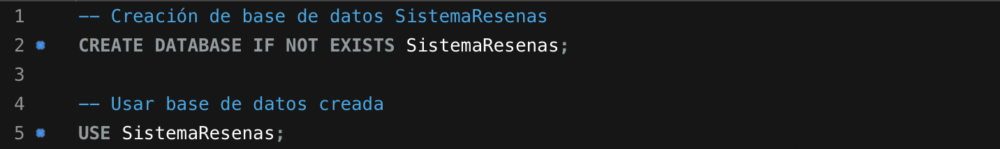
</p>

> [!NOTE]
> Estos comandos están siendo ejecutado a nivel local, en el puerto 3306.

Observe que la base de datos se llama `SistemaResenas`. 

### Creación de tablas

Posteriormente, es necesario crear tablas dentro de esta base de datos correspondientes a `Profesores`, `Cursos` y `Resenas`, que son los solicitados en el enunciado.

Respecto a la creación de la tabla `Profesores`, se tienen siguientes columnas planteadas:

<p align="center">
  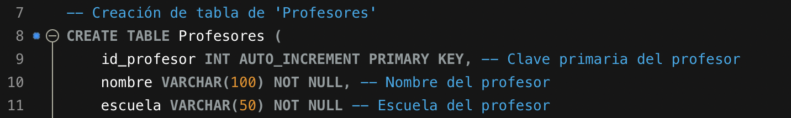
</p>

Se agregó como clave primaria `id_profesor` (identificador numérico del profesor), así como `nombre` y `escuela` que son columnas del tipo `VARCHAR` para guardar la información correspondiente al profesor. Ninguno de estos campos puede ser nulo, de ahí que se coloque `NOT NULL`.

En cuanto a la tabla `Cursos`, el comando de creación es el siguiente:

<p align="center">
  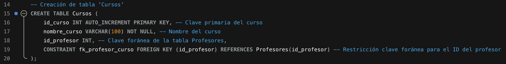
</p>

Observe que se agregó una clave primaria correspondiente al `id_curso` (identificador numérico del curso). Además, se colocó una columna para `nombre_curso` y una clave foránea para el `id_profesor`. De igual forma, ninguno de estos valores puede ser nulo.

Para la tabla de `Resenas`, se utilizó el comando a continuación:

<p align="center">
  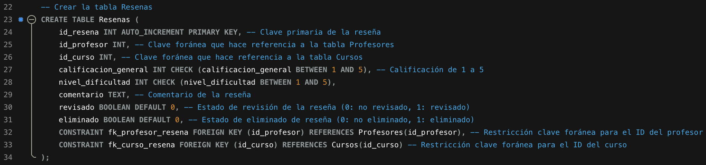
</p>

Nuevamente, se agregó una clave primaria correspondiente a `id_resena` (identificador numérico de la reseña). También, se requieren claves foráneas para `id_profesor` y `id_curso`.

Respecto a las demás columnas, se agregó `calificacion_general`, para la cual se debe verificar que la entrada esté entre 1 y 5 para ser agregada. Además, `nivel_dificultad` contiene la dificultad del curso, para el que se revisa también que se encuentre entre 1 y 5. Las reseñas poseen `comentario` en forma de texto y un booleano `revisado` para indicar si ha sido revisado o no.

Como columna extra, se añadió `eliminado`, la cual es utilizada cuáles registros han sido colocados como eliminados y así poder contabilizar las que han sido indicadas de esta forma. Es decir, la interpretación que se le dio a la consulta 6, consiste en que no se elimina del todo el registro de la tabla, se cambia su estado a eliminado para poder contar todas las reseñas eliminadas de un curso específico.

<p align="center">
  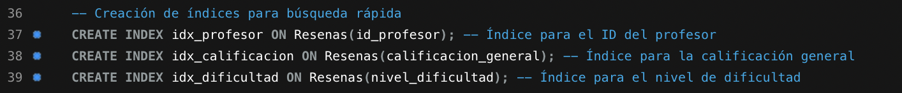
</p>

En la imagen anterior, se indica la creación de los índices para una búsqueda más rápida y eficiente para `id_profesor`, `calificacion_general` y `nivel_dificultad`, dentro de la tabla `Resenas`.

### Ingreso de los datos a las tablas

Con respecto al ingreso de los datos a las tablas para simular el funcionamiento del programa, se utilizaron los siguientes comandos:
 
<p align="center">
  
</p>

El comando anterior se encarga de añadir datos a la tabla `Profesores`, de tal forma que estos sean suficientes para determinar el correcto funcionamiento del programa. Se agregaron varios profesores para 3 escuelas.

<p align="center">
  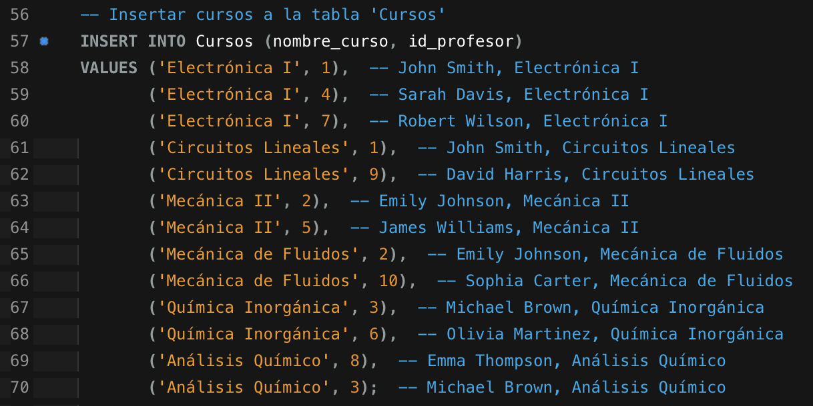
</p>

Este comando consistió en añadir datos a la tabla `Cursos`. Para este paso y el siguiente, se asume que los datos ingresados son correctos; es decir, que el curso realmente pertenece a la escuela para la que fue registrado y el profesor asociado sí imparte el curso.

<p align="center">
  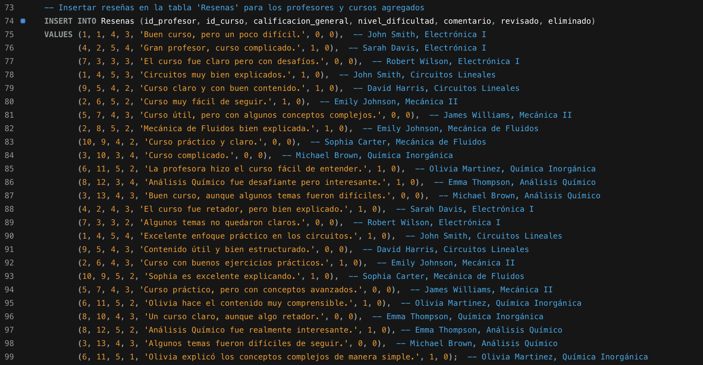
</p>

Finalmente, en la imagen anterior, se agregaron reseñas variadas para cada combinación de profesor-curso. Se procuró añadir suficientes para demostrar que el programa funciona. 

### Implementación de consultas

A continuación se muestra cómo se implementaron las consultas y su salida correspondiente.

#### 1. Filtrado por curso y escuela

Con respecto a la primera consulta requerida, correspondiente filtrar por curso y escuela para determinar los profesores que se encuentra en la base de datos, junto con su promedio de calificaciones. 

<p align="center">
  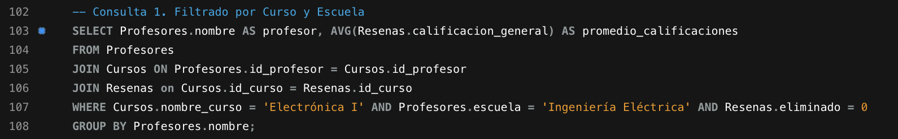
</p>

Se utilizó el comando mostrado en la imagen anterior. Este consiste en que se selecciona el nombre del profesor en la tabla `Profesores` y el promedio de la calificación general en la tabla `Resenas`. Se utilizan `JOIN` para unir los resultados que coincidan, de la tabla `Profesores` con el calificación de las reseñas (tabla `Resenas`) y el nombre del curso (tabla `Cursos`). Para obtener el resultado esperado con el promedio agrupado por profesor, se utiliza la indicación `GROUP BY Profesores.nombre`.

<p align="center">
  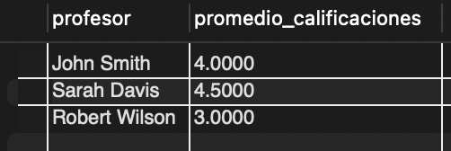
</p>

En el caso de la escuela de `Ingeniería Eléctrica` y el curso `Electrónica I`, se tuvo la siguiente información como salida. Se puede verificar manualmente que los cálculos son correctos y esos son los promedios ingresados a la tabla en las reseñas.

#### 2. Consulta y ordenamiento por calificación y dificultad

Como indica el inciso, se requiere ordenar los cursos de una escuela por calificación promedio en forma descendente y por dificultad promedio en forma ascendente. Para ello, se utiliza el comando a continuación:

<p align="center">
  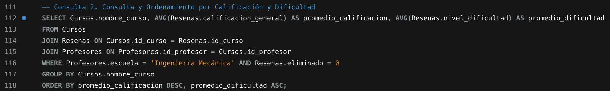
</p>

Se selecciona el nombre del curso, el promedio de calificación general (al agrupar por nombre del curso) y el promedio del nivel de dificultad (nuevamente al agrupar por curso). Se utiliza `JOIN` para unir las tablas basado en la coincidencia de `id_curso` y `id_profesor`. En el comando se buscó específicamente de la escuela de Ingeniería mecánica.

<p align="center">
  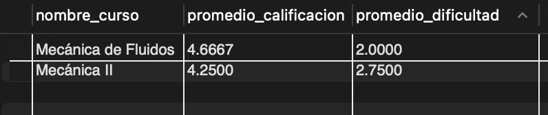
</p>

Se comprueba que la salida para los datos ingresados es efectivamente la obtenida y se muestra en la salida todos los datos solicitados.

#### 3. Búsqueda de reseñas no revisadas

Para buscar las reseñas no revisadas, se debe realizar un `SELECT` con condición de búsqueda de la variable booleana `Resenas.revisado = 0` (no revisado). Para esta selección de registros, se muestra el nombre del profesor, el nombre del curso y el comentario para ser valorado.

<p align="center">
  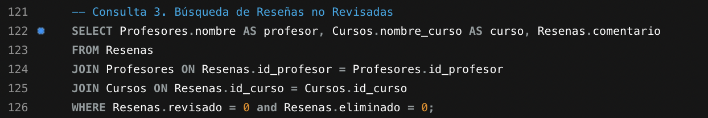
</p>

La salida del comando anterior, se muestra a continuación:

<p align="center">
  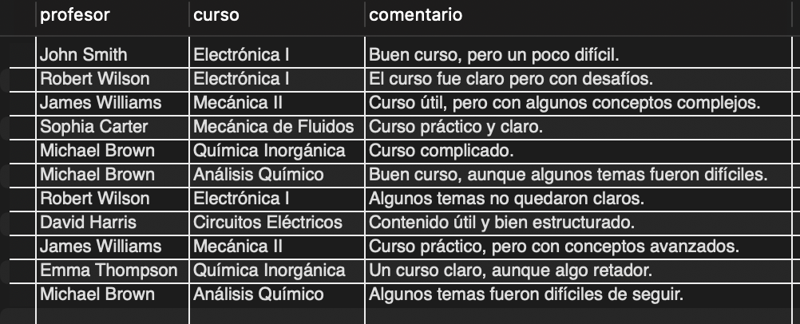
</p>

Observe que esto sirve como una interfaz para revisar los comentarios no revisados, pues muestra la información necesaria para hacerlo.

#### 4. Actualización de estado de reseñas

Vinculado con el punto anterior, esta consulta corresponde a la actualización del valor de estado de reseñas a `revisado` al proporcionar el ID de la reseña.

<p align="center">
  
</p>

En el comando anterior, se emplea un `SELECT` en la tabla `Resenas` y se coloca el índice de interés. Para efectos del ejercicio se utilizó la primera reseña. Observe en la siguiente imagen correspondiente a la salida del comando del punto 3 (no revisados), al ejecutar este comando previamente, no aparece `John Smith` de `Electrónica I` como no revisado.

<p align="center">
  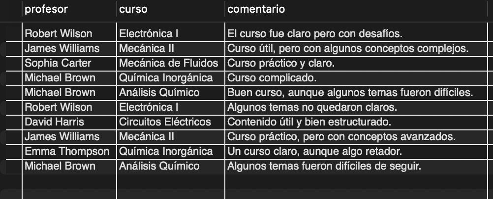
</p>

Por lo que, se cambió el estado de la reseña correctamente a partir de su ID.

#### 5. Consulta con filtración compleja y alias

La filtración requerida consiste en seleccionar el nombre del profesor, el curso, y el comentario
de las reseñas en las que la calificación general es mayor o igual a 4 y el nivel de dificultad es menor a 3. Se utilizan alias para identificar las columnas (`AS`).

<p align="center">
  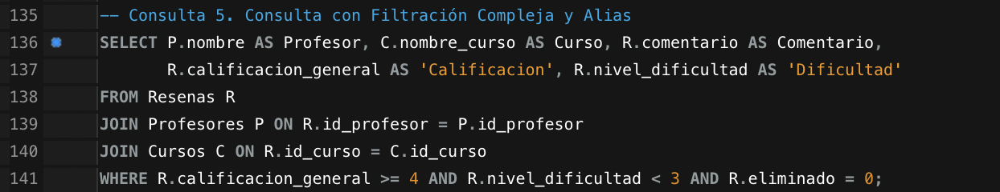
</p>

El comando anterior cumple con el requerimiento de búsqueda. Observe que se limita la calificación general de la tabla `Resenas` a que sea mayor o igual 4 y la dificultad menor a 3. Al igual que en comandos anteriores, se emplea `JOIN` para unir los resultados coincidentes de las tablas `Profesores`, `Resenas` y `Cursos`, por medio del `id_profesor` y `id_curso`.

La salida del comando se muestra a continuación y se verifica que efectivamente es la esperada, según los datos proporcionados.

<p align="center">
  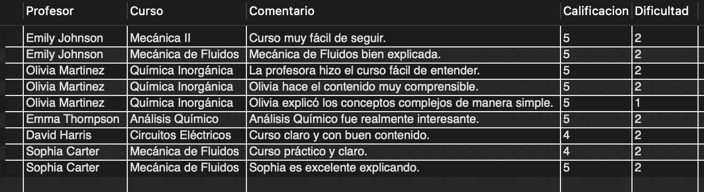
</p>

#### 6. Consulta para eliminar reseñas

En este comando se plantean dos soluciones, pero la que se utilizó finalmente es la segunda.

La primera solución corresponde al comando en la parte superior de la imagen, pues se realiza directamente un `DELETE` de la reseña que coincide con `id_resena`. Sin embargo, para contar la cantidad de reseñas eliminadas se debería implementar una lógica extra, pues de esta forma se están eliminando únicamente.

Por lo tanto, se decidió no eliminar totalmente la reseña. Se añadió la columna `eliminado` y cuando se selecciona esta opción, se actualiza el campo a verdadero. 

> [!NOTE]
> Por esta razón es que en las demás consultas se coloca `Resenas.eliminado = 0`, para asegurarse que los registros seleccionados no hayan sido eliminados.

Por lo tanto, para contabilizar las reseñas eliminadas de un curso específico (a partir de su nombre), se realiza un `SELECT` con un _subquery_ para determinar índice. 

<p align="center">
  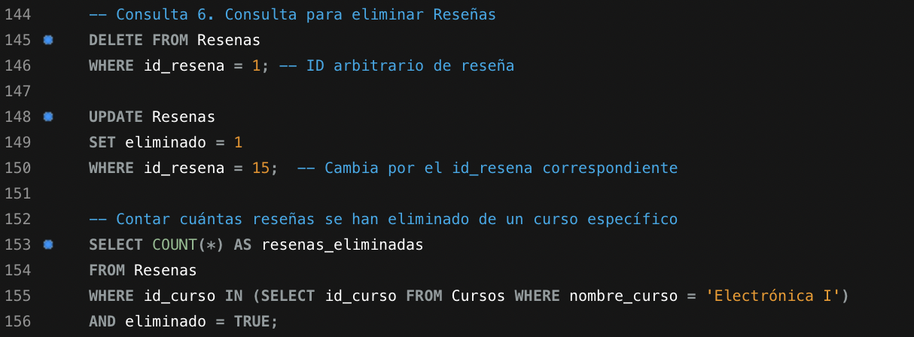
</p>

La salida al ejecutar el `SELECT` se muestra a continuación. Como únicamente se eliminó una, el resultado es correcto.

<p align="center">
  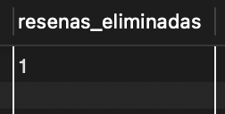
</p>


## Ejercicio 2: Sistema de Publicaciones en Red Social

El objetivo de este ejercicio corresponde a crear una aplicación en C++ para administrar las publicaciones y comentarios de una red social. Esta aplicación permite agregar, consultar, actualizar y eliminar publicaciones, almacenadas en una base de datos NoSQL en MongoDB, de forma local.

La estructura de cada publicación contiene `autor` (string), `contenido` (string), `fecha` (string), `comentarios` (array) y `destacada` (booleano para indicar si está destacada o no). De igual forma, la estructura de los comentarios contiene `usuario` (string), `comentario` (string) y `fechaComentario` (string).

Cada publicación está identificada por la combinación de autor y fecha, pues a partir de estos, es que se realizan operaciones de modificación de las publicaciones. Entonces, no pueden haber dos publicaciones con el mismo autor y fecha. Esto es verificado al insertar datos en la colección.

> [!NOTE]
> Observe que para las entradas que requieren una fecha, se implementaron expresiones regulares para validar su formato (YYYY-MM-DD).

Es importante destacar la validación de los datos para únicamente agregar información limpia a la base de datos y evitar generar errores.

Como se mencionó, se está trabajando con una instancia de MongoDB de forma local (`localhost`), específicamente en la base de datos `social_network` y la colección `posts`.

> [!IMPORTANT]
> Si desea revisar la documentación de las funciones creadas, revise la documentación en Doxygen colocada al inicio del README.


### Demostración de ejecución

A continuación se muestra un ejemplo de cómo se comporta el programa en diferentes situaciones dependiendo de las entradas del usuario.

Inicialmente, se muestra un ejemplo de la compilación, el cual se realiza correctamente. Posteriormente, se realiza la inserción de publicaciones a la colección `posts`.

<p align="center">
  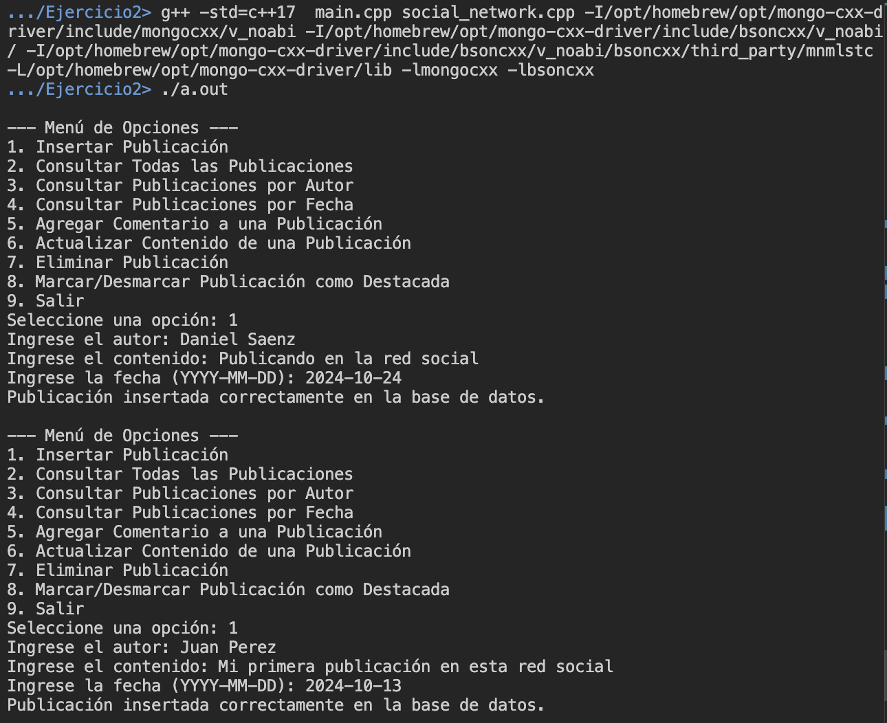
</p>

Después, se realizan consultas a la base de datos. Además de los datos agregados, también se encuentra una publicación del usuario `D` realizada previamente (para evidenciar que los datos al terminar el programa sí se almacenan bien). Entonces al mostrar todas las publicaciones, se muestran las 3 publicaciones, con su autor, fecha y contenido.

<p align="center">
  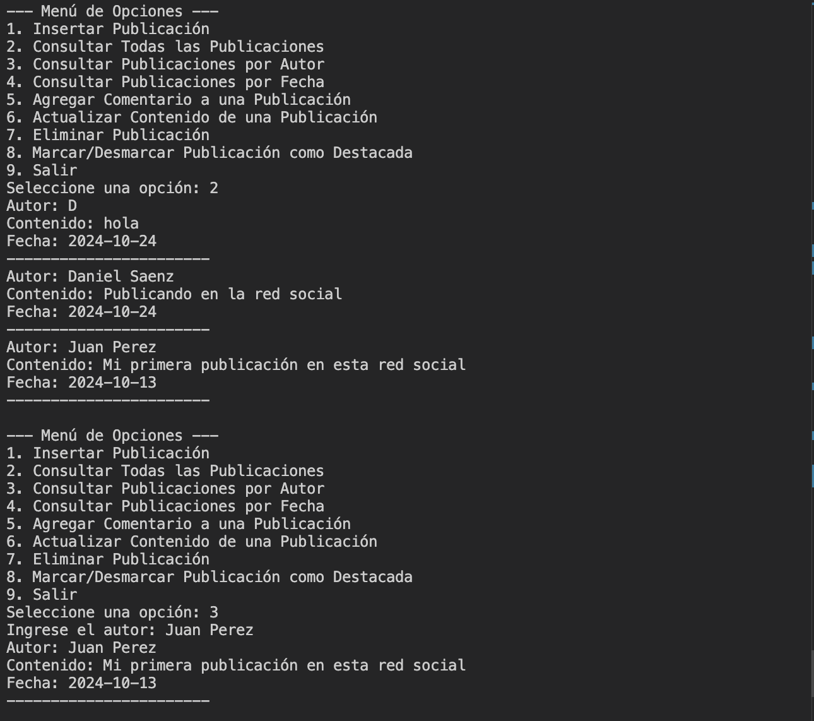
</p>

También se tiene la consulta de fecha cronológicamente, la cual se muestra a continuación. Es importante mencionar que esto funciona por el arreglo que se tiene para las fechas en el formato YYYY-MM-DD, pues ordena por año, mes y día respectivamente. Entonces los resultados mostrados son los esperados cronológicamente, a partir de los más recientes.

<p align="center">
  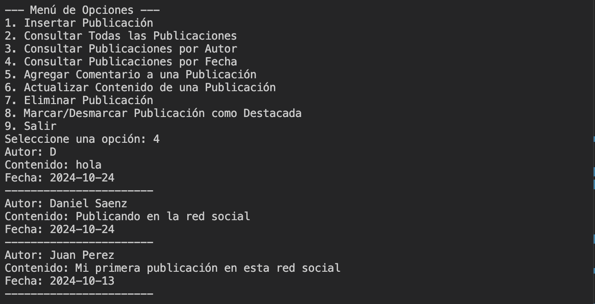
</p>

En cuanto a los comentarios, se agrega uno a la publicación de `Juan Perez`, como en el enunciado. A continuación se muestra el resultado de la actualización para agregarlo:

<p align="center">
  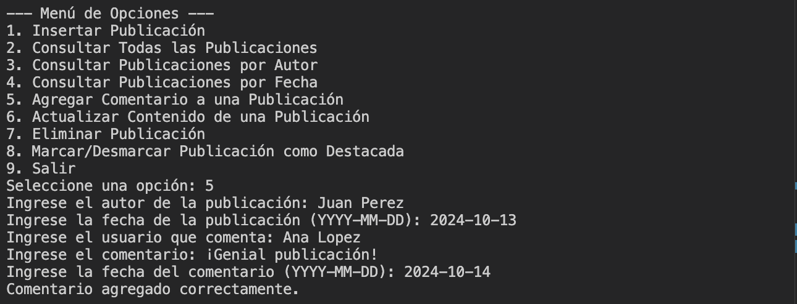
</p>

También se encuentra la funcionalidad de eliminar publicaciones, a partir del autor y fecha de la publicación. En la siguiente se muestra la eliminación de la publicación del usuario `D`:

<p align="center">
  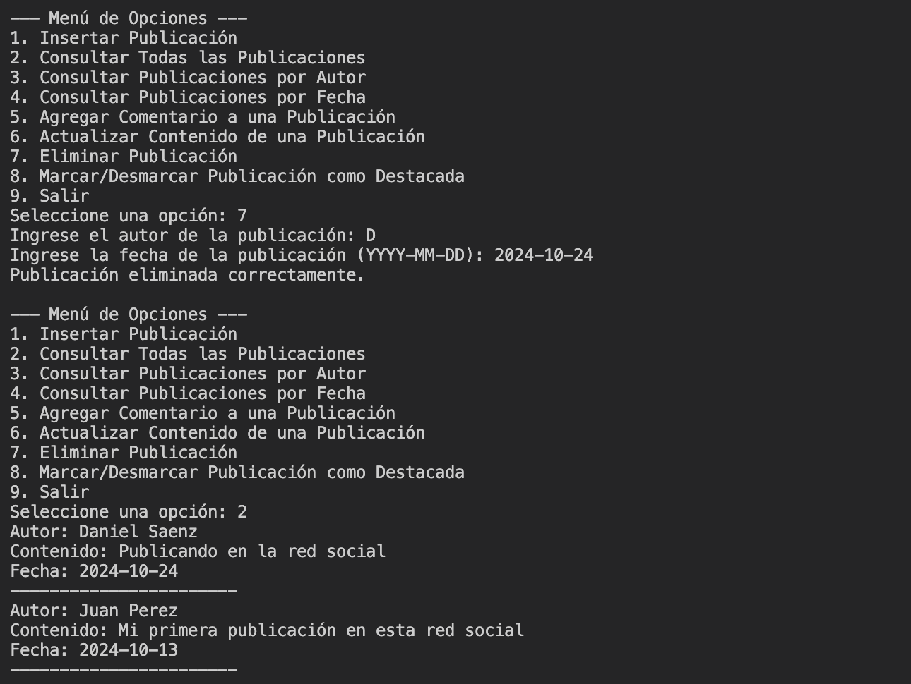
</p>

Para destacar o quitar el destacado de publicaciones, se utiliza la opción 8 del menú. Esta abre un submenú que contiene solicita el ingreso de los datos y muestra una opción para indicar si se coloca la publicación como destacada (`1`) o desmarcarla (`0`).

<p align="center">
  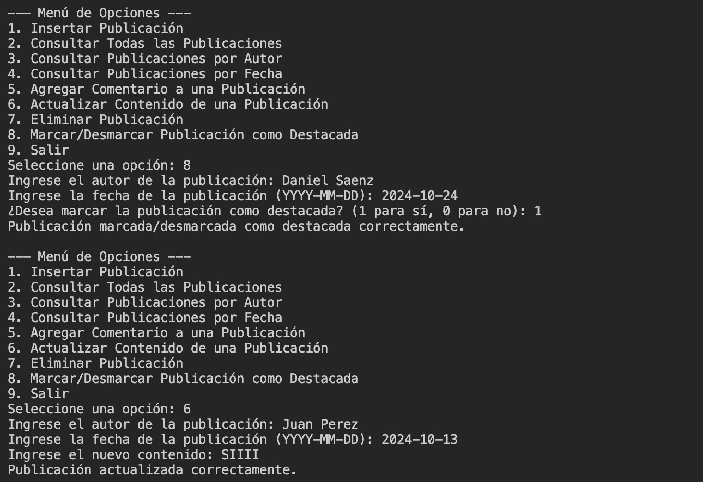
</p>

Como ejemplo de la validación de datos de ingreso para consultar la base de datos, se ingresa una fecha inválida (formato incorrecto). Se indica que es inválida y no se procede con el ingreso de la publicación a continuación:

<p align="center">
  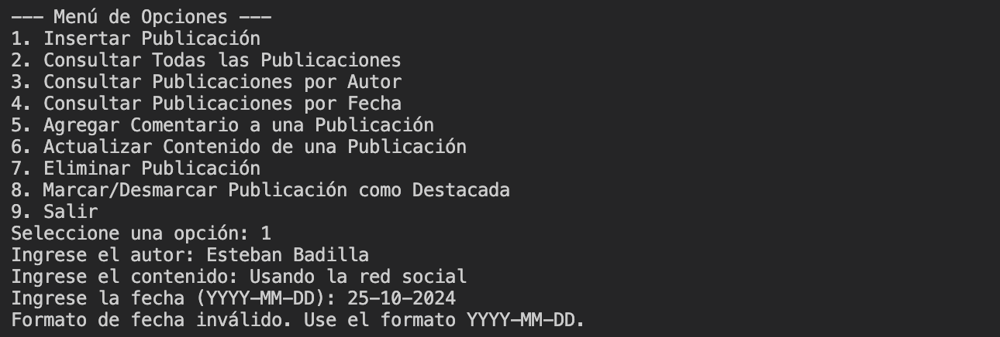
</p>