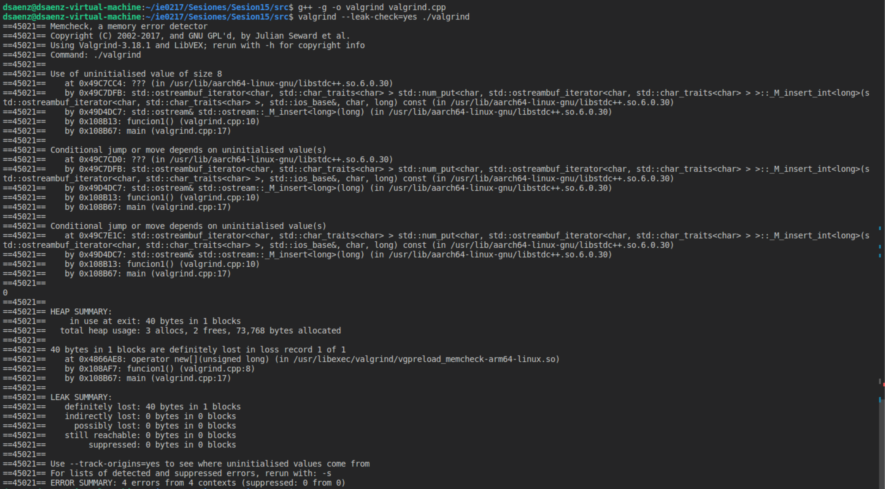

# Tarea 6

El presente directorio corresponde a la __Tarea 6__ del curso IE0217 - Estructuras Abstractas de Datos y Algoritmos para Ingeniería.

Se compone de los siguientes elementos:

- Parte teórica
- Sistema de Administración de Solicitudes en Paralelo
- Depuración Completa de Código en C++ con GDB, Valgrind y Sanitizers.

## Documentación

La documentación en Doxygen correspondiente a la presente asignación fue alojada en el siguiente sitio web de Netlify [Tarea 6 IE0217](https://tarea6-ie0217.netlify.app). 

Acceda a `Archivos -> Lista de Archivos` para encontrar la documentación por archivo de cada uno de los ejercicios.

## Modo de uso

En esta sección, se describe la forma de compilar y ejecutar el código correspondiente a la tarea en cuestión.

Se configuró un archivo Makefile para simplificar el proceso de compilación y ejecución.

> [!IMPORTANT]
> Asegúrese de estar en el presente directorio `ie0217/Tareas/Tarea6/`

Para la compilación, se solicitaba en el enunciado que se realizara los dos programas seguidos. Para ello, se utiliza el comando:

```shell
make
```

> [!NOTE]
> Aparte de la compilación, también se ejecutan los programas uno tras otro.

Si se desea ejecutar únicamente el Ejercicio1, utilice el comando:

```shell
make run1
```

Respecto al Ejercicio2, se utiliza:

```shell
make run2
```

Para eliminar los archivos ejecutables resultantes en el directorio `build`, ejecute:

```shell
make clean
```

> [!NOTE]
> El Ejercicio2 posee diferentes requeridos para utilizar las herramientas de _debugging_ solicitadas. Para ello, diríjase a la sección del Ejercicio2 en la descripción de los resultados.

## Parte teórica

### 1. ¿Cuál es la diferencia entre un proceso y un hilo en programación? Mencione diferencias en el uso de memoria, tres características importantes de los procesos y tres características importantes de los hilos.

Un proceso es una instancia de un programa en ejecución que opera de forma independiente y cuenta con su propio espacio de memoria. Por el contrario, un hilo (o subproceso) es la unidad más pequeña de ejecución dentro de un proceso y comparte el mismo espacio de memoria con otros hilos en el mismo proceso.

- __Diferencias en el uso de memoria__

Cada proceso tiene su propio espacio de memoria aislado, lo cual permite mayor seguridad y evita que los procesos interfieran entre sí. Sin embargo, este aislamiento implica un mayor consumo de recursos.

Los hilos comparten el espacio de memoria del proceso padre, lo que permite una comunicación rápida y un menor uso de memoria, pero aumenta el riesgo de errores de sincronización y de interferencia entre hilos.

- __Tres características importantes de los procesos__
    - _Aislamiento_: Cada proceso es independiente, lo que evita que uno afecte directamente el espacio de memoria de otro, aumentando la seguridad.
    - _Coste de creación_: Crear y destruir un proceso es más costoso en términos de tiempo y recursos que realizar estas operaciones con hilos.
    - _Comunicación_: La comunicación entre procesos es más compleja, usualmente realizada mediante mecanismos como pipes, sockets o memoria compartida.

- __Tres características importantes de los hilos__
    - _Compartición de memoria_: Los hilos comparten el mismo espacio de memoria, lo que facilita la comunicación directa y eficiente entre ellos.
    - _Coste de de creación_: Crear y gestionar hilos es menos costoso y más rápido en comparación con los procesos, lo cual permite una mayor eficiencia en operaciones concurrentes.
    - _Comunicación_: Al compartir el mismo espacio de memoria, es necesario utilizar mecanismos de sincronización, como mutex o semáforos, para evitar condiciones de carrera y errores de concurrencia.

### 2. ¿Qué es la multitarea? ¿Se realiza de manera paralela o concurrente?

La __multitarea__ es la capacidad de un sistema operativo para ejecutar múltiples tareas (procesos) de forma concurrente, asignando a cada tarea un intervalo de tiempo (_quantum_) y alternando entre ellas rápidamente para dar la impresión de que se ejecutan simultáneamente (_context switching_). Este enfoque permite optimizar la utilización de la CPU y mejorar la capacidad de respuesta del sistema.

En sistemas de un sólo núcleo, la multitarea se realiza de manera concurrente porque las tareas se alternan en lugar de ejecutarse al mismo tiempo. Sin embargo, en sistemas multinúcleo, ciertas tareas pueden ejecutarse en paralelo, asignando cada núcleo a una tarea distinta.

1) <ins>Proporcione un ejemplo de uso de multitarea.</ins>

Un escenario de ejemplo de multitarea es cuando un usuario utiliza un navegador web, un editor de texto y un reproductor de música simultáneamente en su computadora. El sistema operativo intercala la ejecución de cada aplicación. Permite al usuario cambiar entre ellas sin interrupciones perceptibles, aunque sólo una tarea esté activa en cada momento en sistemas de un sólo núcleo​.

2)  <ins>Mencione qué mecanismos de comunicación se usan comúnmente en la multitarea.</ins>

La multitarea utiliza mecanismos de comunicación interprocesos (IPC) para permitir que los procesos independientes intercambien información de manera segura. Algunos mecanismos comunes son:

- __Pipes__: Canales unidireccionales que transmiten datos de un proceso a otro.
- __Sockets__: Canales bidireccionales, especialmente útiles para la comunicación entre procesos en diferentes dispositivos o redes.
- __Memoria compartida__: Un área de memoria accesible por varios procesos, que requiere mecanismos de sincronización (como semáforos) para evitar conflictos.

### 3. Explique cómo se genera un proceso paralelo en una computadora.

Para generar un __proceso paralelo__ en una computadora, el sistema operativo debe disponer de múltiples núcleos en la CPU o de múltiples procesadores. En este caso, cada núcleo puede ejecutar una tarea de manera independiente y simultánea.

1. <ins>¿Cómo se dividen las tareas para ser ejecutadas en paralelo?</ins>

En muchos casos, el programa se divide en subtareas o subprocesos independientes que pueden ejecutarse de forma simultánea. Un enfoque común es el modelo de __memoria compartida__, donde los hilos comparten el mismo espacio de memoria y acceden a datos comunes, sincronizándose mediante `mutex` o semáforos para evitar conflictos.

Otro modelo es el modelo de __paso de mensajes__, en el cual cada subproceso tiene su memoria independiente y se comunican a través de mensajes (en arquitecturas de memoria distribuida).

2. <ins>¿Qué factores afectan la eficiencia de los procesos paralelos?</ins>

- __Número de núcleos o procesadores__: La cantidad de núcleos disponibles afecta la cantidad de tareas que pueden ejecutarse simultáneamente.

- __Granularidad de las tareas__: Tareas pequeñas pueden ralentizar el proceso por cambios de contexto excesivo, mientras que las tareas grandes pueden no aprovechar completamente los recursos.

- __Sincronización y contención__: Los mecanismos de sincronización, como `mutex` y semáforos, pueden introducir esperas cuando varios hilos intentan acceder a los mismos recursos, lo cual reduce significativamente la eficiencia.

- __Acceso a memoria__: En un entorno de memoria compartida, los conflictos de memoria pueden ralentizar el proceso, mientras que, en memoria distribuida la comunicación entre nodos puede afectar la velocidad.

### 4. ¿Cómo funcionan las tareas concurrentes?

Las tareas concurrentes funcionan al permitir que múltiples tareas avancen de manera intercalada en un sistema (_context-switching_). Aunque no se ejecutan estrictamente al mismo tiempo, el sistema operativo alterna entre tareas rápidamente.

1. <ins>¿Qué mecanismos de sincronización se utilizan para coordinar las tareas concurrentes?</ins>

- __Mutex (exclusión mutua)__: Permite que solo un hilo acceda a una sección crítica a la vez, al bloquear a otros hasta que el recurso esté disponible.

- __Semáforos__: Controlan el acceso a un número limitado de recursos compartidos mediante un contador; permite que varios hilos ingresen a la sección crítica hasta un límite especificado.

- __Variables de condición (CV)__: Permiten que un hilo espere hasta que otro hilo notifique un cambio de estado específico, lo cual facilita la coordinación de eventos.

- __Barreras__: Sirven para sincronizar grupos de hilos, haciendo que esperen hasta que todos alcancen un punto de ejecución común antes de continuar.

2. <ins>Mencione los desafíos más comunes de la programación concurrente.</ins>

- __Condiciones de carrera__: Ocurren cuando múltiples hilos intentar acceder a la misma memoria simultáneamente sin sincronización adecuada, lo que puede resultar en datos inconsistentes y comportamientos impredecibles.

- __Deadlocks__: Se producen cuando dos o más hilos se bloquean mutuamente al esperar recursos que el otro posee, así se crea un ciclo sin salida.

- __Eficiencia y overhead de sincronización__: El uso excesivo de mecanismos de sincronización puede reducir la eficiencia de la aplicación, pues los hilos pasan tiempo esperando en lugar de ejecutar tareas.

- __Dificultad en la depuración__: Los errores en programación concurrente son difíciles de reproducir y depurar debido a la naturaleza no determinista de la ejecución concurrente. Por lo que, algunos errores sólo aparezcan en condiciones específicas​.

### 5. Mencione las diferencias entre un multinúcleo y un multiprocesador.

Un __multinúcleo__ es un sólo chip de CPU con múltiples núcleos de procesamiento que comparten recursos como la memoria caché. Permite paralelismo verdadero en un sólo procesador al ejecutar múltiples hilos simultáneamente. Cada núcleo ejecuta instrucciones de forma independiente de los demás. 

Un __multiprocesador__ es un sistema con varios chips de CPU, donde cada uno puede tener uno o más núcleos. Es recomendable para sistemas que requieren alta capacidad de procesamiento y permite una mayor escalabilidad al distribuir la carga entre varios procesadores​.

### 6. Mencione las diferencias entre memoria compartida y distribuida.

La __memoria compartida__ es una arquitectura en la que múltiples núcleos o procesadores acceden al mismo espacio de memoria física, lo cual facilita la comunicación directa entre hilos o procesos mediante variables compartidas. Sin embargo, requiere mecanismos de sincronización, como `mutex` o semáforos, para evitar condiciones de carrera y garantizar la coherencia de los datos.

En cambio, la __memoria distribuida__ asigna a cada procesador o nodo su propia memoria local, sin compartirla físicamente con otros. La comunicación entre nodos se realiza a través de mensajes, lo que permite una alta escalabilidad pero introduce latencia en la comunicación. Es común en sistemas de computación en clústeres y supercomputadoras​.

### 7. ¿Qué es una condición de carrera y qué problemas podría implicar en un sistema concurrente?

Una __condición de carrera__ es una situación en la programación concurrente en la que dos o más hilos o procesos acceden a un recurso compartido al mismo tiempo, y al menos uno de ellos realiza una operación de escritura. Esto provoca resultados impredecibles y no deseados, debido a que el orden de ejecución afecta el estado final del recurso compartido.

Pueden generar errores como los que se muestran a continuación:
- Resultados incorrectos.
- Comportamiento no determinista.
- _Segfaults_.
- Vulnerabilidades de seguridad.

### 8. Explique tres mecanismos utilizados para evitar condiciones de carrera en memoria compartida.

- __`std::mutex`__: Herramienta de sincronización que permite que solo un hilo acceda a una sección crítica a la vez.
- __Semáforos__: Contadores que controlan el acceso a recursos compartidos, al permitir que un número limitado de hilos entre en una sección crítica.
- __Variables de condición__: Permiten que un hilo espere hasta que otro hilo señale (notifique) que una condición particular se ha cumplido.

1. <ins>Proporcione un ejemplo en C++ de la implementación de uno de estos mecanismos.</ins>

```cpp
#include <iostream>
#include <thread>
#include <mutex>

std::mutex mtx; // Mutex para proteger el acceso a contador
int contador = 0;

void incrementar() {
    for (int i = 0; i < 1000; ++i) {
        std::lock_guard<std::mutex> lock(mtx); // Bloquear el mutex
        ++contador; // Sección crítica
    } // El mutex se libera automáticamente al salir de este bloque
}

int main() {
    std::thread hilo1(incrementar);
    std::thread hilo2(incrementar);

    hilo1.join();
    hilo2.join();

    std::cout << "Valor final del contador: " << contador << std::endl;
    return 0;
}
```

En el bloque anterior, se utiliza `std::mutex` y `std::lock_guard` para proteger el acceso de la variable `contador` por dos hilos simultáneamente y así, producir condiciones de carrera.

### 9. Mencione las diferencias entre un modelo de memoria compartida y uno de paso de mensajes.

En el __modelo de memoria compartida__, varios hilos o procesos comparten un espacio de memoria común y pueden comunicarse al acceder directamente a variables compartidas. Este modelo permite una comunicación rápida, pero requiere mecanismos de sincronización, como `mutex` y semáforos, para evitar condiciones de carrera.

El __modelo de paso de mensajes__ asigna a cada proceso su propia memoria local y no permite el acceso directo de otros procesos a esta memoria. La comunicación se realiza mediante el envío y recepción de _mensajes_, lo cual evita la necesidad de sincronización compleja, pero introduce latencia y sobrecarga debido al paso de mensajes.

### 10. Explique cuatro mecanismos de sincronización comunes y cómo se implementan en C++.

- __Mutex__: Un `mutex` asegura que sólo un hilo pueda acceder a una sección crítica a la vez, así evita condiciones de carrera. En C++, se utiliza `std::mutex` y se bloquea mediante `lock()` o `std::lock_guard` para asegurar el desbloqueo automático.

```cpp
#include <mutex>

std::mutex mtx; // Declaración del mutex

void bloqueo() {
    std::lock_guard<std::mutex> lock(mtx);
    // Sección crítica
}
```

- __Semáforos__: Contadores que controlan el acceso a un recurso compartido, al permitir que hasta un número definido de hilos ingresen a la sección crítica. A partir de C++20, se utilizan con `std::counting_semaphore`.

```cpp
#include <semaphore>

std::counting_semaphore<3> sem(3); // Permite hasta 3 hilos simultáneos

void semaforo() {
    sem.acquire(); // Adquiere acceso
    // Sección crítica
    sem.release(); // Libera acceso
}
```

- __Variables de condición__: Permiten que un hilo espere hasta que otro hilo le notifique que una condición específica se ha cumplido; se sincroniza la ejecución basada en eventos. En C++, se utilizan `std::condition_variable` junto con `std::unique_lock`.

```cpp
#include <condition_variable>

std::condition_variable cv;
std::mutex mtx;
bool listo = false;

void esperar() {
    std::unique_lock<std::mutex> lock(mtx);
    cv.wait(lock, [] { return listo; });
    // Continúa cuando listo es true
}

void notificar() {
    std::lock_guard<std::mutex> lock(mtx);
    listo = true;
    cv.notify_one(); // Despierta a un hilo esperando
}
```

- __Barreras de sincronización__: Permiten que un grupo de hilos espere hasta que todos hayan alcanzado un punto específico antes de continuar. A partir de C++20, se utiliza `std::barrier`.

```cpp
#include <barrier>
std::barrier barrera(3); // Espera a que 3 hilos lleguen

void tarea() {
    // Realiza el trabajo
    barrera.arrive_and_wait(); // Espera al resto de hilos
    // Continúa después de que todos los hilos han llegado
}
```

### 11. ¿Cuáles son los costos de administración y creación de hilos?

- __Tiempo de creación__: Crear un hilo implica reservar memoria, asignar un identificador y configurar el contexto de ejecución, lo cual consume tiempo y recursos.

- __Cambio de contexto (_context switching_)__: Cambiar de un hilo a otro requiere guardar el estado del hilo saliente y cargar el del hilo entrante. Este proceso genera overhead y puede reducir la eficiencia de la CPU.

- __Sincronización__: Los mecanismos de sincronización, como mutex y semáforos, introducen tiempos de espera cuando los hilos compiten por acceder a los mismos recursos, lo cual afecta el rendimiento general.

1. <ins>Mencione los recursos del sistema involucrados.</ins>

- __CPU__: Procesa cada hilo y realiza cambios de contexto, lo que afecta la carga y el rendimiento de la CPU.

- __Memoria__: Cada hilo requiere una pila (_stack_) y estructuras de control, lo que consume memoria y puede llevar al agotamiento en sistemas con recursos limitados.

- __Entrada/Salida (I/O)__: Hilos que realizan operaciones de I/O pueden experimentar tiempos de espera, afectando el rendimiento de otros hilos en el sistema.

2. <ins>¿Qué estrategias usaría para optimizar el rendimiento de los hilos?</ins>

- __Ajustar el número de hilos__: Adaptar el número de hilos al número de núcleos de la CPU evita sobrecargar el sistema y mejora la eficiencia.

- __Optimizar la granularidad de las tareas__: Encontrar un equilibrio en el tamaño de las tareas asignadas a los hilos evita el overhead excesivo de administración y cambio de contexto.

- __Reducir el uso de sincronización__: Minimizar la necesidad de sincronización mediante el diseño cuidadoso de las estructuras de datos compartidas reduce la contención.

- __Utilizar herramientas de perfilado__: Monitorear el comportamiento de los hilos en tiempo real permite identificar cuellos de botella y ajustar la configuración para mejorar el rendimiento​.

### 12. ¿Cuáles son las ventajas de utilizar una herramienta de depuración al desarrollar un código?

- __Identificación precisa de errores__: Las herramientas de depuración permiten detectar errores específicos en tiempo real, como accesos a memoria no inicializada o desbordamientos de buffer.

- __Control de la ejecución__: Con comandos como _breakpoints_, _step over_, _step into_ y _step out_, se puede pausar y controlar el flujo del programa en puntos críticos. Esto facilita la inspección detallada del comportamiento del código en cada etapa.

- __Inspección y modificación de variables__: Durante la depuración, se puede observar el estado de las variables y modificarlas para probar diferentes escenarios. Esto ayuda a entender el estado actual del programa y a validar que las variables se comporten como se espera.

- __Análisis del Call Stack__: Permite visualizar la secuencia de funciones que llevaron al punto actual de ejecución, lo cual proporciona una visión clara del flujo del programa.

- __Mejora de la calidad y mantenimiento del código__: Ayuda a asegurar que el código sea más consistente y fiable. Esto también facilita el mantenimiento, pues el código depurado y limpio es más comprensible y escalable.


### 13. ¿Qué es un breakpoint y cómo se utilizan en un entorno de depuración?

Un __breakpoint__ es un marcador establecido en una línea específica del código que pausa la ejecución del programa en ese punto durante la depuración. Esto permite al desarrollador inspeccionar el estado del programa, verificar valores de variables, analizar el flujo de ejecución y diagnosticar problemas en tiempo real.

En el caso de `gdb`, se utiliza el comando a continuación:

```shell
(gdb) break main.cpp:12
```

> [!NOTE]
> Se coloca un breakpoint en la línea 12 del archivo `main.cpp`

### 14. ¿Qué es el _stepping_ en depuración y qué tipos existen?

El __stepping__ en depuración es el proceso de avanzar en la ejecución del programa línea por línea, lo cual permite al desarrollador observar detalladamente el comportamiento del código y el flujo de ejecución.

1. <ins>Explique cuándo usaría cada uno de los tipos de stepping (`step over`, `step into`, `step out`).</ins>

Los principales tipos de _stepping_ se describen a continuación

- __`step over`__: Ejecuta la línea actual y avanza a la siguiente sin entrar en ninguna función llamada en esa línea. Resulta útil cuando el desarrollador quiere avanzar rápidamente sobre el código y no necesita inspeccionar el interior de las funciones llamadas.

- __`step into`__: Avanza en la ejecución entrando en cualquier función llamada en la línea actual. Esto permite inspeccionar el comportamiento interno de la función.

- __`step out`__: Continúa la ejecución hasta que la función actual retorne (salir del ámbito de la función), y vuelve al punto de llamada. Esto es útil cuando se está dentro de una función y se quiere salir rápidamente.

### 15. Mencione y explique cinco comandos comunes de GNU Debugger (`GDB`).

- __`run`__: Este comando inicia la ejecución del programa dentro de `gdb`.

- __`break`__: Establece un punto de interrupción en una línea o función específica del código.

- __`next`__: Ejecuta la siguiente línea de código sin entrar en funciones llamadas en esa línea (similar a `step over`).

- __`step`__: Ejecuta la siguiente línea de código y, si hay una función llamada en esa línea, entra en la función (similar a `step into`).

- __`print`__: Muestra el valor de una variable o expresión en el punto actual de ejecución.

### 16. ¿Qué es Valgrind y por qué es conveniente usarlo durante la depuración?

__Valgrind__ es un marco de herramientas para el análisis de programas que permite detectar errores relacionados con la gestión de memoria y problemas de concurrencia. Es esencial para asegurar la estabilidad y eficiencia del programa.

- Detección de fugas de memoria.
- Errores en el acceso a memoria.
- Facilita la depuración en programas multihilo (con `Helgrind`).

1. <ins>¿Qué es la herramienta Memcheck y para qué se utiliza?</ins>

__Memcheck__ corresponde a la herramienta principal de Valgrind para la detección de errores de memoria. Su función es monitorear todas las operaciones de memoria en un programa, asegurándose de que no se acceda a memoria no inicializada, que no se lea ni escriba fuera de los límites de los bloques de memoria asignados, y que no se libere memoria más de una vez.

### 17. Explique cómo se utilizan `AddressSanitizer` y `ThreadSanitizer`.

`AddressSanitizer` y `ThreadSanitizer` son herramientas de detección de errores (sanitizers) que ayudan a identificar problemas comunes en el manejo de memoria y concurrencia en programas C y C++. 

En cuanto a `AddressSanitizer`, consiste en una herramienta que detecta errores de memoria en tiempo de ejecución. Se activa al compilar el código con el flag `-fsanitize=address`.

Ahora, respecto a `ThreadSanitizer`, está enfocado en detectar problemas de concurrencia, especialmente útil en programas multihilo. Entonces, `TSan` monitorea el acceso a memoria compartida y la sincronización entre hilos.

1. <ins>¿Qué tipos de errores puede detectar AddressSanitizer?</ins>

- __Acceso fuera de límites del heap (_heap-buffer-overflow_)__: Detecta cuando un programa intenta leer o escribir fuera de los límites de un array en el heap.
- __Acceso fuera de límites del stack (_stack-buffer-overflow_)__: Identifica errores similares en arrays ubicados en el stack.
- __Use-after-free__: Detecta cuando el programa intenta acceder a memoria que ya ha sido liberada.
- __Use-after-scope__: Identifica el uso de variables locales que ya han salido del ámbito.
- __Double-free y free inválido__: Detecta cuando se intenta liberar la misma memoria dos veces o liberar punteros inválidos​.

2. <ins>¿Qué tipos de errores puede detectar ThreadSanitizer?</ins>

- __Condiciones de carrera (_data races_)__: Detecta accesos concurrentes a una misma variable sin la sincronización adecuada, donde al menos uno de los accesos es de escritura.
- __Uso incorrecto de mutex__: Identifica problemas de sincronización con mutex, como intentos de desbloquear mutex que no están bloqueados.
- __Errores de sincronización entre hilos__: Detecta problemas en el orden de ejecución de hilos que pueden llevar a comportamientos impredecibles.

### 18. ¿Cuál es la diferencia entre paralelismo a nivel de datos y paralelismo a nivel de tareas?
1. <ins>Proporcione un ejemplo para cada tipo de paralelismo.</ins>

- __Paralelismo a nivel de datos__: Un conjunto de instrucciones se aplica simultáneamente a diferentes partes de un conjunto de datos. Es útil cuando se necesita procesar grandes volúmenes de datos de manera uniforme.
    - _Ejemplo_: Al aplicar un filtro en el procesamiento de imágenes, cada núcleo aplica el filtro a un fragmento específico.

- __Paralelismo a nivel de tareas__: Diferentes tareas o funciones se ejecutan en paralelo. Cada tarea realiza una operación distinta; es adecuado cuando el trabajo puede dividirse en partes independientes con diferentes operaciones.
    - _Ejemplo_: El funcionamiento de un servidor web, pues diferentes tareas como recibir solicitudes, procesar datos, consultar una base de datos y enviar respuestas se pueden ejecutar en paralelo.

### 19. ¿Qué es el balanceo de carga en un sistema paralelo y cómo afecta al rendimiento del sistema?

El __balanceo de carga__ en un sistema paralelo es el proceso de distribuir el trabajo de manera equitativa entre los procesadores o núcleos disponibles, de modo que todos trabajen al máximo de su capacidad. Un buen balanceo de carga asegura que ningún procesador esté sobrecargado mientras otros están inactivos, optimizando así el rendimiento general del sistema.

1. <ins>Explique diferentes estrategias de balanceo de carga.</ins>

- __Estática__: En el balanceo de carga estático, las tareas se distribuyen antes de iniciar la ejecución y no cambian en tiempo de ejecución.

- __Dinámica__: En el balanceo de carga dinámico, las tareas se asignan en tiempo de ejecución según la disponibilidad de los recursos. 

- __Distribuido__: En esta estrategia, cada procesador toma decisiones sobre cómo distribuir las tareas entre sí, sin una centralización de control.

- __Centralizado__: En el balanceo centralizado, un nodo maestro asigna tareas a los demás procesadores

2. <ins>¿Cómo puede un mal balanceo afectar la eficiencia de un programa paralelo?</ins>

Un mal balanceo de carga provoca que algunos procesadores estén sobrecargados mientras otros permanecen inactivos o subutilizados. Esto puede llevar a varios problemas, como los que se muestran a continuación:

- __Baja eficiencia__: El tiempo de ejecución total estará determinado por el procesador más lento, lo que limita el rendimiento general del sistema.

- __Desperdicio de recursos__: Los procesadores o núcleos inactivos no contribuyen al procesamiento, desperdiciando recursos que podrían ser utilizados para acelerar la tarea.

- __Aumento de la latencia__: Las tareas demorarán más tiempo en completarse, lo que afecta la velocidad y capacidad de respuesta del programa.

### 20. Explique la importancia del orden de ejecución de los hilos en un sistema concurrente.

El orden de ejecución de los hilos en un sistema concurrente es fundamental porque determina cómo y cuándo acceden los hilos a los recursos compartidos.

Sin una gestión adecuada, la ejecución concurrente puede causar conflictos, inconsistencias y errores, debido a que los hilos pueden interferir entre sí, especialmente al modificar datos compartidos. Un orden de ejecución controlado garantiza que las operaciones críticas se realicen de manera secuencial y sin interferencias, lo cual permite integridad de los datos y el comportamiento correcto del sistema.

1. <ins>¿Qué tipo de errores pueden surgir si el orden de ejecución no se gestiona correctamente?</ins>

Si no se gestiona correctamente el orden de ejecución, pueden ocurrir los siguientes errores:

- Condiciones de carrera.
- _Deadlocks_.
- Comportamiento no determinista.

2. <ins>Proporcione un ejemplo de cómo un error en el orden de ejecución puede causar un comportamiento inesperado.</ins>

En un sistema bancario donde dos hilos realizan operaciones en la misma cuenta de usuario. El primer hilo resta $100 de la cuenta, y el segundo agrega $50. Si ambos hilos acceden y modifican el saldo al mismo tiempo sin sincronización, el saldo final podría calcularse incorrectamente, pues ambos pueden realizar la lectura de $500 antes de modificar.

Entonces, se pueden dar condiciones de carrera, donde el saldo final no sea $450. Puede producirse un resultado de $400 o $550, por ejemplo.

### 21. ¿Qué es una barrera (_barrier_) en la programación paralela?

Una __barrera (_barrier_)__ en programación paralela es un mecanismo de sincronización que asegura que un grupo de hilos o procesos alcance un punto de ejecución específico antes de que cualquiera de ellos continúe.

1. <ins>Mencione un ejemplo práctico de uso de una barrera en un programa paralelo.</ins>

__Cálculo de una suma paralela en un sistema de múltiples hilos__

Se desea sumar una gran cantidad de números dividiendo la tarea entre varios hilos, donde cada hilo suma una parte del conjunto de datos. Después de que cada hilo ha calculado la suma parcial, se necesita combinar estas sumas parciales para obtener el resultado final.

En este caso, se podría implementar una barrera después de que cada hilo ha completado su suma parcial, para asegurarse que todos estén en el mismo punto.

2. <ins>¿Cuáles son los beneficios y desafíos de implementar barreras en un sistema?</ins>

- __Beneficios__:
    - _Sincronización de tareas_: Facilitan la sincronización de hilos en puntos críticos del algoritmo, asegurando que todos los hilos lleguen a una etapa específica antes de continuar.
    - _Coherencia_: Al forzar a todos los hilos a alinearse en ciertos puntos, se mantiene la coherencia en la ejecución.
- __Desafíos__:
    - _Esperas innecesarias_: Si un hilo es más lento que los demás, los otros hilos deben esperar en la barrera.
    - _Complejidad en la implementación_: Implementar barreras en sistemas distribuidos requiere comunicación adicional entre nodos, lo cual puede complicar el código.
    - _Posibles deadlocks_: Un mal manejo de las barreras puede causar que hilos queden bloqueados si alguno no alcanza la barrera.

### 22. ¿Cómo se puede identificar una fuga de memoria (_memory leak_) en un programa paralelo?

Una fuga de memoria (_memory leak_) ocurre cuando un programa asigna memoria en el heap pero no la libera adecuadamente, lo que puede llevar al agotamiento de memoria disponible, especialmente en aplicaciones de larga duración o con alta carga.

En el caso de programas paralelos específicamente, identificar una fuga de memoria puede ser más complicado debido al acceso concurrente a la memoria y al uso de múltiples hilos.

1. <ins>¿Qué herramientas pueden utilizarse para detectar fugas de memoria?</ins>

- __Valgrind__: Fugas de memoria, accesos inválidos y otros errores de administración de memoria.

- __AddressSanitizer__: Accesos fuera de límites, uso de memoria después de liberarla (use-after-free) y fugas de memoria.

- __Helgrind (en Valgrind)__: Se utiliza principalmente para analizar concurrencia y detectar condiciones de carrera. Sin embargo, puede ayudar a identificar problemas relacionados con fugas de memoria cuando están ligadas a la sincronización de hilos.

2. <ins>Proporcione un ejemplo de uso de Valgrind para detectar una fuga de memoria.</ins>

El código a continuación presenta diversos errores de memoria (fugas y accesos inadecuados).

```cpp
#include <iostream>

void funcion1() {
    int* p = new int[10]; // Pérdida de memoria: No se libera la memoria reservada
    
    std::cout << p[0] << std::endl; // Uso de memoria no inicializado

    int array[5];
    array[5] = 10; // Acceso fuera de los límites del arreglo
}

int main() {
    funcion1(); // Llamada de la función

    return 0;
}
```

A continuación, se muestra la salida de ejecución con Valgrind donde se indican las líneas de código donde ocurrieron errores en el uso de memoria.

<p align="center">
  
</p>

### 23. ¿Cómo puede el uso de semáforos afectar el rendimiento de un programa concurrente?

Los semáforos introducen latencia, puesto que los hilos deben esperar a que el semáforo esté disponible para acceder a la sección crítica. Además, un uso excesivo o ineficiente de semáforos puede provocar que los hilos compitan por el mismo recurso, lo cual aumenta el tiempo de espera y disminuye la eficiencia.

1. <ins>Explique la diferencia entre un semáforo binario y un semáforo contador.</ins>

Un __semáforo binario__ funciona como un bloqueo (similar a un mutex), permitiendo solo dos estados: disponible (1) o no disponible (0). Generalmente se usa para garantizar que solo un hilo acceda a una sección crítica a la vez.

Un __semáforo contador__ tiene un valor inicial mayor a 1 y permite que múltiples hilos accedan simultáneamente a un recurso hasta el límite definido por el contador. Cada vez que un hilo toma el semáforo, el contador disminuye; cuando lo libera, el contador aumenta.

### 24. Si un programa falla debido a accesos indebidos a posiciones de memoria no válidas (como desbordamiento de búfer o acceso a memoria no inicializada), ¿qué herramienta podría detectar este error y cómo?

Para detectar errores como accesos indebidos a posiciones de memoria no válidas, `AddressSanitizer` (_ASan_) es una herramienta ideal. `AddressSanitizer` es un sanitizador de memoria que ayuda a identificar problemas comunes como desbordamientos de búfer, acceso a memoria no inicializada y uso de memoria después de ser liberada (_use-after-free_).

Para utilizar `AddressSanitizer`, se debe compilar el programa con el flag `-fsanitize=address`. Funciona a partir de una _shadow memory_ para monitorear y registrar las áreas de memoria en uso.

También, se puede utilizar Valgrind (_Memcheck_) para comprobar estos errores, por medio de `valgrind --leak-check=yes ./programa` después de la compilación con el flag `-g` para _debugging_.

### 25. ¿Qué herramienta usaría para detectar un _use-after-free_ (uso de memoria después de haber sido liberada) y cómo lo indicaría?

Nuevamente, `ASan` es útil en esta situación, al igual que el caso anterior. `AddressSanitizer` identifica el error _use-after-free_ y muestra la dirección de memoria afectada. Además, especifica la línea exacta del código donde ocurrió el acceso indebido y donde fue liberada la memoria originalmente, para facilitar el proceso de _debugging_.

### 26. ¿Qué herramienta usaría para depurar un programa multihilo que presenta comportamientos inesperados, como bloqueos o _deadlocks_, y cómo identificaría el problema?

Para depurar un programa multihilo que presenta comportamientos inesperados como bloqueos o deadlocks, una herramienta recomendada es __Helgrind__, que forma parte de Valgrind.

Inicialmente, se debe compilar el programa con el flag `-g`. Luego, se utiliza el siguiente comando para ejecutar con Helgrind:

```shell
valgrind --tool=helgrind ./programa
```

En la salida, se indican las líneas donde ocurren posibles condiciones de carrera, bloqueos o _deadlocks_. 

## Explicación Formato Markdown utilizado

En el enunciado, se menciona que hay que investigar y agregar explicaciones para el formato Markdown. Por lo tanto, en esta sección se va a agregar una guía general para la elaboración de archivos con extensión `.md`.

- __Headers (#)__:
Para colocar títulos en Markdown se utiliza `#`, dependiendo de cuantos caracteres de este tipo se coloquen, indica el nivel del título. Note que `#` indica el encabezado de mayor tamaño (nivel 1), mientras que `######` indica el encabezado de menor tamaño (nivel 6).

- __Listas sin orden__:
Para colocar listas sin un orden, se utilizó el caracter `-`. Cada ítem de la lista, se encuentra indicado por este. Se pueden usar también otros caracteres como `*` y `+`, los cuales funcionan de la misma forma.

- __Listas ordenadas__:
El formato para colocar listas ordenadas corresponde a colocar los números del ítem para el cual se está poniendo. Por ejemplo: `1.`, `2.` y así sucesivamente.

- __Itálica__:
Para colocar palabras en itálica, se rodea la palabra con `_` o `*` en ambos lados. Por ejemplo: `_italica_` o `*italica*`.

- __Negrita__:
En cuanto a las negritas, funciona de forma similar que itálica, se colocan `_` o `*` dobles alrededor de la palabra. Por ejemplo: `**negrita**` o `__negrita__`.

- __Código__:
El código multilínea se escribe al rodear el bloque de código con tres caracteres de \`. Mientras que, el código en una línea simple, se escribe al rodearlo con \` una única vez.

- __Hipervínculos__:
Para agregar enlaces en Markdown, se utiliza el siguiente formato:

```
[Palabras con hipervinculo](enlace)
```

## Ejercicio 1. Sistema de Administración de Solicitudes en Paralelo


## Ejercicio 2. Depuración Completa de Código en C++ con `GDB`, Valgrind y Sanitizers.

### Resumen general del programa

El programa proporcionado para el Ejercicio 2 consiste en un procesador de datos dentro de un arreglo. Para ello, se tiene la clase `DataProcessor` que contiene los siguientes métodos:

- __Constructor__: Inicializa el arreglo `data` al reservar memoria del _heap_ si el parámetro `size` ingresado es mayor que 0. En caso contrario, se imprime en la consola un mensaje para indicar que el tamaño no es adecuado.

- __Destructor__: Si `data` es distinto de `nullptr`, se libera su memoria.

- __`populateData()`__: Rellena con datos el arreglo `data`, basándose en el índice de cada entrada y multiplicándolo por 10. 

- __`calculateSum()`__: Calcula la suma total de los elementos del arreglo, al recorrerlo con un `for` loop.

- __`calculateAverage()`__: Calcula el promedio de los elementos del arreglo `data`. Llama el método `calculateSum` y lo divide entre el atributo `size`.

- __`concurrentProcess()`__: Inicia dos hilos que ejecutan la función `processData`; cada hilo duplica los valores de las entradas del arreglo. Por lo tanto, los valores esperados después de que nos hilos dupliquen las entradas, es que se cuadruplique cada una.

- __`printData()`__: Imprime en la consola cada entrada del arreglo `data`.

- __`processData()`__: Recorre el arreglo `data` y duplica cada entrada. 

- __`main`__: Solicita el tamaño del arreglo `data`. Luego, reserva memoria para crear una instancia de la clase `DataProcessor`, para el cual ejecuta el método `populateData` y `concurrentProcess`. Finalmente, imprime el promedio de los elementos del arreglo con `calculateAverage` y libera la memoria reservada de `processor`.

### Errores encontrados y su manifestación en el programa

1. __Acceso fuera de los límites en `populateData`__: En el bucle `for` de `populateData`, el índice se incrementa hasta `i <= size` (los índices del arreglo van desde 0 hasta `size-1`), lo que genera un acceso fuera del límite del arreglo y causa errores de segmentación.

2. __Errores ocasionados cuando `size <= 0`__: Cuando se crea una instancia de la clase `DataProcessor`, únicamente se imprime que el tamaño es inválido en este caso. Sin embargo, el puntero `data` queda como un `dangling pointer`, pues no se asigna un valor específico a este. Esto genera errores en los demás métodos que intentan acceder a la memoria que apunta. Nuevamente, este puede ocasionar errores de segmentación.

3. __Condiciones de carrera en `concurrentProcess`__: Observe que no se está protegiendo la memoria compartida por los hilos (entradas de `data`). Por ende, se dan condiciones de carrera cuando ambos intentan realizar operaciones de escritura en el arreglo. Las condiciones de carrera en este caso, pueden ocasionar que el valor las entradas en el array no se procese de forma correcta y no se duplique de la forma esperada, por ejemplo.

### Procedimiento de depuración

En esta sección, se aplican las diferentes pruebas de depuración requeridas en el enunciado.

> [!IMPORTANT]
> Los comandos mostrados en esta sección corresponden a los utilizados previo a dividir el programa en archivos de cabecera y archivos de código fuente. Si se desea compilar con la división, agregue `src/Ejercicio2/main.cpp` a cada comando de compilación.

> [!NOTE]
> Se utilizó el flag `-g` para compilar con las herramientas de _debugging_ en cada uno de los casos.

#### `GDB`

Inicialmente, se utilizó `gdb` para identificar los errores de ejecución y lógica del programa. El comando para la compilación empleado corresponde a:

```shell
g++ -g -o data src/Ejercicio2/DataProcessor.cpp
```

En cuanto a la ejecución, se tiene el siguiente:

```shell
gdb ./data
```

Ahora bien, luego de analizar la ejecución del programa paso a paso, se identificó el error que se muestra a continuación:

<p align="center">
  
</p>

En este caso, en el `for` loop de la función `populateData`, se accede por fuera de los límites de un arreglo de `size = 3` (pues los índices en este caso irían de 0 a 2). Por lo tanto, se produce una escritura que genera error.

Para la identificación del error anterior, se colocó un _breakpoint_ en la función `populateData`, con `break DataProcessor::populateData()`. Luego, se ejecutó el programa con `run`. Después, con ayuda de `next` y `print i`, se imprimió el índice `i` para cada repetición del loop, hasta determinar que efectivamente se estaba saliendo de los límites del arreglo.

Ahora, también se detectó un comportamiento incorrecto al ingresar un tamaño del array `size = 0`. Como se observa en la imagen a continuación, se colocó un _breakpoint_ en el constructor de `DataProcessor` con el comando: `break DataProcessor`.

<p align="center">
  
</p>

Posteriormente, se corrió el programa con `run`, donde se ingresó un tamaño del arreglo de 0. Luego, se avanzó en el programa con `next`. Se detectó que se produjo un error de segmentación cuando se ejecutó la función `populateData` (escritura en el array `data`). Esto se debe a que en el constructor no se asigna el puntero `data` a un valor específico si el tamaño del arreglo es inválido, entonces al tratar utilizar esta variable, se accede a memoria no definida.

#### `Valgrind`

Respecto a `Valgrind`, se utilizó el siguiente comando de compilación:

```shell
g++ -g -o data src/Ejercicio2/DataProcessor.cpp
```

Para la ejecución, se empleó el comando a continuación:

```shell
valgrind --leak-check=yes ./data
```

> [!NOTE]
> Se ejecuta con la funcionalidad de verificar fugas de memoria.

Ahora bien, la salida obtenida se muestra en la siguiente imagen:

<p align="center">
  
</p>

Al indicar un tamaño de arreglo de 1000, se indica que se produjo una escritura inválida en la función `populateData`, lo cual se debe a que en el `for` loop, se accede hasta `i <= size`.

Además, al indicar un tamaño de arreglo de 0, se tiene el siguiente mensaje:

<p align="center">
  
</p>

Se produce un error de segmentación al acceder fuera de los límites de la memoria, lo cual está provocado por la no asignación de un valor al puntero `data` dentro de la clase.

#### `Helgrind`

En cuanto a `Helgrind`, de forma similar a `Valgrind`, se compiló con el comando:

```shell
g++ -g -o data src/Ejercicio2/DataProcessor.cpp
```

Para la ejecución, se utilizó:

```shell
valgrind --tool=helgrind ./data
```

> [!NOTE]
> Se utilizó la funcionalidad de `helgrind` para detectar condiciones de carrera en la ejecución del programa.

<p align="center">
  
</p>
<p align="center">
  
</p>

A modo de resumen de la salida, se indica que existen condiciones de carrera con los dos hilos en la función `processData`, pues existen conflictos entre las escrituras realizadas por ambos hilos entre sí.

Esto corresponde debido a que, no se protege la memoria a la que acceden los hilos (arreglo `data`) en la clase.

#### `AddressSanitizer`

Para el primer _sanitizer_ utilizado, `ASan`, se utiliza el siguiente comando de compilación:

```shell
g++ -fsanitize=address -g -o data src/Ejercicio2/DataProcessor.cpp
```

Para la ejecución, se realiza de forma regular con el comando:

```shell
./data
```

Entonces, la salida obtenida corresponde a la mostrada a continuación:

<p align="center">
  
</p>

Observe que se indica que existe una escritura inválida para el tamaño de arreglo 1000, lo cual similar a la salida mostrada por `Valgrind`, y es ocasionado por el mismo acceso fuera de límites en `populateData`.

#### `UndefinedBehaviorSanitizer`

Para la compilación con el segundo _sanitizer_ utilizado, se utiliza el siguiente comando:

```shell
g++ -fsanitize=undefined -g -o data src/Ejercicio2/DataProcessor.cpp
```

La ejecución es con el comando:

```shell
./data
```

La salida obtenida se muestra a continuación:

<p align="center">
  
</p>

En este caso, no se reportaron comportamientos indefinidos para el tamaño de arreglo 1000.

Observe si se ejecuta para `size = 0`, se tiene la salida:

<p align="center">
  
</p>

Se tiene que se intenta acceder a un puntero nulo de tipo `int`, que corresponde justamente, como se mencionó anteriormente a `data`.


#### `ThreadSanitizer`

Finalmente, para `TSAn`, se utiliza el siguiente comando de compilación:

```shell
g++ -fsanitize=thread -g -o data src/Ejercicio2/DataProcessor.cpp
```

Para ejecutarlo, se aplica:

```shell
./data
```

En cuanto a la salida obtenida con el actual _sanitizer_, se tuvo la siguiente:

<p align="center">
  
</p>

Nuevamente, al igual que con `helgrind`, se obtienen condiciones de carrera en la línea 61 del programa; es decir, cuando se está duplicando el valor de cada entrada en la función `processData`.

### Correcciones implementadas

1. __Acceso fuera de los límites en `populateData`__.

Respecto al primer error encontrado, se solucionó al cambiar el valor de recorrido del `for` loop de `i <= size` a `i < size`. La función completa de `populateData` corresponde a la siguiente:

```cpp
void DataProcessor::populateData() {
    // Si data es igual de nullptr
    if (data == nullptr) return;

    for (int i = 0; i < size; ++i) {
        data[i] = i * 10;
    }
}
```

2. __Errores ocasionados cuando `size <= 0`__.

Respecto al segundo error, cuando se ingresaba un tamaño del arreglo menor que 1, no se asignaba ningún valor a `data` (resultaba en un _dangling pointer_). Por lo tanto, cuando las demás funciones intentaban acceder a su valor, se producía un error de segmentación, pues se estaba accediendo a memoria no inicializada, como se demostró en la sección anterior.

Entonces, para solucionarlo, se apunta `data` a `nullptr` y se implementaron verificaciones de punteros en cada una de las funciones de la clase. Siempre que `data != nullptr`, se ejecuta el resto de la función. Con esto, se evita el comportamiento indefinido al acceder a una memoria no inicializada.

Por ejemplo, en la función `printData`, se implementó de la siguiente forma: 

```cpp
void DataProcessor::printData() {
    // Si data es igual a nullptr
    if (data == nullptr) return;

    for (int i = 0; i < size; i++) {
        std::cout << "Data[" << i << "] = " << data[i] << std::endl;
    }
}
```

3. __Condiciones de carrera en `concurrentProcess`__.

Respecto a las condiciones de carrera en la función `processData` de la clase `DataProcessor`, se tiene que se implementó un `std::lock_guard` junto con un `std::mutex` para proteger el acceso a `data` (se bloquea cuando un hilo está realizando una operación de escritura y el otro espera a que termine).

El código corregido se muestra a continuación. 

```cpp
void DataProcessor::processData() {
    // Si data es igual a nullptr
    if (data == nullptr) return;

    // Recorrer el arreglo
    for (int i = 0; i < size; ++i) {
        std::lock_guard<std::mutex> lock(mtx); // Proteger el acceso
        data[i] *= 2; // Duplicar entrada
    }
}
```

Con esto, ya no se dan las condiciones de carrera en el programa.

### Mejoras preventivas

1. Para la función `calculateAverage`, se agregó la condición de `size` no puede ser menor o igual que 0. Esto es de forma preventiva para evitar posibles divisiones entre 0 o promedios negativos que claramente no son posibles para la implementación actual.

2. Se implementó una función para validar la entrada del usuario para `size` llamada `validarEntero`. De esta forma, únicamente se procede con la creación del objeto si se ingresó un tamaño mayor o igual a 1, lo cual ayuda a prevenir los errores que ocurrían anteriormente y hace que el programa sea más robusto.

3. Se verificó que se realice una liberación de la memoria dinámica adecuada en cada una de las operaciones que se solicita. Cuando se reserva memoria para el objeto `processor`, se libera al final del programa. Además, cuando se solicita para `data`, se libera en el destructor.

4. Respecto a la verificación de los límites antes de acceder a índices, se implementó una variable `initializedElements` que corresponde a un contador de los elementos inicializados. Entonces, en caso de que a partir de un índice del array no se haya inicializado (por cualquier error que pueda suceder), entonces no se acceden a esos índices en el `for` loop, pues se estableció que acceden desde 0 hasta `initializedElements-1`. 


### Pruebas finales

En cuanto a las pruebas finales, se ejecutaron nuevamente cada una de las herramientas de depuración para evidenciar el cambio en el comportamiento del programa. 

Inicialmente, respecto a `gdb`, con el cambio en el acceso de índice a `i < size`, se dejó de dar el acceso fuera de límites que generaba error. 

Respecto a `Valgrind`, se tiene las siguientes dos salidas cuando se ejecuta para `size = 1000` y `size = 0`, respectivamente.

<p align="center">
  
</p>

<p align="center">
  
</p>

En cada una de ellas, se muestra que no existen errores de memoria.

En cuanto a `helgrind`, se tiene la imagen a continuación. En esta, se demuestra que ya no existen problemas de concurrencia al proteger el acceso a `data`, como se explicó en la corrección.

<p align="center">
  
</p>

Respecto a los _sanitizers_ utilizados, en cada uno de ellos, se tiene el comportamiento adecuado. Ya no se poseen accesos de memoria fuera de los límites, errores de memoria, errores de segmentación con tamaños menores que 1.

<p align="center">
  
</p>

Como demostración de que el cálculo del promedio se realizó correctamente, se tiene que si cada entrada posee inicialmente un valor correspondiente a su índice multiplicado por 10 y se suman todas las entradas, se puede factorizar un 10 de cada una. Además, como dos hilos duplican los valores de las entradas, entonces el resultante se cuadruplica, por lo que, se puede factorizar un 4 también.

Al plantear la expresión para calcular el promedio, se tiene el siguiente resultado para `size = 1000`:

$ P = \frac{0 + 40 + 80 + 120 + \dots + 39960}{1000}$

$ P = \frac{40 (0 + 1 + 2 + 3 + \dots + 999)}{1000}$

Ahora, si se aplica la fórmula de Gauss para calcular la suma de números consecutivos, se obtiene lo siguiente:

$ P = \frac{40 \frac{999 \cdot 1000}{2}}{1000}$

$ P = 20 \cdot 999$

$ P = 19980 $

Por lo tanto, el cálculo del promedio se realizó de forma correcta en el algoritmo.
