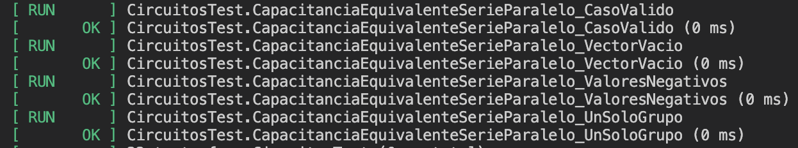

# Tarea 7

El presente directorio corresponde a la __Tarea 7__ del curso IE0217 - Estructuras Abstractas de Datos y Algoritmos para Ingeniería.

Se compone de los siguientes elementos:

- Parte teórica
- Desarrollo de Sistema Base
    - Módulo 1: Simulador de Inventario de Componentes Electrónicos.
    - Módulo 2: Cálculos de Circuitos.
- Pruebas unitarias y cobertura de código
- _Functional Testing y Test-Driven Development_ (TDD)
- _Continuous Integration y Continuous Delivery_ (CI/CD)

## Documentación

La documentación en Doxygen correspondiente a la presente asignación fue alojada en el siguiente sitio web de Netlify [Tarea 7 IE0217](https://tarea7-ie0217.netlify.app). 

Acceda a `Archivos -> Lista de Archivos` para encontrar la documentación por archivo de cada uno de los ejercicios.

## Modo de uso

En general, la tarea consiste de diseñar de los módulos descritos inicialmente, así como _tests_ para verificar su correcto funcionamiento. Para ello, se utilizó la biblioteca `GoogleTest`.

> [!IMPORTANT]
> Todos los comandos fueron optimizados para que sean ejecutados en el orden mostrado y desde el directorio actual `ie0217/Tareas/Tarea7`.

### Instalación de herramientas de _testing_

#### `GoogleTest`

Para instalar `GoogleTest` localmente, clone el siguiente repositorio en el presente directorio `ie0217/Tareas/Tarea7/` con el comando a continuación

```shell
git clone https://github.com/google/googletest.git
```

Después de clonar el repositorio, diríjase al directorio `ie0217/Tareas/Tarea7/googletest/` (repositorio clonado) y ejecute los siguientes comandos:

```bash
mkdir build && cd build
cmake ..
make
```

> [!NOTE]
> El comando anterior se encarga de compilar la biblioteca en el directorio build

#### `lcov`

Además, para la medición de la cobertura de código testeado, se requiere la herramienta `lcov`. Dependiendo del sistema, varía su proceso de instalación. En el caso de Ubuntu, se utiliza el siguiente comando:

```shell
sudo apt-get install -y lcov
```

### Compilación y ejecución de los tests

En primer lugar, para la compilación, diríjase al directorio `ie0217/Tareas/Tarea7/`. Ejecute el siguiente comando para compilar con `CMake`:

```shell
cmake -S . -B build
```

> [!TIP]
> `-S .` especifica el directorio de raíz del proyecto.  
> `-B build` indica el directorio donde se colocan los archivos de construcción (se crea si no existe).

Ahora bien, para la compilación del proyecto, utilice el comando:

```shell
cmake --build build
```

Finalmente, para la ejecución de todos los tests de cada módulo, utilice:

```shell
cmake --build build --target run
```

Posteriormente a la ejecución de los tests, para capturar con `lcov` la cobertura de código, utilice el comando:

```shell
lcov --capture --directory build --output-file build/coverage.info \--exclude '*/googletest/*' \--exclude '*/tests/*' \--exclude '/usr/include/*' \--exclude '*/include/*.hpp'
```

> [!NOTE]
> Se excluyen todos los directorios de prueba y los directorios `include` que no pertenecen al proyecto como tal, únicamente se toman en cuenta los _source files_.

Verifique que no hayan ocurrido al capturar la cobertura de código de los tests ejecutados. En caso de que sí, repita el proceso de ejecución de los tests. 

Para generar el reporte en HTML de la cobertura de código, utilice el siguiente comando:

```shell
genhtml build/coverage.info --output-directory build/coverage-report
```

Finalmente, para visualizar el reporte, utilice:

```shell
open build/coverage-report/index.html
```

> [!TIP]
> Es importante mencionar que al ejecutar localmente, aparece que la cobertura de código no fue la misma que la obtenida en GitHub Actions porque no se toman en cuenta las líneas al final de las funciones.

### GitHub Actions

Al implementar el _workflow_ diseñado en la tarea dentro de GitHub Actions, se aplican los tests automáticamente al realizar un `push`o un `pull-request` dentro de la rama `main`. Por lo tanto, no es necesario realizar ninguna acción adicional para que se ejecuten los tests en remoto.

Ingrese a la sección de `GitHub Actions` en la parte superior de la página de GitHub del repositorio actual. En la siguiente imagen, se proporciona un ejemplo de un `push` donde se ejecutaron los tests.

<p align="center">
  
</p>

> [!NOTE]
> Observe que se señaló el nombre del pipeline correspondiente al diseñado para la presente tarea: `Tarea7 CI/CD Pipeline`.  
> Existen otros pipelines dentro del repositorio, los cuales no corresponden a la tarea.

Al ingresar en un `push` o `pull-request` con este pipeline, se muestra el contenido de la siguiente imagen:

<p align="center">
  
</p>

Acá se muestra el estado de la compilación, _testing_ y _deployment_ del proyecto. 

En la sección marcada en la imagen correspondiente a `Artifacts`, al darle click, se muestra el reporte de cobertura generado en el propio repositorio. Se puede descargar y corroborar el estado de cobertura del código.

## Preguntas teóricas

En esta sección, se responden a las preguntas teóricas colocadas en la primera parte del enunciado de la presente tarea.

> [!NOTE]
> Hay respuestas que corresponden a más de una subpregunta. Por lo tanto, para las subpreguntas que parecen que no están respondidas, es porque la respuesta se encuentra debajo.

### 1. ¿Cuáles son los objetivos principales del software testing?

Los objetivos principales del software testing se listan a continuación:

- Detectar defectos y errores en el software.
- Verificar que el software cumple con los requisitos especificados.
- Validar que el software funciona como el usuario espera.
- Asegurar la confiabilidad, usabilidad y rendimiento del sistema.

#### a. Explique la importancia de la verificación y validación en el software testing.

La verificación asegura que el software cumple con las especificaciones técnicas, y la validación garantiza que satisface las necesidades del usuario (hace lo esperado). Juntas, verifican que el producto es adecuado, funcional y alineado con los requisitos del cliente, evitando fallos y malentendidos en etapas avanzadas​ del desarrollo.

#### b. ¿Qué relación tienen estos objetivos con la mejora de la calidad del software?

El proceso de testing permite detectar y corregir problemas temprano, lo que contribuye a la estabilidad y confiabilidad del producto final. Esto eleva la calidad general del software al asegurar que cumple con estándares y requisitos​.

#### c. ¿Cómo contribuye el _software testing_ a la experiencia del usuario final y a la reducción de costos a largo plazo?

El _software testing_ garantiza una experiencia de usuario libre de errores al asegurar un funcionamiento estable y predecible del software. Además, al detectar problemas desde el inicio, se evitan costosos arreglos en fases posteriores del proyecto, lo cual reduce significativamente los costos de mantenimiento y soporte a largo plazo.

### 2. ¿Qué es el concepto de _semilla_ en el contexto de software testing?

La semilla es un valor inicial utilizado en algoritmos generadores de números aleatorios. Este valor permite que la secuencia de números generados sea consistente y reproducible, lo cual es fundamental en pruebas que dependen de aleatoriedad​.

#### a. ¿Qué aplicaciones tiene en el software testing? Dé tres ejemplos específicos donde la semilla sea crucial para pruebas efectivas.

- __Pruebas de carga y estrés__: Al simular múltiples usuarios o solicitudes, la semilla permite generar datos de prueba consistentes, lo cual asegura que las pruebas sean repetibles y comparables entre ejecuciones.

- __Pruebas de simulación de entornos__: Al trabajar con sensores, por ejemplo, una semilla fija permite simular condiciones controladas de conectividad, lo cual facilita la identificación de fallos en condiciones específicas.

- __Pruebas de UI y UX__: Generar acciones de usuario aleatorias pero reproducibles ayuda a detectar fallos en interfaces y en la navegación, pues permite ejecutar la misma secuencia de eventos para depuración.

#### b. ¿Cómo afecta el uso de semillas en la reproducibilidad de pruebas y qué beneficios aporta en términos de diagnóstico de errores?

El uso de semillas en pruebas permite que cada ejecución sea exactamente replicable, lo cual facilita detectar y corregir errores de manera efectiva al poder reproducir las condiciones exactas en que ocurrieron los fallos. 

Esto ofrece claridad en el diagnóstico, facilita la colaboración entre equipos al compartir un entorno de pruebas consistente (especialmente en proyectos grandes donde se dividen los equipos de _testing_ y de desarrollo) y asegura que cualquier cambio en el código o en la configuración pueda ser validado bajo las mismas condiciones​.

### 3. Mencione las etapas genéricas del software testing.

#### a. Identifique y describa las ocho etapas genéricas en el proceso de software testing.

#### b. ¿Qué propósito cumple cada una de estas etapas en el ciclo de vida de las pruebas?

1. __Análisis de requisitos__: El equipo examina los requisitos del software para definir el alcance y los objetivos de las pruebas.
    - Propósito: Define el alcance y ayuda a identificar los casos críticos.
2. __Planificación de pruebas__: Se elabora un plan que establece la estrategia, los objetivos, los recursos y el cronograma de pruebas.
    - Propósito: Establece una ruta clara para el proceso de pruebas y coordina recursos.
3. __Diseño de pruebas__: Creación de casos de prueba detallados y escenarios basados en los requisitos del software.
    - Propósito: Crea los casos específicos que guiarán la evaluación de las funcionalidades del software.
4. __Configuración del entorno de prueba__: Preparación del entorno con el hardware, software y red necesarios para ejecutar las pruebas.
    - Propósito: Garantiza que el entorno esté listo y en condiciones de replicar el entorno de producción.
5. __Ejecución de pruebas__: Se ejecutan los casos de prueba de manera manual o automatizada.
    - Propósito: Realiza la evaluación real del software, verificando si cumple los casos definidos.
6. __Informes de prueba__: Documentación de los resultados, destacando defectos y problemas encontrados.
    - Propósito: Ofrece claridad sobre los resultados y los problemas, siendo fundamental para decisiones de calidad.
7. __Seguimiento de defectos__: Registro y seguimiento de los defectos, trabajando con el equipo de desarrollo para resolverlos.
    - Propósito: Asegura que los errores se registren y se solucionen adecuadamente.
8. __Cierre de pruebas__: Evaluación final de todo el proceso y preparación de un informe que resuma los resultados de las pruebas.
    - Propósito: Cierra el ciclo con una evaluación general y detalla lecciones aprendidas para futuras pruebas.

#### c. ¿Qué otras etapas o pasos podrían integrarse para hacer el proceso de testing más robusto? Justifique su respuesta.

Entre las pruebas que se podrían agregar al proceso de _testing_ se encuentran las siguientes:

- __Revisión de casos de prueba__: Permitiría detectar problemas o carencias en los casos de prueba antes de la ejecución, mejorando la calidad de la evaluación.
- __Automatización de pruebas__: Aumenta la eficiencia al permitir ejecutar pruebas repetitivas y complejas de forma rápida y consistente.

### 4. Tipos de pruebas de software: Mencione al menos cinco tipos de software testing y explique cada uno.

#### a. Describa brevemente los objetivos y aplicaciones de cada tipo de testing mencionado.

#### b. ¿En qué escenarios o tipos de proyectos es más adecuado cada tipo de prueba?

#### c. Ejemplifique cómo cada uno de estos tipos de testing contribuye a la detección de diferentes tipos de errores en el código.

1. __Unit testing__
    - Objetivo: Validar que cada unidad o componente pequeño del código funcione correctamente de manera aislada.
    - Aplicaciones: Común en pruebas de funciones, métodos y clases (componentes individuales), como _frameworks_ o bibliotecas reutilizables.
    - Escenarios: Ideal para proyectos modulares o de gran tamaño donde la verificación de cada componente garantiza la estabilidad y comportamiento esperado al integrarse.
    - Ejemplo: Identifica errores de lógica dentro de una función, como cálculos erróneos.

2. __Integration testing__
    - Objetivo: Verificar que varios componentes o unidades funcionen correctamente en conjunto.
    - Aplicaciones: Evalúa interfaces y comunicación entre módulos, especialmente en sistemas con múltiples servicios o API.
    - Escenarios: Útil en proyectos de servicios o sistemas con muchos módulos dependientes entre sí.
    - Ejemplo: Detecta incompatibilidades entre módulos, como un formato de datos no reconocido.

3. __System testing__
    - Objetivo: Probar el sistema completo para asegurarse de que cumple con los requisitos funcionales y no funcionales.
    - Aplicaciones: Se evalúan funcionalidades globales, rendimiento y usabilidad, simulando el entorno de producción.
    - Escenarios: Adecuado para productos próximos a lanzarse, donde se requiere validar la funcionalidad completa.
    - Ejemplo: Encuentra problemas de integración global, como funcionalidades no accesibles en ciertas condiciones.

4. __Acceptance testing__
    - Objetivo: Validar que el sistema cumple con los requisitos y expectativas del cliente.
    - Aplicaciones: Prueba final antes del lanzamiento, realizada desde la perspectiva del usuario o cliente.
    - Escenarios: Ideal para software a medida o productos orientados a clientes específicos que requieren validación formal.
    - Ejemplo: Revela funcionalidades que no cumplen con las expectativas o el flujo esperado por el cliente.

5. __Performance testing__
    - Objetivo: Evaluar el rendimiento, estabilidad y capacidad de respuesta del sistema bajo distintas condiciones de carga.
    - Aplicaciones: Común en aplicaciones críticas o de alto tráfico, como sitios web de comercio electrónico y plataformas en línea.
    - Escenarios: Crucial para aplicaciones de tiempo real o que soportan muchos usuarios concurrentes (alto tráfico).
    - Ejemplo: Identifica cuellos de botella y problemas de latencia bajo carga, lo cual afecta la escalabilidad del sistema.

### 5. ¿Cuáles son las características y ventajas principales del uso de la herramienta _unit testing_?

_Unit testing_ permite evaluar unidades de código individuales en aislamiento para asegurar su funcionamiento correcto antes de integrarlas con otras partes del sistema.

Las principales características se listan a continuación:

- __Aislado__: Cada prueba se ejecuta en un entorno independiente, sin interferencias externas, lo cual asegura que cualquier error detectado corresponda exclusivamente a la unidad probada.
- __Automatizable__: Las pruebas unitarias se diseñan para ser automatizadas, lo cual permite una ejecución frecuente y facilitando la detección rápida de errores a lo largo del ciclo de desarrollo.
- __Rápido__: Por su enfoque en unidades pequeñas y aisladas, estas pruebas se ejecutan rápidamente, proporcionando retroalimentación inmediata a los desarrolladores.
- __Determinista__: Las pruebas unitarias ofrecen resultados consistentes bajo las mismas condiciones, lo cual garantiza la reproducibilidad de los resultados y facilita la depuración.

#### a. ¿Cómo contribuye _unit testing_ al desarrollo ágil y al desarrollo orientado a pruebas (TDD)?

En el desarrollo ágil, el _unit testing_ respalda ciclos de iteración rápidos al permitir verificar el impacto de cada cambio pequeño en el sistema de manera continua.

En el TDD, las pruebas unitarias impulsan el desarrollo guiando la implementación de funciones según requisitos claros y verificables, lo cual contribuye a reducir errores y asegurar que cada componente cumpla su propósito.

#### b. Mencione al menos tres beneficios clave de _unit testing_ para los desarrolladores y para la calidad general del software.

Entre las ventajas principales del uso de _unit testing_, se encuentran las siguientes:

- __Detección temprana de errores__: Facilita la identificación de problemas en fases iniciales, lo cual minimiza el costo y tiempo de corrección.
- __Apoyo en el refactorizado__: Al contar con pruebas que aseguran el comportamiento de cada unidad, los desarrolladores pueden modificar el código con confianza sin temer efectos negativos.
- __Mejor documentación__: Las pruebas sirven como una referencia sobre el comportamiento esperado de las unidades, facilitando el entendimiento del código por parte de otros desarrolladores.

#### c. ¿Cuáles son los desafíos comunes al implementar _unit testing_, y cómo se pueden mitigar?

- __Cobertura insuficiente__: Es difícil cubrir todos los casos posibles. Este reto se afronta planificando pruebas clave y usando herramientas de cobertura de código.
- __Complejidad en pruebas de componentes acoplados__: La dependencia entre unidades complica las pruebas. Para resolverlo, se utilizan _mocks_ que permiten simular dependencias y realizar pruebas en aislamiento.
- __Mantenimiento de pruebas__: Las pruebas requieren actualizaciones constantes debido a cambios en el sistema. Automatizar las pruebas y eliminar pruebas redundantes ayuda a reducir el costo de mantenimiento.

### 6. GoogleTest en _unit testing_: ¿Qué tipos de revisiones se pueden realizar y cuáles son sus diferencias?

#### a. Explique los distintos enfoques de revisión que GoogleTest permite en pruebas unitarias.

#### b. Compare las diferencias en cuanto a efectividad y aplicación de cada tipo de revisión.

GoogleTest ofrece dos tipos principales de revisiones para evaluar condiciones en pruebas unitarias:

- __`EXPECT_`__: Permite que el test continúe incluso si la verificación falla. Este enfoque es útil para realizar múltiples verificaciones en un sólo test, lo cual permite observar el comportamiento de todas las condiciones en una misma ejecución.
    - Efectividad: Es más efectivo en pruebas donde se necesita evaluar múltiples condiciones sin interrumpir el flujo, pues permite identificar una serie de errores en una sóla ejecución.
- __`ASSERT_`__: Detiene el test inmediatamente si la verificación falla. Esto es adecuado para casos en los que una falla hace que el resto del test sea irrelevante, lo cual optimiza el proceso de pruebas al interrumpir la ejecución en errores críticos.
    - Efectividad: Es más efectivo en situaciones críticas, donde una falla inicial invalida cualquier prueba posterior en el mismo test.

#### c. ¿Qué tipo de revisión sería más adecuado para validar cálculos numéricos? ¿Y para pruebas de cadenas de texto?

- __Cálculos numéricos__: Para cálculos numéricos, `EXPECT_EQ` o `ASSERT_EQ` son recomendables al evitar márgenes de error, garantizando así una comparación exacta sin tolerancia. Depende de la implementación si se desea que se detenga la ejecución después de fallar u observar el comportamiento del programa con el fallo numérico.
    - Específicamente, se puede utilizar `EXPECT_DOUBLE_EQ(val1, val2)` y `ASSERT_DOUBLE_EQ(val1, val2)` (o su análogo con floats), al considerar tolerancias de error.

- __Cadenas de texto__: Para pruebas de cadenas de texto, `ASSERT_EQ` es adecuado, puesto que permite una verificación exacta de igualdad. Además de que, cuando la prueba depende de la igualdad de las cadenas para continuar, se detiene la ejecución ante una diferencia.
    - `EXPECT_STREQ(str1, str2)` y `ASSERT_STREQ(str1, str2)` son utilizados propiamente para strings.

### 7. ¿Qué es el Functional Testing?

#### a. Defina Functional Testing y describa tres de sus principales características.

El Functional Testing es una metodología de pruebas que verifica si el software cumple con los requisitos y funcionalidades especificadas, centrándose en el _qué_ hace el sistema en lugar del _cómo_. Su objetivo es garantizar que cada funcionalidad trabaje según lo esperado, sin considerar la implementación interna.

- __Orientado a requisitos__: Se basa en los requisitos del sistema, validando que cada funcionalidad cumpla con lo especificado.
- __Caja negra__: Los testers no necesitan conocer la estructura interna del código; se enfocan únicamente en la salida y el comportamiento esperado de cada función.
- __Varios niveles de prueba__: Puede abarcar desde pruebas unitarias hasta pruebas de aceptación del usuario, al evaluar funcionalidad a diferentes escalas del sistema​

#### b. ¿Qué tipos de errores específicos en el código podría identificar este tipo de prueba?

- __Errores de lógica en funcionalidades__: Detecta casos donde una funcionalidad no produce el resultado esperado.
- __Errores de integración entre módulos__: Identifica fallos en la interacción entre diferentes partes del sistema, asegurando que trabajen correctamente en conjunto.
- __Errores en manejo de entradas y salidas__: Verifica que el sistema maneje adecuadamente entradas válidas e inválidas, evitando fallos y asegurando respuestas apropiadas.

#### c. ¿Cómo se diferencia Functional Testing de otras pruebas, como Unit Testing y System Testing?

El _Functional Testing_ evalúa funcionalidades completas y su alineación con los requisitos, mientras que el _Unit Testing_ se centra en unidades individuales y en su funcionamiento en aislamiento.

Aunque ambos verifican el sistema en su totalidad, el _Functional Testing_ se enfoca en validar cada funcionalidad según los requisitos, mientras que el _System Testing_ también abarca aspectos no funcionales como rendimiento y seguridad, al evaluar la estabilidad general del sistema en condiciones reales.

### 8. Comandos en unit testing: Mencione y explique dos comandos de cada uno de los siguientes tipos:

#### a. _Binary Comparison_: ¿Cuándo es recomendable utilizar estas comparaciones?

- __`EXPECT_EQ(val1, val2)` y `ASSERT_EQ(val1, val2)`__: Comparan si dos valores son exactamente iguales. `EXPECT_EQ` permite que la prueba continúe tras una falla, mientras que `ASSERT_EQ` detiene la prueba inmediatamente.
- __`EXPECT_NE(val1, val2)` y `ASSERT_NE(val1, val2)`__: Verifican que dos valores sean diferentes. `EXPECT_NE` es útil para seguir evaluando en caso de falla, y `ASSERT_NE` se utiliza cuando es crítico detenerse ante una igualdad inesperada.

Estas comparaciones son adecuadas cuando se espera una igualdad o diferencia exacta entre valores y la lógica de la prueba depende de ello.

#### b. _String Comparison_: ¿Qué aspectos específicos de las cadenas de texto se pueden validar?

- __`EXPECT_STREQ(str1, str2)` y `ASSERT_STREQ(str1, str2)`__: Verifican que dos cadenas de caracteres sean exactamente iguales.
- __`EXPECT_STRNE(str1, str2)` y `ASSERT_STRNE(str1, str2)`__: Comprueban que dos cadenas no sean iguales.

Estos comandos permiten verificar la igualdad exacta o diferencia en cadenas, siendo útiles en casos donde cada carácter y su orden son importantes, como en validaciones de entradas de usuario o en salidas de formato específico.

#### c. _Exception Assertions_: ¿Cómo ayudan a detectar condiciones excepcionales en el código?

- __`EXPECT_THROW(statement, exception_type)` y `ASSERT_THROW(statement, exception_type)`__: Verifican que una sentencia lance una excepción específica. `EXPECT_THROW` continúa la prueba tras la verificación; `ASSERT_THROW` la detiene.
- __`EXPECT_NO_THROW(statement)` y `ASSERT_NO_THROW(statement)`__: Aseguran que una sentencia no lance ninguna excepción, lo cual es útil para comprobar que el código maneja condiciones de ejecución de manera segura.

Estos comandos son esenciales para validar la correcta gestión de excepciones, asegurando que el software responda de manera controlada ante condiciones excepcionales.

#### d. _Predicate Assertions for Better Error Messages_: ¿Qué beneficios ofrecen en la comunicación de errores?

- __`EXPECT_PRED1(pred, val1)` y `EXPECT_PRED2(pred, val1, val2)`__: Permiten definir predicados personalizados para comparaciones más detalladas. `EXPECT_PRED2`, por ejemplo, verifica que una condición con dos valores cumpla un predicado específico.
- __`ASSERT_PRED1(pred, val1)` y `ASSERT_PRED2(pred, val1, val2)`__: Son similares a los anteriores, pero detienen el test si falla el predicado.

Estos comandos proporcionan mensajes de error más claros y específicos, lo cual facilita la comprensión y depuración de fallos al permitir personalizar las condiciones de error.

#### e. _Floating-Point Comparison_: ¿Por qué es útil este tipo de comparación en cálculos científicos o financieros?

- __`EXPECT_FLOAT_EQ(val1, val2)` y `ASSERT_FLOAT_EQ(val1, val2)`__: Comparan valores en punto flotante considerando una pequeña tolerancia de error. Estas verificaciones son útiles cuando el cálculo implica pequeñas variaciones.
- __`EXPECT_DOUBLE_EQ(val1, val2)` y `ASSERT_DOUBLE_EQ(val1, val2)`__: Funcionan igual que los anteriores, pero para valores de doble precisión.

Las comparaciones de punto flotante son fundamentales en aplicaciones científicas y financieras donde los resultados pueden variar ligeramente debido a la precisión limitada, lo cual asegura que el código mantenga una precisión aceptable en los cálculos.

### 9. Coverage o Cobertura de código: ¿Qué es y por qué es conveniente su uso?

La cobertura de código es una métrica utilizada en software testing para medir qué tanto del código fuente es ejecutado durante las pruebas. Esta métrica indica el nivel de pruebas aplicadas y ayuda a detectar partes del código que no han sido verificadas, lo cual incrementa la fiabilidad del software al identificar áreas potencialmente vulnerables a errores​.

#### a. Explique qué se entiende por cobertura de código en el testing.

La cobertura de código representa el porcentaje del código fuente ejecutado por los casos de prueba.

#### b. ¿Qué tipos de cobertura existen? Describa en qué consiste cada uno y cómo se mide.

- __Cobertura de líneas__: Mide el porcentaje de líneas de código que han sido ejecutadas. Se calcula dividiendo el número de líneas ejecutadas por el total de líneas en el programa, lo cual ayuda a garantizar que cada línea ha sido probada al menos una vez.
- __Cobertura de sentencias__: Similar a la cobertura de líneas, pero enfocada en las sentencias o instrucciones individuales. Esto asegura que cada instrucción del código, como asignaciones o llamadas a funciones, sea verificada.
- __Cobertura de funciones/métodos__: Evalúa si todas las funciones o métodos del código han sido llamados al menos una vez durante las pruebas. Esta métrica es útil para asegurar que cada parte funcional del software recibe al menos una verificación básica.
- __Cobertura de condiciones__: Verifica que todas las _condiciones booleanas_ (por ejemplo, expresiones dentro de `if`, `switch` o `while`) sean evaluadas como verdaderas y falsas. Esto asegura que el programa maneja correctamente todos los resultados posibles de estas condiciones.
- __Cobertura de ramas__: Mide si todas las ramas en las decisiones del código (como `if-else` o `switch`) han sido ejecutadas. Es particularmente útil para probar caminos alternativos y asegurar que todas las rutas de decisión son evaluadas.


#### c. Proporcione un ejemplo de cómo la cobertura de código ayuda a identificar áreas no probadas de una aplicación.

Se supone una aplicación con un módulo que contiene un bloque de código `if-else`. Durante las pruebas, el análisis de cobertura muestra que sólo se ejecutó la parte `if` del bloque, mientras que la rama `else` quedó sin verificar.

Este análisis indica que las pruebas actuales no cubren todas las posibles rutas de ejecución, lo cual permite a los desarrolladores crear casos específicos para la ruta `else`, asegurando una verificación completa y reduciendo el riesgo de errores en ejecución.

### 10. Herramienta de _Coverity_: ¿En qué consiste y cómo funciona el análisis estático de código?

Coverity es una herramienta que realiza análisis estático de código, es decir, examina el código fuente sin ejecutarlo. Su propósito es detectar defectos y vulnerabilidades de manera temprana, ayudando a asegurar la calidad y seguridad del software mediante la identificación de errores comunes de programación y problemas de seguridad, como desbordamientos de buffer y fugas de memoria​.

#### a. Defina el propósito de _Coverity_ en el análisis de código sin ejecución.

Coverity se utiliza para identificar defectos en el código __antes__ de que el software se ejecute. Esto incluye errores que podrían causar fallos en producción, vulnerabilidades de seguridad y problemas de rendimiento.

#### b. ¿Qué ventajas tiene el análisis estático frente a otros tipos de testing?

- __Detección temprana de errores__: Identifica problemas durante la fase de desarrollo, lo cual reduce los costos de corrección y permite mantener la calidad en etapas iniciales.
- __Cobertura completa__: Analiza todo el código, incluidas rutas que podrían no ejecutarse en las pruebas dinámicas, detectando errores que el testing de ejecución podría pasar no detectar.
- __Prevención de vulnerabilidades de seguridad__: Al revisar el código fuente, el análisis estático identifica problemas de seguridad antes de la implementación, asegurando que el software cumpla con estándares de seguridad sin depender de casos de prueba específicos.

#### c. Describa el flujo de trabajo general que se sigue en Coverity para identificar y reportar vulnerabilidades en el código.

El flujo de trabajo usual en Coverity se muestra a continuación:

1. __Análisis del código fuente__: Coverity examina el código para identificar patrones y defectos comunes, utilizando un motor de análisis que detecta errores de programación sin ejecutarlo.
2. __Identificación de defectos y vulnerabilidades__: La herramienta detecta problemas como accesos a punteros nulos, condiciones de carrera, fugas de memoria y vulnerabilidades de seguridad.
3. __Generación de reporte__: Coverity genera un informe que clasifica los defectos por severidad y proporciona descripciones detalladas de cada problema, incluyendo recomendaciones para su corrección.
4. __Integración en el flujo de desarrollo__: Los reportes se integran en el proceso de desarrollo, permitiendo que los desarrolladores analicen y solucionen los defectos identificados, y asegurando que el código se mantenga seguro.

### 11. _Continuous Integration_ (CI) y _Continuous Delivery_ (CD): Conceptos y diferencias.

#### a. Explique los conceptos de Continuous Integration (CI) y Continuous Delivery (CD).

CI (_Continuous Integration_) es una práctica de desarrollo en la cual los desarrolladores integran frecuentemente su código en un repositorio compartido. Cada integración se verifica mediante pruebas automáticas, lo cual permite detectar y resolver errores rápidamente, garantizando que el código es estable y funciona correctamente.

CD (_Continuous Delivery_) extiende CI asegurando que el código esté siempre en un estado desplegable. Automatiza la preparación del software para su despliegue en entornos de prueba o producción, facilitando la implementación de cambios de manera rápida y confiable​.

#### b. ¿Cuáles son las principales diferencias entre CI y CD en el ciclo de vida del software?

CI se centra en integrar y probar continuamente el código de manera automatizada, lo cual asegura que cada cambio es funcional y no introduce errores.

CD se enfoca en tener el código listo para despliegue, automatizando el paso desde la integración hasta la entrega, lo cual permite que el software esté siempre preparado para producción.

#### c. Mencione tres características o beneficios de cada uno y explique cómo estas características apoyan el desarrollo de software moderno.

- __CI__:
    - __Detección temprana de errores__: Permite la identificación y corrección de errores a medida que surgen, evitando acumulación de fallos en el código.
    - __Mejora en la calidad del software__: Las pruebas frecuentes garantizan que el código cumpla estándares de calidad de forma continua.
    - __Aumento en la colaboración__: Facilita la colaboración en equipo al evitar conflictos en el código y mantener la integración constante​

- __CD__:
    - __Despliegues rápidos y seguros__: Mantiene el software en estado desplegable, lo cual permite liberaciones rápidas y controladas.
    - __Reducción de riesgos__: Automatiza las pruebas y validaciones, minimizando el riesgo de errores en producción.
    - __Retroalimentación continua__: Proporciona información constante sobre el estado del software en entornos reales, mejorando la respuesta a problemas.

#### d. Describa cada etapa del flujo seguido para implementar CI/CD en un proyecto típico.

- __Code__: El proceso comienza con la creación y modificación del código por parte de los desarrolladores. Este código incluye tanto los archivos fuente como los scripts y configuraciones necesarias para el proyecto.

- __Commit__: Una vez que el código está listo, los desarrolladores lo integran al repositorio compartido mediante un commit, lo cual dispara el pipeline de CI/CD.

- __CI Pipeline__:
    - _Build_: El sistema compila el código, asegurando que todos los componentes están construidos correctamente y sin errores de compilación.
    - _Unit tests_: Se ejecutan pruebas unitarias para verificar que cada unidad de código (funciones, clases) funciona de manera independiente y cumple su propósito específico.
    - _Integration tests_: Se realizan pruebas de integración para asegurar que los módulos del sistema funcionan correctamente cuando se combinan, verificando la comunicación y funcionalidad conjunta.
- __CD Pipeline__:
    - _Review_: El código y los resultados de las pruebas se revisan, ya sea de forma automática o manual, para asegurar la calidad antes de avanzar a entornos más avanzados.
    - _Staging_: El código se despliega en un entorno de staging, donde se simula el entorno de producción. Aquí se realizan pruebas adicionales que incluyen pruebas de rendimiento y usabilidad.
    - _Production_: Finalmente, si el código pasa todas las pruebas anteriores, se despliega en el entorno de producción, donde estará disponible para los usuarios finales.

### 12. Uso de GitHub en CI/CD: ¿Cómo se relacionan estas herramientas con el uso de GitHub?

#### a. Explique cómo GitHub facilita la integración continua y la entrega continua en el desarrollo de software.

GitHub permite que los desarrolladores gestionen y colaboren en el código fuente mediante un sistema de control de versiones centralizado. Esto facilita la Integración Continua (CI) al permitir que cada cambio en el código se registre en un repositorio compartido, donde se pueden ejecutar pruebas automáticas cada vez que alguien realiza un commit o un pull request.

Para Entrega Continua (CD), GitHub permite configurar pipelines que automatizan el despliegue del software, asegurando que el código esté en un estado listo para producción. GitHub también centraliza la colaboración, lo cual facilita la revisión del código y la identificación de problemas en equipo.

#### b. Mencione las principales características de GitHub Actions en el contexto de CI/CD.

- __Pipelines personalizables__: GitHub Actions permite crear flujos de trabajo personalizados para CI/CD mediante archivos YAML, definiendo pasos específicos para construir, probar y desplegar el código.
- __Integración con GitHub__: GitHub Actions se integra nativamente con el repositorio, lo cual facilita la ejecución de flujos de trabajo en cada evento relevante, como push, pull request o creación de tags.
- __Soporte de múltiples entornos__: Permite ejecutar los flujos de trabajo en diferentes sistemas operativos (Linux, macOS, Windows), adaptándose a las necesidades del proyecto.
- __Acciones preconfiguradas__: Ofrece una biblioteca de acciones reutilizables que simplifican tareas comunes (por ejemplo, instalación de dependencias, ejecución de pruebas), lo cual acelera la configuración del pipeline​.

#### c. ¿Qué ventajas ofrece GitHub Actions sobre otras herramientas de CI/CD?

- Al estar integrado en GitHub, GitHub Actions permite configurar CI/CD sin necesidad de herramientas externas, reduciendo la complejidad de administración.
- Con archivos YAML y acciones preconfiguradas, GitHub Actions permite a los desarrolladores adaptar el pipeline a sus necesidades específicas (personalización del flujo de trabajo).
- GitHub Actions permite ejecutar flujos de trabajo en diferentes plataformas y escalarlos según los requerimientos del proyecto, lo cual es ideal para proyectos que deben probarse en múltiples entornos.

### 13. GitHub Actions: Mencione y explique los pasos que se siguen para configurar y utilizar GitHub Actions en un proyecto.

Para configurar y utilizar GitHub Actions en un proyecto, se sigue el siguiente proceso:

1. __Crear el archivo de configuración__: En el repositorio de GitHub, se crea un archivo YAML en el directorio `.github/workflows/` con el nombre del flujo de trabajo.
2. __Definir el evento que activa el workflow__: En el archivo YAML, se especifica el evento en la sección `on`, que puede ser `push`, `pull_request`, o una tarea programada (`schedule`).
3. __Configurar los jobs y steps__: En la sección `jobs`, se definen los trabajos que se ejecutarán, cada uno con pasos (`steps`) específicos que contienen las acciones o comandos a realizar.
4. __Personalizar el entorno de ejecución__: Cada `job` puede especificar un sistema operativo, como `ubuntu-latest` o `windows-latest`, para definir el ambiente en el cual se ejecutarán los pasos.
5. __Guardar y validar el archivo__: Una vez configurado el archivo, se guarda y se envía al repositorio, lo cual activará el workflow según los eventos definidos.

#### a. ¿Cuáles son los componentes principales de un archivo de configuración de GitHub Actions?

- __`name`__: Nombre del workflow.
- __`on`__: Eventos que activan el workflow.
- __`jobs`__: Contiene los trabajos que se ejecutan en el workflow.
- __`steps`__: Define las acciones específicas de cada trabajo.

#### b. Explique cómo se define un workflow, un job, y un step en GitHub Actions.

- __Workflow__: Es el flujo completo que contiene uno o varios `jobs`, activado en respuesta a eventos.
- __Job__: Conjunto de pasos que se ejecutan en un entorno específico, los cuales pueden depender entre sí.
- __Step__: Acción individual en un `job`, que puede ser un comando, script o acción predefinida.

#### c. ¿Cuáles son las mejores prácticas para configurar GitHub Actions en proyectos de desarrollo colaborativo?

- Usar variables de entorno y secretos para credenciales.
- Modularizar workflows y jobs para organizar tareas.
- Reutilizar acciones predefinidas.
- Configurar notificaciones para alertar al equipo sobre el estado de los workflows, para mejorar la colaboración y la rapidez en la resolución de problemas.

### 14. Mocking y Stubbing en Unit Testing: ¿Qué son y cómo se aplican en pruebas unitarias para simular dependencias?

_Mocking_ y _Stubbing_ son técnicas utilizadas en unit testing para simular dependencias externas, permitiendo que las pruebas se enfoquen en el comportamiento de la unidad bajo prueba sin verse afectadas por otros componentes del sistema.

- __Mocking__: Consiste en crear objetos simulados (mocks) que imitan el comportamiento de dependencias reales, pero con la capacidad de verificar cómo interactúan con la unidad bajo prueba. Esto es útil para probar interacciones, como asegurar que se realicen llamadas a métodos externos en el orden esperado o con los datos correctos.

- __Stubbing__: Corresponde a crear objetos que devuelven respuestas predefinidas para llamadas específicas, sin validar las interacciones con la unidad bajo prueba. Los stubs son útiles cuando se necesita una respuesta consistente de una dependencia (como un valor de retorno específico), pero no es relevante verificar cómo se interactuó con ella.

### 15. Diferencias entre Testing Manual y Testing Automatizado: ¿Cuándo es preferible cada uno?

- __Testing Manual__: 
    - Ideal para pruebas exploratorias y de usabilidad donde se requiere la observación directa del usuario.
    - Es útil para casos únicos o poco repetitivos, donde el costo de la automatización no se justifica.
    - Permite una evaluación más intuitiva y subjetiva, detectando problemas que pueden no capturarse en scripts automatizados.
    - Es adecuado en etapas iniciales de desarrollo o en proyectos pequeños con pocos cambios. 

- __Testing automatizado__:
    - Es eficiente para pruebas repetitivas y de gran volumen, permitiendo ejecutarlas rápidamente y de manera continua.
    - Mejora la cobertura de pruebas, ya que puede ejecutar múltiples escenarios y pruebas en paralelo.
    - Reduce los errores humanos y ofrece consistencia en los resultados de las pruebas.
    - Es ideal para proyectos grandes y complejos con ciclos de desarrollo rápidos, así como en entornos de CI/CD.

### 16. Herramientas de Testing Automatizado: ¿Cuáles son algunas herramientas populares en la industria, y cuáles son sus ventajas y desventajas?

- __Jenkins__
    - Ventajas:
        - Jenkins es una herramienta de automatización de integración continua que facilita la ejecución de pruebas automatizadas en cada integración de código.
        - Permite la integración de múltiples herramientas de prueba y despliegue; muy flexible y personalizable con numerosos plugins.
        - Ayuda a detectar errores rápidamente, permitiendo una retroalimentación constante.
    - Desventajas:
        - La curva de aprendizaje compleja.
        - Puede requerir altos recursos de hardware para proyectos grandes y complejos.
- __Selenium__
    - Ventajas:
        - Es una herramienta de código abierto con soporte para múltiples navegadores y plataformas.
        - Permite escribir scripts en varios lenguajes de programación como Java, Python y C#.
        - Recomendada para pruebas automatizadas de aplicaciones web.
    - Desventajas:
        - No soporta aplicaciones de escritorio, por lo que está limitado a aplicaciones web.
        - Puede ser complejo de configurar y mantener, especialmente en pruebas de larga duración y en ambientes inestables.
        - Las pruebas son más propensas a romperse con cambios en la interfaz de usuario.
- __Postman__
    - Ventajas:
        - Es ampliamente utilizada para pruebas automatizadas de `API REST`, con una interfaz intuitiva que facilita la creación y ejecución de pruebas.
        - Permite la creación de colecciones de pruebas y su integración en flujos de CI/CD.
        - Admite generación de informes y el uso de scripts en JavaScript para validar respuestas de API.
    - Desventajas:
        - Está orientada principalmente a API, por lo que no es adecuada para pruebas de interfaz de usuario o pruebas de carga.
        - Las capacidades avanzadas requieren una suscripción de pago.

## Descripción del Sistema Base

### 1. Módulo de Gestión de Inventario (Clase `Componente` y Clase `Inventario`)

Este módulo permite gestionar un inventario de componentes electrónicos. Los componentes, como resistencias, capacitores e inductores, se representan mediante la clase `Componente`. Esta clase almacena información básica sobre cada componente, como su nombre, cantidad, categoría y una descripción detallada. 

Por su parte, la clase `Inventario` actúa como contenedor para múltiples instancias de la clase `Componente`. Además, proporciona las funcionalidades necesarias para agregar nuevos componentes, actualizar las cantidades existentes, reducir el stock y buscar componentes específicos. También, permite listar todos los componentes organizados por categorías.

Las clases implementadas y sus métodos se describen a continuación:

- __Clase `Componente`:__
    - `Componente`: Constructor que inicializa un componente con sus atributos y valida que los valores sean adecuados.
    - `agregarComponente`: Incrementa la cantidad del componente. Lanza una excepción si la cantidad proporcionada es negativa.
    - `reducirComponente`: Reduce la cantidad del componente si es posible. Devuelve `false` si no hay suficiente stock y lanza una excepción para cantidades negativas.
    - Getters para `nombre`, `cantidad`, `categoria` y `descripcion`.

- __Clase `Inventario`:__
    - `agregarComponente`: Añade un componente al inventario o incrementa su cantidad si ya existe. Valida que la cantidad no sea negativa.
    - `reducirComponente`: Reduce la cantidad de un componente existente, lanzando excepciones si la cantidad solicitada es mayor que la disponible o si el componente no existe.
    - `listarComponentes`: Lista todos los componentes del inventario, mostrando sus detalles. Lanza una excepción si el inventario está vacío.
    - `buscarComponente`: Busca un componente por su nombre y devuelve sus detalles. Lanza una excepción si el componente no se encuentra.

__Errores analizados:__
- Se valida que las cantidades sean siempre mayores que cero.
- Se manejan excepciones para casos como nombres vacíos, cantidades negativas y operaciones sobre componentes inexistentes.
- Si el inventario está vacío, se lanza una excepción para evitar listados innecesarios.


### 2. Módulo de Cálculos de Circuitos

Este módulo permite realizar cálculos básicos de circuitos eléctricos, como la resistencia, capacitancia e inductancia equivalentes en configuraciones de serie y paralelo. Además, incluye una función avanzada para calcular capacitancias equivalentes combinando configuraciones en serie y paralelo.

El módulo está diseñado para manejar vectores de valores que representan los componentes en el circuito, valida entradas y asegura que todos los valores sean positivos.

Para este módulo, se implementaron las siguientes funciones:

- __Cálculos de Resistencias:__
    - `resistenciaSerie`: Suma las resistencias en serie.
    - `resistenciaParalelo`: Calcula la resistencia equivalente en paralelo mediante la suma de inversos.
- __Cálculos de Capacitancias:__
    - `capacitanciaSerie`: Calcula la capacitancia equivalente en serie mediante la suma de inversos.
    - `capacitanciaParalelo`: Suma las capacitancias en paralelo.
- __Cálculos de Inductancias:__
    - `inductanciaSerie`: Suma las inductancias en serie.
    - `inductanciaParalelo`: Calcula la inductancia equivalente en paralelo mediante la suma de inversos.
- __Capacitancia Avanzada:__
    - `capacitanciaEquivalenteSerieParalelo`: Calcula la capacitancia equivalente combinando configuraciones en serie y paralelo.
        - Esta función fue implementada con la metodología de _Test-Driven Development_ (TDD) y se describe a profundidad en una sección posterior.

__Errores analizados:__
- Las funciones lanzan excepciones si los vectores de entrada están vacíos.
- Se valida que todos los valores en los vectores sean positivos; de lo contrario, se lanza una excepción.
- Se manejan casos especiales, como un único valor en el vector, asegurando que los cálculos no fallen.


## Pruebas unitarias y cobertura de código

El propósito de las pruebas unitarias es implementar una validación del correcto funcionamiento de cada unidad del programa. Por ende, en esta sección, se centró en probar el funcionamiento de cada función implementada, tanto en casos de correcto funcionamiento como cuando ocurren errores por entradas inválida.

Respecto al primer módulo correspondiente a la Gestión de Inventario, se implementaron los siguientes tests para la clase `Componente`:

1. __Creación de Componentes Válidos:__ 
    - Verifica que un componente pueda ser creado correctamente con valores válidos para nombre, cantidad, categoría y descripción.
2. __Creación con Cantidad Negativa:__ 
    - Asegura que se lance una excepción si se intenta crear un componente con cantidad negativa, previniendo valores no válidos.
3. __Creación con Nombre Vacío:__ 
    - Lanza una excepción si el nombre del componente está vacío, garantizando que todos los componentes tengan un identificador válido.
4. __Agregar Cantidad Negativa:__ 
    - Valida que no se pueda incrementar un componente con una cantidad negativa, asegurando la integridad de los datos.
5. __Reducción Correcta:__ 
    - Verifica que la cantidad de un componente se reduzca correctamente si la operación es válida.
6. __Reducción con Cantidad Negativa:__ 
    - Lanza una excepción al intentar reducir una cantidad negativa, previniendo operaciones incorrectas.
7. __Reducción Mayor a la Existente:__ 
    - Comprueba que la operación falle si se intenta reducir más de lo disponible en el inventario.

El resultado de la ejecución de los tests se muestra a continuación: 

<p align="center">
  
</p>

> [!NOTE]
> Observe que efectivamente se cumple correctamente la ejecución para cada uno de los tests establecidos.

Ahora bien, la clase `Inventario` se implementaron los siguientes tests unitarios para cada una de sus funciones por separado:

1. __Agregar Componente con Cantidad Negativa:__ 
    - Lanza una excepción si se intenta agregar un componente con una cantidad no válida.
2. __Agregar Componente con Nombre Vacío:__ 
    - Verifica que se lance una excepción al intentar agregar un componente con un nombre vacío.
3. __Reducir Componente con Cantidad Negativa:__ 
    - Asegura que no se permita reducir una cantidad negativa para un componente.
4. __Reducir Componente Inexistente:__ 
    - Valida que se lance una excepción si se intenta reducir un componente que no existe en el inventario.
5. __Listar Componentes (Inventario Lleno):__ 
    - Comprueba que la función de listado funcione correctamente cuando hay elementos en el inventario.
6. __Listar Componentes (Inventario Vacío):__ 
    - Lanza una excepción si se intenta listar componentes en un inventario vacío.
7. __Buscar Componente Existente:__ 
    - Asegura que un componente existente pueda ser encontrado correctamente.
8. __Buscar Componente Inexistente:__ 
    - Valida que se lance una excepción si el componente buscado no se encuentra.

En cuanto a la ejecución de los tests de la clase `Inventario`, se obtuvieron los siguientes resultados exitosos:

<p align="center">
  
</p>

Finalmente, en cuanto al segundo módulo de cálculos de simplificación de componentes eléctricos, se consideraron los tests unitarios mostrados a continuación:

1. __Valores Válidos (Serie y Paralelo):__ 
    - Verifica que las funciones produzcan resultados correctos para vectores con valores positivos de cada tipo de componente.
2. __Valores Inválidos (Serie y Paralelo):__ 
    - Lanza excepciones si los vectores contienen valores negativos o ceros de cada tipo de componente.
3. __Vectores Vacíos (Serie y Paralelo):__ 
    - Valida que las funciones lancen excepciones si el vector de entrada está vacío.

Al igual que en los casos anteriores, se pasaron todos los tests para cada tipo de componente, como se observa en la siguiente imagen. 

<p align="center">
  
</p>

Es importante destacar que la naturaleza de las pruebas unitarias es probar componente por componente del programa. Por esta razón, se validaron las funcionalidades individuales, sin contemplar todavía la integración entre ellas. En la siguiente sección correspondiente a pruebas funcionales sí se analiza la integración entre las distintas funciones implementadas.

### Cobertura de código `lcov`

En cuanto a la cobertura de código probado con los tests, se implementó la herramienta `lcov` para realizar este trabajo. 

El resultado obtenido con `lcov` se muestra a continuación:

<p align="center">
  
</p>

Observe que se cubrieron un 100% las líneas de código, lo cual es positivo porque significa que el programa fue probado exhaustivamente y contemplado para distintos casos de error. De igual forma, se podrían implementar más tests con tipos de datos inválidos para probar el funcionamiento del sistema en ese caso, así como en más casos de funcionamiento correcto para verificar que la lógica empleado es la correcta.

Para una tarea de esta magnitud, se consideró que las pruebas implementadas fueron suficientes. 

## _Functional Testing y Test-Driven Development_ (TDD)

En el enunciado, se solicita implementar el proceso TDD para el desarrollo de una función correspondiente a `capacitanciaEquivalenteSerieParalelo`. Este método asegura que las pruebas se escriben antes de la implementación del código, lo cual promueve un diseño robusto y orientado a los requerimientos.

Los pasos seguidos para el desarrollo de la función se muestran a continuación:

### Especificaciones iniciales contempladas

La función `capacitanciaEquivalenteSerieParalelo` debe calcular la capacitancia equivalente combinando grupos de capacitancias en configuraciones de paralelo y serie. Cada grupo de capacitancias se combina primero en paralelo, y luego los resultados se combinan en serie.

- Recibe un vector de vectores, donde cada vector interno representa un grupo de capacitancias en paralelo.
- Devuelve un `double` que representa la capacitancia equivalente total.
- Valida que los valores sean positivos.
- Lanza excepciones para vectores vacíos y valores no válidos (negativos o cero).

### __Creación de los tests unitarios__

Se escribieron las siguientes pruebas antes de implementar la función:

1. __Caso Válido:__
    - Verifica que la función calcule correctamente la capacitancia equivalente para varios grupos de capacitancias.

2. __Vector Vacío:__
    - Lanza una excepción si el vector principal está vacío.

3. __Valores Negativos:__
    - Lanza una excepción si algún valor dentro de los vectores internos es negativo.

4. __Un Solo Grupo:__
    - Valida que la función maneje correctamente un único grupo en paralelo.

Por ejemplo, el test utilizado para el primer caso corresponde al siguiente:

```cpp
TEST(CircuitosTest, CapacitanciaEquivalenteSerieParalelo_CasoValido) {
    std::vector<std::vector<double>> gruposCapacitancias = {
        {10.0, 20.0},
        {30.0, 40.0}
    };

    ASSERT_NEAR(capacitanciaEquivalenteSerieParalelo(gruposCapacitancias), 21.0, 0.01);
}
```

> [!NOTE]
> Se toma un error de 0.01 al tratar con valores numéricos en un entorno digital.

### Implementación de la función

Después de ejecutar las pruebas iniciales, se implementó la función para pasar las pruebas. La lógica se dividió en dos pasos principales:

- Calcular la capacitancia equivalente para cada grupo en paralelo.
- Combinar los resultados en serie.

Por lo tanto, se pueden reutilizar las funciones establecidas para el caso individual de capacitancias en serie y paralelo.

El resultado final se muestra en el fragmento de código a continuación:

```cpp
double capacitanciaEquivalenteSerieParalelo(const std::vector<std::vector<double>>& gruposCapacitancias) {
    // Verificar que vector del parámetro no esté vacío
    if (gruposCapacitancias.empty()) {
        throw std::invalid_argument("Error: No se proporcionaron grupos de capacitancias.");
    }

    // Vector para almacenar resultados de capacitancias en paralelo
    std::vector<double> resultadosParalelo;

    // Procesar cada grupo y calcular su capacitancia equivalente en paralelo
    for (const auto& grupo : gruposCapacitancias) {
        resultadosParalelo.push_back(capacitanciaParalelo(grupo));
    }

    // Combinar todas las capacitancias equivalentes en paralelo como una configuración en serie
    return capacitanciaSerie(resultadosParalelo);
}
```

### Validación con los tests iniciales

Después de la implementación, se verifica que efectivamente la función cumpla con los tests establecidos inicialmente. En la siguiente imagen se comprueba que efectivamente se cumplió con todos los tests establecidos y por ende, la implementación es exitosa, tanto para los casos de datos válidos como para cuando ocurren errores.

<p align="center">
  
</p>

## _Continuous Integration y Continuous Delivery_ (CI/CD)

Para esta sección, se estableció el archivo de configuración del pipeline, denominado `Tarea7 CI/CD Pipeline` en el directorio `.github/workflows/`. Para ello, se utiliza GitHub Actions para automatizar las pruebas, la cobertura de código y el despliegue simulado del proyecto. A continuación, se detalla cada paso del proceso:

1. __Configuración del workflow__

```yaml
on:
  push:
    branches:
      - main
  pull_request:
    branches:
      - main
```

- `on`: Define los eventos que activan el workflow.
    - `push`: Establece que se ejecuta el workflow cuando se realiza un `push` a la rama `main`.
    - `pull_request`: También se ejecuta cuando se abre o actualiza un pull request hacia la rama `main`.

2. __Job `build-and-test`__: Este trabajo clona el repositorio de `googletest`, así como que establece la configuración del entorno, la compilación del proyecto, la ejecución de los tests y la generación del reporte de cobertura.

- __Configuración básica__: Se coloca la última versión de Ubuntu como sistema operativo para ejecutar el pipeline.

```yaml
runs-on: ubuntu-latest
```

- __Steps del job__
    - Clonar el repositorio actual.

    ```yaml
    - name: Checkout code
    uses: actions/checkout@v2
    ```
    - Configurar GoogleTest para las pruebas unitarias y funcionales. Se realiza la compilación de la biblioteca con `CMake`. Además, copia las bibliotecas compiladas al directorio `/usr/local/lib` para que sean accesibles por el proyecto.

    ```yaml
    - name: Clone and build GoogleTest
        run: |
          git clone https://github.com/google/googletest.git Tareas/Tarea7/googletest
          mkdir -p Tareas/Tarea7/googletest/build
          cd Tareas/Tarea7/googletest/build
          cmake ..
          make
          sudo cp lib/*.a /usr/local/lib
    ```
    - Instalar  `lcov` para la generación de reportes de cobertura y `build-essential` para la compilación del proyecto.
    ```yaml
    - name: Install dependencies
            run: sudo apt-get update && sudo apt-get install -y build-essential lcov
    ```
    - Compilar el proyecto en un directorio `build` con `CMake`.
    ```yaml
    - name: Build project
        run: |
          mkdir -p Tareas/Tarea7/build
          cd Tareas/Tarea7/build
          cmake ..
          make
    ```
    - Ejecutar pruebas unitarias creadas para cada componente del programa.
    ```yaml
     - name: Run tests
        run: |
          cd Tareas/Tarea7/build/tests
          ./InventarioTests
          ./InventarioFunctionalTests
          ./ComponenteTests
          ./CircuitosTests
    ```
    - Generar reporte de cobertura de código probado con `lcov`. Se excluyen directorios de prueba. Al finalizar, se genera un reporte en formato `html`.
    ```yaml
    - name: Generate coverage report
        run: |
          cd Tareas/Tarea7/build
          lcov --capture --directory . --output-file coverage.info --exclude '*/googletest/*' --exclude '/usr/include/*' --exclude '*/tests/*'
          genhtml coverage.info --output-directory coverage-report
          echo "Coverage report generado en el directorio Tareas/Tarea7/build/coverage-report"
    ```
    - Subir reporte como artefacto al repositorio en la sección de GitHub Actions.
    ```yaml
    - name: Upload coverage report
        uses: actions/upload-artifact@v3
        with:
          name: coverage-report
          path: Tareas/Tarea7/build/coverage-report
    ```

3. __Job `simulate-deployment`__: Este trabajo depende de la ejecución del __job__ anterior, pues ya consiste en el deployment del proyecto a entornos de producción.

```yaml
simulate-deployment:
    runs-on: ubuntu-latest
    needs: build-and-test
    if: ${{ success() }}

    steps:
      - name: Deployment Step
        run: echo "Despliegue exitoso."
```

Se simuló de tal forma que imprime `Despliegue exitoso` en caso de que se ejecute correctamente.

En un proyecto real, este flujo podría extenderse para incluir un despliegue a un servidor de pruebas o producción. Entre los pasos adicionales, se pueden encontrar:

1. __Preparación del Entorno__: Antes de realizar el despliegue, el pipeline debe asegurarse de que el servidor o entorno de pruebas esté configurado correctamente:
    - Instalar dependencias necesarias (compiladores, librerías, entre otros).
    - Configurar claves SSH para acceso seguro al servidor.
    - Definir variables de entorno para credenciales o configuraciones específicas.

2. __Publicación de Binarios__:  El pipeline podría incluir un paso para subir los binarios generados a un sistema de almacenamiento centralizado. Se puede utilizar herramientas como `scp` o servicios de almacenamiento en la nube para transferir los archivos al entorno de despliegue.

3. __Configuración del Servidor__: Tras la transferencia de los archivos, el servidor puede ser configurado automáticamente para hacer las siguientes acciones:
    - Reiniciar servicios relevantes.
    - Configurar permisos para los archivos desplegados.

4. __Pruebas Post-Despliegue__: Después del despliegue, el pipeline puede ejecutar un conjunto de pruebas funcionales en el servidor, asegurándose de que la aplicación funcione como se espera en el entorno final. Esto incluye la ejecución de scripts diseñados específicamente para validar la operación.

5. __Notificaciones de Éxito o Error__: El pipeline puede incluir notificaciones para informar a los desarrolladores sobre el estado del despliegue. Esto ayuda a mantener a todos los involucrados informados sobre el progreso y éxito del proceso.